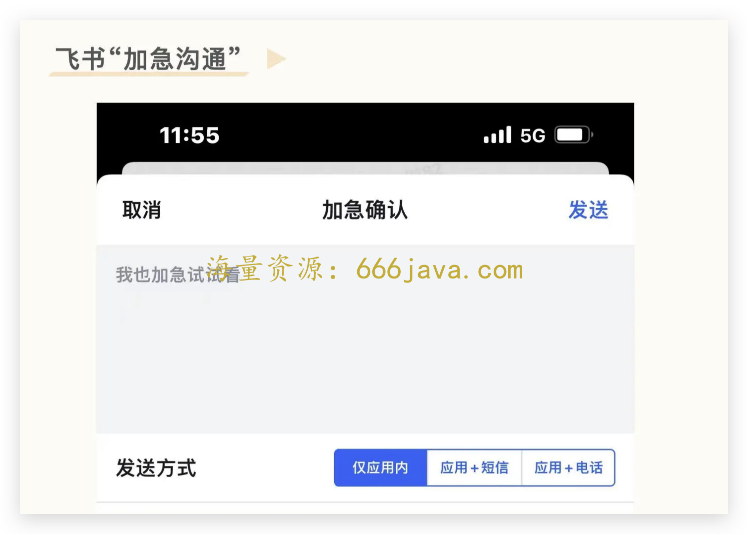

# 22-角色（下）：失败的来往和成功的钉钉后面为什么都是陈航（无招）？

你好，我是雄峰。这节课我们继续聊陈航（无招）和钉钉的故事。

上节课我们把话茬留在了钉钉的两个救星“康帕斯”和“复星”上。

在阿里内部支持以及外部复星的背书下，钉钉迅猛发展。直到 2021 年底，钉钉 MAU 月活跃用户近 2 亿，企业微信 MAU 月活跃用户 8889 万，不到钉钉的一半。再之后的后来者飞书，MAU 月活跃用户为 460 万（是不是比你想象得低很多）。

在办公沟通和协同平台中，钉钉遥遥领先于第二、三名的企业微信和飞书，完成了一出完美的复仇记。

这节课，我们就来探讨一下这出“复仇记”成功背后的原因，更重要的是，向你传递一种“意愿”的精神，帮助你从中汲取支撑自己在业务困顿、逆风局打仗的能力。

## 钉钉行业领先的原因

为什么钉钉可以做到行业第一？ **核心原因有三个：管理驱动+先发优势+B 端优势**。我们一个一个来说。

### **钉钉产品的管理驱动**

做 C 端产品和 B 端产品会有一个思维盲区： **你的用户是谁？**

以 C 端为例，产品付费购买和使用的人基本上是一类人（教育不是），但是 B 端领域产品付费购买和使用的人并不是同一个。

钉钉真正的目标用户并不是公司员工，而是公司的管理层，因为只有管理层，才能决定自家公司到底用什么软件去办公。因此，如何让管理层和老板们用得更爽，以及如何让老板们觉得成本更低，才是最关键的地方。钉钉最大的优势就在于，老板可以通过极低的成本，获得对员工的掌控力。

- **打卡免费** **：** 不用采购部署指纹考勤机也可以做到实时了解出勤情况；
- **出勤定位** **：** 无需额外费用就可以实时跟踪外勤员工的位置信息；
- **信息触达：** 重要消息没回复也不怕，“已读”功能可以让员工在收到老板消息即时响应；“钉”功能可以在不打电话的前提下提高老板向下沟通效率，也可以免费电话、短信通知对方；
- **权限控制** **：** 公司各项审批进一步管控且通过 OA 一站式实现。

可以看出来，钉钉是一个完全以老板为需求导向的软件。尤其是“钉”和“已读”两种功能，只要你在钉钉上看了信息，就会为对方显示“已读”，如果不看，就会有夺命连环“钉”。对于普通员工，这是非常不友好的功能，也很大程度上加大了劳动者的工作压力。而对于老板则非常实用，你看到了就必须回复，不能装死，假装没看到。

此外，过去实现这些功能，必须花大价钱部署 OA 系统。打算本地部署的，采购、运维、更新都是一笔不小的成本，一般小企业压根用不起。如今，钉钉以免费的状态出现，甚至部分功能比付费 OA 系统还好用。小企业何必还去重新花费成本部署新系统呢？

那么话说回来，企业微信和飞书的产品理念又是什么呢？

**企业微信主打连接**：你没看错，企业微信从一开始就不是给企业管理用的，本质是为了给微信的私域减负。简单来说，就是把在微信上维护的客户转移到企业微信上进行沟通，从而建立最大的 CRM 管理系统。

**飞书主打协同效率**：通过一站式的企业办公软件解决员工工作碎片化的问题，从而让员工进入一种“心流”的工作状态，大幅度提升员工工作效率，这也是飞书在互联网 IT 人士之间口碑非常好的原因所在。

### **钉钉的先发优势**

**做 C 端产品和 B 端产品还有一个思维盲区** **：** **迁移成本。**

C 端用户从一个产品迁移到另一个产品（非熟人社交），迁移成本并不会太高。但是 B 端用户的迁移成本就非常高。

一方面是采购成本高，它不像买衣服、日用品，几百块的支出，喜欢就买，不喜欢就退。一个企业决定使用某个企业工具，往往除了采购成本以外，还要为全体员工培训，为公司部署。另一方面是使用习惯以及数据安全，迁移到新的企业工具不仅原有员工的使用习惯需要调整，可能在迁移的过程当中还会出现各种各样的问题，反而会有顾虑。

互联网员工的心头好是飞书。之前在腾讯的时候经常会有内部论坛反馈说，飞书哪里好哪里好。但是奇怪的地方是，飞书的规模远落后于钉钉和企业微信。

有不少人把飞书落后于钉钉的原因归结为：飞书的产品不够“管理导向”。这个认知已经是陈年黄历了。

伴随着企业办公市场越来越激烈，各家产品的很多功能点也越来越像。飞书一直都有考勤打卡的功能，人事审批、客户管理、对外沟通、关联组织这些“帮助传统企业老板做好管理”的功能，飞书都已经拥有，很多 Push 员工沟通以及反馈的功能，比如“加急沟通”，飞书也有，直接大屏幕弹出来让你崩溃，再不理会，就直接电话过去。

在产品功能越来越像的前提下，钉钉的先发优势更加明显了。飞书曾经有两个扩张的窗口期，但都没有把握住。

一个是早期顾忌阿里的合作关系，并 **没有推出国内版**。飞书虽然 16 年就诞生了，但是之前一直是服务于内部，后面也主推的是海外版（Lark），然而同期的钉钉突飞猛进，飞书直到 19 年才推出了国内版。另外一个，则是没有抓住 **2020 年疫情线上办公的爆发期**。当时飞书功能远不如对手完善，比如文档和会议功能，且服务器资源也准备不足，导致同期被甩了很大一截，现在想往回追是非常困难的。

### **钉钉的 B 端优势**

之前医疗业务的朋友跟我聊过一个观点：B 端业务一定要有大企业背书和头部标杆案例，不然你很难开展合作。因为这类企业都需要对内去回答一个问题： **为什么要找你合作？**

而这两个优势钉钉都有。前面我们提到过钉钉帮复星集团做了“复星通”之后，复星集团董事长郭广昌在不同场合给钉钉打了广告，同行也纷纷采用钉钉，后面钉钉在和民生证券达成合作后，很自然地，也和更多金融企业达成了合作。

除了大型企业以外，钉钉在过去几年里，先后与各级省政府达成了合作。试想，在 G 端市场吃得开，连省政府机关都在用，那下面的企业有什么道理不跟上呢？

此外，阿里从 2019 年末开始推行云钉一体化，这为钉钉带来了大量巨头企业用户，200 多家超大型企业客户，每家企业规模在万人以上。相反飞书大部分使用的用户都还在互联网企业，而中国绝大多数企业并不是互联网企业，很难形成破圈效应，或者说，大多数中国企业并不知道什么叫做协同。

## 意愿的重要性

我刚毕业进公司的时候，部门的大老板给新人做了一次培训，问了一个很有意思的问题：

> 假如你有娃，你娃生病了，你会怎么办？

大家的回答就是：肯定带医院去啊。

老板：如果你所在的区医院都关门了，你怎么办？

大家：去福田或者宝安。

老板：如果整个深圳都关门了，你怎么办？

大家：如果问题严重，一边网上求助，一边去广州。

老板：如果广东都关门了，你怎么办？

大家：去隔壁省份或者去香港。

老板：好，你发现没有，你总会有办法去想办法解决相关的问题，但是为什么当你们推一个需求遇到了一点问题，你们就觉得搞不定了，然后就坐困愁城呢？本质上是你们没有把产品当成自己的小孩。 **一个优秀的产品经理应该同时具备意愿和能力两种素质，能力支撑你初期的发展，意愿支撑你长期的发展。**

### 穷途末路找出路

无招每天以 18 个小时的时间在处理工作，为了挖一个面试候选人可以拉着他在机场聊上三个小时，然后飞机飞往下一个目的地，凌晨抵达之后拉着商务，继续去见客户，第二天早上 7 点又开始了一天正常的工作，内部都认为这是一个机器人，从来不会疲倦。

除了对自己要求高以外，无招对于团队的要求也非常高且粗暴。一位在钉钉创业初期，参与过陈航在内部的 review（复盘）会议的互联网人士称，这场复盘让他印象十分深刻，“开始前十分钟风平浪静，接着后面近两个小时的时间里，无招同志用摧枯拉朽的方式把产品同学喷成了渣”，三字经满天飞。

此外，无招会亲自面试每一个求职者，标准之一就是“够不够疯狂”，结果往往是 100 个面试者最多有两个能合格。求职者常常会吐槽，“无招的点有点奇怪”。关于这一点，我的导师也跟我聊过，组织氛围激情得有点像“传销”，一般人很难理解。

除此之外，钉钉要招的人是能够高度认同钉钉，即使在明知没有很大物质回报的前提下，依然能长久保持激情的人。无招甚至会很强势地问你，“你用微信吗，你证明一下，你把微信上所有的人都改成用钉钉沟通，你做得到吗？”这搞得别人很尴尬，都不知道咋接。

也就是这么一波人，通过自己强大意志，在穷途末路的时候找到了新的出路。

### 面对不确定的确定性

在这节课的最后，我想和你分享一下去年离职的两个小故事。

一个是离职前跟行业猎头老板聊天，她跟我形容了当前帮各大公司招聘管理干部的问题，除了硬技能以外，很多公司非常看中意愿，而意愿又是在面试阶段很难判断的点，至于为什么看中意愿，她的大致的意思是：

> 过往很多管理干部喜欢在事实清楚、数据清楚、方向清楚、目标清楚的环境下做业务决策，在确定性下做业务，就会有很多的红利业务和红利业绩。
>
> 但是，互联网发展到了如今的状态，不确定性是常态。那在事实不清楚、数据不清楚、方向不清楚、甚至目标不清楚的环境下，大家就有点不知道该怎么做了，缺少了对环境的钝感力以及对工作的韧性，最终坐困愁城、一事无成，而 **意愿是支撑大家去找新方向的关键动力**。

另一个故事是和二爷 [（邱岳）](https://time.geekbang.org/column/intro/100002601?tab=catalog) 聊跳槽的事情，说选择去什么公司。当时我们聊到了国内某头部公司 Landing 成功率的问题（跳槽过去能够活多久），他举了一个有意思的例子：

> BAT 里面有一个厂，跳过去 Landing 的成功率是最低的。核心在于，这家公司原有的工作模式非常重视业务成功率，跳过去之后如果延续过往的工作习惯，高 P 失败过一两次之后基本上整个人的精气神就垮了，动作就会变得异常谨慎小心。但是这家公司在行业里，又是以快速迭代进步闻名，每一个成功产品的脚下都是一堆失败产品的骨渣，如果不敢尝试、不愿意去尝试，最好就别去那家公司。

也正是这个原因，我非常喜欢罗永浩本人，因为只要他不死，总会有新的东西出来。此外，2020 年 5 月 17 日，钉钉春夏新品发布会上，发布了 5.1 版本“年宝玉则”。年宝玉则是四川阿坝巴颜喀拉山的最高峰，海拔 5369 米。这是钉钉 5.0 版本“巴颜喀拉”的延续，蕴含着勇攀高峰的精神。

## **小结**

这两节课，我通过无招在来往失败和钉钉成功的经历，分别讲述了三个业务知识点，我们一起回顾一下。

**社交领域的网络效应**：即梅特卡夫定律， **一个网络的价值等于该网络内的节点数的平方，而且该网络的价值与联网的用户数的平方成正比**，简单来说，熟人社交产品会出现越多人用越好用，越好用越多人用的情况，如果想脱离这个产品，那你就没有办法联系身边的人，这就导致你后面不得不用。

**B 端产品与 C 端产品的区别：一个是使用者和购买者分离** **。** 企业通讯工具是给员工使用，但是决策人是老板，因此要优先满足老板的需求。 **另一个是产品的迁移成本。** 涉及到员工的使用习惯以及公司数据安全等问题，轻易不会更换另一个产品。

**钉钉一骑绝尘的原因** **：** 对于购买者的需求满足（主打管理）、产品的先发优势（抓住了早期的市场空白和疫情机会）以及阿里在 B 端的势能。

但是这都不是我最想聊的。我最想聊的还是无招这个人不绝望不放弃的奋斗精神，在穷途末路下还能够找到出路的状态。而这，也是我们在接下来面对不确定社会最大的确定性—— **让自己变得更好，让自己愿意探索，让自己接受失败。**

最后，向你推荐二爷的一篇文章， [《产品经理最重要的能力》](https://mp.weixin.qq.com/s/-CrC6V9AVw8CI3rqd5BPyw)，也希望你能理解“角色”在非规律世界中的重要性。

## **思考题**

在这节课的最后，我也给你留了一道思考题。想一想，你认为无招还有哪些点值得大家借鉴呢？

欢迎你在留言区和我交流互动。我们建立了一个 [读者交流群](http://jinshuju.net/f/DuxzBi)，欢迎你的加入！如果你觉得有所收获，也可以把这节课分享给你的朋友一起学习。我们下节课见。
