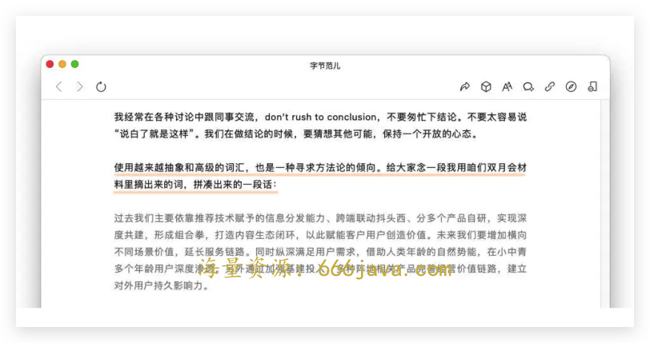
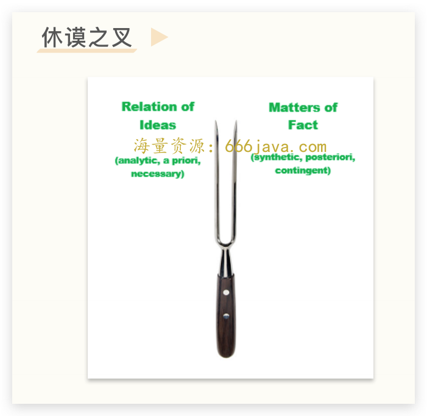
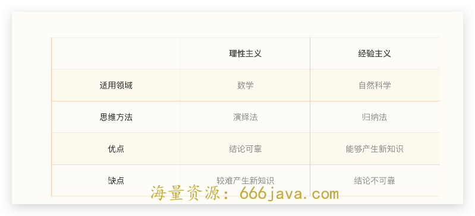
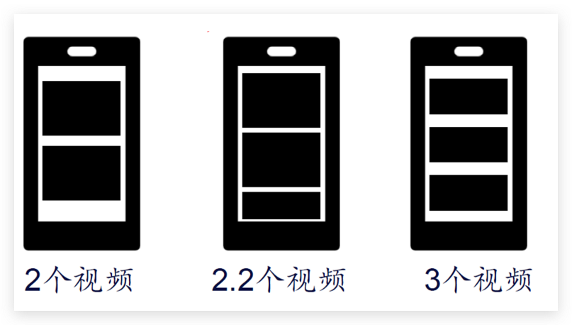

# 23-练习课：如何在实际工作中规避方法论的过度影响？

你好，我是雄峰。

本节课是我们非规律世界的第六篇，这是一节练习课。前面五节课我们学习了不同公司、不同领域的产品，因为执迷旧有方法论和成功经验，导致业务失败的商业案例。

这一节课，我们要学习的是如何在实际工作中，尽量规避方法论和过往经验的错误影响。作为这个模块最后一讲，我会通过几个案例和练习，和你一起完成对前面非规律世界的回应。

回应分为两方面。

1. **理解世界对方法论的执念**：方法论是人类更深层理解世界的手段，是人类持续进步的阶梯，尤其站在公司角度，方法论是提升企业经营效率的工具，也是筛选人才的标准。因此方法论的存在是有其合理性的；

2. **学会规避方法论的陷阱**：了解方法论的局限性，了解其在什么场景和什么环节是不适用的，进而学习几个常用的工作方法，来尽量规避方法论的过度影响。

我们先从理解这份执念开始。

## 大厂为何迷信方法论

互联网大厂有两个特别有意思的现象，一个是大厂黑话，一个是总结方法论。这两者一定程度上相互影响——“用黑话写出来的方法论不明觉厉”。我们来看两个例子。

21 年字节跳动九周年司庆，张一鸣做了“ [平常心做非常事](https://mp.weixin.qq.com/s/AgvuGQuHjstezvZAA7Wcpw)”的主题演讲。演讲全文在字节范儿公众号上公开之后，立刻火爆全网，一鸣惊人。

其中最大的引爆点就是张一鸣在举例说“什么是脱离平常心的表现”时说的： **对事物的过度抽象，对方法论的过度追求，也是** **一种走捷径不务实的表现，比如使用越来越抽象和高级的词汇。** 演讲专门从公司的文档摘抄了一些词语，堪称互联网黑话+方法论结合的高级范本。

我过往在公司晋升答辩的时候，面试官都会问一个糟心的问题。

> 在这个事情上，你有没有形成自己的方法论？

在这种问题下，就经常会看到一个诡谲的现象：好的业绩不代表你可以晋升，所谓的方法论可以让你在没啥业绩的时候逆势而上。所以很多人平常不努力工作，在答辩前两个月开始全力准备 PPT，蹭团队其他人的工作内容，包装各种高大上的方法论，找各种人去模拟练习答辩场景，然后升职加薪走向人生巅峰，这对很多努力工作的同事是非常不公平的。

不过，吐槽归吐槽，为什么大厂依旧会执着方法论呢？

### 方法论重复利用

当公司问你“有没有形成自己的方法论”，站在企业的角度思考，就是想要 **找你索要银弹**。

什么是银弹呢？在欧洲民间传说的风潮影响下，银色的子弹往往被描绘成具有驱魔功效的武器，是针对狼人、吸血鬼等怪物的特效武器，后来也被比喻为具有极端有效性的解决方案，是 **杀手锏、大招的代称**。

我们假设企业是一个大的农场主，他有十个庄园，其中一个庄园恰好是你在负责。大部分庄园一年可以收获 10 万斤粮食，但是你非常优秀，可以收获 50 万斤粮食。农场主问你：为什么你的产量是其他庄园的五倍，你的秘诀是什么？你这个时候才会回过头来总结，可能是最近施肥勤、买的种子高产、经常打农药无虫害等等。然后农场主把这些方法推广到其他庄园，以期望得到同样的结果。

公司找你索要方法论，其实想表达的内容是： **你干得还不错，是有什么样的方法导致的？能不能总结出来让其他的员工也这么干**？所以，公司都要求员工在做好个人工作之余还要多多思考、积极产出方法总结，本质就是追求 **对“员工”这项资源最大化的、重复性的利用**。

### **成功的归因**

大厂迷信方法论的第二个原因： **需要给成功找到一个解释，而解释需要跟自己相关。**

我们来模拟一种场景：如果一个团队从一个边缘市场切入，把一个清理类工具从零用户做到了千万级 DAU。下面是负责人两种不同的解释。

> A 回答： **团队成功的原因在于找到产品地缘套利的机会。** 清理类工具在国内已经基本饱和。一方面在于手机性能越来越强，存储空间越来越大，导致用户需求减弱；另一方面是手机厂商 [盐铁官营](http://time.geekbang.org/column/article/548476)，自己做清理类工具来满足用户需求。但是国外市场这两个条件均不满足。一方面，手机还是国内三四年前的水平，对清理类需求很大；另一方面，国外手机厂商意识也不如国内先进。因此，清理工具出海是一个很好的时机。
>
> B 回答：恰好找到了一块国外有需求的市场，发现清理类产品还有得做。

你是老板，或者你是公司，你愿意听哪个？

肯定是 A 回答嘛。 **一个一定程度上可归因的方法论，是一个你好我好大家好的结果**，既体现了业务有章法，又可以体现个人的价值，既体现了团队有思考，又证明了公司有总结。公司愿意买单，媒体愿意倾听，个人也有收益。

总不能一块业务做起来之后，老板问你是为啥，你跟老板说运气吧？虽然很有可能这就是真相，但是这个结果对所有人都不利。

### 有人才的筛选

升“鸡肝”（基干）之后，我明白了一个团队管理最基础的原则：团队需要划分梯队，确保每一个人既有空间又有容错。

所以过往在做团队人才梯度盘点的时候，通常会把团队人才分类四类：

1. 这个事情交给他/她，有没有结果；
2. 这个事情除了结果以外，有没有业务亮点；
3. 这个事情除了亮点以外，是否有业务的前瞻判断，基于判断做了提前准备；
4. 这个人有没有办法在无授权的情况下凝聚一波人为一个目标去努力。

这四类人才是层层递进的结果，而 **方法论就可以成为筛选人才的一个漏斗。**

因为选拔人才不能够只看业务结果的好坏，有些业务容易做，有些业务有时机。因此需要找到个人因素在其中起到的作用力，不管是个人的能力、判断还是影响力。

## 方法论的陷阱

上述逻辑非常自洽，但是在实际工作中，会碰到很多过度重视方法论所带来的问题。

- **无法复用：** 方法论一看就会，一做就废，达不到想要的业务效果，强行套用反而让业务停滞不前；
- **错误归因：** 明明是大环境底层的影响，结果非要总结出个一二三，反过来要拿一二三去做业务；
- **空余概念：** 概念大于实际，很多时候因为对概念的执着影响了实际业务，忽略了常识。

下面，我就用一系列案例带你去练习，看看在工作中用哪些策略可以规避方法论的错误影响。

### 不要纠结方法，应该大胆尝试

长期以来，人类认识世界并理解世界的方法论有两种。哲学家休谟用一把叉子，把这两种方法论一分为二，分别为理性知识和经验知识。

**叉子的一边是理性知识，它们不需要经验的验证**。比如数学，欧几里得的几何原理，通过几个简明易懂的公式从而构建数学殿堂的根基，数学的知识不需要做实验来验证，只需要理性思考就能够获得，而理性主义的思考方法就是 **演绎法**，简单来说就是推导。

叉子 **另一边，是经验知识，这些知识单靠理性是得不到的，或者说，这部分知识单纯靠理性去想，反而不可靠。经验主义的观点立足于自然，我们会通过自己的观察来理解世界：通过观察自然界中许多个个别现象，总结出普遍的规律，这个就是归纳法**。

但是这两个方法论体系都有其自身的问题。

**理性知识的问题是需要一个确定性的因果前提，但实际上我们很难判断真正的因果关系是什么**。我们经常只是给两件在时间和空间上挨得很近，一前一后发生的事情套上了因果关系，从而进行推导。

说一个笑话，有一个朋友家里养了好几只猫，养了好几年，夫妻双方也一直在备孕，但一直就是怀不上。父母认为：就是你们一直养猫，导致怀不上孩子。这个因果关系对不对呢？肯定是不对的，但是不孕不育又是一个很难查清楚的问题，一定程度上又很难证伪。

**经验主义的问题是知识底座并不牢固，通过归纳所获得的知识都是不可靠的，不是必然的，也不是普遍的。**

小说三体里面有一个火鸡悖论，“在一个农场里有一群火鸡，农场主每到 11 点会准时给他们喂食。于是，这群火鸡中的科学家总结出了一个伟大的宇宙规律：每到 11 点上帝就会赐予他们食物。它在感恩节这天向全体火鸡公布了这个伟大的发现，结果那一天它们等来的却是农场主明亮的刀子……”这种问题就叫做“不完全归纳的误区”。

既然理性知识和经验知识都可能靠不住，那么我们能依靠的是什么呢？答案： **实用主义**。

我们不需要去纠结发现的方案是否就是最好的，就是真理，因为我们无从判断。对于我们来说， **能够指导我们往前走一步的理论，都可以认为是真理。而无法让我们前进的理论，都可以认为是谬误。**

这样的思想用一句谚语来说就是： **兵来将挡，水来土掩。** 我们的行动准则就是遇到问题解决问题，不要太纠结所谓的终极真理。这虽然听起来很功利，但在生活和工作中非常有效。

我们可以从两个场景去练习一下，从实际工作中去理解如何去运用实用主义，减少方法论的影响。

> 练习一：一个屏幕放多少个视频，能够更好地刺激用户刷新短视频、提升用户留存？
>
> 

> 如果要用以下几个方法去做决定，你会用什么方法尝试呢？
>
> A. 设计的动线原则；
>
> B. 产品的内容卡机制；
>
> C. 数据里面的 A/B 测试。

答案是：A/B 测试。

在字节内部有一句非常出名的话： **能够 A/B 的事情就不要讨论。也是实用主义非常好的工作方式之一。** 后来经过详细的 A/B，发现 2.2 个视频的一屏展示效果是最好的。

产品设计领域早期有一个很出名的问题：按钮放在左边还是放在右边？

中间会衍生出很多很多的讨论，也会有各样的方法论佐证，有的说左好，有的说右好，可以说是公说公有理，婆说婆有理。这种开放性问题一般是谁能吵，谁能说，谁就赢。而且聊着聊着容易从“事”上升到“人”，从一个事情怎么做变成我一定要赢。这个时候，就凸显出 A/B 测试的优势了。

方向明确的问题可以用 A/B，那如果是方向不明确的问题呢？我们再用一个练习场景去模拟一下。

> 练习二：大家一致讨论做一个内容型产品，方向已经明确了，但是如何开始业务的第一步是大家非常纠结的点。怎么做比较好呢？
>
> A. 从内容供给切入，重点做内容体系建设以及 KOL 引入；
>
> B. 从用户规模切入，重点做用户增长以及数据体系搭建；
>
> C. 不管哪个都行，先最小投入做到 5 千用户，看看数据指标再决定哪里开始。

我个人答案是：C（该问题存在一些争议）。 **当一个问题讨论不清楚的时候，我倾向于先丢一个** [最简方案](https://time.geekbang.org/column/article/545373) **看看效果，通过反馈迭代下一步的重点。因为数据总能够反馈你认知以外的东西，从而帮助你找到更优的方案。**

我经常会打一个比喻，大家要过一条河，不知道深浅，我们可以用各种方法论来测量、计算河流到底危险不危险，但性价比最高的办法，一定是先丢一块石头看看浪花，听一下声音再判断怎么做。

实际工作中，我也希望你可以记得这两条准则： **可以 A/B 的就不讨论，想不清楚的就先动手最快获取反馈信息，一定要避免原地踏步、贻误时机。**

### 不要放大自我，应该抽离审视

很多成功的方法论来自过往的经验总结：想当年我做成了某某业务，用了某某方法，现在我们的业务跟之前做的很类似，那么我们就应该用某某方法。但实际上应该这么用吗？

这里我先问你一个问题：

> 如果一个人毕业后，5 年内实现了年薪百万——他厉害吗？

我相信大多数人会认为：是的。那我再把这个问题进一步细化。

> 假如一个人在毕业后（2015 年）就加入了字节跳动，一直在字节，做过商业化中台相关的业务，参与了字节和抖音商业化体系的初始建设，5 年后实现了年薪百万——他厉害吗？

大概率你并不认为他很厉害，相反你会觉得，这么好的时机、这么好的业务，就这？

这里有一个很有意思的现象，就是 **归因标尺发生了变化**。前者你会更多地认为是他个人能力导致的，后者你会更多地认为是他所处的行业和公司导致的。

我毕业前在得到的前身实习过，当时罗振宇老师说了一个故事：2000 年左右属于电视媒体的黄金时代，在央视做媒体的那一波人，属于在一个好的行业和好的平台上，你只要不呆、不傻、不笨、肯干、吃苦耐劳，跟着趋势走，你都会有一个不错的发展前景。

我把这个逻辑总结成了： **个人发展=行业选择 × 平台选择 × 个人努力**。回到上面那个例子，他的百万年薪，大家会更多归因到他所处的行业（互联网）以及所处的平台（字节跳动明星业务，头条和抖音），其次才是个人，因为如果这个人很强，那年薪肯定远不止百万。

**这个时候，我们再去想最开始的问题：基于大的行业机会和大的平台积累的成功方法论，就一定是正确的么？套用的话，一定有用么？**

答案可能是未必。很多互联网人切入传统行业，满心欢喜地想 [用互联网的方式改造传统行业](https://time.geekbang.org/column/article/544430)，吃的就是这个大亏，一方面是盲目套用过往的方法论，另一方面是由于过往成功的经验盲目放大了自身能力。

那么这种情况该怎么做呢？这里介绍两个常用的方法，在实际业务中常用的“ **底层环境法**”，以及在换业务的时候常用的“ **平替换位法**”。

什么是 **底层环境法**？我们在面对一个同类型业务的时候，总会不自觉地套用过往的方法论，从而快速找到切入点。但是，这个思路成立必须具备一个前提： **原有方法论成立的底层环境与当前是一致的。** 我们试着练习一下。

> 练习三：TapTap 是当前国内最大的手游社区平台，当初以“一方内容绑定”+“独立游戏推荐”+“游戏真实评论”的模式，从 0 把一个小众产品做成了国内手游领域的 steam，如果现在复用这一套方式，还可以做成一个新的“TapTap”么？
>
> 如果能，为什么能？如果不能，为什么不能？

你可以思考 2 分钟再往下看。

答案是不能。想一想，TapTap 刚发家时候的环境，和现在一样吗？

当初这一套方法论可行的关键要素是： **可推荐的游戏内容足够多**。这个底层环境在当下是不复存在的。

TapTap 刚发家的时候，每年有 1 万款游戏版号下发，而且还可以大量抓包海外游戏供用户体验。因此，可以给用户推荐大量的好游戏。但是如今版号一年的下发量不超过 1 千款，且无法抓包海外游戏，编辑可推荐的候选池就很有限了。那么，这一套机制就很难运转，强行套用当初那一套方法论，并不会取得成功。

什么是 **平替换位法**？过往在 [练习课](https://time.geekbang.org/column/article/545373) 中，我分享了赛道法和换位法，其实平替换位也是换位法的一种。这个逻辑是指， **当我们换一个新业务的时候，要降低对自己能力的预判，反过来思考：如果一个你认为相对平庸的人放到那个位置上，是否也可以取得一定的成功** **？** 如果这个人也可以取得成功，那么说明自己成功的几率也相对较大。我们在换业务的时候，就可以用这个方法避免自己踩坑。

在日常工作中，我也经常告诫团队，如果一个业务的业绩上涨了，你要强行归因的话，那么你也需要为它的下跌负责。

### 不要执着概念，应该回归常识

2012 年，中国掀起了一轮“消费升级”的浪潮，核心概念是：中国经济的发展会催生 XX 亿中产阶级，而这一部分中产阶级的消费会有很多品质的提升。伴随着这个理论，涌现出了一堆围绕“消费升级”的产品改造。

> 煎饼果子+消费升级=黄太极煎饼
>
> 新疆烧烤+消费升级=薛蟠烤串
>
> 肉夹馍+消费升级=西少爷肉夹馍
>
> 牛腩+消费升级=雕爷牛腩

上面这些公司活下去的寥寥无几，消费升级的概念已经吹不下去了。相反，后面成立的拼多多越来越好。很多人看不懂拼多多的成功：不是消费升级么？怎么消费降级的产品反而越做越大呢？

这就是执着概念而没有常识的典型案例。用黄峥的话说：拼多多吸引的是追求高性价比的人群，他会买一个爱马仕的包，也会用 9.9 元买一箱芒果，这与他的消费能力没有关系。传统公司才用一线、二线、三线来划分人，拼多多满足的是一个人的很多面。

下面，我们练习一下如何在工作中摆脱概念，认清楚常识。

> 练习四：某游戏社区是否需要增加优惠福利的功能？
>
> A. 游戏开发商为了避免渠道之间的价格歧视，不会提供，所以不应该增加；
>
> B. 游戏社区最大的价值是提升信息发现的效率，优惠福利并不关键，可加可不加；
>
> C. 优惠福利所带来的增长是数据的噪音，因此不应该增加；
>
> D. 用户玩一个游戏除了游戏本身的内容以外，还需要游戏内的福利内容，这个是基本需求，需要满足。

先思考两分钟，你认为答案应该是哪一个？

我个人的答案是 D，核心在于换位用户角度，用常识就可以理解：每一个用户玩游戏都希望可以免费获得游戏内的道具福利，如果充值有折扣那就再好不过了，因为可以以更低的价格享受更多的内容。

这里，我希望你记住黄峥的一段话，可以很好地运用到工作当中。

> 人的思想是很容易被污染的，当你对一件事做判断的时候，你需要了解背景和事实。 **了解之后你需要的不是睿智，而是面对事实时是否还有勇气用理性、用常识来判断**。常识是显而易见、容易理解的，但各种因为成长、学习形成的偏见和个人利益的诉求蒙蔽了我们。

## 小结

讲到这里，我们今天这节课也就接近尾声了。最后，我来给你总结一下今天的关键内容。

作为非规律世界的练习课，我们了解了大厂迷信方法论的底层原因：

1. 方法论重复利用，可以提升企业的经营效率；
2. 为项目的成功归因，论证成功不是偶然；
3. 支持人才的筛选，为企业激励提供证明。

这个事情有解么？在公司规则的层面下，一定程度上很难解决。所以，我建议你在一个大的体系下， **熟悉规则，尊重规则，利用规则晋升，从而变成规则的制定者**。

此外，在具体的工作中我们要有几条心法，让自己在面对具体问题的时候不被方法论过度影响，从而影响业务的进展。

- **不要纠结方法，应该大胆尝试**

简单且确定的问题，可以用 A/B 测试的就不要讨论；简单且不确定的问题，可以先以最小代价尝试，通过数据获取信息反馈，再进行迭代，从而避免原地不动、贻误时机。

- **不要放大自我，应该抽离审视**

业务上，在套用方法论的时候不应该盲目信任过往经验，而是要判断底层环境是否发生变化，避免刻舟求剑。工作上，在换到新的业务岗位时，应该抽离自己对自己高估的认知，换位中等能力的人，判断效果好坏。

- **不要执着概念，应该回归常识**

当面对一个复杂问题的时候，要了解清楚背景和事实之后，换位用户角度，用常识进行判断。

## 思考题

想一想，你工作中还有哪些场景被方法论过度影响过呢？

欢迎你在留言区和我交流互动。我们建立了一个 [读者交流群](http://jinshuju.net/f/DuxzBi)，欢迎你的加入！如果你觉得有所收获，也可以把这节课分享给你的朋友一起学习。我们下节课见。
