# 24-错位：拼多多缘何在电商市场的红海中再杀出一片天？

你好，我是雄峰。

作为非共识机会的第一讲，最好的选题一定是你熟悉又陌生的内容。熟悉的点是这个东西你一定听过，陌生的点是为什么它可以获得成功。以这样的反差，让你有一个“非共识机会”的强烈新鲜感。

今天，我们就来聊一聊移动互联网的一个奇迹：拼夕夕（拼多多）。可以说，这匹杀出的黑马，搅动了中国电商的既定格局，创造了很多个移动互联网的业务奇迹。

## 拼多多的业务奇迹

我们可以把拼多多的业务奇迹分为两方面来看。

**认知奇迹：** 在大家认为电商领域两强一尾（淘宝/京东/唯品会）格局已定的情况下，拼多多从这个最红海的领域逆势杀出。要知道，当初王兴也觉得这个领域没有任何机会，才选择做了团购业务。

**增长奇迹：** 拼多多用了 2 年，让自己的活跃用户超过京东，用了 5 年，让自己的活跃用户超过淘宝。此外，拼多多 2 年就突破了 1000 亿的 GMV，同交易规模下，京东用了 10 年，淘宝用了 5 年，不得不说是一个增长的奇迹。

同时，拼多多又是一家争议性极强的公司。

这个争议，一方面来自极致低价导致的平台有着不少的假货，各种各样的拉新手段粗暴且存在较大的诱导性。另一方面来自于公司的企业文化。

用同行的话说，就是去了拼多多你才知道什么叫做血汗工厂，去了拼多多你才知道什么叫“壕”无人性，去了拼多多你才知道什么叫极致执行和试错。这样的情况打破了过往大家对于互联网公司的认知，朋友经常开玩笑：拼多多是用富士康的手段管理互联网员工，上厕所都要计时。

就是这么一家公司，不管从什么角度去分析，都无法为其存在的巨大争议开脱。但是我还是希望你可以跟着我的分析视角去客观了解一下拼多多崛起的多种因素，进而了解一个真实的中国社会，建立一个“不要以一已好恶来揣度天下”的认知框架，从而让自己有更多发现非共识机会的可能性。

## 淘宝的战略忽视

马云在 07 年接受媒体访谈的时候，曾经说过一句著名的话：打着望远镜也找不到对手。这句话一方面表明了阿里电商业务的一骑绝尘，压根就没有对手，另一方面也表明了阿里对于对手的重视程度——打着望远镜寻找。

但就是这么一个重视度，在过去的 10 年里，阿里出现了两个对手，一个是京东，另一个则是拼多多。对于前者，淘宝是有预期的，按照美国电商的发展，标准自营电商平台一定是可以做大做强的，比如亚马逊。但拼多多确实是一个意外，也是一个令大多数人想不到的意外。我们可以从供给端和用户端来理解这个意外。

### 供给端：淘宝天猫化和平台打假导致的商家外溢

零售领域作为一个发展超百年的行业，这个领域最重要的用户体验就是四个字：多、快、好、省。什么意思呢？

> 多：商品的选择多，或者有独家的 SKU；
>
> 快：发货和配送速度快；
>
> 好：东西的质量或者有品牌溢价
>
> 省：价格便宜。

任何电商一定是围绕这几个字来打造自己的业务的，我们来看几个熟悉的例子。

> 淘宝：主打的是“多”“省”两个字——选择多，价格也便宜。
>
> 京东：主打的是“好”“快”两个字——主打 3C 产品，标准化且品牌有保障，自建物流。

2010 年之后，淘宝的重心就是“围剿京东”，主要的策略方向就是“天猫化”。

2008 年淘宝商城上线，在大品牌入驻的策略背景下，流量开始向品牌商倾斜。2011 年，淘宝商城独立分拆为一个公司，2012 年改名为“天猫”。一方面，天猫每年都会做“双 11”，一直到今天成立了这样的一个“剁手节”，另一方面，也在市场上开始执行“二选一”，在关键的营销活动节点，商品只允许在天猫上架。

而天猫化的基础就是要 **加大对假冒伪劣产品的打击**。试想一下，邀请品牌方入驻，然后品牌方发现：哟呵，这里怎么会有一个李鬼？你想干啥？

品牌方是很难容许平台真货和假货一起卖的。因此，平台加大了打击假冒伪劣产品的力度，为品牌方的入驻提供空间。最典型的动作就是 2015 年淘宝开始打假行动，一天清出了平台 24 万低端商家。原来的低价、低质的商品在淘宝上越来越难以获得流量，而这恰好就给拼多多的商家入驻留出了业务空间。

### 用户端：微信和淘宝的相互封锁给拼多多留出了空间

说起淘宝在用户端的忽视，也是很有意思的一个点。突然有一天，用户无法在微信上打开淘宝的网址链接，淘宝也无法把内容分享到微信上。奇怪的地方在于，淘宝说是微信干的，微信说是淘宝干的。

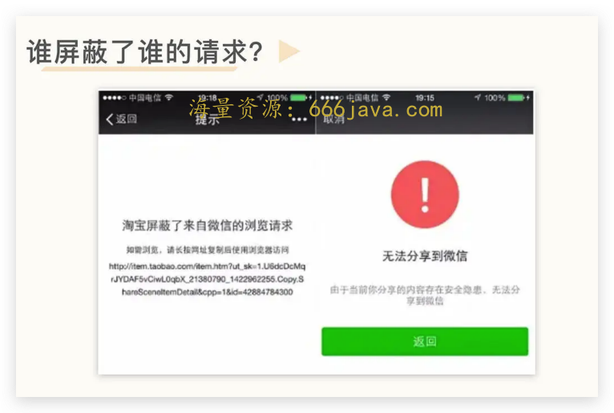

那谁最有可能先动手呢？大概率来说是淘宝，因为淘宝之前就干过类似的事儿。

淘宝做用户增长有一个非常明确的上游流量规则： **不要参天大树，而是草原成林。**

简单而言，就是不希望平台的流量被上游所主导，而要构建广阔而细微的毛细血管，打造更稳健的流量生态。比如淘宝在 PC 端的时候就封锁过百度的爬虫，不允许搜索用户用百度搜索搜索出淘宝的商品，此外，淘宝还屏蔽过蘑菇街和美丽说的流量来源。

但是这种方式忽略了一个关键问题，伴随着红米等高性价比智能手机的普及，微信用户的扩张远比淘宝快，这就导致了什么呢？ **有大批的用户，淘宝并没有触及到。**

在微信普及的过程中，我们需要理解一个现象： **对于新入网的用户，微信就是一切。** 我特别喜欢观察我妈妈使用微信，会发现她不只把微信当成一个通讯软件来使用，还用来收藏相片、制作图片纪念册，用来购物，也用来看视频，偶尔还用来导航地址，并且这种现象在七大姑八大姨身上特别常见。对于他们而言，一个微信就足够了。

还记得我们在 [导读](https://time.geekbang.org/column/article/541141) 举的例子么？拼多多的创始人黄峥曾表示：

> 拼多多之所以成功，第一爆点得益于抓住了微信和微信红包的红利。微信红包让用户的微信钱包有了钱， **但其他**（线下） **还不流行微信支付，用户有钱却没地方花。**

**微信的用户红利非常关键。** 在 16 年这个时间点，微信代表了国内用户的天花板。可以说，所有人都会用微信，但并不是所有人都会用淘宝及其支付。从 MAU 来看，双方存在 5 亿人的差额，这就意味着必然有一批只使用微信但是不使用淘宝的潜在电商用户。而这，就是拼多多独特的空间。加上微信构建起来的支付生态，拼多多用户也可以绕开支付宝的协同因素。

你可能还会想，的确，这一部分用户淘宝并没有办法触及到，但是京东可以触及啊？可是，京东主打城市市场且价格偏贵，这就导致其对微信流量的利用并没有达到很好的效果，甚至有一段时间，京东还埋怨微信的流量质量差。

## 拼多多的低价策略

我们复盘淘宝坐看拼多多的崛起各种失误，其实算是事后诸葛亮的看法，因为在当时人们的眼里，阿里的决策无比正确。

要知道，正是淘宝清退了劣质商家，走向了正品化之路，才有了天猫的成功，要知道天猫里面利润最大的两个类目：女装和美妆，都是天猫做起来的结果，即时今天拼多多坐拥 8 亿用户，也一直无法攻克这两个品类。

此外，限制了微信到淘宝的用户访问，腾讯空有流量也做不起来电商业务，后面也不得不把 ECC（腾讯电商 BG）+微信入口打包卖给京东。

所以，当时并没有人觉得阿里做错了什么，直到黄铮发现了淘宝战略下的非共识机会。

前面说过，电商领域最重要的用户体验就是四个字：多、快、好、省。拼多多围绕省这个字进行极致挖掘，在价格领域，和淘宝、京东形成了鲜明的对比。

### 低价要素一：清库存和低端商家

你可能注意到过一个现象，很多大城市如果有门店拆迁，短期又没有找到新的商家入驻的时候，就会有人用非常低的租金租下来一两个月，搞成 10 元店或者清仓大处理。

这些现象背后的本质，就是去库存。 **库存的积压会带来资金周转率的下降，存储和运输成本也会持续上涨。** 因此，很多正品库存会以极低的价格做反季节销售，并且流入到四五六线城市。

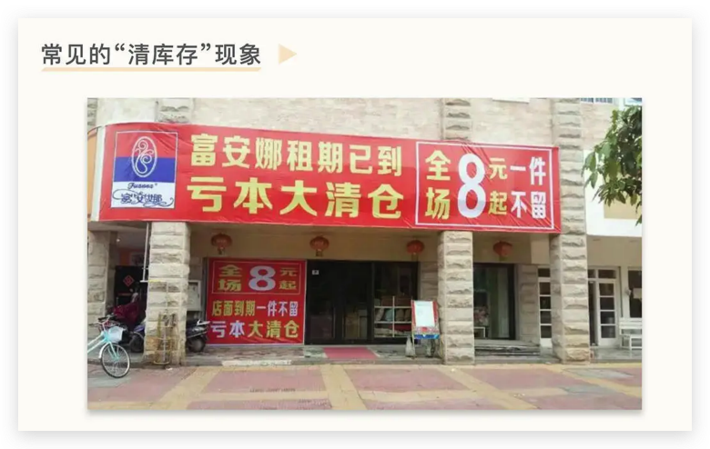

此外，淘宝清出的低端商家有几十万家，这些低端商家不可能被清出就消失了。相反， **拼多多成建制地接收了这些被淘宝和京东抛弃的商家**。这些商家大多是低端供应链，质量很差，但是价格真的非常便宜。

试想一下，你可以花不到 50 块钱的价格，买到一整套的瓷器餐具（八盘+八碗+八筷+八勺+一个大汤盆）。同时，这批商家又具备较强的电商运营经验，无缝对接拼多多的平台。

这两部分的货源，让拼多多的价格对比淘宝和京东，天然具备极强的竞争优势。

### 低价要素二：拼团以及货币化率低

电商产品经理面试过程中有一个经典的问题：为什么拼多多没有购物车而淘宝有购物车？

这里面核心原因有两个。

**一个在于拼多多早期的电商业态是以 H5 页面的形式存在于微信中**。那个时候还没有小程序，H5 可承载的功能有限。因此，只能够在展示上强化单款产品信息。而在微信生态内传播的时候，用户都是为了一款非常低价的产品去集中拼团，购物车的存在会影响用户的决策。

正是因为这种群裂变传播的方式，拼多多才可以总在单品团购上达到十多万人的购物规模，也让商家有将价格压下去的可能性。

**另一个，在于拼多多的电商结构也是以单款 SKU（最小存货单位）为主。** 最常见的情况就是，一个 SKU 可以瞬间在社交网络引爆，带来巨大的订单，因此，店铺的概念相对来说会非常弱化。爆款低价产品是站内流量分配的主逻辑，而非店铺权重，用户在拼多多内，往往都是被单款低价商品所吸引从而下单购物，批量购买的过程几乎没有。

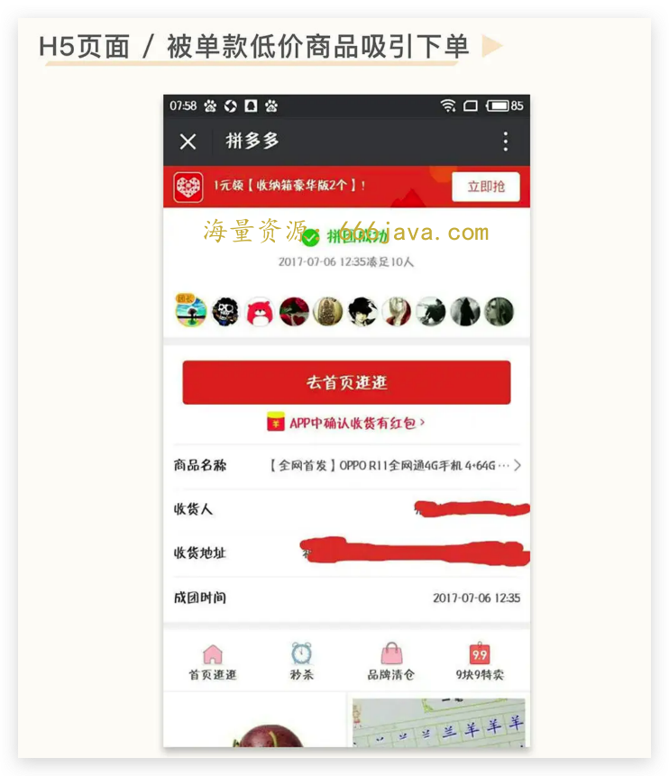

此外，拼多多平台的货币化率也远低于友商。简单来说，就是商家在拼多多做生意，拼多多收取商家的费用比友商要低很多。以 20 年拼多多的数据为例，整体的货币化率在 2%左右，但是淘宝天猫的综合货币化率在 3.74%。这样也降低了商家的负担，让商家有更多的意愿在平台低价售卖商品。

总结下来，就是针对低价的产品拼多多会免费给予很大的流量支持，而且平台的广告费用低，那么对于商家而言，让利空间就更大了。

### 低价要素三：极致的增长策略

黄铮的拼多多 [第二封致股东信](https://mp.weixin.qq.com/s/d0J4tM1m4v656FX4RF2m_g) 中提到一个观点：

> **我想，拿“储蓄罐”里的钱去存定期恐怕不是一个好主意**。我们在相当长的一段时间内将不会改变现在的经营策略，将持续聚焦在企业内生价值上，积极寻找对长期公司价值有利的投入机会，即使这些投入按照会计准则会被记为大额短期费用。

简单理解，就是 **拼多多用赚到的钱全部拿去做增长，甚至可以接受大额亏损，公司内的一切业务都围绕增长进行服务。**

**电商平台保护自己最有利的武器** **，** **一个是匹配效率，另一个就是规模。** 拼多多在 16 年到 21 年都保持着高速增长的规模，把公司赚到和融到的钱全部拿去做增长。

而高速增长的用户可以让平台的流量达到相当大的规模，这个规模可以构建对上游商铺的绝对吸引力，进而撬动其为平台提供更丰富、更低价的商品。对电商卖家而言，卖 1000 单和卖 10 万单，价格是不一样的，那他完全可以为 10 万单的平台卖更低的价格，这又会进一步推动用户来使用拼多多，从而不给竞争对手留下任何机会，这也是亚马逊的逻辑。

这就可以解释为什么拼多多会有那么多“莫名其妙”以及“匪夷所思”的拉新手段了。 **一切都是为了增长** **。** 据不完全统计，拼多多拉新的方式大致有如下这些。

**拼多多截图生成二维码：** 让你发截图的内容有机会被二次转化。

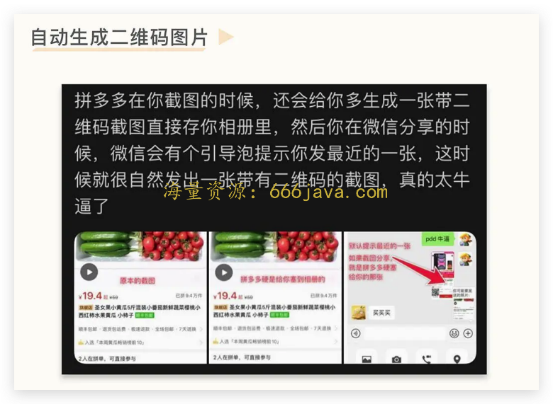

**微信诱导以及通知文案：** 让你误以为被人发了红包。

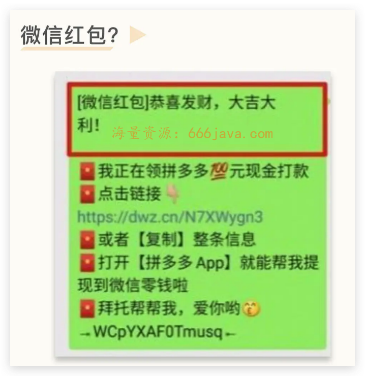

**分享口令文案：** 让你误以为在微信群被人 Q 了。

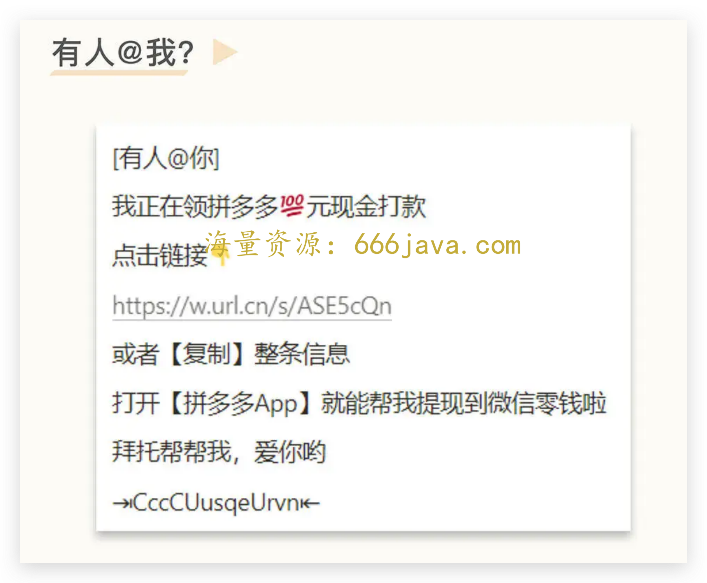

**小游戏拉新策略：** 多多农场，做任务浇树，长大之后可以领一箱水果，顺势绑定个人地址。就这么一个小游戏，一个月就做到了千万级别的用户，给拼多多带来了大量流量。

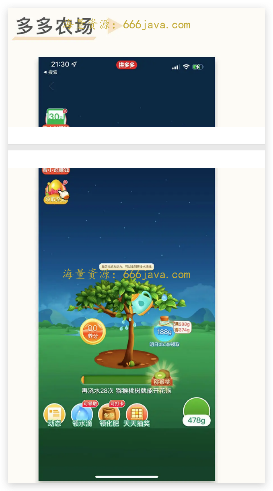

**红包助力提现活动：** 引导用户把链接分享出去助力，积攒到一定量级（很少人达到）即可提现。

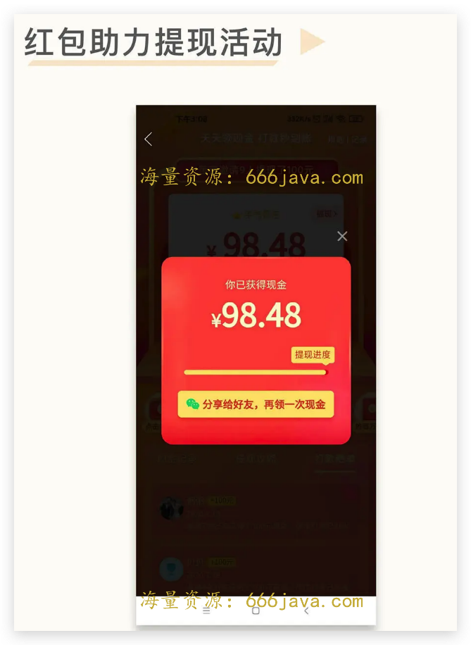

别看这些策略 low，从实际数据来看，效果非常好。拼多多早期通过微信拼团的获客成本是 1 块钱，2017 年拼多多的获客成本是 11 块钱，即使到了 2018 年拼多多要上市，需要疯狂扩展用户，获客成本急剧上涨到了 61 块钱，但还是远低于友商，同期淘宝和京东的获客成本是 300 元左右。

很多人之所以认为上述策略没有用，核心在于 **“五环内”的人群会精准跳过这些坑，大家经过互联网多年的毒打，可以精准地分辨出什么是广告，什么是坑。但是刚入网的父母辈人群并没有这个能力。** 试想想，你的父母辈有多少人被下面这类广告坑过？

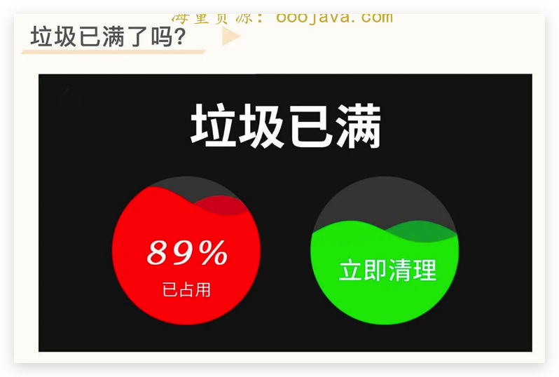

那是不是针对五环内的人群，拼多多就没办法了呢？还真不是。

拼多多还有针对五环内人群的增长策略——百亿补贴。尤其是最初的补贴苹果手机，可以说是一个非常经典的案例。 **针对这种非常容易分辨出真假的产品进行大额补贴，改变五环内人群的认知，消除大家对于拼多多的偏见，进而构建新的传播网络** **。** 同时间段，拼多多也找了大量的知名自媒体打广告，比如“半佛仙人（B 站 UP 主）”“小道消息（公众号）”，也是非常经典的增长手段。

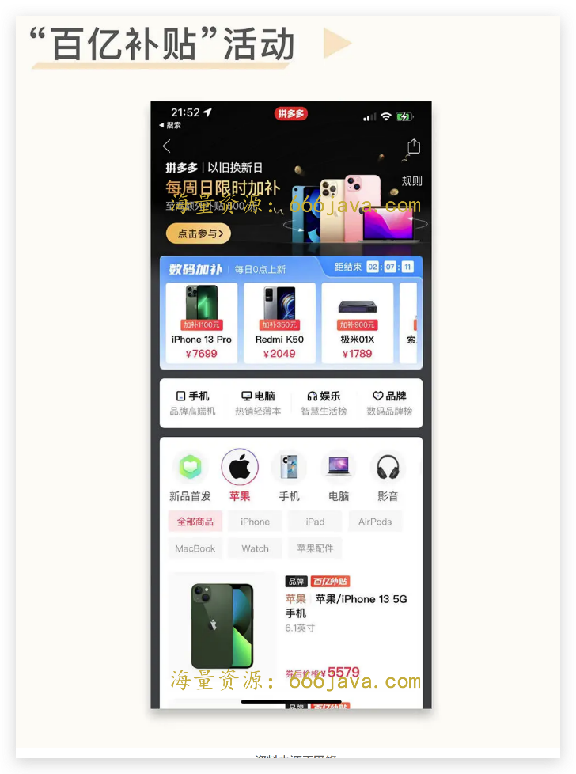

我也是从百亿补贴之后开始入坑拼多多，大量的购物行为从淘宝转移到了拼多多，只要同样的产品我都会来拼多多搜索一下，看看是否更便宜。

黄峥自己说过， **我打广告，是想告诉大家，我不是骗子。**

## 不要以一己好恶来揣度天下

这个标题来自字节战略大神朱时雨先生的 [一篇文章](https://mp.weixin.qq.com/s/tie4K-jAh3_9tkDUtpL81w)。在日常工作中，很多人常常会以自己的视角来解释一切，从而陷入了狭隘认知的陷阱。

虽然拼多多取得了很大的成功，但是到现在提到拼多多依旧会觉得它很 low，会觉得买拼多多里面的东西是消费降级，会认为拼多多的成功是因为抓住了移动互联网第三波人口红利带来的下沉人群。

其实，不管是消费降级还是下沉人群，都是一个很傲慢的概念，也都是听多了概念没有常识才说出口的话。

**真实的情况是，拼多多是新网民电商转化的第一站**； **真实的情况是**， **五环外人群才是中国最广大的老百姓**； **真实的情况是**， **绝大多数国人的消费观念里面，便宜才是硬道理。**

很多人并不了解真实的中国社会是什么情况。

前面我们说过，中国科技的发展是摸着美国过河，而中国社会经济的发展，一定程度上是摸着日本过河，日本是我们的邻国，加之在国情以及文化层面存在着很多的相似性，很多时候，研究日本的过去就可以看到中国的未来。

日本知名社会观察家三浦展有一本经典著作《第四消费时代》，以日本为例，30 年为限，描绘出了不同时代的消费群体画像，将日本进入产业化阶段后的消费社会大致划分为四个阶段。

> 第一消费社会：1912 年-1945 年，主流消费群体只限于大城市中的少数中产，日本逐渐开始了西方化的现代化社会。
>
> 第二消费社会：1945 年-1973 年，消费的观念是产品要足够大、足够多，而且要贵，每个家庭好像都要拥有电冰箱、电视和空调，以及至少拥有一辆私家车。
>
> 第三消费社会：1974 年-2004 年，消费的观念从以家庭为主转变为以个人为主，个性化成为主导，但是社会上出现单身的人群越来越大、离婚率快速上升的现象，人与人之间的隔阂和冷漠导致社会问题频发。
>
> 第四消费社会：2005 年至今，经过高消费的反思，社会上逐渐兴起了乐于共享、重视环保、重新建立人与人之间联系的意识，这也正是第四消费社会的特征表现。

中国处于哪个阶段呢？从实际的情况而言， **中国处于四个消费社会并驾的阶段**。上述现象分散在中国各个区域，且常常共同出现。 **因为区域经济发展的不平衡，因为城乡经济的倒挂，因为财富分配不平衡的加剧。**

著名经济学家托马斯.皮凯蒂在 2017 年 4 月发表了一篇长达 76 页的报告，《中国资本积累、私人财富和贫富差距，1978-2015》，在论文中，他分析了中国 1%人群的财富占比。

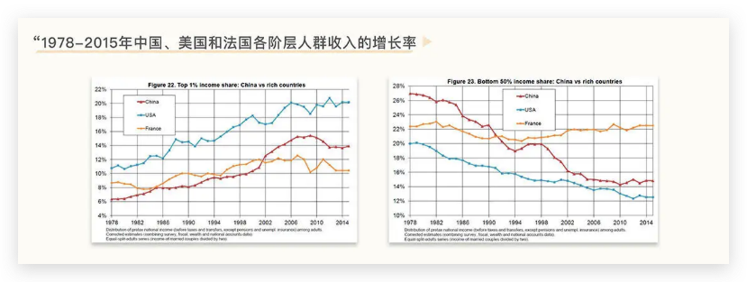

这两幅图比较了 1978-2015 年中国、美国和法国各阶层人群收入的增长率。三十多年来，中国的最富 1%收入增速为年均 8.4%，底层 50%收入增速为年均 4.5%，而美国最富 1%收入增速为年均 3%，底层 50%收入增速为 0。1978 年，中国比美国和法国都要平等，而 2015 年，中国的不平等程度超过了法国，并且接近美国。

在互联网的传播机制下，大家会被自己所接受到的信息不断的强化认知，从而形成自己的“信息茧房”，只关注自己感兴趣和周边可关注到的信息，从而被这些信息束缚自己的认知。

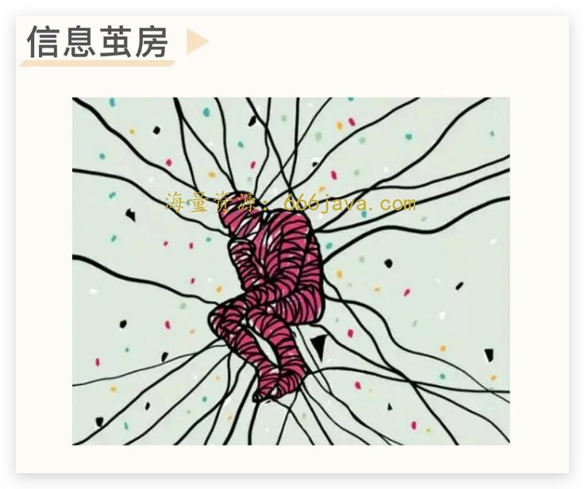

这就导致大家经常容易被认知以外的信息所震惊：

> 王兴曾说过一个数据，中国的本科率大概只有 4%左右；
>
> 总理也曾说过，中国月收入 1000 元以下有 6 亿人；
>
> 统计数据也表明，中国只有 1 亿人坐过飞机，有 5 亿人没有坐过高铁。

现实情况下，中国仍是一个以低收入群体为主的发展中国家，并且低收入群体在全国人口中的比重超乎想象。那么这些收入结构的人，能够理解什么是品牌，什么是真货，以及什么是消费升级么？

有一次我跟朋友讨论，很好奇买一个 200 块钱冰箱的人是一群什么人。朋友反过来问，你换位思考一下，你只需要一个相对便宜的，有一定空间可以储存食物的，具备基础的保险和冷藏能力即可，也不会经常坏的东西，品牌什么的你是无所谓的。那么一个 200 一个 1000，你会选择哪个？ **如果是这个需求下，低价又有什么问题呢？**

我在 [第 3 次练习课](http://time.geekbang.org/column/article/568615) 最后一部分提到了黄铮说过的一段话。这里，我想再重复一下，作为对用常识判断业务的勇气的支撑。

> 人的思想是很容易被污染的，当你对一件事做判断的时候，你需要了解背景和事实，了解之后你需要的不是睿智，而是面对事实时是否还有勇气用理性、用常识来判断。常识是显而易见、容易理解的，但我们各种因为成长、学习形成的偏见和个人利益的诉求蒙蔽了我们。

没错，在上海看到的灯火辉煌以及人头攒动是中国，在《无穷之路》纪录片里看到的也是真实的中国。不理解这一点的人，就无法理解拼多多，不用常识去思考的人，也就无法理解拼多多，一个没有开放心态的人，又如何寻找非共识的机会呢？

## 小结

今天我们这节课聊的点不多，最主要的，是希望你能建立起非共识机会的眼界和勇气。如果一定要说基于拼多多的这个案例，希望你可以学习到什么样的知识点，我认为是这样两个。

**拼多多的低价策略：** 多、快、好、省是电商企业常用的四个竞争维度，其中拼多多的崛起关键点，核心是围绕着“省”进行重点突破。基于依托微信的用户红利、淘宝的低端供给清出以及拼多多的极致增长策略，形成了对用户低价心智的认知，进而在红海的电商市场杀出一条血路，在用户规模上超过了淘宝。

**不要以一己好恶来揣度天下：** 由于区域经济发展、城乡经济倒挂以及财富头部集中化，中国当前是一个四个消费社会并存的国家。我们需要认清，中国仍然是一个以低收入群体为主的国家，月收入 1000 元以下的有 6 亿人。打破自己过往的信息茧房，才能构建新的认知框架。

下节课，我们来聊聊“绝地求生”的故事。

## 思考题

除了拼多多以外，还有哪些典型的“五环内”不理解“五环外”的产品？

欢迎你在留言区和我交流互动。我们建立了一个 [读者交流群](http://jinshuju.net/f/DuxzBi)，欢迎你的加入！如果你觉得有所收获，也可以把这节课分享给你的朋友一起学习。我们下节课见。
