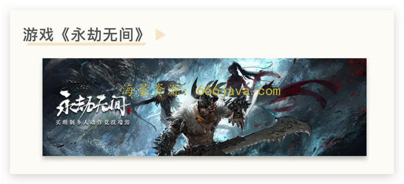
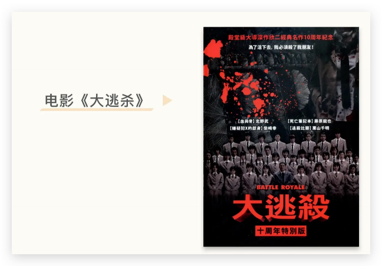
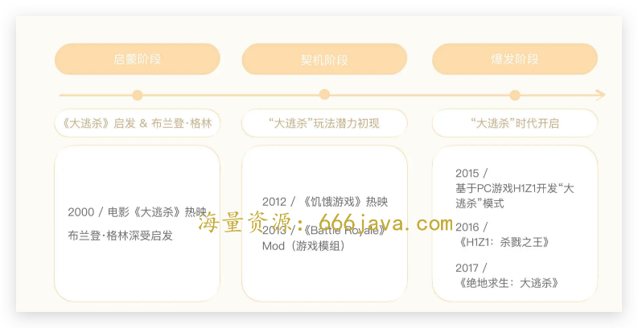
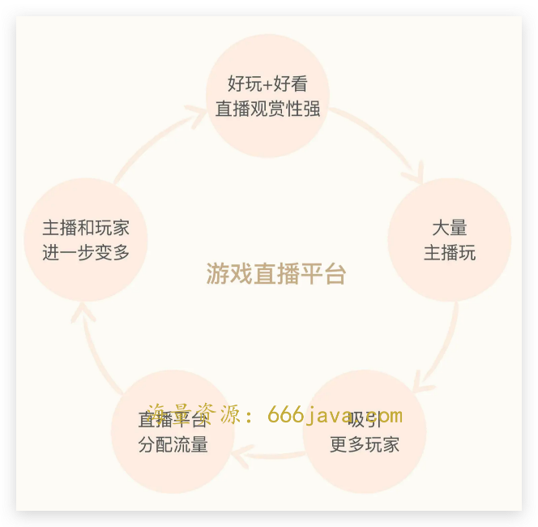

# 25-玩法：大逃杀电影出了那么多年，为什么才诞生绝地求生？

你好，我是雄峰。

过去我们所有的商业案例都是产品或者公司，今天我们换一个角度，从一款热门游戏切入分析，加深你对“非共识机会”的了解。

这个游戏叫《绝地求生》（PlayerUnknown 's BattleGround），国外将它简称为“PUBG”。相信你对这款游戏并不陌生，即使没有玩过，也大概听说过。

游戏的机制相当简单，100 人被随机空投到一座岛屿上，手无寸铁的玩家捡各种各样的装备，所有人相互竞争，最后只活下来 1 个人。唯一的赢家最后会说一句，“大吉大利，今晚吃鸡”。所以，这类游戏后面也统称为“吃鸡游戏”。

从收入上来看，《绝地求生》从 2017 年上线至今（含手游），累积收入超百亿美金，创造了一个超 5 亿用户规模的市场。从影响上来看，《绝地求生》从一个单一游戏衍生出了“吃鸡”这个游戏品类，也诞生了大量非常火爆的“类吃鸡类游戏”，比如《堡垒之夜》《Apex:英雄》《永劫无间》等。

可以说，《绝地求生》是一款现象级的游戏，不仅是这几年全球最火的游戏，其衍化出来的“吃鸡游戏品类”也是这几年出现爆款游戏最多的品类，创造了一个游戏时代。

有意思的地方在于，“吃鸡”游戏的 **核心玩法跟 20 年前的日本电影《大逃杀》如出一辙**。

那问题来了，为什么将近 20 年的时间里，没有游戏从业者按照《大逃杀》的逻辑做出类似的游戏，火爆全球呢？尤其是大逃杀诞生的日本，本身就是一个游戏大国。

核心在于，从各个角度来说，“吃鸡”的成功是一个非共识的机会。接下来，我将带你了解《绝地求生》诞生的过程，同时从玩法、传播的角度去分析，为什么说《绝地求生》是一个非共识的机会？

## “大逃杀”游戏的起源

腾讯的收入一半靠游戏，而支撑腾讯游戏的两根擎天巨柱，一根是《王者荣耀》，另一根是《刺激战场（绝地求生国内改名）》。

《王者荣耀》属于 MOBA（多人联机在线竞技游戏）类游戏。这类游戏火爆至今，经过了大量优秀制作者和玩家长时间的共同优化。MOBA 类游戏起源于 2003 年《魔兽争霸 III》的自定义地图 “遗迹守卫战”（DotA）。八年之后，DotA 才终于变成了一款独立游戏，之后还有 《英雄联盟》《Dota 2》和《王者荣耀》等更为大众所熟悉的游戏产品出现，推动了该品类游戏的全球火爆。

而《绝地求生》与 MOBA 类游戏不同，它的出现高度依赖一个苏格兰人：布莱登·格林（Brendan Greene）。可以说，这哥们以一己之力推出了这款游戏，火爆全球。

- **启蒙：大逃杀电影与“吃鸡游戏之父”**

2000 年，改编自高见广春同名小说的惊悚电影《大逃杀》上映，在日本创下了 31 亿日圆的票房佳绩。

彼时互联网刚起步，《大逃杀》仅在日本及周边的东亚国家产生了一定影响，远不如现在一部漫威电影的预告片影响大。然而，一位远在欧洲的苏格兰人却被这部电影震撼，他就是日后被称为“吃鸡游戏之父”的布兰登·格林。

- **契机：大逃杀游戏制作初体验**

2012 年，电影《饥饿游戏》在全球热映，不仅刷新了票房记录，也让布兰登更加肯定“大逃杀”游戏未来市场的潜力是巨大的。

2013 年，布兰登基于 PC 游戏《武装突袭 2》做了一个名为“ **Battle Royale**”的 Mod（游戏模组，即玩家可以根据游戏官方工具创作游戏内容）。该 Mod 具备了大逃杀的基本雏形：每局一共有 42 位参赛者，随机安排在地图任意地点，人手配置一把枪，最终活下来的人获胜。

Mod 发布后，布兰登在圈内名声大噪， **大逃杀玩法的潜力初现端倪**。

- **爆发：“大逃杀时代”开启**

2015 年，布兰登应黎明工作室（前身为索尼互娱）邀请，基于 PC 游戏 H1Z1 再次开发大逃杀模式，于 2016 年推出《H1Z1：杀戮之王》。

这个游戏已经具备了比较完整的大逃杀模式，商业成绩愤然。而布兰登不满足于在既定的游戏框架内设计游戏，于是离开了黎明工作室，受邀前往韩国蓝洞游戏工作室，希望独立开发出真正属于自己的一款大逃杀游戏。

2017 年，《绝地求生：大逃杀》在国外游戏平台 Steam 面世，该游戏英文名为：PlayerUnknown 's BattleGround。其中，PlayerUknown 是布兰登的游戏 ID，代表着这是一部真正属于布兰登的作品，也是史上第一款独立的大逃杀游戏。

## “吃鸡”的玩法非共识

还记得我们前面提的问题吗？大逃杀电影出来十几年了，为什么过了这么久才出现大逃杀游戏？现在我再加一个问题： **13 年的大逃杀模组已经取得了一定的行业影响力，为什么没有其他游戏公司快速跟进、抄袭呢？**

### 游戏行业的四大驱动力

Steven Ma（腾讯游戏高级副总裁）之前总结过，驱动游戏行业增长的动力有四个。

> **玩法驱动：** 一个游戏必然有一个核心玩法，有意思的游戏玩法会带动玩家不断重复地玩这个游戏，而好的玩法则会带动游戏的火爆。典型的例子就是 MOBA 类的《王者荣耀》，自走棋的《云顶之弈》等。
>
> **内容驱动：** 游戏玩法虽然雷同，但是游戏本身有 IP 的加持或者游戏故事引人入胜，也可以吸引玩家不断地玩。为什么二次元的游戏非常重视游戏立绘、声优以及剧情？就是因为这类游戏大多属于内容驱动，通过不断丰富的内容吸引核心用户，典型的例子就是《原神》《明日方舟》。
>
> **技术驱动：** 同样的游戏内容通过不同的形态载体呈现，则会有不一样的游戏体验。比如《原神》有 PC 端和手游端，为了让用户在手机端也能体验到和 PC 端一样高质量的画质和内容，推出了“云原神”，用云的方式在手机端实现了 PC 上的画质体验和模型渲染。类似的就是 VR 技术的进步，也出现了《半衰期：爱莉克斯》这类跨时代的 VR 游戏作品。
>
> **用户驱动：** 如果一个区域的用户游戏渗透率不高，则证明会有大量的空间。比如过往大家并不看好印度市场，因为用户付费差、网络速度慢、手机设备不行，但是针对印度市场做了大量本地化适配的《Free Fire》（类《绝地求生》的印度版）也取得了很大的成功。

这四个驱动力排在最前面的是 **玩法驱动，也是最关键的驱动力**，“吃鸡”本质上就是玩法驱动型的游戏。

但“吃鸡”面向市场的时候， **绝大多数业内人士并不认为这个玩法能火起来，因为“** **吃鸡”的玩法违反了游戏设计的基础原则：“退出成本管理”机制**。这也是 15 年“吃鸡”的 Mod 有一定影响之后，同行并没有跟进的原因。大家认为，大多数玩家会被难度所劝退。

### “退出成本管理”是什么？

即使没有做过游戏的人也知道，学习任何一个陌生领域的东西都是需要循序渐进的，一上来太难的话，很容易让人放弃尝试。

比如你还在读初中数学，一上来就给你看微积分的教材，大概率你会选择躺平不看。游戏也一样。游戏开发商最怕的就是玩家觉得游戏一上来就太难，怎么玩怎么输，最后直接退出游戏。 **大部分网络游戏的付费方式是免费游戏+内购付费的模式，你玩得越久，付费的可能性就越高**，如果一上来就退出了，游戏开发商是没法赚钱的。

**退出成本管理则是通过循序渐进的方式，让你先熟悉游戏的基础操作，然后一点一点增加难度，最终登顶大神，玩家也会在游戏的过程中，体验到一种成长的快感，升级的满足**，所以你在玩大多数游戏的时候，一开始都是弱鸡的 AI 以及大量的新手引导。

但“吃鸡”就不一样了。玩过“吃鸡”的朋友应该知道，“吃鸡”没有什么新手适应阶段，一上来就要“刚枪对 A”，非常考验心态和技术，落地成盒是常态（“吃鸡”进入战场是从降落伞飘下来，死亡状态是一个盒子）。很多时候能够进入前 10 就非常开心了，如果可以吃鸡，绝对是一件值得发朋友圈高兴的事儿。可以说，这个游戏的核心玩法不符合退出成本管理机制，与直觉相违背。

问题来了，为什么“吃鸡”的玩法违反传统理念还那么成功呢？这里我先说一下原因： **“吃鸡”通过随机体验和规模效应两个策略，让玩家的上手体验并不如我们想象得那么难和残酷。**

### 随机体验+规模效应+独特的玩法

**随机体验** 是指游戏内的很多关键要素都是随机的。游戏每一轮的航线是随机的，每一个地方刷新的装备是随机的，每一个人选择跳落的地点是随机的，空投投放的装备是随机的，毒圈缩小的范围还是随机的。

这就导致了一个体验点的改善： **玩家可以自己选择什么样的体验模式**。在游戏中，玩家为了活到最后，一般会采取两种手段：一种是远离核心地带，去边缘捡装备避免冲突，也就是我们俗称的“苟着”；另一种则是激进地收集物资，对自己的技术非常自信，通过不断交战消灭对手，获得胜利。

新手为了避免冲突，可以选择苟着，跑到大家都不在的地方去捡垃圾，老手为了获得击杀的爽快感，也可以选择刚枪。不同玩家有不同的生存模式，新手玩法可以说是把游戏当成了一个休闲的收集游戏来玩，各种探地形、捡装备，并不会觉得游戏很残酷。

另一个是 **规模效应**。不知道你玩不玩王者，喜欢玩王者的朋友有这么一个有趣的现象：

> 赢了是自己牛 X，一直赢，自己好牛 X，就是峡谷一霸；
>
> 输了是队友傻 X，一直输，系统好傻 X，匹配机制做得跟屎一样。

你可以想一想，为什么玩王者的人都想赢？输了又比较生气呢？

王者的匹配机制是两个队伍对战，输赢的概率都在 50%左右，大家玩游戏都是奔着赢去的。但是，如果 100 人同时进行游戏对抗，赢的概率就变成了 1%，一下子降低了 50 倍，那么心态就完全不一样了——你不会觉得每一局进来我都应该赢，不应该输了。

**问题的本质来自预期。** 之前玩王者，你的概率是 50%，你的预期是要赢，现在玩“吃鸡”，你的概率是 1%，预期就发生了变化，进入前 10 貌似也不错，能吃鸡那就非常开心了，这就是单局参与人数变大之后产生的规模效应。

这种心理模型和赌场的逻辑一样，进赌场的那一刻，你也不会觉得自己一定会赢钱，更多是玩一下就好。所以，“吃鸡”的那句经典台词“winner winner chicken dinner”也是从赌场流传出来的。

**随机性叠加规模效应，加上“吃鸡”独特的大地图+缩圈跑毒，也带来了体验的多样化**。有玩家吐槽《绝地求生》无聊，“10 分钟捡垃圾，10 分钟跑路，10 分钟蹲着阴人，见面 1 分钟挂，这游戏好玩在哪里？”但这段话也恰恰解释了《绝地求生》的好玩之处。

游戏的乐趣不仅仅只有吃鸡，也有到处捡装备和找空投补给的乐趣，也有以近乎极限的方式跑毒成功的乐趣，也有躲在转角处或者草堆里阴人的乐趣，也有开着各种交通工具撞人的乐趣，也有正面刚枪以 1 挑 3 的乐趣…… **如此多的乐趣构建了一个刺激又休闲、低门槛** **、** **高进阶的游戏。**

## “吃鸡”的传播非共识

除了玩法本身，“吃鸡”的传播也是“非共识机会”的体现。

一款游戏研发出来之后，还有一个重要的工作就是推向市场，这个工作在游戏里面叫做 **发行或推广**。和手机游戏不同，PC 游戏的宣发手段十分有限。通常只能通过上架 Steam 这类 PC 游戏平台，靠平台算法被动分发，或是大规模做品牌传播。

《绝地求生》则打破了这一模式， **凭借其高话题性的游戏内容，通过“游戏直播”这个媒介，实现了全球范围内的病毒式传播。** 那么，直播平台是如何带火“吃鸡”的呢？为什么“吃鸡”类游戏能在众多游戏直播中突出重围呢？

### 直播平台是如何带火“吃鸡”的？

先说需求端。2014 年国外的游戏直播平台 Twitch 被亚马逊以约 9.8 亿美金收购，MAU 刚刚突破 1 亿，进入了高速发展时期。当时主要的直播内容均为《英雄联盟》等热门竞技游戏， **平台急需新的爆款直播内容进一步提升用户规模，而这类爆款游戏内容需满足话题性和可观赏性两部分的要求**，毕竟是用户看主播玩，好玩并不是最重要的。

再说供给端。 **大逃杀类游戏过往对于 Twitch 游戏直播平台的活跃带动是很明显的** **。** 2013-2015 年，《武装突袭 2-Dayz》到《H1Z1：杀戮之王》均在 Twitch 上热播过一段时间。这两款游戏均是全球混服的末日生存类游戏，容易产生各种地域文化的碰撞，H1Z1 曾有一个经典的“红衣军”事件，即中国玩家全部在游戏内换上红色衣服，团结一致进攻外国玩家，让该游戏直播热度大涨。

有兴趣可以看看：《 [全世界的喷子都在这个脏游戏里了，老外不会说中文简直就没法活](https://mp.weixin.qq.com/s/6DttXqlXVtLYWpRzN4WS9A)》

除了需求端和供给端的双向选择，《绝地求生》的研发公司也非常注重直播方面的投入，游戏开发的很多细节都围绕直播观众的体验改动，在游戏发行初期也与各大直播平台合作，吸引主播来播《绝地求生》的游戏内容，确保用户任何时候登录直播平台都有《绝地求生》的游戏内容。

GamesBeat 的记者采访绝地求生的国际商务总监时 Woonghee Cho，总结了他们当初对与 [游戏直播合作的策略](https://youxiputao.com/articles/12318)：

> 从项目开始的时候，我们就知道观众是最重要的客户群体。我们希望这个游戏的直播会很有意思，所以我们是围绕着这个特征来开发游戏的。这个策略使得游戏发布之后，它的 Twitch 观众数量迅速上涨。我们觉得这是游戏取得如今销量的基础，毕竟我们没有采取任何特别的营销措施。”
>
> 此外我们和中国以及全世界的直播网站合作，让玩家们得以接触到这款游戏。还发起了“绝地求生合作计划”，主播们可以从他们那里获得一个特殊版本的《绝地求生》，其中可以创建自定义房间（对中国玩家来说再熟悉不过了），还包含一个特殊的“僵尸模式”。

### 为什么“吃鸡”能在众多游戏直播中突出重围？

纵观全球当前最火的几款长青派游戏，《英雄联盟》《DOTA》和《绝地求生》等，我们可以发现它们除了有两个必要特征外（第一是内核足够简单，第二是玩法变化丰富），还都有一个共性——非常好看。

好看，也就是观赏效果好。可以说，绝地求生之所以这么火，和它非常适合直播有必然的联系。

**站在用户角度，** 好不好玩可能得上手才知道，但看别人玩很有趣，也挺有意思的。有一部分用户就是喜欢看别人玩但是自己不见得会玩，把游戏当成了赛事去观看。好比《英雄联盟》S11 全球总决赛的观看人数超 7000 万，但是英雄联盟的玩家远不到这个量级。此外，想知道哪款游戏好不好玩，不用再去看游戏测评网站，直接看主播的游戏内容就好，所见即所得，同时还能学习游戏技术，让自己直接熟练上手游戏。

**站在主播的角度**，绝地求生的随机不确定性、竞技性、娱乐性都和主播的需求高度契合，观众每次观看都可能获得不同的体验。好看的游戏有较好的直播效果，会为主播带来更多的人气，同时自己熟悉领域的游戏会让观众审美疲劳，需要适时寻找新游戏来换换口味。

**站在平台的角度**，为了扩大自己的用户规模，也会在内容差异性上进行处理。当平台观察到玩家在看主播玩《绝地求生》的时候，就会划分更多的资源和版位给到《绝地求生》，让用户快速找到游戏内容。如果发现直播内容对平台活跃有很大的促进，则会进一步加大直播内容的流量分配，这样也反过来推动更多的主播来播放绝地求生，毕竟平台的流量都分配给这个游戏了，拿不到流量也没有用户看。

上述因素导致绝地求生迅速占领直播平台，一举成为各直播平台热度排名第三的游戏。（前两名分别是上千万观众热度的《英雄联盟》和《王者荣耀》）

## 腾讯执念游戏直播业务的原因

说到这里，不知道你有没有发现过一个现象：腾讯除了自己旗下的游戏直播平台企鹅电竞以外，也是国内两家最大游戏直播平台斗鱼和虎牙最大的股东。在 2020 年之后，更是积极推动斗鱼和虎牙两大直播平台合并，最终由于政策干预导致无疾而终。

为什么腾讯要推动直播平台的合并呢？

在腾讯游戏的历史项目中，最赚钱的游戏依然是大 DAU 的竞技游戏，如《英雄联盟》《穿越火线》等。此类游戏最大的特点是受众基础广，游戏内容有观赏性，天然适合直播内容。这也就是腾讯对《绝地求生》出手（投资加研发）如此迅速的原因。

而《绝地求生》又是依赖直播平台所火爆的产品，那么，有没有可能后面有一款类似的产品也依靠直播平台爆火，从而撼动腾讯两根收入支柱——“王者”和“吃鸡”呢？

所以，腾讯持续投资虎牙和斗鱼两个直播平台，核心目的就是将市场份额最大的直播平台全部整合，收入囊中。后续，再让所有的大 DAU 产品在直播领域上形成“局部流量垄断”，进一步提升“王者”和“吃鸡”的护城河，避免收入大盘受到影响。反过来说，如果有一款新的游戏，有机会动摇“王者”和“吃鸡”的地位，腾讯也可以通过直播平台进行反制。

但由于政策干预，虎牙和斗鱼的合并并未成功。2020 年后，抖音、快手的直播份额指数级上升，仅快手一家的直播量就比虎牙和斗鱼两个平台加起来还多。腾讯“直播 x 游戏”的商业版图，此后再无机会落地。

## 小结

今天我们聊的是《绝地求生》，是第一次聊游戏领域的内容，除了可以吸引你的兴趣以外，我更希望你能换一个角度来看待“非共识机会”。同时，也希望你可以学到下面三个知识点。

**游戏行业的驱动力**：推动游戏行业持续向前发展的驱动力有四个，分别是玩法驱动、内容驱动、技术驱动以及用户驱动，其中玩法驱动和内容驱动是最关键的两个驱动力，玩法驱动的代表作是《王者荣耀》和《绝地求生》等，内容驱动的代表作是《原神》。

**《绝地求生》的非共识**：《绝地求生》初期没有人看到的原因就在于其玩法的非共识和发行模式的非共识。

前者看似违背了游戏设计的基础原则——退出成本管理，但是玩法上的随机性和规模效应，加之独特的缩圈机制，让游戏的实际体验并没有那么难。后者是并没有选择常规的 Steam 被动推广以及游戏品牌的推广模式，而是选择了通过直播平台的方式推广游戏，从而低成本火爆全网。

**游戏发行模式的变化**：腾讯内部之前讨论过一个问题，21 年游戏发行做得最好的产品是哪一个？答案是《黑神话：悟空》。这个游戏没有花一分钱做推广，而是在 B 站曝光了几个实机演示的游戏 PV，从而引爆全网，形成了大量的传播，可以说是最划算的买量，也给了游戏发行从业者新的思考：下一个非共识的游戏发行机会在哪？

## **思考题**

想一想，“吃鸡”还有哪些非共识的地方呢？最近爆火的《羊了个羊》，有哪些非共识的地方呢？

欢迎你在留言区和我交流互动。我们建立了一个 [读者交流群](http://jinshuju.net/f/DuxzBi)，欢迎你的加入！如果你觉得有所收获，也可以把这节课分享给你的朋友一起学习。我们下节课见。
