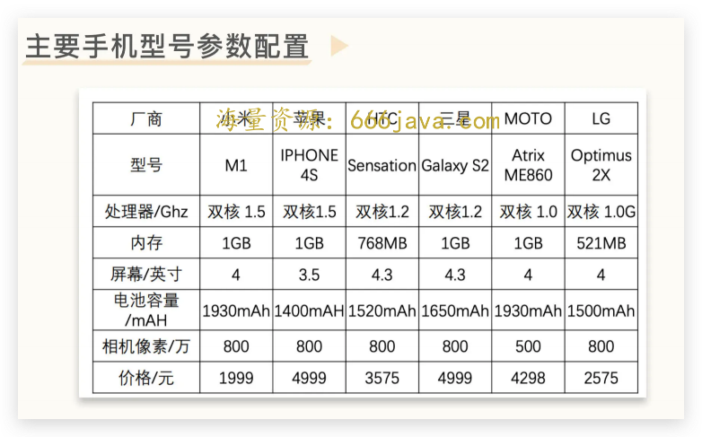
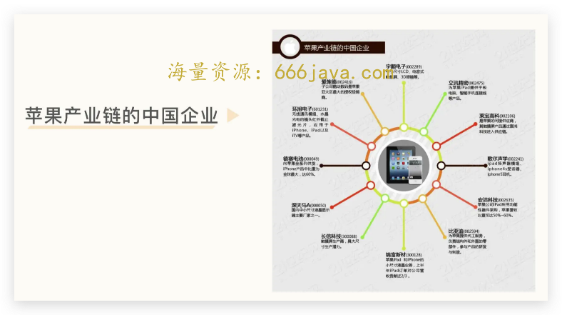

# 27-边界（下）：没有任何硬件基础的小米，为什么可以成为国内第一手机厂商？

你好，我是雄峰。

上节课我们回到了国内手机行业发展之初，了解了小米做手机面临的四大问题点：延伸至全球的激烈竞争，用户认知的缺失，重资产的投入以及手机行业独特的运行规则。

面临着这么多的困难，雷军为什么还是要做手机呢？在回答这个问题之前，我们先思考一个问题：在十多年前，你用手机主要是干什么？

> 打电话或者发短信。

如果换一个问题问呢：除了打电话或者发短信以外，手机还能做什么？

> 貌似也干不了别的。

现在如果回答这个问题，答案会五花八门，貌似可以用手机干一切想干的事情：可以玩在线游戏，看移动电视，使用位置导航，与成百上千的朋友保持联系，分享照片和视频，查看新闻和信息，管理健身计划……这个名单还可以继续延续下去。

“手机能做什么”在智能时代被无限地放大和延展，智能手机成为了移动版的电脑，而这也是功能机与智能机时代最大的差距。而雷军正是看到了 iPhone 带来的改变，看到了手机将替代电脑成为大众最经常使用的智能设备，才毅然决然投身到了智能手机这个行业。

## 规则：智能手机的新模式

原先的功能机就是一个联系人的工具，而智能手机时代的手机更像是一个移动电脑。核心就在于 iPhone 重新制定了 [智能手机的新规则](https://time.geekbang.org/column/article/548476)，相较于传统功能机信号好、待机长、耐摔等产品关键要素，比拼的更是 **硬件、软件以及互联网服务的综合能力。**

在新的规则下，手机公司之间的差距被拉小。对于小米等一系列新公司而言，也就等于有了更大的机会。

传统的诺基亚、摩托罗拉、索爱这样的手机公司，最多只能满足 1-2 个能力，而只有苹果具备三项综合能力，所以雷军当时的判断是：

> 乔布斯重新发明手机之后，大家发现 **手机市场其实竞争很不激烈，因为没有几家能做。**

雷军认为，智能手机将替代 PC 成为大众最经常使用的智能设备。为了朝着这个判断迈进， **雷军秉持着一种极致的产品人思维，选择停止使用笔记本，也尽量不用 PC，所有的事情尽量用手机完成。** 这一过程无疑是痛苦的，但在他看来，这种痛苦就意味着机会。

> 你试试不用 PC，那么你就能发现“什么事情在手机上不能干”，你就去做这个方向的创业，一定会成为主流。

正因为有这个底层判断，雷军顶着巨大的不理解，选择了手机行业，重新出发。

## 软件：MIUI 和论坛

小米成立之初，核心创始人没有硬件背景。雷军及主要创始人都来自软件和互联网领域，因此先从自己熟悉的软件领域出发，基于安卓定制系统 MIUI 切入了智能手机领域。

当时的安卓系统还是 2.X 时代，是非常原始的系统版本。即使当时市面上顶配的安卓手机，在 2.X 的系统上也不太流畅，加上缺少中国本地化设置，因此催生了一些基于安卓的第三方定制系统。

小米的 MIUI 团队先杀入了这个领域，先 **从动画和 UI 界面开始优化，并重点做好电话、短信、通讯录以及桌面四个功能。**

此外，为了快速获取用户反馈和满足用户需求，MIUI 建立了自己的社区论坛，确定了每周更新版本的模式。更重要的是，每周迭代的功能都是由社区用户讨论产生的，用户都能看到自己提出的意见被采纳了，极大地提升了参与感。

上述一系列动作的结果就是，一方面，通过用户的反馈，快速迭代的 MIUI 成为了当时行业最好的国内安卓定制系统，形成了 **小米对友商的独特差异化**，毕竟 UI 层的体验是肉眼可见的改变；另一方面，论坛聚拢了早期的核心用户，每一次迭代都让论坛用户的参与感被持续地深化，等到有一天小米做手机的时候，就会 **天然有一批核心支持者。**

## 硬件：紧跟苹果的供应链和代工厂

雷军的联合创始人中，两位有硬件背景，分别是工业设计的刘德和摩托罗拉的周光平。尤其是后者以及他前团队的加入，补齐了小米在硬件研发上的短板，带来了丰富的硬件开发经验和供应商资源。

但问题是，小米当时的目标是要做最好的顶级旗舰手机，因此，也要 **选择最好的供应链，非苹果不用。** 这就导致周光平要搞定不少过往没有接触过的供应商和代工厂。

先说 **供应商** 方面。供应商普遍更愿意和实力雄厚且具备大量出货基础的厂商合作，即使小米当时融了不少钱，但在这些供应商的眼里也不算什么。

为了获取手机应用链的支持，雷军通过各种关系去找供应商合作。

比如为了获取夏普液晶显示屏的供货支持，他通过金山公司日本分公司接触到了三井商社，并在后者的协助下与夏普公司建立了联系。而建立合作关系，还是在日本“3.11”大地震之后。雷军亲自飞去了夏普大阪总部拜访谈判，最终用诚意打动了对方。

在雷军这样持续不断的努力下，触控技术供应商 TPK、手机芯片公司高通等纷纷同意为小米提供支持，其中高通还把 1.5Ghz 双核处理器的首发交给小米， **在这些顶级供应商的背书下，小米的供应链之路逐渐打通，陆续获得了全产业链供应商的支持。**

**代工厂** 也是如此。包括富士康在内的全球几大代工厂最初都拒绝了小米的合作请求，最后是英华达（苹果 iPod 代工厂）在最后时刻答应和小米进行合作。

当时代工厂对上游的选择无非是两种，一种是生意，另一种是伙伴。前者在商言商，后者则是可以一起成长的品牌商。当时英华达的董事长张景嵩认为雷军可以信任：用一个词来说就是 **“一致性”。因为他对上游供应链、媒体、员工等所有人讲的东西都是一致的，没有说一套做一套。**

雷军在小米 1 开售的时候，不止一次的对外宣称：“小米手机零部件供应商中有大量是苹果公司的供应商”。

将小米的供应商与 iPhone 之间画等号，一方面是是炫耀小米硬件的选材品质，避免被用户当成山寨机（当初雷军在对外宣讲的时候，走到哪里把手机摔到哪里，就是想证明品质高），另一方面是暗示体验可以对标 iPhone，但是中间的艰苦只有雷军自己知道。

## 营销：极致的定价和互联网销售模式

手机生产完成之后，就要面临售卖的问题了。

传统的手机品牌，主要还是采用线下实体店的方式来销售， 在接触到消费者之前，成本低则抬升 1-2 百元，高则 5-6 百元。

作为首个互联网手机品牌，小米采用了互联网销售的模式。不设线下渠道，最大规模减少中间渠道成本，大大 [降低了成本](https://time.geekbang.org/column/article/545373)。

小米 1 的定价仅为 1999 元，而这个价格基本上是成本的定价，后续的收入主要依赖互联网增值，以及长期售卖之后硬件成本的降低。小米当时的硬件性能基本达到了智能手机的顶端，且售价远低于同行。

于是，小米一经发售便引爆市场，在极短的时间内收到了 30 万份订单。最终，小米 1 手机在整个生命周期内达成了 790 万台的销量。

## 风口：大陆供应链崛起和电商流行

“一个人的命运，当然要靠自我奋斗,同时也要考虑到历史的进程”，这一句话完美地诠释了小米手机崛起的本质。艰苦奋斗的同时精准踩中了时代的风口，借用了行业的势能成为了风口上的猪。

小米手机的成功固然是雷军及小米公司成千上万人努力的结果，但是我们也不能忽视中国当时的两个趋势变化。

**一个是 iPhone 中国代工之后，大陆手机供应链体系的崛起。**

2007 年，雷军以数码产品发烧友的身份，第一时间购买了一台 iPhone，手机上的那行小字让他印象深刻，“Designed by apple in California, assembled in China”。他觉得，世界对于中国制造的印象还停留在组装上。但实际上，苹果把生产线搬到中国之后，除了它自己赚得盆满钵满，中国也逐步建立起了最完善的消费电子产业。

除了 iPhone 代工厂富士康以外，还有生产手机面板的京东方、深天马，生产触摸屏的欧菲科技，生产射频天线的信维通信，生产声学器件的瑞声科技、歌尔声学等等。它们都在各自细分的领域做到了全球领先。等到小米开始做智能手机的时候，难度已经比当初降低了不少，也为后面华为、OPPO 和 VIVO 等手机公司的崛起奠定了基础。

说句题外话，为什么中国政府会大力支持特斯拉建上海超级工厂，还提供了大量贷款呢？核心就在于政府判断特斯拉就是下一个 iPhone。特斯拉上海超级工厂的电动车国产化之后，也会带动中国电动车产业链的发展，催生优秀的本土汽车品牌，实现中国企业在汽车领域的弯道超车。

**另一个是双 11 破圈之后网络购物在中国的逐步流行。**

2009 年发生了一件值得载入中国电商发展里程碑的事：淘宝商城双 11 活动（11 月 11 日）。虽然第一届只有 27 家品牌方参与，销售额也只有 0.52 亿，但是分摊到每一家品牌方的效果却非常好。

淘宝商城的“双 11”标志着电商大型促销元年的开启，也引发了越来越多用户的参与和讨论，形成了破圈效应。越来越多的用户尝试在网上购物，用户习惯的培育也构成了小米网上购买用户的基础。

## **小结**

在小米成功之后，中国互联网涌现出了一批互联网手机品牌，知名的有华为的荣耀、锤子、360 特供机，不知名的有小辣椒、大可乐等。

大家纷纷摸着小米过河，用互联网的方式杀入智能手机领域，从而有了今天我们看到的各式各样、好用又便宜的安卓手机。

下面，我们来总结一下小米成为国内第一手机厂商的核心关键点。

为什么说小米做手机非常难，属于一个非共识的市场？核心原因有四个。

1. **手机业务竞争异常激烈。** 手机行业的竞争远大于当时的互联网产业。当时中国互联网大量依赖本土化壁垒来战胜海外竞争对手，但是手机业务一堆巨无霸且全球竞争；
2. **没有国内用户的消费认知。** 早期中国手机的先驱主要是依赖政策准入以及低价策略占据了不少市场，但是中高端市场一直没有进入，且消费者对于国产手机也没有印象；
3. **手机行业属于重资产，非常烧钱。** 10w 台备货量就需要准备至少 2 亿以上的钱，这还不包括企业的运营以及其他费用，属于重资产的投入，这不是互联网所擅长的轻资产领域，所以小米在创业初期融资一部分来自自己的钱，另一部分也是老合作伙伴投的钱，大的风投都没有参与；
4. **手机行业有自己的运行规则。** 手机制造的基础是大量高质量元器件和高标准代工厂的合作，售卖的基础是线下渠道体系，这两者都需要在行业营浸比较久的手机厂商才可以做到，不然只能找二、三线的厂商来造手机，这又是一条山寨机的方向。

那为什么小米又能够做出来呢？可以说，小米的成功既是个人努力的范本，又有时代风口的加成。总结下来，大致有如下几个原因。

1. **iPhone 定义的智能手机模式下，跟进者不多。** 传统功能机就是一个联系人的工具，智能手机时代的手机更像是一个移动电脑，核心在于 iPhone 重新制定了智能手机的新规则，相较于传统功能机信号好、待机长、耐摔等产品关键要素，比拼的更是硬件、软件以及互联网服务的综合能力，导致在新的时代上大量传统手机公司没有跟上；
2. **小米用铁人三项模式造手机。** 集硬件+软件+互联网于一体的能力打造，确保手机全部的能力项都无短板，可以跟苹果在智能手机领域形成差异化竞争优势，用较低的价格享受不输于 iPhone 以及其他高端安卓机的体验；
3. **中国时代的红利方向。** iPhone 供应链进入中国之后智能手机制造供应链成熟，后面给小米提供了大量的便利，不管元器件还是代工厂，此外 09 年之后淘宝双十一引爆了电商购物的潮流，让小米在做手机和卖手机方便都获得了极大的便利。

如果我们用这一套智能手机的视角去看新能源电动车市场，其实会有惊人的相似之处。

同样的 **优等生入华**（手机为苹果，电动车为特斯拉），把关键零部件的供应链进行国产化，为国产电动车发展的基础提供条件，比如宁德时代、三花智控等。

同样的 **规则切换**，从单纯的硬件制造转向到硬件、软件以及智能驾驶三位一体的模式，加之电动车电机的制造远比内燃机更加简单，因此更适合弯道超车。

同样的 **品牌建设和渠道模式变化**，在燃油车时代，国产车几乎没有高端品牌，销售模式也是走经销商体系，但是在电动车时代，国产高端车品牌不断涌现，如蔚来、理想等，且销售模式也基本走直营体系。

用一句话来说， **燃油车时代的中国没有能赢的可能，电动车时代的中国想输也没有可能**，这也是小米从手机杀入电动车领域的原因所在。

## **思考题**

想一想，小米为什么要做高端市场，又为什么一直没有突围成功呢？

欢迎你在留言区和我交流互动。我们建立了一个 [读者交流群](http://jinshuju.net/f/DuxzBi)，欢迎你的加入！如果你觉得有所收获，也可以把这节课分享给你的朋友一起学习。我们下节课见。
