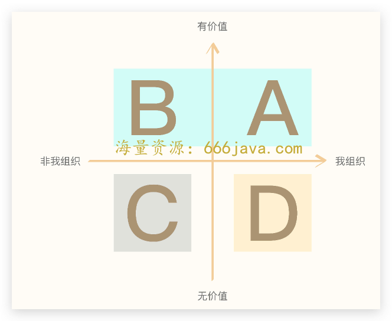
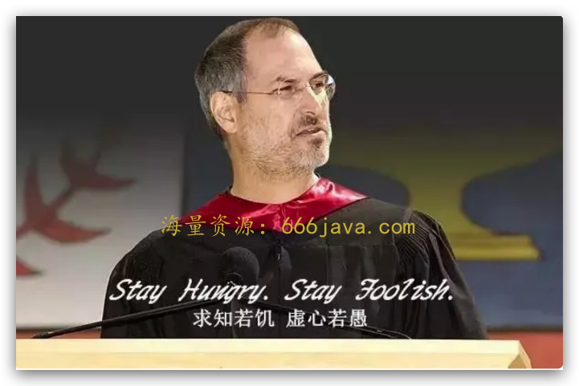
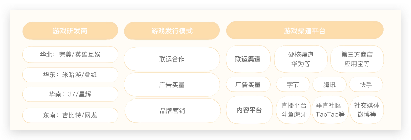
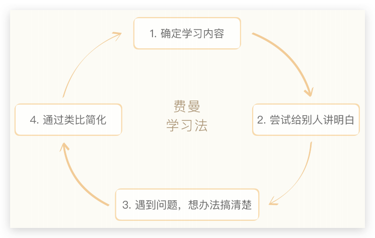

# 28-练习课：如何用开放的心态来挖掘非共识机会？

你好，我是雄峰。

本节课是我们非共识世界的第四节课，这是一节练习课。前面三节课讲述了商业世界中一批“另类”的公司，在市场上发现了非共识机会，顶着巨大的不理解持续前进，获得巨大成功之后重新定义了商业规则。这一节课，我们要学习的是如何挖掘非共识机会。

没错，非共识的能力是可以锻炼和培养的。在说具体如何做之前，我们先来总结一下，非共识的机会是如何产生的。

1. **资深行业从业者对市场的理解再创造** **：** 比如贝壳创始人左晖，当房地产中介的所有人都在依靠吃差价赚钱的时候，左晖就率先提出不吃差价的口号，在全行业都依靠假房源获取用户流量的时候，左晖就率先提出真房源的口号，两者都给链家带来了巨大的口碑；
2. **行业外的人的用新方式对原有行业进行重塑** **：** 比如小米创始人雷军作为圈外人，反而重塑了中国智能手机产业，一方面是原有从业者不认为国产智能手机有大的机会，另一方面是看不懂以 iPhone 为代表的智能手机，雷军敏锐地发觉了这一个新的时代机会，以互联网思维做出了小米；
3. **偶尔的灵光闪现** **：** 比如全球共享住宿鼻祖 Airbnb，这个产品并不是刻意设计出来的业务，而是两个创始人经常参加技术大会，却住不起酒店。为了开会他们愿意去住朋友家的客厅，只要有充气床和早餐就可以，这两个东西的英文 Air Bed 和 Breakfast 就是 Airbnb 这个名词的由来。因为自己有需求，所以他们干脆创建了 Airbnb。

简单总结下来，我认为是三点： **专业领域的持续积累，多领域的综合知识以及敏锐的生活观察能力。** 这三个点是构建非共识能力的基础。那具体要怎么做呢？

## 好奇心是非共识的契机

不管是知识的持续积累还是敏锐的生活观察能力，都要求你有足够多的好奇心。如果你对于任何事都没有好奇心，那么永远不可能对新事物有探索的想法，也就不会产生任何新的机会。

知乎上有一个 [神贴](https://www.zhihu.com/question/19982269/answer/13554085)，在 11 年前（2011 年）有一个大学生提问：

> 大三的学生，手头有 6000 元的钱，想要做些小投资赚点儿钱，有什么好建议么？
>
> 答：买比特币，保存好钱包文件，然后忘掉你有过 6000 元这回事。五年后再看看。

在当时 1 比特币大概在 1 美元左右，6 千人民币大致可以兑换 5000 枚比特币。即使按照现在的行情价 2 万美元一枚计算，妥妥的已经成为了亿万富翁，所以在加密货币暴涨的 19 年和 21 年，这个帖子一直被网友们流传，评论区清一色的膜拜。我自己在看到这个帖子的时候，一方面是感慨错失了发财的机会（笑），另一方面也在反思自己的问题：

为什么面对一个未知的领域（比特币），没有尝试着去了解一下其内在逻辑？

因为从 13 年开始身边就有一些朋友接触比特币这个领域，也或多或少地劝我了解一下。基于固有观念，我总认为这玩意是割韭菜的镰刀，迟迟不愿意去了解，而这个阶段里，不少的朋友依托比特币已经实现了一定阶段的财务自由。

这就是好奇心缺失和心态不开放的表现。后面在一些新领域的方向上，我给自己定了一个标准：可以不参与，但是不能不了解，逼着自己去了解最新的元宇宙和 Web 3.0。

话说回来，如何保持好奇心呢？

### 新事物是靠“空下来”发现的

换位思考一下，你每天从早上 9 点忙到晚上 11 点，一个星期 6 天皆是如此，全部精力都被工作所消耗，有限的空余时间内你只会想睡觉，哪里还有精力去做一些新鲜事物的探索呢？所以保持好奇心的第一个点就是 **让自己空下来，有一段属于自己的时间。**

有人会问，我就是这么忙啊，早上 10 点开始，到了晚上 11 点还有人拉我开会，这个该怎么办？

这里有两个办法可以帮你把时间给挤出来， **一个是时间错位，另一个是会议复利**，让自己的工作更有效率，从而节约出更多的时间。

我们先来做一个小的练习题，假设你一天的工作有这么 5 件事情（当然，一天远不止），你会如何安排这些工作的顺序呢？

> A. 写一个 Q4 的业务规划；
>
> B. 针对新版本数据进行数据分析；
>
> C. 客户来访需要接待沟通；
>
> D. 新的业务方向需要咨询一下相关同事获取必要信息；
>
> E. 同事找我沟通业务合作的事情。

工作中的事情大多分为两类，一类是独立完成的工作，另一类是跟周边协同完成的工作。但是大家上班的时间往往是一致的，这就导致两类工作经常会相互干扰，本来想静下来写一个 Q4 的业务规划，突然有同事来你工位，找你沟通可合作的机会点，一天类似的事情有好几个，忙碌了一天发现净开会去了，什么事情都没有做。

面对这种情况，可以采用时间错位的方法，简单来说，就是 **当大多数人在忙碌的时候，你应该在休息，当所有人在休息的时候，你应该在忙碌，从而创造更多独处的时间，避免自己的时间跟着其他人的节奏走。**

大多数互联网公司的上班时间是 10 点左右，晚上的下班时间差不多 9 点或者 10 点之后，那你有没有办法尝试 7 点上班、晚上 6 点下班呢？

这种工作方式的好处就是跟周边团队是错峰节奏，一方面缓解通勤的压力，另一方面可以在很短的时间内处理完昨天晚上的留言和工作。3 个小时独处的时间是没有人干扰的，完全可以花 2 个小时处理完工作，留出 1 个小时去了解一些感兴趣的业务方向。

如果是我安排，我会把上述 5 件事情进行分类， **A+B 属于独立可完成的工作，C+D+E 属于协同完成的工作，前者安排在早上，后者正常安排。**

那什么是 **会议复利** 呢？一天的工作中，我们大量的时间都在开会，但是需要先思考两个问题：

> 什么样的会是必须要开的？
>
> 什么样的会对自己有价值？

工作中会有一个概念误区，会希望把自己的所有时间填满，仿佛只有这样才算非常努力，理想的方式应该是把自己的时间作为筹码，投掷到你参与的每一个会议上去，看看哪些会议可以给自己带来有效的价值，这里我们可以将会议分为四类来看：

**有价值的会议 A 类和 B 类一定要去听的** **。** 这一部分可以带着脑子去听其他人的会议内容，从而收获自己想要的信息和业务判断。

D 类会议由于是自己组织，要尽可能避免无效会议，争取把 D 转向 A，甚至直接不开 D 类的会，杜绝 C 类的会议。

久而久之，你就会知道哪些会不重要，哪些事情不关键，哪些人不靠谱。那么你也就清楚哪些不应该不参加，哪些不值得参加，哪些人的会可以不参加，这样你就可以把自己的时间空出来干自己觉得有意义的事情了。

你可能担心这样做是否合理。其实站在企业的角度去思考， **企业的核心追求是效率、效果，而不是时间。** 如果你选择更有意义的事情去做，那么创造出来的增量价值对于公司的帮助更大。

保持好奇心的第一个点就是让自己时间先空下来，让自己慢下来，你才可能有时间去了解更多新的东西，有更多探索新事物的欲望。

### 如果一切都有意义，那就是没有意义

从学校步入职场，大多数人都会犯一个问题： **短期高估，长期低估。**

最明显的表现是短期目标制定过高了，长期，又没有什么具体的目标。比如每一个人都希望自己很快可以出人头地，几年晋升 P11，薪酬翻个几倍，但是长期的人生目标会有所缺失。想一想，40 岁的你希望过上什么样的生活？是否具体、可量化？可能大多数人回答不上来这个问题。

影响好奇心建立的另外一个点，就是所谓的意义感。追求意义感会有一个隐性的影响： **任何时间尽可能希望其有价值，不能让它被浪费了。**

假设你好容易按照上述的方式把时间空下来，你有早下班的时间，你会选择去干什么？有这么几个选项给你，你会选择哪个呢？

> A. 打两把游戏；
>
> B. 去健身房健身；
>
> C. 思考工作其他的事情；
>
> D. 发呆；
>
> E. 拔草一家心仪已久的餐厅。

这里我建议的是：除了 C 以外，其余的都可以做。

很多灵感和好的想法是来自生活的点点滴滴，来自过往兴趣爱好，也来自发呆，有更多生活的爱好才有更多创造性的灵感产生。 **如果被工作填充了所有，被意义填充了一切，那么人生的一切将没有意义。**

[乔布斯 2005 年在斯坦福做了一次演讲](https://zhuanlan.zhihu.com/p/408761347)，著名的“stay hungry stay foolish”就来自这个演讲。

乔布斯讲述了自己三个人生的小故事，其中有一个特别打动我，大概的内容就是自己在大学读了六个月之后就退学了，而在退学的这段时间跟着自己的直觉和好奇心走，遇到了很多东西，此后被证明是自己人生路上的无价之宝，乔布斯是这么解释一些无意义的时光的：

> 再次强调，没人可以未卜先知，事与事间的因和果，往往只在回首时显现。你得相信，因和果会在未来生活中联系起来。人总要有些信仰才行，直觉也好，命运也罢，因果轮回，不管什么，去相信因与果的联系，会给你信心去跟从自己的意愿，哪怕离经叛道，也绝不止步，只有这样，才能有所成就。

所以，在工作之余保持更多的兴趣和爱好，让自己有更多的时间去探索自己的个人价值，才可以保持足够的好奇心。

## 知识是机会的试金石

如果说好奇心是发现非共识机会的基石和契机，那么知识的持续积累则是非共识机会的催化剂和试金石。

催化剂是指，只有大量的知识累积才可以把一个灵光一现的想法和点子，转化成一个可落地的方案，找到可使用的场景，从而形成新的机会。

试金石是指，只有大量的知识积累才可以判断提出来的想法和点子，到底只是“非共识”的想法，还是有更多成为“机会”的可能性。

因此我们一方面需要在自己擅长的业务领域方向有长足的积累，构建起足够的知识纵深；另一方面要快速学习新领域的知识内容，成为多学科领域的“游牧民族”。

这里面我推荐两个自己最常用的方法：自己擅长的专业领域，使用人肉图谱；多领域知识的快速学习，使用费曼学习。

### 专业领域：人肉图谱

每个人都有自己所擅长的专业领域，比如我擅长的是商业化领域，横跨游戏和广告两个方向，而这个能力也是公司给我付钱的核心因素。

要想在某一专业领域有足够的知识纵深，一方面需要自己 **下场实践，去真实的市场环境上感知行业的变化**，另一方面需要 **其他知识信息的补充，以便从全局了解自己所处领域的发展情况**。

- **为什么是人肉图谱？**

我们刚刚提到的“其他知识信息”的获取途径并非书籍。以我们所处的互联网行业来看，这个领域最新的知识和信息不在书本上，因为更新迭代的速度太快了，所以一部分散落在互联网的角落里。而想要获取这一部分信息，需要学会善用 Google，找到领域大拿的公众号或者 Podcast，再或者找到适合的付费订阅栏目；另一部分则存在从业者的脑子当中，当下可能大家都觉得有机会的方向，在下一个阶段就被抛弃，至于什么原因，只有亲历者才知道其中的原因。

举一个很有意思的例子。

> 2015 年微信支付为了扩大自己的用户规模，与央视春晚项目组合作，用户通过微信“摇一摇”的方式可以抢红包，而当时内部在给用户送多少钱的基础上并没有达成一致的意见，后面项目负责人拍板的结果是：2 元左右。
>
> 问题来了，为什么给用户发的红包是 2 元左右呢？
>
> 其核心逻辑在于：红包是一个好的兆头，2 元的价值大致对应一注彩票的价值，微信红包不见得可以让用户发财，但是可以让用户有发财的机会。所以当年在领取红包之后还会随机奉送一注彩票，感兴趣的用户还可以继续下注彩票，间接带动了微信彩票业务的发展。

如果这件事不听当事人说，你怎么会了解其中的逻辑呢？包括之前在直播中讲的 [B 站业务逻辑](http://time.geekbang.org/column/article/566660)，我也是从 B 站朋友侧获取的信息。所以，想要获取任何最新的信息，最好的方式是直接问这个领域的资深从业者，远比你自己去摸索来得快。

- **如何建立人肉图谱？**

那么，以什么样的方式构建人肉知识图谱效果最优呢？我使用的办法是： **把所处的业务进行拆解，基于关键业务环节+重点公司，构建一张鸟瞰式的图谱网格，逐步与这些岗位的人建立朋友关系，来保障信息的获取。**

接下来，我以自己所处的游戏发行行业做一个拆解案例，让你理解具体该怎么做。

在做之前，先介绍一下什么是游戏发行。

如果我们把游戏比作一个包子铺，游戏研发商就是包子铺里面的师傅，负责做包子，游戏发行就是负责把包子卖给用户，让用户愿意为包子付费。很多游戏研发公司只擅长做包子，但是不清楚如何做游戏营销和推广，因此涌现出了一批游戏发行公司，与游戏研发商合作，承担其中市场推广和游戏运营的工作，这个就是游戏发行。

游戏行业发行模式的上游是游戏研发商，下游是游戏渠道，而游戏发行的模式当前行业主流有三种，一种是联运，一种是广告，另一种是营销。因此我们可以画一张下面的图，把关键业务环节和重点公司做一个标注，如果想了解发行行业在出现什么样的变化，把这些环节的人都找一遍，即可获取大量的信息。基于多方面的信息汇总，即可拼凑出一张完整的行业视角。

你也可以可以尝试着按照上述的逻辑，把你所处的行业进行一个人肉知识图谱的拆解。

其中有一个环节就是如何找到关键公司和关键岗位上的人。这里我想说的一个点是：尝试着先从一两个身边的人着手，不断扩充自己的行业深度理解，积累越多，你对行业的理解也就越深，也就可以提供更多的信息价值，然后才能慢慢延伸扩展至更多，这个是需要时间的。

### 多领域知识：费曼学习

王烁（财新总编辑）老师对于多知识领域的学习有一个精彩的比喻：

> 在一个专业领域持续深耕类似农耕民族，需要对这个领域进行精耕细作，就可以成为这个领域的专家，但是在如今这个时代，技术在飞速地迭代，而新的机会永远出现在边缘地带，只掌握原来的专业领域知识是远远不够的，逼得我们必须成为知识的游牧民族，哪里水草丰美就向哪里迁徙，在知识的原野上，用旺盛的好奇心，四处奔跑。

他甚至还提出了一个“另类的二八定律”，就是用百分之二十的时间，掌握一个新领域百分之八十的知识。

事实上，大量的非共识机会就是跨界创新多领域相互融合的结果，而我在学习新领域知识上使用的方式就是费曼学习法。

相信你对费曼学习法并不陌生，它也被称为史上最高效学习的方法，其核心理念是： **你是否真正掌握一个知识的关键点在于，看你能否用直白浅显的语言把复杂深奥的问题和知识讲清楚。**

整个学习法大致可以分为四个关键环节：分别是确定学习内容、尝试给别人讲明白，遇到问题想办法搞清楚，通过类比的方式简化内容，从而让不懂这个领域的人也听得懂你想说的东西。

**第一步：选择要学习的方向，或者说提出你想要学习的问题。**

这一步常常被人所忽视，很多时候好的问题比答案更关键。比如非共识机会里面有一篇写了 [吃鸡游戏](http://time.geekbang.org/column/article/573814) 的分析，当时有朋友就会问我为什么要写这个题目？我的回答是这样的：

> 吃鸡这个游戏的电影原型《大逃杀》在 20 年前就上映了，吃鸡本身的核心玩法与《大逃杀》基本一致，在游戏行业抄袭成风且跟进迅速的时代，为什么就没有人或者游戏公司跟进这个玩法机制呢？相反是一个边缘制作人反复凭借自己的一己之力推动了整个游戏品类的向前，中间你不觉得有什么地方是我们所忽视的么？

朋友听完就觉得很有意思。所以， **好的问题不仅可以指明学习的方向，也可以激发人的兴趣**。现在，你就可以尝试拿出一张空白的纸，在最上方写下你要提问的问题以及提问题的原因。

**第二步：设想你需要把这个知识传递，要把这个知识点教给一个不懂的人。**

你先要对问题进行拆解并分析，最好的方式就是自己完整的把内容写下来，然后讲解给这一方面毫无经验知识的人，让他听懂，中间也尝试把自己的解释记录下来，便于回溯修改。

这一步非常关键，一方面你要尝试着把视角从供给侧转为需求侧，简单来说，你不能够按照自己的思路来讲，而是要按照听你内容的人来调整，在解释的过程中你会把你不甚理解的东西详细地拆解出来；另一方面，你要把自己想到的东西落到实处并讲出来，中间的过程可以帮助你发现大量自己没有注意的细节，从而加深对业务逻辑的理解。

**第三步：每一个听众都会给你反馈，当你觉得不明白时，再返回去了解。**

还不明白的时候，别急着往下走，再返回去，找各种材料去理解去学习，直到你搞懂为止，然后把解释记到纸上，把最接近“标准”的答案写下，下一次还有人问到类似的问题时，你就可以很好地解答了。

我个人的经验是要把这个东西讲述给最少 5 个人去听，且最好是不同工作方向的人，因为你会发现不同领域的人给你的反馈并不一致。

**第四步：进一步简单化** **，用上** **比喻，尽量用简单通俗的语言重新表述。**

你可以找一个参考系的中位数，最高的要求就是让你爸妈这类完全不懂的人听懂，最低的要求就是让你身边有一定知识经验背景的同事听懂。目前我们可以从最低的要求来，也是一个很大的进步。

我在工作中很喜欢跟朋友和同事说，这个领域你要不要尝试费曼一下？

很多人会胆怯，觉得自己没有办法输出。实际上， **输出不够的核心是因为输入不多，而输入不多的原因又是因为自己没有找到一个好的问题进行集中性研究** **。** 我们工作中看了大量的文章和资讯，但是这些并不能构成知识，而知识一定要有成体系化的结构进行梳理和展示，才有其多领域学习扩充的价值。

## 小结

讲到这里，我们今天这节课也就接近尾声了。最后，我来给你总结一下今天的关键内容。

作为非共识机会的练习课，我们总结了这类机会出现的原因，大致可分为三类：

> 1. 资深行业从业者对市场的理解再创造，比如贝壳；
> 2. 行业外的人用新方式对原有行业进行重塑，比如小米；
> 3. 偶尔的灵光闪现找到了行业新的机会，比如 Airbnb。

而非共识机会之所以诞生的原因有三种：

> 1. 专业领域的持续积累；
> 2. 多领域的综合知识；
> 3. 敏锐的生活观察能力。

因此，锻炼发现非共识机会的能力要从两方面着手，一方面是保持自己的好奇心，它是驱使新机会被发现的源动力；另一方面是积累更多的知识，单一领域的深度知识和多领域的知识可以催化出更多的非共识机会，还可以把非共识落地成可行方案。

保持好奇心最重要的方式是让自己闲下来。其中最关键的办法是让工作更有效率，这里面推荐两个办法， **一个是时间错位，另一个是会议复利。**

前者是让自己与其他人的时间形成错频，从而有自己独处工作的时间，后者是让工作更有效率，尽可能把时间花在更有价值的会议上，两者叠加可以空出不少工作时间，而空出来的时间一定不要让意义填满，可以尝试着找到生活中美好的点和多元的生活方式，才会让你更有动力保持好奇心。

在不同领域积累更多知识的方法并不一样。在自己要持续钻研的专业领域，可以构建自己的 **人肉知识图谱**，只有对领域有一个全局的认知和全面的信息源，才可以更好在深度上构建优势竞争力。在探索新领域的方向上，建议使用 **费曼学习法**，通过自己给自己提问的方式不断探索新的领域方向，成为知识领域的游牧民族。

最后，我想跟你说一个个人感悟， **非共识机会需要长时间的积累和锻炼，非一日之功，一定要尝试着调整短期和长期的目标策略，很简单，人生是一个长跑。**

## **思考题**

你还有哪些保持自己好奇心的办法呢？

欢迎你在留言区和我交流互动。我们建立了一个 [读者交流群](http://jinshuju.net/f/DuxzBi)，欢迎你的加入！如果你觉得有所收获，也可以把这节课分享给你的朋友一起学习。我们下节课见。
