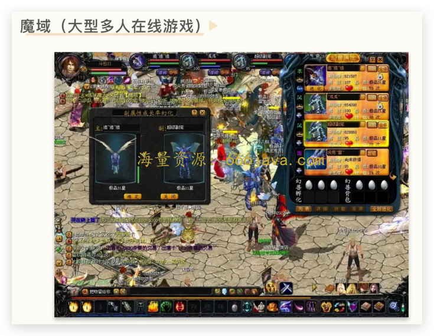
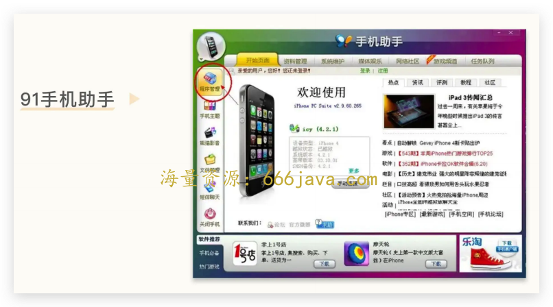
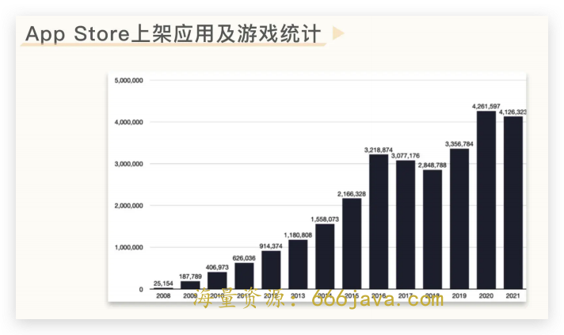
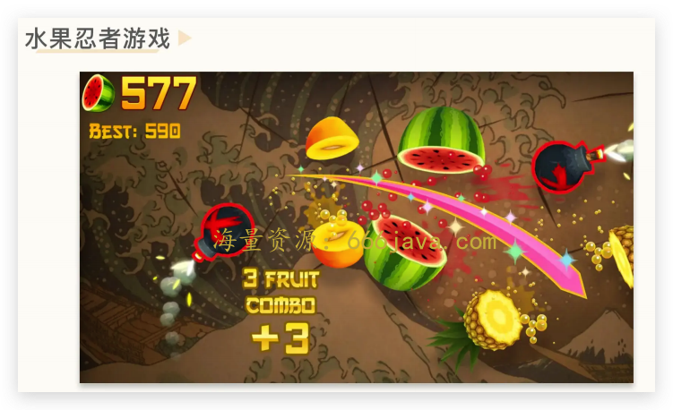
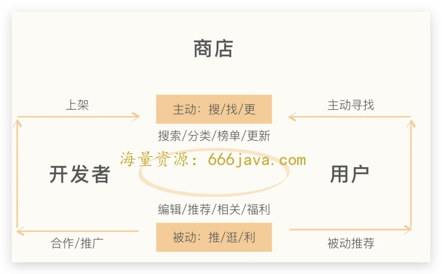
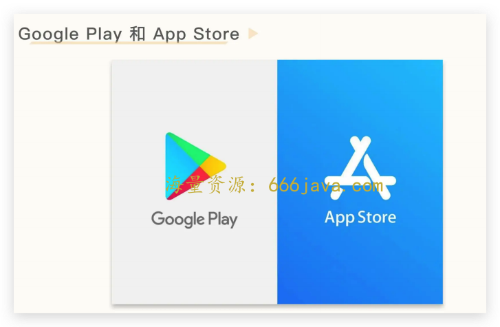

# 29-平台：91 手机助手卖掉为什么是明智的选择？

你好，我是雄峰。终局思维的第一节课，我们来聊聊 91 手机助手。

先来回想一下，什么是“终局思维”呢？

这个概念是阿里巴巴前参谋长曾鸣教授提出的。意思是说， **时间是一切事物发展最大的变量，在面对选择时，从终点出发考虑问题，来决定你当下的选择。**

因为当我们思考任何一个业务机会点或者看到行业热点机会的时候，如果带上了时间这个要素再去判断，可能得出的结论会和过往大相径庭。

为什么要聊 91 手机助手？在第三方应用商店这个领域里，91 手机助手和豌豆荚都是市场的领先者，但是最终的境遇确大相径庭。

前者在 13 年以 19 亿美金的价格卖给了百度，成为了当时互联网行业最大的一起收购案，而当时与 91 助手齐名的豌豆荚不甘心卖身大厂，坚持独立运作并转型应用内搜索业务，但是探索了 3 年之后不得已以 2 亿美金卖身给了阿里巴巴。

这两个产品的归宿非常好地诠释了什么是终局思维。

早在 2014 年，阿里巴巴给豌豆荚开出的价格是 15 亿美金，而 2 亿美金的价格基本上只能够将将 [打平投资人的投入](https://time.geekbang.org/column/article/560747)，这意味着这一次投资人的退出是没有什么收益的。

和豌豆荚死磕应用内搜索相比，为什么 91 助手卖身是正确的呢？

我们前文有总结过豌豆荚做 [应用内搜索失败](https://time.geekbang.org/column/article/559278) 的原因，也有总结过国内手机硬件厂商通过 [盐铁官营](https://time.geekbang.org/column/article/548476) 的方式挤压了第三方工具产品的生存空间。

今天我们来讲另外一个原因： **从终局思维去判断，国内应用商店业务无法成为一个平台型产品，只是一个管道型产品**，导致其互联网入口价值不断降低，再也无法支持起当初那么高的业务估值。

接下来，我将带你了解 91 手机助手发展的历程，以及大小公司都要做应用商店的原因，并用终局思维去思考，为什么 91 手机助手卖掉是合理的选择。从中，我们再去学习衡量产品是否为平台的关键点： **需求是否动态不平衡**。

## 91 手机助手简史

91 手机助手的创始人熊俊可以说是移动互联网早期的一个奇迹，在同一个领域两次创业都获得了成功，实现了财务自由。

第一次是 **91 手机助手**。他在 2007 年把 91 手机助手的雏形以 10 万人民币卖给网龙，然后加盟后者。2013 年，网龙以 19 亿美元的估值将 91 手机助手出售给百度，不过，这个阶段的 91 手机助手已经和熊俊没有任何关系了。

第二次是 **同步推**。2010 年熊俊从网龙出来之后，创办了同步推，产品基本跟 91 手机助手一致，并获得了蔡文胜和创新工场的投资。14 年，同步推以 10 亿的价格卖给了一家台湾的公司，熊俊再次收获了财务自由。

为什么同一个领域两款产品都可以获得成功呢？核心在于 **需求庞大**。

### 第一版：照片管理工具

如今来看，我们会觉得第一代 iPhone 是一款划时代的产品，引领了智能手机的时代，但在当时来说，它并不足够出色。

产品贵不说，手机信号也比较差，不支持 3G 网络，也没有一些显然会用到的功能，比如更改铃声、壁纸，还不能换电池、插存储卡。当时 iPhone 令人惊艳的只有全新的触控方式，超大的屏幕，把 PC 互联网带到手机上的理念。因此，当时 iPhone 主要吸引的是一批极客玩家和尝鲜者的注意，熊俊就是其中之一。

他在 2007 年 9 月底的时候，攒钱买了一台水货（从水路走私来的货物，那时候 iPhone 并没有进入中国市场）iPhone，成为中国最早的苹果尝鲜者之一。和很多早期玩 iPhone 的人一样，熊俊觉得这款手机虽然硬件强大，但使用起来并不方便，尤其 **不太方便整理手机中的照片，这也成为熊俊为 iPhone 开发管理套件的初衷。**

为了尝试解决这些问题，他陆陆续续写了几个小软件，最后把这些软件打包，命名为“iPhone PC Suite”放到了网上，这就是 91 手机助手的前身。随着软件包的不断更新，逐渐达到了 20 万次的下载量，这对于当时 iPhone 的市场存量来说，是一个很大的数字。

### 第二版：手机内容中心

熊俊加入网龙也是非常机缘巧合的事情，因为两者所做的事情完全不相关。网龙的主营业务是网络游戏，其中最出名的一款游戏叫做魔域，这是一款 15 年前在 PC 端游非常火爆的 MMO（大型多人在线游戏）游戏，网龙就是依靠这款游戏实现的上市。

这里插一个行业小段子，早期从网龙出走的一位游戏策划如今非常有名，他叫姚晓光，现在是腾讯天美工作室群总裁，也就是王者荣耀的制作人。

2007 年底，网龙 CEO 刘德健在路演时见到很多投资人在用 iPhone，加上彼时网龙刚上市，财大气粗，想要寻找新的方向，便决定成立一个手机无线业务部门。他的助理找到熊俊，表达了收购的意向。

网龙给 iPhone PC Suite 的收购价是 10 万元，同时也邀请熊俊来网龙工作，一起建立新的无线事业部。那时候熊俊刚毕业三年，工资不高，10 万块钱不算是一个小数目，加上从一家台湾私企加入上市公司对他的诱惑也很大，于是加入了网龙。

在网龙的那段时间，他对 PC Suite 进行了一次产品升级。 **从过往只满足用户拷贝文件管理照片的需求，进一步实现了在 PC Suite 上帮助用户完成音乐、铃声以及小说等内容的** **一站式管理。** 这个阶段，PC Suite 改名为 91 手机助手。

### 第三版：增加应用分发

与豌豆荚不同的地方在于，91 手机助手做分发是从 iOS 侧开始的。你可能会好奇，iOS 不是 App Store 垄断的么？为什么可以由一个第三方商店分发 App 呢？

核心在于早期的 iPhone 并没有进入中国市场。这导致了两个现象。

一个是 **App Store 注册非常麻烦**。当时国内用户下载应用需要首先注册国外账号，再用国际信用卡支付，非常繁琐。如何注册国外区的账号一度在威锋网等苹果论坛成为热门的 iPhone 非官方使用指南。

另一个是 **iPhone 当时并没有在国内发售，国内用户买的 iPhone 是其他国家的产品**。大量美版的 iPhone 不支持国内三大运营商的信号，因此需要越狱破解，不然在国内只能打电话，完全无法上网，而越狱之后的 iPhone 可以安装、运行未经过官方认证的第三方程序。

两者的叠加导致大量国内 iPhone 用户会选择越狱，而越狱之后都会选择安装盗版的 App 或者游戏。一方面省去了注册 App Store 的麻烦，另一方面省去了购买正版 App 的费用。

**91 手机助手在这期间大量收集破解版的应用和游戏，集中在产品里面分发给用户，满足了大量的用户需求**。到此为止，91 手机助手才形成了今天的样子，变相成为了中国版的 iTunes 和 App Store。

此外，当时 91 助手非常聪明地跟水货经销商合作，为他们提供了 iPhone 上全套的批量安装能力，让一个手机卖给用户前就装好大量的应用，这样也更有利于手机的售卖。很多经销商在手机卖给用户前会这么说：手机常用的应用和游戏全部都装好了，如果你还要其他的，可以打开里面的 91 手机助手自己找。

这么一番操作下来，91 手机助手一度占据了国内 80%的 iPhone 用户规模。以至于在 2009 年下半年，腾讯选择 91 助手作为优先发布其最新版本移动 QQ 的平台——这意味着 91 手机助手上的 QQ 永远比 App Store 的官方版本要领先 1 到 2 个版本。

此后，91 也推出了安卓版本，逐步成为了国内第一大第三方应用商店，横跨 iOS 和安卓两个平台。接下来，就有了前文提到的，百度在 13 年以 19 亿美金收购 91 手机助手的故事。

## 风口上的业务：应用分发

当年除了 91 手机助手做应用分发以外，还有大大小小几十家跟 91 竞争，稍微有名气一点的有这么一些。

> 巨头公司：腾讯的应用宝、百度的百度手机助手、360 的 360 手机助手、阿里的淘宝手机助手；
>
> 创业公司：豌豆荚手机助手、应用汇手机助手、木蚂蚁手机助手、PP 手机助手；
>
> 手机厂商：华为应用商店、OPPO 应用商店、VIVO 应用商店、小米应用商店；
>
> 运营商：咪咕商店（移动）、天翼商店（电信）、沃商店（联通）。

可以说在应用分发这个领域，大小巨头和创业公司打成了一锅粥，那为什么大家都要抢占这一块业务呢？

### 用户需求大

智能手机的爆发会带来两个结果。

一个是 **App 开始增多**。互联网从业者会想尽一切办法，把用户需求融入到一个 App 中满足，不管是线上的信息还是线下的服务。以 App Store 为例，2008 年至 2021 年间，App Store 上架的应用和游戏从 2 万款增加至 400 万款，这是一个急速爆发的市场。

另一个则是 **用户会不断使用新的 App**。触控屏的全新体验加上大量新的 App 供给，给用户带来了全新的生活方式。当用户从功能机时代切换到智能机时代，会有强需求去不断体验新的 App 或者游戏：比如早期的聊天软件除了 QQ 和微信以外，还有米聊、Ttalk 等，因为触摸屏火起来的单机游戏，有水果忍者、神庙逃亡、汤姆猫等。

早期一个用户一年会使用上百款软件，当时一年的智能手机出货量可以达到 1 亿+，这意味着每年有上百亿的应用分发需求空间，市场空间广阔。

### 产品容易做

除了用户需求大以外，应用商店本身也并不难做。作为一个具备双端属性的产品， 应用商店一端连接着大量的开发者（App 或者游戏），另一端对接用户，商店在中间提升两者的匹配效率。

**对开发者而言，核心诉求是在商店内被用户快速找到，** 最好商店再帮忙推广下产品，让更多的用户看到它。因此，针对开发者，商店需要满足两个功能点。

> 1.  开放平台功能：确保产品可以在商店上架，实现新产品的提交、版本维护以及数据查看；
>
> 2.  商业推广能力：产品在平台可以通过花钱的方式获得更多用户，或者有适合的分成机制给平台，让平台愿意推广自家产品。

**对用户而言，商店需要满足用户找到想要内容的需求** **。** 因此商店需要尽可能收集所有用户感兴趣的应用，并通过有效的内容组织形态，让用户更快地找到内容。用户找内容的路径通常分为两类，这两类路径形成了不同的产品形态。

> 1. 主动寻找内容的用户：用户对于自己想要什么内容非常明确（比如微信、抖音、腾讯视频）或者相对明确（比如需要一个 P 图的产品），所以提供了搜索/分类等内容组织形态，便于用户快速查找自己想要且新热的产品；
>
> 2. 被动寻找内容的用户：用户对于自己想要什么内容并不是非常清楚，因此需要平台通过不同的维度组织不同的内容来吸引用户消费，比如个性化角度（推荐）、福利角度（平台抽奖活动或者福利礼包）以及时下新热内容角度（榜单）等。

从本质上来看，应用商店是一个 [工具型产品](https://time.geekbang.org/column/article/567449)。B 端功能初期可以通过爬虫的方式进行解决，内容的组织形式大同小异，没有特定的资源壁垒以及技术门槛，竞争门槛相对低，巨头和创业者都可以参与，导致竞争异常激烈。

### 现金牛业务

我们在 [盐铁官营](https://time.geekbang.org/column/article/548476) 讲过厂商通过底层权限以及出货预装的方式，挤压第三方工具的用户空间，形成了自己的互联网营收模式。

虽然当前互联网广告发展陷入了瓶颈，但是任何一家头部厂商的广告收入每天依旧有 3 千万+。这一部分的主流收入来自应用商店，少部分来自浏览器以及其他工具模块。可以说 **没有应用商店，厂商的互联网营收会直接减少 70%。**

应用商店的收入形态分为两部分。一部分是应用类（非游戏），这一部分主要依靠广告模式，混在队列里面进行广告展示。以某应用商店为例，上面带 AD 标的就是广告，由于广告与内容形态一致，属于 [原生广告](https://time.geekbang.org/column/article/542727) 的一种，因此转化效率不错。

另一部分是游戏类。这一部分主要依靠联运分成。简单理解，就是应用商店上架的游戏都需要把流水按照一定分成比例分给应用商店，从而换取应用商店的推广支持。比如你从华为应用商店下载了《阴阳师》，在游戏里充值了 100，那么大概率华为应用商店会拿走 50%左右。

在信息流广告起来之前，应用商店是当时变现效率最高且最成熟的模式。

### 分发的协同价值

搜狗的 CEO 王小川之前在点评百度收购 91 的时候，说过这么一段话：

> 手机助手相当于 PC 浏览器。百度这个收购，在构建一个无线搜索的“二级火箭”，这就是 91 的价值。

应用商店的特殊之处在于，除了用户需求大以及可以赚钱以外，还有一个关键点： **它是一个入口型产品，可以给公司其他业务带来协同价值。**

入口型产品是什么意思？简单理解，就是这类产品是任何用户接触智能手机的第一站，那么它就可以在用户触网的第一时间把用户转化到自家产品上。百度收购 91 的一个原因也是为了更好地支持百度移动端新产品的扩张，为移动搜索铺路，实现应用内搜索业务的孵化。

## 为什么说 91 手机助手卖是正确的？

前面铺垫了这么多应用商店的可取之处，那为什么 91 手机助手卖掉又是正确的呢？

大众所熟知的应用商店中，最出名的就是 App Store。核心在于它是智能手机时代第一个应用商店，也是正版 iOS 系统上唯一的应用商店。理论上安卓端也只有一个应用商店，那就是 Google Play，但是因为种种原因，谷歌放弃了中国市场。

所以，国内出现了大量 [第三方应用商店](https://time.geekbang.org/column/article/548476)，而 **第三方应用商店不可能存在平台产品的机会，失去了平台产品的机会，产品的成长空间则大打折扣。**

### 平台：需求的动态不平衡

什么是平台产品？最简单的理解就是，生产者生产出内容，通过平台提供给消费者或者用户，消费者消费内容，给予生产者回报，平台在中间解决了双方匹配效率的问题，典型的双边平台有淘宝、美团外卖等。

那是不是一端对接开发者、一端对接用户就是平台型产品呢？其实还有一种可能，产品非平台，而是管道。

区分什么是平台型产品，什么是管道型产品， **核心要看用户的需求在平台的活动过程中，是否会产生动态不平衡** **。** 平台的基础，是两端要形成动态不平衡。 **只有两端动态不平衡，平台才有生存的价值。**

那什么是动态不平衡呢？这个概念是美团的副总裁张川所提出来的，他是这么说的：

> 这个市场的活跃度足够高，不会产生单个用户和单个服务提供者在一段时间内多次达成同一个交易的过程。比如用户交易的时候很少在固定的时候固定的买一家店里面固定的商品，用户也很少同时同刻在同一个地点打上同一个司机的同一辆车。

平台对于双端最大的价值是提升匹配效率，如果双端已经有过匹配关系，不再通过平台进行匹配交易了呢？那么平台的价值就会丧失，就会变成一个管道产品。

好比我们使用家政平台请人上门做保洁服务，是否会经常碰到一种情况，如果保洁做得不错，往往会私下跟你加微信，直接约上门服务，从而降低平台中间的抽成？而大部分时候你也会同意，只要做得不错，也不会轻易换人。 **双方绕过平台私下交易** **，** **平台在中间的调控作用就越来越不明显了。应用商店发展到一定的阶段也是如此的情况。**

### 管道：国内商店是管道而非平台

在智能机市场早期，一方面大家会有兴趣使用新的应用，另一方面市场并没有头部产品，一个行业会有 N 款产品相互竞争。但是按照终局思维去思考，把时间拉长来看呢？

**用户下载 App 的需求在降低。** 以 2018 年的行业统计数据为例，用户一年使用 App 的数量已经下降到了 30 多个，这比 2010 年刚开始的时候整整少了 70%的需求量。8 年的时间里，用户可能会换好几次手机，但是长期使用下来，已经对很多产品有了使用习惯，不太会轻易更换。加上超级 App 把很多功能聚集到了一个产品上，可以一站式满足所有需求（比如微信）那么用户也没有必要再多装 App。

**行业集中度在往头部聚集。** 15 年之后行业掀起了 [同类项并购](https://time.geekbang.org/column/article/560747) 大潮，比如滴滴和快的合并，携程收购去哪儿等。那么对于用户而言，同类型产品装一个 App 就可以了，多余的就不用再装了。同时，从商店的分发数据也可以看到这个趋势。2010 年，商店中用户最常下载的 100 款应用在大盘占比只有 20%，等到了 18 年之后这一部分的占比已经提升到了 60%左右，这意味着大量用户只会选择下载头部产品。

商店业务的特殊性在于， **内容既是吸引用户来使用产品的原因，又是平台进行变现的基础。** 而变现的前提条件是具备对产品的调控权：控制产品展示与否。而再往前看，调控权的前提是用户不会流失。什么意思呢？

举一个例子，如果用户想找 A 聊天软件，A 软件没有付费，挣不了钱，你给推荐用户 B，不展示 A，如果用户被顺利转化了，那么你就具备平台的调控策略。也就是说，你能极大地影响用户对软件的选择。

但是如果用户要找的是微信呢？

如果平台不展示，大概率用户会放弃甲商店上找内容，去其他商店找内容。这种列表可以罗列一大堆，比如腾讯视频、抖音、淘宝等等。

如果这一批产品不投广告，不做商业合作，那么平台也没有办法下架处理，因为下架就意味着用户会流失。这就是头部产品聚集导致商店是管道而非平台的原因，对于大多数常用应用而言，应用商店就是管道。

在这种情况下，91 手机助手选择急流勇退。 **在行业对其有高预期、买方对其有高需求以及当时处于行业高点的时候，卖身无疑是一个非常好的选择** **。** 毕竟充足的现金流可以为下一次机会的爆发储备足够的资本。后续巨头和手机厂商纷纷涌入，这个行业的竞争壁垒被不断拉高，创业公司很难在这两者的压力下有更大的空间。

问题来了，那为什么国内商店不是平台而国外的 App Store 和 Google Play 是呢？核心在于其 **具备底层的调控能力**，它是真的敢下架某些产品而用户并不会流失，有兴趣的话，你可以了解一下堡垒之夜的开发商 epic 诉讼苹果的官司。

## 小结

讲到这里，我们今天这节课也就接近尾声了。这节课围绕“终局思维”来展开，讲解了 91 手机助手的“卖身”的明智选择。关于这节课的核心内容，我给你总结了三个点。

**91 手机助手的发家史：** 本质上来说，91 手机助手之所以可以在国内兴起，一方面是 iPhone 当初没有进入国内以及 App Store 的产品机制过于复杂的原因，导致用户都需要一个相对简化的管理工具和应用分发产品，另一个方面则是熊俊抓住了这个时间窗，快速实现了一站式内容分发和资源管理的能力。

**各家做应用分发的原因：** 巨头做的应用分发是因为产品是入口型业务，且对体系内其他产品有协同的增量价值，创业公司做的原因是产品相对简单且用户需求大。加之商业模式清晰，于是大大小小的公司都涌入了这个赛道。

**91 手机助手卖掉的合理性：** 应用商店业务看似是平台产品（一端对开发者，一端对用户），但是从终局思维的角度出发，会发现越到后面，用户的需求越会实现动态平衡：用户需求固定，应用头部化，导致平台没有办法调控用户与应用之间的配对关系，平台在过程中缺乏价值，进而丧失了更大的业务空间。加上后面巨头和硬核厂商的加入，91 手机助手等创业公司产品很难有空间做大规模，因此卖掉是一个更好的选择。

## 思考题

假如微信和苹果的 App Store 发生矛盾，你觉得苹果敢下架微信么？还是微信敢不上苹果？

欢迎你在留言区和我交流互动。我们建立了一个 [读者交流群](http://jinshuju.net/f/DuxzBi)，欢迎你的加入！如果你觉得有所收获，也可以把这节课分享给你的朋友一起学习。我们下节课见。
