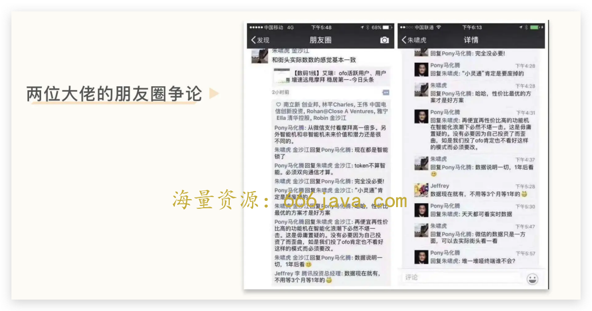
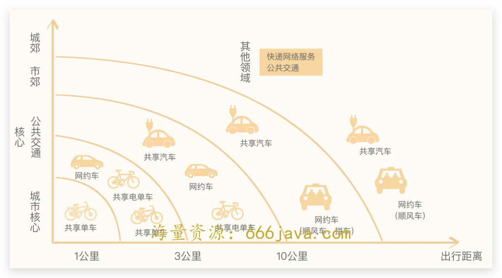
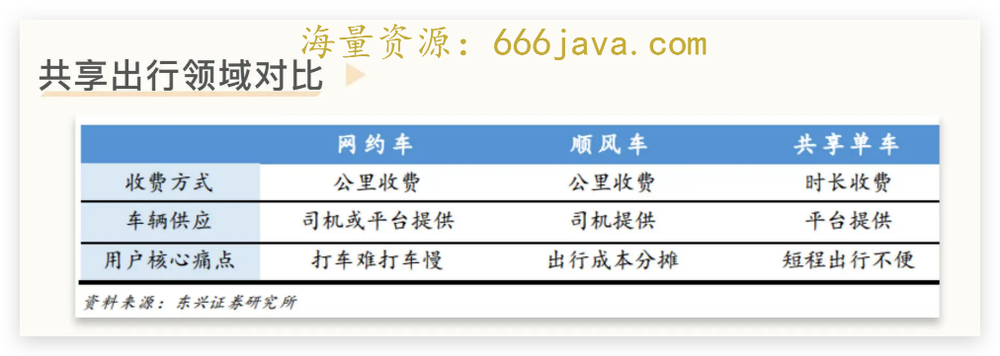
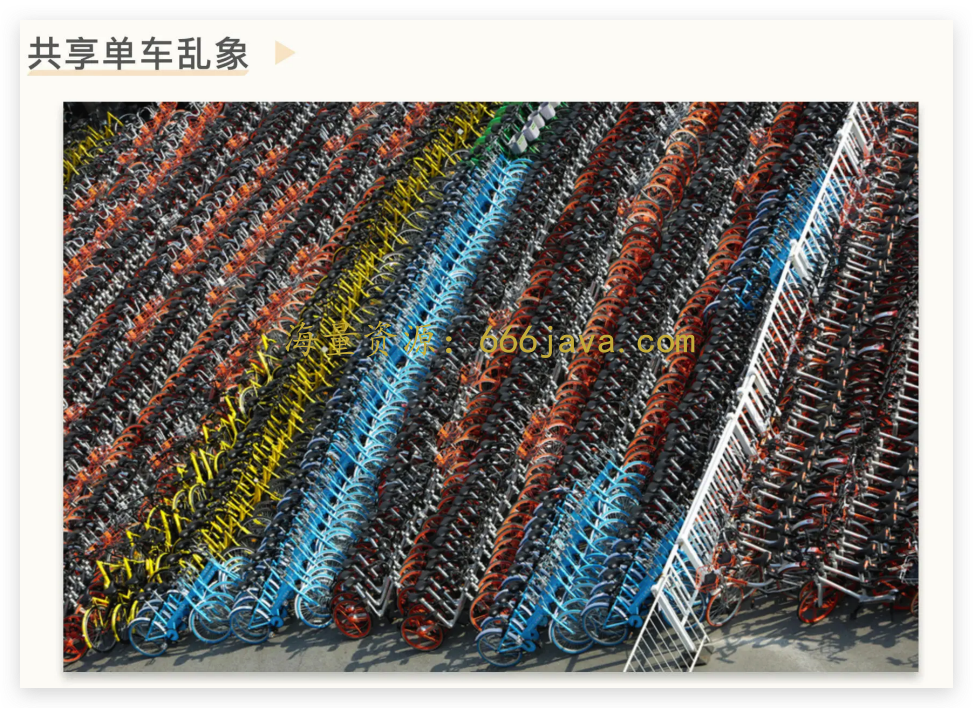
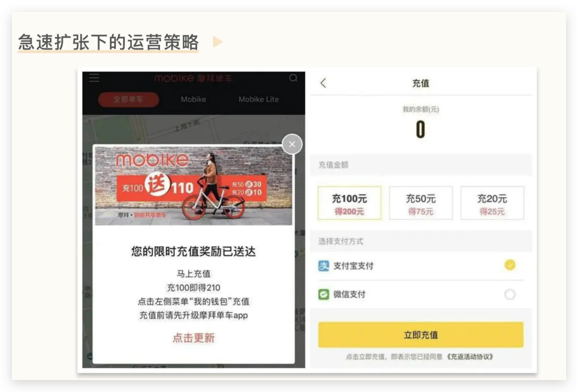
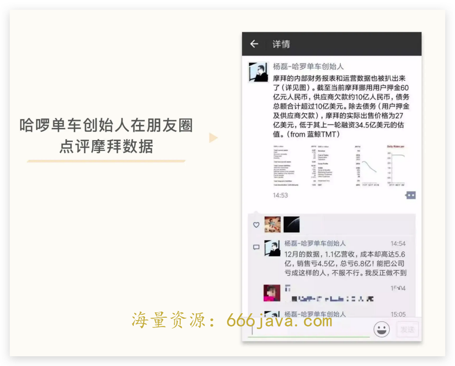

# 30-盈利：哈啰单车为什么可以在一地鸡毛的共享单车中逆势杀出？

<audio controls="" title="30-盈利：哈啰单车为什么可以在一地鸡毛的共享单车中逆势杀出？">
  <source
    id="mp3"
    src="/mp3/business-thinking/30-盈利：哈啰单车为什么可以在一地鸡毛的共享单车中逆势杀出？.mp3"
  />
</audio>

你好，我是雄峰。

终局思维的第 2 节课，我们来聊聊共享单车领域里面的哈啰单车。

共享单车诞生的初衷是解决居民城市出行的“最后三公里”问题，当前盛行的共享单车模式为无桩模式，通过软件定位和智能解锁的方式实现共享出行。小黄车 ofo 和摩拜可以说是创造了这个领域，也一手所做大了整个行业规模，在资本的催化下，大街小巷中随处可见两家单车的身影。

摩拜与 ofo 的橙黄大战，也从线下百万辆的单车燃烧到了两大公司背后的投资人身上。17 年 6 月，摩拜的投资人马化腾先生和金沙江创投的朱啸虎先生，在朋友圈就“谁的共享出行模式靠谱”以及“谁家数据领先”争论了起来。

但是最终逆袭行业的却是哈啰单车。仅仅一年之后，阿里巴巴集团学术委员会主席、湖畔大学教育长曾鸣就表示，哈啰单车在一年半内逆袭摩拜和 ofo，日订单总量超过两者总和。

哈啰单车早期投资人 GGV 资本合伙人李浩军也称：过往的经验是，老大、老二打仗，老三被打死，哈啰单车的逆袭可以作为商业案例写进教科书，逆袭并不容易。

为什么哈啰单车可以做到这一点？核心在于 **共享单车的本质是一门租赁生意，盈利的关键在于获取的租金和运维费用是否可以形成利差**，单纯依靠烧钱没有办法垄断市场，也没有办法实现盈利，更无法维系业务。

哈啰单车是较早看到这一点的公司。

我在课程最后贴了一段某投资大佬在 17 年 4 月份的判断。他的核心观点在于： **Business is business** **。** **如果不考虑最终赚钱，只是在玩击鼓传花的资本游戏，迟早要输掉整个市场，这就是终局思维的思考方式。**

接下来，我们就回到共享单车爆火的时间点，逐一分析并回答四组问题：

1. 共享单车为什么火了？为什么资本会疯狂的投资共享单车？
2. 为什么说共享单车是一门租赁生意？它跟过往的共享出行模式有什么不同？
3. 为什么 ofo 和摩拜在大城市拼命投车是双杀模型？它们这么做会有什么问题？
4. 哈啰究竟做对了什么可以逆风翻盘？

希望你可以从哈啰单车这个后发先至的例子，建立一个基础的业务认知：不管生意吹得如何天花乱坠，如何宏伟磅礴，资本如何支持和投入，用终局思维的角度去理解每一块业务， **生意就是生意，如果一门生意不赚钱，那么它就不是生意，而任何的庞氏和泡沫都会有被戳破的一天。**

## 共享单车为什么火？

回到 2016 年的时间点，很难想象本来基本退出主流交通工具的自行车，会以新的方式重新出现在大街小巷。2016 年初，以“小黄车”ofo 和“小橙车”摩拜为代表的共享单车，分别从北京几所高校和上海两地出发，以每个月净增十万辆的速度覆盖每一个城市，到了 2017 年初，各种颜色的单车蜂拥而出，市场整体投放量超过 300 万辆，进入近 50 个城市。

### 起源：ofo 和摩拜因何而起？

我们在第 2 次 [练习课](http://time.geekbang.org/column/article/552161) 中提到过，当智能手机开始普及，互联网进入了移动互联网时代，信息传输的维度又增加了一个：传输地理空间信息。而这也为很多新模式的开展奠定了基础，比如外卖业务，地图导航业务等。 **共享单车行业就是智能手机发展到一定阶段的产物。**

这个市场最初的两个领头羊是 ofo 和摩拜。ofo 成立于 2014 年 8 月，起步于校园市场，创始人戴威做 ofo 的原因和张旭豪做饿了么相似，都是从自身痛点出发，因为在学校骑自行车经常被偷，连续丢了四五辆车之后，希望能以共享的方式骑自行车，便创立了 ofo。

“小橙车”摩拜则由汽车媒体人胡炜玮于 2015 年创办，在上海起步。胡炜玮做汽车媒体时结识了现在蔚来汽车的老板李斌，当时有一个小伙子找李斌想做智能单车，李斌觉得这没什么搞头还不如做共享单车，但小伙子不感兴趣，胡炜炜于是毛遂自荐，向李斌提出了自己做共享单车的想法，拿到了投资。

ofo 和摩拜单车原本是市场、用户并不重叠的两家公司，ofo 起步于北京校园，重点做校园租赁，摩拜起源于上海，重点做白领地铁接驳。但随着滴滴入局，ofo 开始全力扩张，进入了摩拜切入的白领市场，两者成为对标公司，彼此“针尖对麦芒”地争夺市场，资本真正疯抢共享单车也始于此。

### **跟进：** **滴滴覆盖短途出行**

ofo 和摩拜最开始虽然见了大量的投资人，但是大部分投资人都不敢出手。一是大家认为这个模式是抢政府的工作，当时一个普遍的观点是“政府公共自行车可以免费骑，单车有什么可投的”，另一个是大家在想滴滴会怎么看。

如果滴滴投资了 ofo，那么摩拜则机会不大，反之则 ofo 没有机会。但如果滴滴自己做共享单车，那么这两家的空间都不大。在滴滴共享出行的视图下，当前网约车+顺风车解决的是 3 公里以上的出行服务，那么 1 公里-3 公里这一区域则是覆盖盲区了。

最后滴滴决定投资 ofo，之后其他的投资人都开始迅速跟进，ofo 估值暴涨，作为对手的摩拜单车也迎来了进一步扩大融资的机会。

### **推动：资本为什么追捧共享单车？**

滴滴入局之后，两家公司在一年内的估值被迅速拉高到成为 10 亿的独角兽，并在随后达到 30 亿美金，一两年的时间走过了很多企业一辈子的路，资本之所以如此追捧，核心原因有三点。

**有较为明确的退出渠道。** 滴滴入局给了投资人一颗定心丸，打开了投资人的想象：滴滴很重视 ofo 这块业务。这就让很多投资人觉得这个行业安全，加上后面腾讯、阿里以及美团的入局，进一步推高了这种投资情绪，击鼓传花总有接盘的人，那么进去就可以赚到。

**有较为清晰的商业模式。** 上游造车、下游铺市场，按骑行次数获取低额、高频收入，扣除各项成本后就是利润。尽管这一模式当时还在“烧钱”、跑马圈地阶段，远远谈不上盈利，但模式简单意味着可复制性强，可以通过资本强驱动。

**行业资产荒下的无奈。** 2016 年是比较迷茫的一年，移动互联网的红利期已经过去，巨头垄断前 30 名的 App，大家都在找新的风口，摩拜和 ofo 这类项目恰好符合其中的条件，如果放在 2015 年的市场，受追捧程度可能不会到 2016 年这样的程度，毕竟当时还有不少好项目。

在资本的推动下，大大小小的共享单车公司涌入市场，巅峰时期一年全国投放了超 4000 万台共享单车，80%的自行车都由这两家投放。

## ofo 和摩拜做错了什么？

在这么大的规模以及资本的强驱动下，ofo 和摩拜又做错了什么呢？核心是没有理解两件事情：

1. 共享单车是一门租赁生意；
2. 两者在大城市拼命投车是“双杀模型”。

### 共享单车的租赁生意

共享单车属于共享出行的一种，整个共享出行领域有三种模式，分别是网约车、顺风车以及共享单车。

共享经济的本质是将闲置私人物品/时间拿到市场上参与交易，从而形成新的价值。而符合这个定义的其实只有顺风车，因为提供服务的主体完全是私家车主。

打车的时候可以看到五花八门的汽车，但是共享单车大部分只有几种颜色，核心在于供给端（单车）无法经由平台标准化。一个可以提供服务的共享单车需要 GPS 定位和智能解锁，想要确保无充气骑行还要更换轮胎，有这个改造成本还不如自己造一辆车。

因此，共享单车更像电信运营商“先建基础网络，再收入网费”的模式，是重资本行业。

这里面的关键点就是租金和成本的收支平衡。一辆车的租金=出租次数\*单次骑行收入，成本=车辆折旧/损耗费用+公司运营成本。如果成本远大于租金，那么这个生意是明显存在问题的。

ofo 和摩拜并不是不了解这个逻辑，核心在于两者错误估计了自己的盈利能力以及单车的损耗和运维成本。

### 成本高：损耗和运维

在共享单车的领域中，ofo 和摩拜代表了两类极端的打法。

前者采用的是“低价车+高维护+快速扩展”的方式，一辆车的成本大概是 300 左右，并没有做智能化改造，车不具备定位功能，依赖智能锁车，需要时间检修和充气。

后者采用的是“高价车+低维护+紧跟 ofo 扩张步伐”的策略，一辆车的成本大概要 3000 多，后来降低到 800 元左右，整车无需打气且可以用 GPS 定位，用李斌的话说：4 年无维修。

最开始 ofo 方面预估，车费为 0.5 元，每天使用次数三次，以损坏率 18%-20%来计算，每日收入 1.2 元，其中营业成本 40%，扣除之后每日净收入 0.72 元。同时，单车成本 300 元，大概一年可以回本。实际情况在于，ofo 由于车子便宜，相对来说质量比较差，加上没有定位功能，车辆被骑到哪里去也不知道，日晒雨淋，半年之后就出现了超 60%的损坏率，很多车压根就不能骑。

摩拜方面预估，车费为 1 元，每天使用三次，损坏率为 1.5%，每日收入 2.96 元，扣除 40%的营业成本之后，每日收入约 1.77 元，单车成本 3000 元，摩拜单车第一版的车型在城市场景中需 4 年达到盈亏平衡，后面推出更便宜的车型，也需要 16 个月达到盈亏平衡。问题在于损坏率也远不止摩拜预估的 1.5%，实际达到了 20%+的情况。

共享单车低廉的使用费用，外加在用车和交车环节的缺乏监管，使得单车的侵占和毁损成本极低，导致“公地悲剧”的出现，错估了单车的损坏率。

此外由于共享单车属于无桩模式，车辆随骑随停，加上两家不断的竞争，向市场投放越来越多的车辆，而损坏的车辆也越来越多，政府不得不对大量乱停的车辆进行管扣以及收缴，而这也带来了车辆的损耗。

为了避免共享单车对于道路的影响，不少城市开始限制共享单车的投放，以上海为例，对共享单车提出了两类要求。

在硬件标准上，对一些零件提高防锈要求，一些锁具、实心轮胎、整体车轮等也都作出了相应要求。在管理上，要求 1000 辆车需要有 5 人管理。这意味着包括 ofo 在内的很多低端单车企业需要更换轮胎与车锁，甚至更换新车型，这需要增加巨大的资金和时间成本。

### 收入低：用户规模

在资本的推动下，两家走向了过往网约车的老路，通过融资进行急速扩张，获取用户规模之后又进行新一轮的融资。因此，两家考虑的核心并不是每一次骑车赚了多少钱，而是有多少用户骑车。

在这种业务思路下，平台为了吸引更多用户骑车，必然会降低用户使用产品的门槛。除了必要的押金以外，更多的是免费以及低价的骑行。

今天你免费一周，后天我免费两周，紧接着开始免费一个月，然后你充值 100 送 100，我就敢充值送 110，加上不断有各种运营红包活动来吸引用户骑车，很长一段时间里，用户骑车基本不花钱，即使花钱，骑车费用也很便宜，5 毛到 1 块就可以骑车一个小时以上。而两家又在一个城市不断的血拼，带来的结果就是一辆车远远没法达到一天骑三次的情况，大量单车一天骑一次都做不到。

平台基本上不赚钱，成本支出又非常庞大，因此两家迎来了巨额亏损，到后面不得不挪用用户押金来维持企业的正常运转。这样下去，一方面彼此竞争导致市场规模没法做大，另一方面消耗了大家的精力，没有办法兼顾更多市场，最终形成“双杀模型”，切断了两家的前路。

背后的资本眼看这是一场消耗战，不可能无穷无尽的烧钱。我们之前讲过，如果是资本挑起战争，在发现没有必要继续投入的时候，资本就会来结束它。

于是，两家背后的大股东开始推动合并，最后的故事你就知道了，ofo 选择自己干最终破产清算，摩拜卖身美团相对有了后路。

## 哈啰单车又做对了什么？

摩拜与 ofo 的两败俱伤很大程度上是因为缺乏运营经验， 对共享单车的损耗率估计明显不足，对提升单车的运营效率也没有认知。

在摩拜卖身美团的时候，哈啰单车创始人在朋友圈点评摩拜的数据：1.1 亿的营收，有着 5.6 亿的成本，销售亏 4.6 亿，总亏 6.8 亿！能把公司亏成这样，不得不服。

哈啰出行创始人杨磊很早就有一个判断，共享单车行业是一个起步门槛低，但规模化和技术门槛很高的行业，需要很强的运营经验，这是一门干毛巾挤水的生意，利润是从一个一个细节上抠出来的。

### 方向：二三线城市扩张

很多人把哈啰单车的崛起称为“农村包围城市”。其实这是一个事后诸葛亮的分析，哈啰联合创始人李开逐表示过：

> 最开始 **由于资源有限**，哈啰单车确实没有选择一线城市，但进入的都是比较好的二线城市。五万辆车在上海可能就像是一滴水滴在大海里，但是在宁波、厦门这样的城市，完全可以占据一定市场份额。

宁波开通之后的效果非常好，因为当时摩拜和 ofo 在北上广深四个城市大规模对战，导致大量城市覆盖度并不足够，这也给了哈啰单车基础的生存空间。

有了宁波的经验，哈啰单车有意识地向三四线城市下沉，因为竞争没有那么激烈。而摩拜和 ofo 之所以在初期并没有大量拓展二三四线城市，是因为他们认为共享出行解决的是“家-地铁/公交-公司”的交通环节，核心解决交通接驳需求，这样的需求主要存在一线城市。

头部两家觉得小城市做不出来，相反哈啰觉得小城市可以做，尽管市场相对没有那么大，聚沙成塔总有更大的规模，且相对来说盈亏线更容易拉平，毕竟缺少竞争的情况下，每一辆车的利用率反而比一线城市要高。

### 成本：控制运维成本

共享单车的成本主要由两部分构成，一部分是车的成本，另一部分是运维成本。

几家单车企业打到后面都选择了摩拜轻量版单车的方案，车的成本都在 800 左右，但是运维成本差异非常之大。

哈啰单车的运维成本大概是每车 0.3 元/天，而摩拜和 ofo 则达到了每车 0.8 元/天。假设有 1000 万台车，哈啰就可以节约 18 亿的成本，那为什么哈啰可以做到这么低的运维成本呢？

- **借助** **“哈勃”数据调度系统，做到骑车率最优**

哈啰单车对于每一个城市投多少单车有严格的控制，经过大量测试，人车比 30:1 是一个相对合理的数值，每 100 万人口铺 2-3 万辆。在此基础上，通过系统记录每一辆车的骑车轨迹建立城市热力图，不断调整不同区域车辆的投放数量，确保运营效率最优化。

- **区域网格化管理，防止车辆丢失以及及时维修**

哈啰将一个城市切割成无数 2km\*2km 的网格，根据人口密度，一个运维人员负责一个或多个网格。一方面便于调度车辆，另一方面也便于防止车辆丢失，保障车辆及时维修。获取用户提供的报障信息后，平台会给予骑车奖励，而辅助系统则加以智能判断，向附近的运维人员发起疑似故障工单。运维人员以兼职为主，这种任务主导、按照工作单量结算工资的模式，能够杜绝腐败，便于管理。

- **电子围栏技术+独家城市拓展合作，降低竞争难度**

政府为了避免共享单车影响路政，后面采取了单车总量控制和配额管理的模式，避免一个城市投放太多的共享单车。

哈啰收购永安行单车（第一家上市的共享单车企业，主要跟政府合作）之后，有了较多的政府关系，加上虚拟电子围栏（划定骑行停放范围的基础上，通过 GPS 定位限定共享单车城市运营区域，超出区域后用户会收到相应提醒或扣费处理）的技术建设，拓展了大量城市在共享单车的独家合作，导致竞争不再那么激烈。

### 门槛：免押金扩张

如今共享单车的骑行不需要任何押金，只需要信用分达到一定程度即可。但过往不管是 ofo 还是摩拜，都必须先付押金才可以骑行，用户侧会认为一辆车对应一份押金，实际上很多时候是一辆车压五份押金，而大量的押金是共享单车进一步扩张的原因。而当扩张出现问题之后，用户会开始挤兑押金，典型的就是 ofo，直到破产之后仍然有大量的用户押金没有退。

哈啰在接受蚂蚁金服的投资之后，在 2018 年 3 月推出了免押金服务，芝麻信用超过一定分值，就不必交付押金。不仅降低了用户扫码骑车的门槛，在竞争格局方面，也是一次对挪用押金企业的降维打击，大量用户退了押金之后转投哈啰阵营，一定程度上加速了挪用押金玩家的覆灭。

## **小结**

最后，我来总结一下这节课的重点内容。

通过前期大额补贴“烧出市场”是互联网商业模式的惯用套路，这种模式在滴滴上成功了，但是到了共享单车领域，则是后发的哈啰单车占据了市场领先地位。

我们可以明显看出，并不是所有的模式都能够靠烧钱解决问题，共享单车对比网约车业务，供给侧的特性决定了其无法单纯靠资本的方式，快速扩大市场并形成垄断。

网约车不隶属于平台，补贴司机端即可获取大量的车辆供给，车辆的损耗由私人或者租赁公司负责。但是共享单车来自平台，需要大量持续的投入，加上单车损耗高，需要到期更换，导致 **供给端需要长期的投入，不是一笔钱就可以搞定的，业务模式本身就要具备造血能力，实现业务的自负盈亏。**

所以我们在复盘共享单车发展史的过程中，可以很明显地发现哈啰单车之所以可以战胜另外两个具备先发优势的对手，核心就是其很早就理解 **共享单是一门租赁生意，有效提升租金收益** **、降低运维成本，才是这门生意长期成立的关键点，依靠资本是不长久的。** 因此，哈啰单车在与对手的竞争过程中，重点做对了以下 3 点：

1. **凭借有限的资本** **，** **选择二三线城市扩张。** 避免与摩拜和 ofo 在一线对决，从而提升单车的收益率，尤其重视与地方政府的合作，大量签约独家合作协议；
2. **利用高效的运营体系** **，** **降低运维成本。** 哈啰内部的哈勃系统，一方面可以更加有效的调度车辆，实现资源最大化利用，另一方面可以快速诊断、维修故障车辆，延长车辆使用寿命；
3. **选择免押金** **扩张，** **降低用户使用门槛。** 共享单车最初使用的时候需要用户支付押金才可以骑行，但是哈啰单车与蚂蚁金服合作，通过信用分的方式让用户免押金骑行，吸引了大量用户选择退押金转向哈啰，也进一步加速了对手的灭亡。

## 思考题

用终局思维来判断，你认为共享单车发展到后面会是一个什么样的结果？

欢迎你在留言区和我交流互动。我们建立了一个 [读者交流群](http://jinshuju.net/f/DuxzBi)，欢迎你的加入！如果你觉得有所收获，也可以把这节课分享给你的朋友一起学习。我们下节课见。

## 补充阅读

某投资大佬在 2017 年 4 月份的判断：

> 17 年 4、5 月份认识的杨磊，当时 Hello（哈啰单车最早的名字叫 Hello bike）去融资，挺艰难的，大家都觉得未来属于 ofo 和摩拜。跟他聊了几次之后，我就判断，未来能赢的应该是 Hello bike，而不是新闻满天飞，牛吹得比天大的摩拜还有 ofo。
>
> 17 年，在我们董事会上，我就说过我的结论，当时大家都不信。为什么会有此判断？因为杨磊（Hello 创始人）跟我谈投入产出，谈运营，谈降低维护费用。
>
> 而 ofo，摩拜呢？谈订单。行为呢？不断在大城市投车，搞国际化，天天参加各种会演讲……
>
> 单车的本质就是租赁生意，看租金和运维费用。一辆车的租金＝出租次数\*单次骑行收入。
>
> 拼命在大城市投车，简直是双杀模型，出租次数暴跌，为了吸引用户得打价格战，单次骑行收入暴跌。不重视运维，成本又很高。国际化更扯淡，大大增加了运作复杂度，且产出很低。
>
> 试试，或许还未尝不可，但去了很多海外市场，让我更坚信，这 2 个团队不懂看投入产出比。
>
> 上上次碰到杨磊，大概几个月前，我问他什么时候国际化，他说，国内最起码还得干 3 年。
