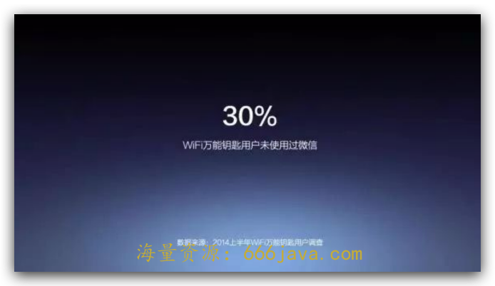
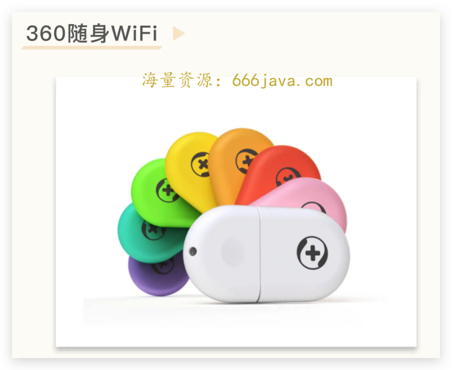
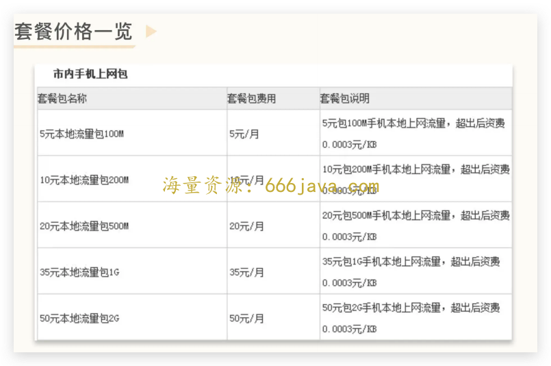
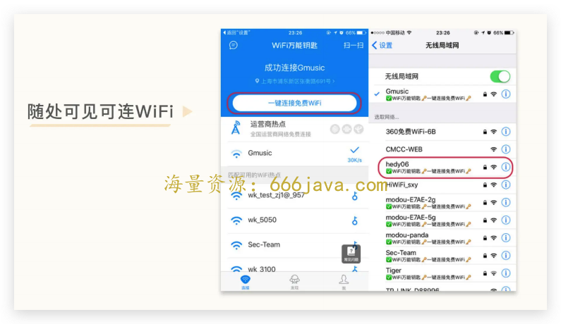
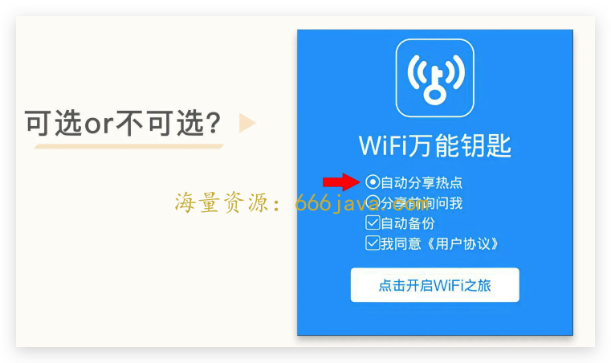
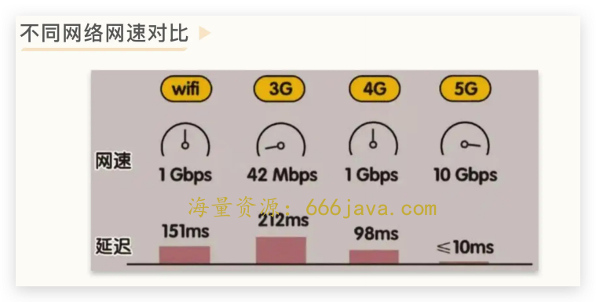
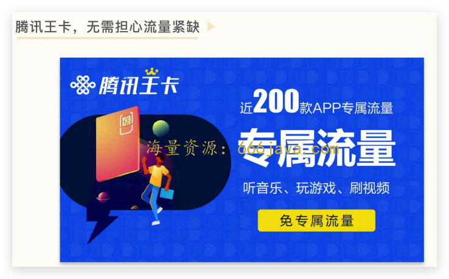
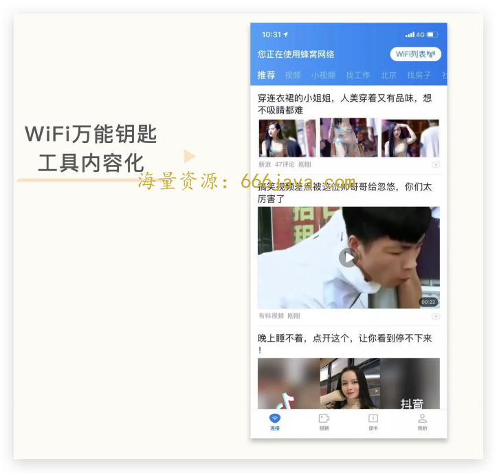

# 31-基础：WiFi 万能钥匙为什么崛起又为什么落寞？

你好，我是雄峰。这是终局思维的第三节课，今天我们要聊的对象是 WiFi 万能钥匙。

早些年，大家对拼多多的高速发展存在大量的质疑，认为数据有水分，加上平台上多为假冒伪劣商品，导致拼多多的创始人黄峥不得不出来接受采访。他认为拼多多发展迅速以及形成当时状况的核心在于：

> 拼多多关注中国最广大老百姓的多面需求，而这个方向可能是“五环内”的人所理解不了的。

从此，“五环外”概念又成了互联网“新梗”。而当初互联网产品圈看不懂的“五环外”产品除了拼多多以外，还有快手和 WiFi 万能钥匙。这三个产品并称为互联网“下沉之王”，它们有一个共性： **用户规模极其庞大，却不为主流媒体和一线人群所知晓。**

同样的，WiFi 万能钥匙在 16 年月活用户就超过了 5 亿，仅次于微信和 QQ，成为国内第三大用户规模的产品，但知乎上有不少人质疑数据的真实性，典型的一个问题就是： [如何评价 WiFi 万能钥匙团队年终奖给每人发一辆特斯拉？](https://www.zhihu.com/question/28128858/answer/39679193)

大量用户的疑问是：我并没有看到身边有人用这个产品，是不是数据作假？

之所以会有如此大的认知差异，是因为 WiFi 万能钥匙的使用群体与知乎的一线城市群体有所不同。WiFi 万能钥匙的主流用户群体是手机流量费敏感型且家庭无 WiFi 的三四线新入网人群。

WiFi 万能钥匙的创始人陈大年在 [一次分享](https://mp.weixin.qq.com/s/jxuaV1R6W5u0Ij_h3Tue3w) 中提过一个特别有意思的数据：

> 2014 年上半年，我们做了用户普查，结果给了一个你们都不信、我也不信的数字：WiFi 万能钥匙用户里面有 30% 的人是没有用过微信的。

为什么会有这种情况？陈大年自己也不信任这个数据，经过反复论证，得出了一个非常有认知差异的结论：

> 这 30%的人不用微信的理由，是因为 WiFi 万能钥匙让他们第一次上网。以前他可能觉得贵，不能上网，或者不懂，用不来，所以没有上网。因为有了 WiFi 万能钥匙，他尽管不能上网，但他上网了，而且有些人准备明年上网，但是他提前上网了，所以他给我们 30% 的结果。

早期前景如此之好的 WiFi 万能钥匙现在怎么样了呢？可以说是泯然众人矣。IT 橘子在今年 9 月份发布了一个报告：《 [中国第一批独角兽，现在都怎么样了？](https://m.huxiu.com/article/657625.html)》其中就有提到 WiFi 万能钥匙，该产品在 15 年估值高达 10 亿美金，但如今已退出独角兽阵列，坊间传闻甚至有卖身 360 的可能性，产品 DAU 也大幅下滑至千万级别。

接下来，我将带你进一步了解 WiFi 万能钥匙崛起的原因，从中了解 3 个关键问题点：

1. 移动互联网早期用户为什么会有免费 WiFi 的强需求？
2. 为什么 WiFi 万能钥匙的热点分享机制会引起行业极大的争议？
3. 到了今天，为什么这个产品及其所处的免费 WiFi 赛道都衰落了呢？

希望这个案例，能够加强你用终局思维看业务的意识，并及早作出调整。

## 抓住机会的副产品

WiFi 万能钥匙的老板是陈大年，他最知名的身份是盛大的联合创始人陈天桥的弟弟。

陈大年是技术出身，同时又兼具极强的产品 sense。技术的代表作是盛大第一款自研游戏《传奇世界》，底层核心是陈大年牵头对韩国的《热血传奇》做了逆向工程；产品的代表作是一手推动盛大收购了起点中文网，又一手打造早些年研究移动互联网最前沿的部门——盛大研究院。WiFi 万能钥匙，就是盛大创新院孵化出来的产品。

### **萌芽：盛大创新院**

2008 年，盛大的游戏业务已经达到行业顶点，管理层希望扩展到其他领域。因此，2009 年，盛大集团董事长陈天桥以“保证盛大未来 10 年优势”的宗旨，成立了盛大创新院，任命陈大年亲自负责这个部门。

两兄弟最初的设想，是模仿普林斯顿高等研究院及施乐帕洛阿图研究中心的模式，招募一批顶尖高手，给他们充分的研究自由，让他们做出一流成果回馈给公司。

当时盛大创新院招聘信息中的一段话引起了业内诸多关注：

> “我们崇尚基于信任基础的自治文化……每一个创新院的成员都可以选择做自己喜欢的项目，您可以在创新院完成立项和核心团队组建的过程，在院内完成策划、研发、试运营的过程，成熟后则由机构注资并剥离成独立子公司，项目成员获得包括奖金、利润分成、股份期权等回报。”

根据这种思路，盛大以业内一流的薪水，挖掘了行业大量的牛人。创新院开局极好，在云存储、电子书、笔记工具以及手机 Rom 上，都是国内第一批探索的公司。

这种创新院拥有极好的探索文化，但是很难衡量业务产出。盛大每年给创新院砸 2 个亿，但是收入基本为 0。2011 年，盛大面对腾讯游戏的强势崛起，资金开始捉襟见肘，不得不停止很多项目上的投入，创新院的方向也从创新转为业务研发和业务支持，团队成员的自由度越来越小。

这种情况下，很多人选择了离开，后面创新院就逐步解散了。说来也奇怪，从创新院出来的很多人和项目，都取得了不错的发展，典型的就是 WiFi 万能钥匙。

### **需求：上网方式的变化**

我们在前面有提到过，推动互联网发展的底层动力有两个：一个是网速越来越快，另一个是用户越来越多。 **从 PC 互联网转型到移动互联网之后，上网终端从 PC 变成了手机，随之而来的则是上网方式的变化** **：** **PC 上网是用一根网线连接，按月付费不限流量，手机上网要么在家使用 WiFi，要么出门使用移动流量。**

**WiFi 的问题点在于，大量家庭是没有安装宽带的，即使安装了也不知道如何设置 WiFi。** 2012 年全国共有 1.5 亿户安装了固定互联网宽带，而当年的手机网民达到了 3.8 亿，这两者的重合度并不高。

而且智能手机普及后，不少用户跳过了 PC，直接从手机开始接触网络，当时的路由器大多不具备无线功能，要想建立室内 WiFi 则必须新购置一个无线路由器，价格贵不说（几百起），设置也极其麻烦，很多人并不会设置。

**移动流量的问题点在于网速慢** **、** **不稳定且上网费用贵。** 2012 年手机网络信号以 3G 为主，网速大概在 120K/s-600K/s 左右，而 WiFi 环境下的网速是 3G 的好几倍且更加稳定。更关键的是，当初流量包价格昂贵，默认手机套餐的流量普遍只有几百 MB，且每超出 1MB 收费 1 元。

我到现在都记得学生时代节约流量费的操作：手机默认设置的是 2G 网络信号，只确保 QQ 和人人网的消息可以弹出来，浏览图片的时候才开 3G，就是心疼流量费。

### **产品：WiFi 万能钥匙**

正是看到了这个痛点，陈大年才决心做一个新的产品：让更多的人可以在任何地点免费上网。

他在盛大创新院内部提出这个想法，但是附和者聊聊无几。因为员工体会不到这个需求背后真实的用户场景——公司网速很快，盛大开的工资足够高，出门也不担心网络费用。

于是，陈大年离开盛大创新院自己开了一家公司，把产品实践了出来，这个产品就是今天的主角：WiFi 万能钥匙。

产品的初衷是希望用户在任何场景使用，都能实现 WiFi 的免费连接。简单来说就是蹭网。因此万能钥匙重点做一个功能： **如何知道更多 WiFi 的密码并共享给用户使用** **。**

## WiFi 万能钥匙为何引起极大争议？

WiFi 万能钥匙并不能破解任何 WiFi，它的核心运作机制是 **WiFi 密码共享，** 也就是这个功能导致万能钥匙在网络上遭到所有人的口诛笔伐。

简单来说，如果用户的手机安装了 WiFi 万能钥匙，并连接上了某一个 WiFi 网络，则万能钥匙就会记住这个密码，并将它上传、存储到自己的服务器上，等后面的用户再连接这个 WiFi 的时候，万能钥匙就会帮助用户实现自动连接。

尤其在早期，安卓系统隐私做得很一般，系统中有一个文件专门用来存储用户使用过的 WiFi 密码，并且是明文，没有加密。早期的 WiFi 万能钥匙会读取这个文件，将文件的内容上传到服务器，不断地收集、积累数据。一部手机通常会连接过十几个甚至几十个 WiFi，一旦你安装了 WiFi 万能钥匙，这些连接过的 WiFi 密码就都暴露了，其结果就是： **越多人安装 WiFi 万能钥匙，密码越容易被破解。**

如果用户不分享 WiFi 密码呢？这里还有 4 种办法解决。

一种是 **尝试密码撞库**。很多家庭 WiFi 密码设置的方式非常简单，比如 12345678、00000000、11111111 等，做一下密码撞库就足以攻破这部分 WiFi 密码了。

还有 **向移动或者电信布设的公共热点采购流量**，免费提供给用户使用。14 年开始，WiFi 万能钥匙每个月花费几百万元采购运营商 Wi-Fi 免费给用户使用，以增加无处不在的热点服务。

除此之外，还有 **申请安卓 Root 权限** 的方式。早期大量安卓机都会开放 Root 权限，这个权限可以让应用接管系统层的很多能力，比如直接访问存放 WiFi 密码的文件夹。这种情况下，即使用户不共享 WiFi 也可以获取相应的密码信息。

最后一种则是 **将 WiFi 分享前置在使用产品之前，且伪装成为非同意项**（圆点非按钮可选），让用户在不注意的情况下分享自己的 WiFi 密码。

这些操作，让 WiFi 万能钥匙在网上被非常多的人抨击，WiFi 共享出去存在非常大的安全隐患。不过，虽然产品的口碑很差，但是挡不住用户用脚投票，短短几年就做到了除微信和 QQ 外下载量最高的第三大移动互联网产品，而这个团队到 2015 年年初也只有 36 个人，也就是这个时候，陈大年为了鼓励团队，给每一位员工送了一辆 Tesla S。

## 稍纵即逝的机会

即便 WiFi 万能钥匙取得了一定的成功，但是陈大年看得非常清楚，我们第一部分的框架标题就来自陈大年自己的判断：

> 一切都成功都是抓住机会的副产品。

这也源于早些年盛大公司取得很好成绩之后，陈天桥和陈大年的父亲和他们的一次对话，父亲问了他们 5 个问题，下面的内容选自一篇 [陈大年的自述](https://mp.weixin.qq.com/s/jxuaV1R6W5u0Ij_h3Tue3w)。

> 第一个问题，你们聪明吗？我说今天看来好像还行。第二个问题，你们是不是世界上最聪明的人？我说这个完全不可能。第三个问题是，你们努力吗？我说比较努力。因为那时候一年只休息 30 多天。第四个问题出来了，你们是最努力的人吗？肯定不会是。今天碰到一个投行的人，说他曾经有一年只休息过 7 天。最后我父亲问了我们第五个问题，那么凭什么让你们赚那么多钱呢？
>
> 我们考虑了一段时间，我父亲就给我们做了总结，你们要记住，你们肯定是聪明而且努力的，但是比这些更重要的是， **你们遇到了一个千载难逢的机会，所以才会有这样的成绩。**
>
> 用陈大年自己的话来说， **WiFi 万能钥匙的成功就是抓住机会的副产品，这个机会就是在移动互联网发展初期的时候，流量资费贵且网速差。**

但这个机会是稍纵即逝的。

WiFi 万能钥匙成功之后，腾讯、美团、阿里先后杀入了免费 Wi-Fi 的赛道，但两三年之后，大部分产品都停止了维护，只剩下 WiFi 万能钥匙一家在苦苦支撑。

2018 年央视经济频道点名批评了 WiFi 万能钥匙，重点指出了其安全隐私方面的问题。2022 年 7 月 12 日，华为手机应用市场宣布 WiFi 万能钥匙下架，理由是风险软件，存在违规行为建议立即卸载。

曾经人人下载的热门软件，为何变得“老鼠过街，人人喊打”？为什么用户规模从几亿变成了如今的几千万，且各大巨头均停止了这个领域的投入呢？ **核心在于用户不再出现流量焦虑了。**

### 免费 WiFi 刚需不再

如果用一句话总结 WiFi 万能钥匙如今的境况，最根本之处还是在于 4G 普及后流量费用更便宜了。

3G 时代的资费贵且网速差，但是 2014 年三大电信运营商开始了 4G 网络的建设，而 4G 之后，网速和稳定性都不弱于 WiFi。

更关键的地方在于，在政府的管控下，三大电信运营商在 15 年开始了提速降费的操作。4G 流量平均单价对比 3G 时代下降了 93%，三次下调了国际及港澳台漫游资费，降幅达到 90%以上。过往流量超过 1M 扣 1 块钱，现在很多套餐超 1G 才扣 1 块钱，加上各类价格便宜的流量包、提速包甚至无限流量卡层出不穷，用户无需担心流量紧缺的问题。

此外，政府也在大力建设免费 WiFi 基础设施，公交车、机场、酒店等很多公共场景都开放了免费 WiFi 服务，让 WiFi 万能钥匙原本的用户场景变得可有可无。

### 用户安全意识的觉醒

安全问题始终是 WiFi 万能钥匙逃不开的原罪。WiFi 万能钥匙的工作原理是“密码共享”，这就会造成 WiFi **用户个人信息的泄露**，给 WiFi 被万能钥匙破解的用户带来安全隐患。

同一个密码在不同人手里可以做的事情完全不一样。如果在黑产手里，完全可以 hank 进用户的网络，窃取大量个人信息和数据，如果家里有摄像头、NAS 等数据信息设备，则造成的数据风险则会进一步放大。

此外，共享 WiFi 带来了 **网络卡顿** 的问题，侵害了被迫共享 WiFi 密码人群的私人权益。这个模式对分享 WiFi 密码的用户没有任何好处，导致越来越多的用户后面选择不再使用 WiFi 万能钥匙等类似的产品，同时也会定期更换家里的 WiFi 密码。

这些操作也变相地让万能钥匙的使用场景受限。

### 不成功的业务转型

用户使用万能钥匙的场景主要在连接网络的那一刻，连接成功之后用户会切出前端场景，只要产品活跃在后台连接 WiFi 即可。这和我们过往在 PC 上使用安全防护软件一样，不过这种使用场景的特点是用户使用时长短，“如何把流量变现”是悬在万能钥匙头上的一把达摩克利斯之剑。

最后，WiFi 万能钥匙的解决办法是 **把工具内容化，在用户连接网络成功之后推资讯内容**，一定程度上非常像今日头条。

为什么万能钥匙会选择这种模式呢？核心是 **通过内容沉淀用户时长**。万能钥匙选择的内容是资讯和短视频这种细粒度的消费内容，还记得之前提到的 [时间刻度](https://time.geekbang.org/column/article/551301) 吗？这种模式的好处是便于插入更多的广告进行变现。

陈大年自己也很早意识到：

> WiFi 万能钥匙的商业本质是销售流量，但这是一个“很薄”的过程，更多的希望是通过 WiFi 这个入口进入到后续的产业中，让商业模式更厚重些。
>
> 所以，万能钥匙同时也在孵化出新的业务形态，比如网文（连尚读书）、招聘（连尚招聘）等，只是结果不太理想。

造成这个结果的原因有两点。一是 **WiFi 万能钥匙的现金流下降太快，没有高收入支撑**。巅峰时期 WiFi 万能钥匙的广告收入一年超 10 亿，但是这个收入下降很多。因为当时的用户需求逐渐减弱，导致 DAU 下滑，而内容体验又过于糟糕，用户留存较差，后面接触到更好的内容选择（比如今日头条或者抖音），则会立马抛弃万能钥匙。

另一个是 **新业务的孵化进展太慢**。不管是社交产品“连信 App”，网络文学产品“连尚读书”，信息资讯类产品“连尚头条”，蓝领招聘类产品“连尚招聘”，找房子产品“楼司令”，都有非常强劲的竞争对手，迟迟没有获得突破。

此后的 WiFi 万能钥匙逐步泯然众人矣，也传出了被收购的声音。

## 小结

在移动互联网初期爆发过一波工具类产品的创业潮，核心围绕着“电量”“空间”“流量”三个角度去做，均获得了较大的阶段性成功，比如早期的金山电池管家，猎豹清理大师以及 WiFi 万能钥匙。而工具类应用的成长土壤，很大程度上是 **安卓系统的开放性、手机性能不足以及网络环境过差** 导致的。

不过如果从终局思维出发，网速迟早会变快的，手机性能会变好的，手机电量也会持续变多。

本质上，工具型产品都是一个阶段套利的机会。与 WiFi 万能钥匙一样的猎豹清理大师，就是抓住了在海外的套利机会，覆盖比中国互联网稍晚的区域，获得了巨大的成功。

因此，我们需要关注这些短期具备套利机会的业务，但是也要运用终局思维去判断，这些只是一个阶段性的窗口机会，需要 **在取得成功之后急速寻找转型的业务方向**。

虽然 WiFi 万能钥匙很早就意识到了这个问题，在 4G 流量普及便宜之后用户使用习惯会发生转移，但是在转型动作上还是偏慢偏迟，导致其消失在了行业的前列中。

## 思考题

互联网产品中有不少的套利机会，简单而言就是一个区域发展先进，可以把先进领域的产品和服务复制到落后区域当中，这跟时光机理论非常相似，你还可以举出哪些套利机会呢？

欢迎你在留言区和我交流互动。我们建立了一个 [读者交流群](http://jinshuju.net/f/DuxzBi)，欢迎你的加入！如果你觉得有所收获，也可以把这节课分享给你的朋友一起学习。我们下节课见。
