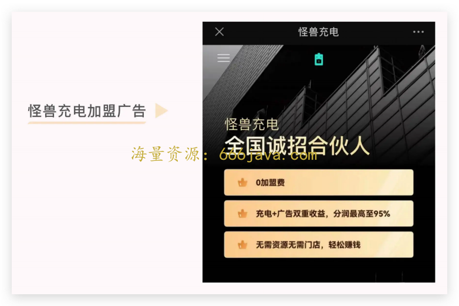
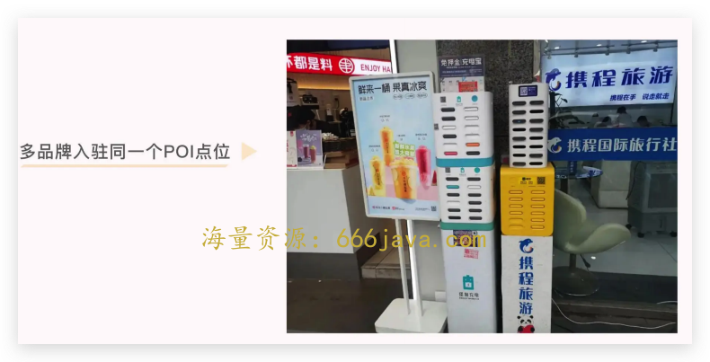
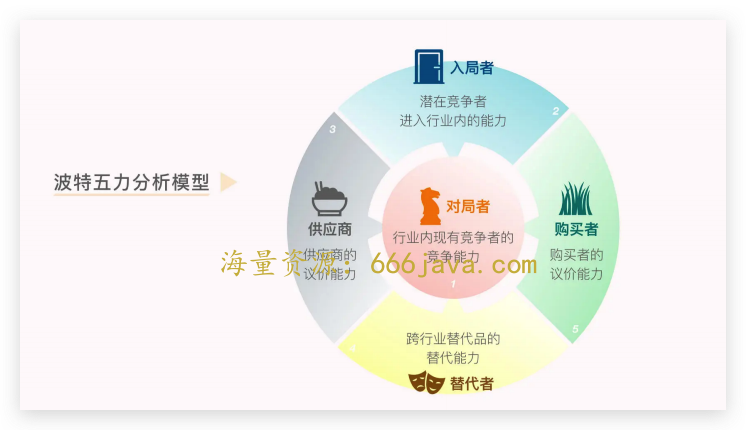
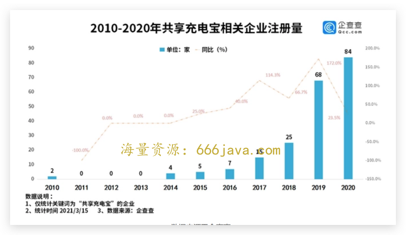

# 33-竞争：为什么共享充电宝不是一个好生意？

<audio controls="" title="33-竞争：为什么共享充电宝不是一个好生意？">
  <source
    id="mp3"
    src="/mp3/business-thinking/33-竞争：为什么共享充电宝不是一个好生意？.mp3"
  />
</audio>

你好，我是雄峰。这是终局思维的第五篇，今天我蹭个热度，聊一下时下话题度比较高的产品——共享充电宝。

前不久“雪糕刺客”这个词火了，指那些隐藏在冰柜里看似其貌不扬的雪糕，在拿去付钱的时候会用自己的价格刺你一下。比如当时被推上风口浪尖的“钟薛高”，一个限量款雪糕价格高达 66 元。

曾经遍布商场和街头各个店铺的共享充电宝也喜提“刺客”绰号。曾经每小时收费 5 毛钱，如今每小时收费 4 元甚至 10 元，找不到地方还一晚上就要 30 元到 50 元，这种大幅度涨价成为了舆论焦点。虽然大家对于这种“先低价扩展，再高价售卖”的形式已经有认知了，但依旧被共享充电宝这个镰刀给割得嗷嗷叫。

有意思的地方出来了，看上去“暴利”的共享充电宝生意远没有想象中轻松。虽然大幅度涨价，但是共享充电宝背后的企业这两年没有一家是赚钱的。

以怪兽充电发布的 2022 年第二季度财报为例，二季度总营收为 7 亿，毛利润率也高得吓人，达到了 82.69%，堪比 A 股一哥茅台，但亏损却也高达 1.7 亿。

早在 17 年的时候，共享充电宝成为了共享单车之后又一个风口业务。国民老公王思聪在朋友圈称：“共享充电宝要是能成我吃翔，立帖为证。”

他的这番话在 2021 年被“推翻”——怪兽充电登陆美股，小电科技冲刺上市，搜电街电合并为“竹芒科技”。用户经历了共享单车的教育，共享充电宝“扫码、注册、付款、使用”的操作流程已经非常熟悉，这几家在一段时间内还有所盈利。

但是到了今天，貌似王思聪又说中了。这几家不仅一直在亏损，而且资本端也不看好这个赛道。一级市场已经没有资本继续大幅投入这个赛道，二级市场下“共享充电第一股”怪兽充电估价一路向下，现已跌破 1 美元（如果连续超过 30 个交易日股价低于 1 美元则会触发退市程序）。

问题点来了，共享充电宝越来越贵而背后的公司却越来越穷，那钱去哪里了呢？

今天，我们就用终局思维的思考方式，结合竞争分析领域常用的波特五力分析模式，去分析为什么共享充电宝不是一门好生意。

## 共享大潮下的充电宝

17 年共享单车带火了一系列共享经济业务，同时期还有充电宝、汽车、衣橱、雨伞以及停车位等共享业务，但为什么只有共享充电宝杀出来了呢？

### 用户痛点明确

移动互联网早期工具类产品有三个创业方向，分别是电量、空间以及流量。空间成就了猎豹清理大师，流量成就了 WiFi 万能钥匙，但电量领域没有任何工具类产品脱颖而出，核心在于软件层面较难优化。

金山电池管家这种产品本身只是安慰剂，对于电量的节省没有明显帮助，但 **电量焦虑** 又是一个用户侧实打实存在的需求。因此业内有两条解决思路：家庭场景是超级快充技术，比如 OPPO 和它广为人知的“充电 5 分钟，通话 2 小时”；出门场景则是共享充电宝。

这里会有两个问题。首先， **手机电池的电量为什么不能更大？** 一方面在于电池材料技术一直没有突破；另一方面在于如今以薄为美的手机审美下，人们对于手机厚度有很严格的要求，电量增大则会导致手机变厚。王思聪不看好共享充电宝，就是因为在他看来，电池技术迟早会突破，那么共享充电宝的用户需求则不复存在。

另一个是 **为什么出门不自己带一个充电宝**。我问过不少身边的朋友，核心就是美观和懒两个原因。重就不说了，带出门也不太方便，尤其是女性的包就那么大，充电宝很影响整体形象。还有就是容易忘记充电，等到出门的时候才会发现。

早期共享充电宝非常便宜，5 毛钱可以充 1 小时，价格完全可以接受。加上 5G 技术的出现和短视频的兴起，电量的损耗进一步加大，用户对于共享充电宝的需求更加强烈。

### 投资人的逻辑

金沙江创始人朱啸虎投资了不少共享经济企业，比如滴滴、ofo，还有共享充电宝企业小电科技。为什么在吃过共享单车的亏之后，朱啸虎还愿意投资这个领域呢？

除了共享充电宝用户痛点明确以及商业模式清晰以外，还因为和共享单车相比，它更为健康。具体表现在 3 个方面。

1. **硬件成本低** **，** **损耗率极小。**

一辆单车的成本到后面要 800 多，投放一个区域最少也要 10 辆车，即使哈啰单车把精细化运营做到行业领先，一年的损耗也高达 20%。但共享充电宝一个桩 10 台充电宝的成本也不及一辆单车，一年的损耗率也只有千分之一。

1. **用户频次高于单车。**

用户使用共享单车的主场景是站点到公司的接驳，或者家到附近商超的路程，属于出行的一种补充场景，这种用户的场景相对来说是少数。但每个用户都有手机，而在外面使用手机就会有电量焦虑，这就导致共享充电宝用户的受众会大于单车。

1. **不占据公共空间。**

共享充电宝依靠商家合作，不放置在路边，而共享单车则大量投放在公共区域，一方面带来了更高的损耗，另一方面也带来了更多的监管目光——毕竟大量无人维护的单车会影响市政交通，这一部分也需要付出额外的运维成本。

最后我想补充一点， **巨头投资这个领域的逻辑与风投机构有所不同** **。** 以腾讯为例，投资小电科技是为了增加微信小程序的使用场景，也为信用分推广积累经验，而美团切入这个领域是看中了共享充电宝的高频使用场景，可以拉动美团 App 的活跃。

### 哈啰单车的启发

吸引不少目光之后的共享充电宝行业 40 天融资 12 亿元，开启了急速扩张的模式，各种共享充电宝和充电桩开始铺向大街小巷。

共享充电宝最开始有三种模式，相同之处在于，共享充电宝和充电桩都会铺设在各个线下网点，不同之处在于租赁和归还方式。

第一种代表是来电科技。用户和充电宝都可以移动，允许 A 点借 B 点还，需要付押金，主要分布在火车站、机场等人流多的场景。

第二种代表是街电科技。固定场景下的移动共享，用户在借充电宝的小型机柜里付押金借出，使用后在同一地点归还，场景较小，包括餐厅、酒吧等。

第三种代表是小电科技。无需押金，只能够在固定场景上使用，线机一体，不可借走，这种也主要分布在火车站和机场。

从用户需求而言，第一种对于用户体验是最好的，但是这种方式对于押金和归还点数量要求比较高，也限制了大家使用共享充电宝的热情。 **在看到哈啰单车通过芝麻信用分的无押金方式大规模扩张后，各家充电宝企业纷纷与支付宝开展合作，向第一种模式转型且免押金，塑造了我们今天所看到的模式。**

## 无门槛无休止的竞争

2017 年，共享充电宝行业在引发资本追逐的同时纷纷展开烧钱大战，但转年即遇到融资危机，行业迅速进入洗牌期；2019 年底开始行业格局相对稳定，头部厂商主要为“一兽三电”，即怪兽充电、街电、小电、来电四家公司，更难得的是前四大共享充电宝企业均取得了盈利，毛利率接近 25%，但是好景不长，2 年之后这个行业就迎来了全面亏损。

究竟是什么原因造就了这样一波三折的局面呢？

### 给地主打工的“佃农”

和共享单车一样，共享充电宝的核心竞争力也在于 **铺设速度和资金使用效率**。

前者的关键是快速地扩展线下 POI 设备点（Point of Interest，在地理信息系统中一个 POI 可以是一栋房子一个商铺）。因为只有铺设大量的 POI 点才可以覆盖更多用户、刺激更多用户使用，这是各家维持行业规模的关键。

行业跟 POI 点合作的方案有两种，一种方案是采取入场费+分成模式，还有一种是阶梯式分成模式：第一个月品牌方和店铺三七分，第二个月四六分，第三个月五五分，或者收入按照一定比例进行分成。

**入场费+分成模式的问题在于优质 POI 点被哄抢**。比如大型商场、热门景点、KTV 酒吧餐厅等都是充电宝使用的高频场景。在各家规模的扩张和竞争下，一个优质 POI 有好几家来洽谈合作，抬高入场价格、提升分成比例的情况时有发生。

比如某充电宝品牌与一家大型酒吧连锁集团签署了三年独家排他合作协议，入场费就达到了 2000 万，还有一定比例的分成，这个交易几乎成为行业笑话，业内人评估：“按照成本结构计算超过 500 万就是亏本的买卖，2000 万就是烧钱的节奏。”

**阶梯分成模式的问题在于如何实现一笔钱的循环扩展。** 在没有资本大力支持的情况下，企业必须实现盈利自循环再进行扩展。比如手头有 1 亿现金，可以扩展 50w 个 POI 点位，只有当 50w 个 POI 点位实现回本，才会进入下一轮扩展，但是这种方式会偏慢，且高额分成下企业利润较低。

而这种重资产的运营模式下盈利有限，会导致企业扩展速度变慢从而降低资金的使用效率，因此各大共享充电宝企业也在进行战略调整，开启 **代理模式**。

代理模式比较简单，品牌方直接将移动电源、柜机出售给代理商，并从后续经营中分享利润，比如怪兽充电从中只抽 5%的收入，95%给到代理商，而代理商自己去拓展 POI 点，负责后续的维护。这种方式虽然降低了扩张的成本，分摊了经营的风险，但也意味着品牌和服务把控力度的减弱。

代理模式下，共享充电宝的价格、计费方式，商户都可自己设置。如果设置为 2 元一小时，平均每个充电宝使用 2 小时，一天就是 28 元，两月不到就能收回成本。现在很多商家都会设成 3 元一小时，一个月就能回本。甚至商家还可以设置为按半小时计费，这就是“共享充电宝刺客”的源头。

很多行为并非品牌方自己设置，而是下包之后被代理商和商户所调整。部分代理商为了让用户无法归还充电宝，会在用户借了之后立马还回去一个，把坑位占满，让用户无法归还，从而获取更高的收益，极大地影响了品牌口碑。

另一方面，代理商为了抢占优质 POI 点位，也需要跟其他家进行竞争。在这个市场上，渠道商拥有极强的定价权和话语权，所以经常出现多品牌入驻同一个 POI 点位的情况。核心在于 **产品对用户无任何差异化体验，对商户无任何差异化价值，最终只能够比拼分成和入场费，全部沦为给地主打工的“佃农”。**

以怪兽充电为例，其 2019-2021 年销售和营销费用，占总营收的比重分别为 67%、76%和 83%，2020 年 Q2 更是高达 96.2%，这意味着每赚 100 块钱，就有 96 块钱要分给合作伙伴，加上企业自身的运营成本，不亏才怪。

### 充电宝们的波特五力分析

除了事后诸葛的分析，我们还有什么方法可以判断即将进入的领域最终会变成什么样的形态吗？

在做新业务立项的时候，其实经常会用到波特五力分析法。这个模型是 20 世纪 80 年代迈克尔波特提出来的一个竞争分析模型，简单来说就是 **做一个新的业务，要从五个方面去分析竞争对手，不能够只盯着眼前的竞争对手，因为竞争的力量比我们想象中的要大。**

分析完“不同的角色会对我所提供的产品和服务带来什么样的影响”，就可以构建起对一个行业基本竞争态势的判断。

五力模型就是这五种竞争力量，分别为：

> 1. 对局者。行业内现有竞争者的竞争能力；
> 2. 入局者。潜在竞争者进入的能力；
> 3. 供应商。供应商的讨价还价能力；
> 4. 替代者。跨行业替代品的替代能力；
> 5. 购买者。购买者的议价能力。

在共享充电宝领域，购买者大多面对 C 端用户，无需分析，我们用这个模型的其余四点分析一下，为什么共享充电宝会沦落到增收不增利，给 POI 点打工的情况。

- **对局者** **：行业内现有竞争者的竞争能力**

这里需要分析的是当前这个行业的所有玩家有什么差异化优势，一般有 4 个分析的维度：

1. 服务的差异化。比如充电速度更快，充电宝电池更大；
2. 更优惠的价格。比如在一个区域某个产品价格更低；
3. 体验不可替代性。比如在一个区域只有它有；
4. 品牌营销的创新。比如用户对某一品牌有较强的认可度。

从实际体验而言，行业中的竞争对手在这四点上非常同质化，在服务体验、产品价格以及品牌认知上基本趋同，唯一比拼的就是可以覆盖更多区域的 POI 点。

这意味着对局者之间会形成激烈且持久的竞争，一段时间内会陷入相对的平衡。从长线来看，大家就会选择合并，但在反垄断法的大背景下，头部 [同类项合并](https://time.geekbang.org/column/article/560747) 几乎成了不可能的情况。加上美团这个财大气粗的对手， **从终局角度来看，大家会进入一个份额稳定的对峙状态。**

所以，从对局者入手分析就会发现一个明显的问题： **我并不能提供和对手差异化的服务，唯一可以比拼的就是价格和规模** **——** **这是一门很苦的生意。**

- **入局者** **：潜在竞争者进入的能力**

这里我们需要 **分析入局者进入行业的核心目的：它是来赚钱的还是别有所图？**

先说赚钱。 **若一个行业进入门槛很低且很赚钱，则会吸引源源不断的人进入这个行业。**

共享充电宝行业就是这么一个状况。对于任何公司而言，这个行业的门槛都极低，可以很快复制一套，其中最关键的能力是如何搞定更多 POI 点。

头部公司并不一定具备这项能力的绝对优势。相反，对具备大量区域关系的人来说，共享充电宝绝对是一门非常好的生意。

再说“别有所图”。 **若这个行业对于其他行业有特殊的附带价值，则也会吸引其他人的加入，比如用户流量价值**。

美团最开始在 17 年立项做共享充电宝，试运行大概 6 个月之后就停了这块项目，因为它对美团的协同价值并不大。直到 20 年，美团开始执行“大美团战略”，希望将多个低频+中频服务汇总到“美团”这个大的 App 内，从而形成超级 App 的流量规模，反向促进其他业务的孵化，于是 20 年又重启了这个项目。

美团就是看到了这一块市场进入成熟期之后，用户规模变得较为庞大（19 年市场统计有 1.96 亿人使用）且商业模式已经得到了市场验证（几家均盈利），所以于己而言，重新切入可以有效降低成本，获取线上流量。

我们再多想一点，抵御新人入局最好的方式是什么呢？要么是门槛足够高，要么是完全不赚钱。但是这两个条件完全不具备，因此 19 年之后共享充电宝企业还是在变多的。

- **供应商** **：讨价还价能力**

这个角度需要分析的是 **供应商和你的依存关系** 是什么样的。

对于一个企业而言，最希望的必然是上下游都依靠自己，如同苹果在生态链中的位置一样。不受管控的供应商如同硌牙的大米，能吃但不舒服，这类供应商往往会让企业付出更多、赚取更少。

我们一般会从三个角度来分析企业对于供应商依存关系：

1. 供应商在它所处的行业中具备不可替代性；
2. 市场供少于求导致购买者众多；
3. 可随时切入你所在的市场成为你的对手，从供应商成为入局者。

共享充电宝的上下游有两类供应商，一类是充电宝企业，另一类是 POI 点位，充电宝企业只满足 3，但是 POI 点位满足上述所有要求。

以北京环球影城为例，它在开业之初面向行业所有的共享充电宝企业开展独家招商，坊间传闻怪兽充电宝入场费花了 800 万，分成费用额外算。核心就在于环球影城的区域位置在行业中具备不可替代性，如果这个区域不覆盖则会导致高频场景的服务缺失。

此外，当多家共同竞争的时候，必然会把价格哄抬到一个较高的水位，最后就是如果环球影城不满意所有品牌提供的价格，那完全可以把桌子掀翻，自己绕过品牌方做一个区域性的共享充电宝业务，为园区所服务，这种情况在一些特大型商场已经实现了。

那么在这种情况下，共享充电宝们也就被供应商吃得死死的，无任何博弈的空间。

- **替代者** **：跨行业代替品的替代能力**

这里需要分析的是 **从趋势来看，会出现什么样的竞争对手从而颠覆所在的行业**。这类对手防不胜防，很多八竿子打不着的公司会把行业整体给颠覆，这就是常说的降维打击，这类替代者出现的可能性一般有三种：

1. 用户需求痛点消失。
2. 用户习惯发生迁移。
3. 行业政策面影响。

前文我们提过，早期王思聪之所以不看好共享充电宝，核心是认为 **电池技术** 可以取得突破，实现小体积高密度的安全电量技术，但目前来看化学电池材料基本已经到了极限。

**用户习惯** 暂时没有发生大的变化，除非有一点价格涨得受不了，大家都习惯带一个充电宝或者快充插头出门。

最后就是 **行业政策** 的影响，从现有的政策管控来看政府重点在价格合理性和企业垄断两个方面，且该产品属于区域型市场无法产生垄断，则政策干预面空间不大。

所以，当前暂时没有明显替代的产品或者服务出现，也就是说， **这场战争不会有任何人来终结。**

## 小结

我们前面利用终局思维思考业务，主要是从业务本身的发展趋势来思考，比如长期来看用户的痛点是否会发生转移（WiFi 痛点）、业务模式如何在长期发展中摆脱资本的支持实现自盈利（哈啰以及 O2O 业务）。而这一节课是从行业中的多个竞争角度来分析，借助波特五力分析法，分析为什么共享充电宝不是一门好生意。

共享充电宝这个领域竞争非常激烈，而且没有产品壁垒和渠道优势。

用终局思维的角度去思考，会发现行业友商提供的产品和服务没有任何差异化，导致大家都在进行同质化竞争，比拼的是行业分成和入场费成本；而这个产业无任何门槛和壁垒，新入局者可以凭借区域地方优势切入市场，进一步抬高市场的分成成本；最后，由于行业替代者众多且上游技术方案成熟，供应商的选择非常多，而且完全可以自建，导致产品与供应商的博弈能力的缺失。

行业不赚钱、亏钱的现象加剧，而最后大家只能够比谁更能撑，全部沦为了给渠道打工的佃农。

想一想，各大商场里面的娃娃机是否也是类似的逻辑呢？

## 思考题

你觉得共享充电宝有哪些破局的方案么？

欢迎你在留言区和我交流互动。我们建立了一个 [读者交流群](http://jinshuju.net/f/DuxzBi)，欢迎你的加入！如果你觉得有所收获，也可以把这节课分享给你的朋友一起学习。我们下节课见。
