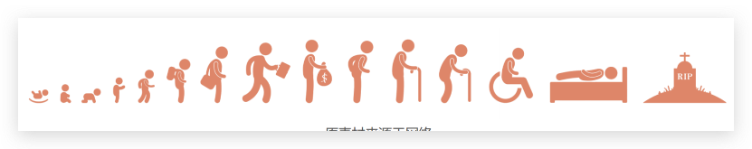
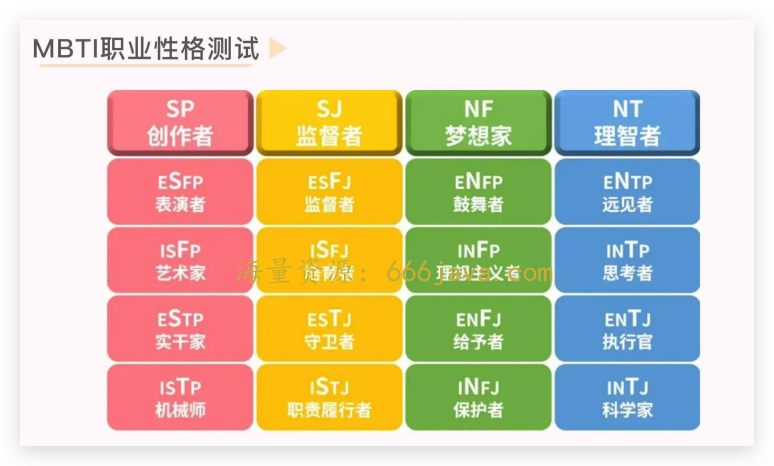
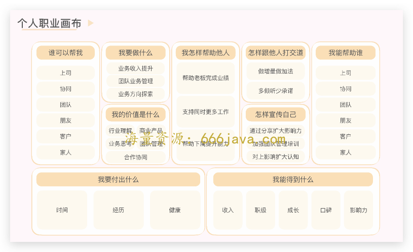

# 34-练习课：终局思维还可以运用在日常生活哪些方面？

你好，我是雄峰。

本节课是我们终局思维的第 5 节课，这是一节练习课。

前面 4 节课我们主要讲了如何用终局思维去分析和判断一个产品或者一个公司，站在长时间周期下为什么会成功或者会失败。终局思维的思考模式，可以让你切换一种新的视角，从而得出不同的判断，继而调整要做的事情和方向。

这么好的工具为什么只用在思考业务上呢？

今天我们聊点不一样的东西，尝试站在人生的终点，重新反思“什么是人生中最重要的事情”，从而校准自己当下的行动。

## 当下的选择可以决定未来

**没有人知道未来是怎样的，但未来并非虚无飘渺，而是以不同的概率形式活在今天。** 因为人的一生就是由关键决策相互纠缠所构成的一张网，而未来由当下的关键决策所影响。

因此，我们可以站在生命的终点去思考：这一生将如何度过，想要什么样的生活？通过当前关键决策的调整，影响到未来想要的生活。

接下来，我将从工作、生活以及财富三个角度切入，用终局思维的思考方法，尝试得出不一样的视角和观点，和你一起调整当前的生活方式，继而获得更好的人生。

## 工作：百岁人生下的规划

我们一辈子可以活多少岁？按照《百岁人生》提到的点，我们很有可能活到将近一百岁，甚至超过一百岁。而随着近些年人口老龄化的不断增长，退休年龄增加也是无法避免的。

那么，第一组问题就出现了：

长寿时代，我们要如何规划自己的工作呢？如何保持长时间的职场竞争力或者收入能力，从而度过接下来 50 年漫长的工作生涯呢？

### 找到人生中的长板

回顾我自己的工作生涯，从毕业之后就有一个不切实际的妄念：成为全栈产品经理。

因为产品经理是一个多学科综合能力的职业体现，需要涉足策略、交互、设计、商业、运营、营销、管理、投资等多个领域，掌握越多对于自己做产品则帮助越大，而每一个领域都足够我学习很久。

随着见识和经验的提升，了解得越多就越能够感受到自己的不足，想学的也就越多，但是学不完的也越多，以至于带来了深深的负罪感。

这种情况被我老板发现了，找我聊过一次，给我提了一个至今都非常重要的建议：

> 决定一个人职业发展上限的是他的长板，决定一个人职业发展下限的是他的短板。长板让你跑得更快、更高，短板需要在关键时刻不拖你后腿。
>
> **你正确的做法是打造长板，然后规避短板，一个人的精力永远是有限的。**

最后一句话点醒了我。我过往一直认为只要自己多花时间，总可以做得更多，但其实， **即使有更多的时间，也应该花在长板上，好让自己获得更强的职业竞争能力。**

那么，如何更好的认知自己，从而找到自己的长板呢？这里我有两个工具分享给你。

先说 [MBTI 职业性格测试](https://www.16personalities.com/ch/%E4%BA%BA%E6%A0%BC%E6%B5%8B%E8%AF%95)，也是国际最为流行的职业人格评估工具，对于还没有毕业以及正在找工作的同学都有非常大的帮助。

不过这只是一个参考。在汤峥嵘老师的 [超级访谈](https://time.geekbang.org/column/article/507162) 里也提到过，“如果你的工作需要你去扮演一个和你性格不同的角色，那就大胆地去扮演。让自己的人生更丰富多彩不是很好吗？只是记得，经常换回到自己的本色，经常回家充充电，该休息就休息一下。”

再说 **个人职业画布**。我们可以把它视为商业画布的变形，或者转换思路，尝试打磨自己这个“产品”。这里我重点提一下“我的价值是什么”的部分，简单来说，就是我是谁以及我拥有什么。

在这个环节，有一个我常用的技巧，就是重点回答几个关键问题：

1. 你具备哪些能力？
2. 公司为你哪些能力买单？老板为你哪些能力买单？
3. 你的这些能力是否足够突出？评判突出的标准是什么？
4. 有没有见过同类型能力比你更强的人？如果有，你觉得具体强在哪里？那你觉得公司为他买单的点是他的强处么？

我在 18 年给自己写了一个类似的分析，具体如下：

> （问题 1、2）
>
> 公司给我买单的点是对于广告联盟业务足够了解且大多都做过，导致短期内不可替代，而老板认可我的点除了业务理解以外，还有工作态度以及为人可信（忠诚）。
>
> （问题 3）
>
> **我的这些能力突出的地方在于多领域的综合商业认知**，即在少人力的基础上完成一大块业务全链路工作，但是这一块较难量化，万一换一个勤劳肯干的人，不见得比我干得差。
>
> （问题 4）
>
> 有见过，某头部联盟的策略负责人，强的地方在于不断打破人对于这个业务的想象和天花板，公司为他买单的点除了这个之外，还有对于整体的协同价值，需要重点学习的是更高层面的业务认知和思考。

我提炼出来的长板就在于多领域的综合商业认知，而这也是我持续到如今的精进方向：不断了解不同行业领域商业模式的特点，从而构建一个跨领域的综合认知。

### 找到职业的借力点

但是在过了两年之后，会发现这个认知太片面了，简单来说这就是把自己的职业发展锚定在个人的努力层面，问题是，大多数财富自由的人或者有很高职业发展上限的人，只是靠自己努力么？

这就是雷军从软件进入互联网业务之后最大的认知： **努力不重要，选择才重要。**

我们在讲 [不同环境下的归因方法](https://time.geekbang.org/column/article/568615) 时有提到一个公式：

**个人发展=行业选择 × 平台选择 × 个人努力。**

职业的借力点，也可以依据这个公式分为两个层面。

一个是 **找到好的行业以及赛道**，你可以参考之前讲过的 [解构一个行业](https://time.geekbang.org/column/article/552161) 的方法，拆解行业，找到行业的关键因素，也就意味着找到了机会点。

另一个则是 **找到一个上升期的公司和团队以及老板**，虽然我也经常性选错（笑），但关键在于总结每一次选择之后的教训。

最后，不管怎么选择，我们一定要记住一点： **善良比聪明更重要，因为长线有复利。** 不少人过中年之后的朋友跟我说，越到后面越依赖人际关系的帮助，而大量的人际关系则是靠信任和口碑所积累， **正如同通往真诚的道路就是真诚本身一样，越到后面“不做什么”越重要。**

### 把握变化世界中的不变

亚马逊的创始人杰夫·贝索斯说过：“人们经常问我：未来 10 年什么会被改变？我觉得这个问题很有意思，也很普通。从来没有人问我：未来 10 年，什么不会变？”

贝索斯的“不变思维”，也是“终局思维”的一种。互联网行业不断出现新的风口，11 年的千团大战，13 年的打车大战，15 年的 O2O 大战，17 年的共享单车以及共享充电宝，18 年的短视频大战……如果我们 **频繁追风口、不断换赛道，就会导致自己陷入疲于奔命的状态，然后什么都没有得到。**

因此， **在长周期中，我们需要找到两个关键点：所在行业的“不变”以及串联自己的职业叙事故事线，从而构建自己的长线竞争力。**

什么是 **“不变”**？举个例子。长期来看，我应该一直会选择从事互联网和商业化结合的相关行业。从趋势来看，不管怎么变化，互联网领域最大的 4 种变现模式，广告、电商、游戏以及增值，以及在这四类商业模式基础上构建的各类服务，都应该会长久存在。这是不变。

在这几个领域掌握综合技能点，就可以保持较高的职场竞争力，因此我也一直在广告和游戏两个领域，研究最新的知识点，从而保持长期竞争力。

那什么是串联自己的 **职业叙事故事线**？

这是我导师教我的一招，简单来说就是职场的选择是否可以相互借力，构建个人的职业认知，每一次选择是一个点，最终连成个人的故事线。

比如我导师的故事线：

> （目标）
>
> 立志要做最优秀的用户侧产品经理。
>
> （第一点）
>
> 毕业后进入人人网，从社交产品开始做。社交产品对于用户体验的要求最高，也是最考验用户同理心的产品。
>
> （第二点）
>
> 随后进入创新阶段，做新社交产品的领域探索，进一步了解用户在社交方向的变化，对于用户的不同层次有了更好的认知。
>
> （第三点）
>
> 接着转型到电商产品领域，核心在于在掌握前端用户体验设计能力之外，要想进一步精进，需要更多的了解后台产品的复杂逻辑。而电商是这个领域最复杂的产品，从交易平台到交易后台设计是一种新的进步。
>
> （第四点）
>
> 最后转到商店工具类产品，核心是想基于这个枢纽型产品看到千万产品的设计方向和业务模式，进一步了解行业产品生态的方向。
>
> 现在在做手机底层 OS 系统，就是逐步实践当初的目标。

你会发现，他的职业选择一直围绕这个主目标不断地串联和延展，目标就是“终局”，这让他在一个领域的积累是持续加厚的，方向也是持续深入的。

你的职业选择是否可以做一个类似的参照呢？

### 找到工作以外的关键兴趣

长周期的职业生涯，除了工作收入以外，很有可能还有来自兴趣能力所构建起来的收入。痴迷和喜欢一个领域，可以让你不用耗费很大的决心就持续不断地干一件事，从而捕捉别人捕捉不到的机会，带来更大的回报。

说一个比较近的例子。我的一个朋友在某大厂当设计师，他对摄影和露营非常感兴趣，有空就组织大家周末一起去摄影、户外露营。这些只是个人的兴趣，但是伴随着露营潮的兴起，他过往的业务爱好很快成为了可以发展的主业。因此去年从公司离职，开始全职去做自己感兴趣的工作，获得了不菲的收入。

不过，真正对未来具有决定性意义的事情，当下常常是小概率事件。所以，人要拿出一部分精力用于当下看来没有什么价值，也看不到什么未来，只是纯粹自己喜欢的事情上。

**这里我们要区分一个点，在这个领域只是单纯消费，还是以创造为主。**

喜欢旅游的人很多，但通过旅游赚钱的人很少；喜欢玩电子游戏的人很多，但能做出来《魔兽世界》这类划时代产品的游戏策划人很少。因此，我们需要不断追问自己在兴趣之余是否可以更多的创造。

你可以尝试找出 3-5 个兴趣爱好，问自己三个问题：

1. 我是否愿意为这个兴趣废寝忘食的沉迷？
2. 我是否在这个兴趣上有着他人不一样的见解和能力？
3. 我是否愿意持续深入了解并解构这个爱好甚至行业，从而分享给他人？

之后，从中找到一个最感兴趣的爱好，坚持下去。

## 生活：有些选择要早做

工作只是人生的一部分， **人生最关键的是选择过什么样的生活。** 而选择的前提，就是拥有健康的身心。

### 要有一个好身心

这是一句正确的废话，每一个人都知道身体是革命的本钱。但是大多数时候，大家会因为眼前的工作选择忽视身体的状态，也就是“口头重视，实际忽视”。

我问过身边同事，大多数人都选择“先发展，再治理”的策略：先确保赚到钱，确保自己不断晋升，后面有问题再来花钱解决，再或者每年保障大问题没有即可。

但是这个认知有一个非常大的盲区，就是有钱可以解决一切。医学的朋友反过来问了我一个问题：如果有钱可以解决一切，那为什么贝佐斯还是秃头？我们要认清的是， **很多疾病在医学上也是无解的，很多身体的损伤基本上是不可逆的。**

另外，除了身体上的疾病，心理状况也值得关注。

我早期一直被教育一句话： **在工作中要抹平情绪**。这是一个值得辩证看待的工作策略，好处在于可以更好的合作沟通，但如果情绪被消耗到一定份上，就会对什么事都提不起兴趣，从而丧失工作的动力，慢慢发展就会出现抑郁症以及狂躁症等心理症状，这也是我们总会听到职场中某某得抑郁症的原因。

我们之前讲过，可以 [调整工作方式](https://time.geekbang.org/column/article/576925) 让自己闲下来，从而有时间有精力去做一些与工作无关的事情。我自己也在逐步践行这种方式，简单的方式有这么几点：

1. 每周保持三次半小时以上的运动；
2. 每周给家人做一次饭，找找生活的感觉；
3. 每周陪家人出去探店拔草一次；
4. 找到一个共同兴趣一起合作或者探索，比如游戏或者运动；
5. 学习冥想。

最后，我非常建议有空做一个全身检查，包括心理咨询，重新审视自己的身心所遇到的问题。

### 想要在哪里生活

**在不同地方生活决定了我们选择过不同的生活方式，而这一点往往是越早想清楚，就越具备长线的复利。**

随着大量互联网公司在二线城市开设办公地，互联网民工的生活地选择变得更加丰富。除了过往的北上广深杭，还有成都、武汉等变得可选，加之互联网公司开始全面出海，也有不少海外的 base 地选择开放。

如果 **追求进一步的职业发展**，全球除了中国还在发展以外，大量的跨越性发展机会已经丧失，这种目标下一定是伴随着国内头部公司的扩展而选择，而工作地往往没得选。

如果 **追求的是生活和工作相对平衡**，其实越早的选择海外机会或者国内外企机会，相对会更好，而工作地的选择将变得非常重要。

这两年不少一线互联网的朋友选择了后者，生活和工作相对平衡，纷纷从头部大厂转投一个舒适的城市，选择一家不太卷的公司寻求平衡，或者准备出国工作，换一个环境体验，寻找新的机会。

这里我就非常佩服一个朋友，他在 8 年前刚毕业那会就想清楚了自己的生活目标： **尽可能多体验世界不同的生活方式，并寻求工作与生活的平衡**。因此早早就准备雅思考试，考上了 MIT，从大厂离职后肉身翻墙海外，开启了全球旅游工作的日子，我记得离开前他这么跟我说过：

> 向外追求认可是一个永远爬不完的阶梯，而向内追求幸福是一个个人可以掌握的游戏，人的一辈子就那么短，年轻的时间也就 30 年不到，趁着年轻一定要好好享受生活。

这里建议你想想，你想过什么样的生活？再进一步，这样的生活应该在哪里定居？

## 财富：如何安然渡过一生

日本电视台 NHK 有一个纪录片叫做《老后破产：所谓“长寿”的噩梦》，这部纪录片以“金钱”为主题揭露了日本战后一代人在步入退休生活后的现实情况： **即便年轻时拼命挣钱、存好养老金、结婚生子“养儿防老”，却依旧一步步地走向破产。**

那么站在年轻的时候来看这个事情，就需要多一分警醒了：如何避免出现类似的情况呢？

### 明天不一定会更好

刘慈欣在短文 [《永生的阶梯》](https://www.douban.com/group/topic/90999454/?_i=6320731t4MPs30) 中探讨了站在未来的角度，会有哪些技术手段可以克服死亡，实现永生。

里面有一段话写的非常好，我们放在这里：

> 这一切都基于一个信念：明天会更好。其实人们拥有这个信念只是近两三个世纪的事，工业革命之后，人类世界呈不间断的上升态势，人们对未来的信心逐渐建立起来，人类在物质享受方面急速进步，呈一种春风得意马蹄疾的态势。

但是，明天真的会更好吗？

著名经济学家罗伯特·希勒获得诺贝尔经济学奖时，一位中国学者曾问他：“中国经济最大的风险是什么？”他的回答言简意赅，却又意味深长：

> “中国经济面临的最大风险是没有经历过衰退、萧条、危机，中国的发展太顺利了，一旦出现危机，就很难有正确的判断和应对。”

很多年轻人愿意超前消费的核心原因在于“明天会更好，职级会晋升，赚钱会更多”。但在漫长的人生中， **我们迟早会经历一次乃至多次衰退和经济的停滞发展，所以心态上需要做好准备：明天不一定会更好。**

对应的，我们需要做好应对风险的准备。

### 500 万的存款目标

《纳瓦尔宝典》这本书最近在互联网圈非常火，被誉为新时代创业者的《穷查理宝典》，内容很广，主要关于“积累财富、提升认知、获得幸福”。其中提到过一个“什么时候退休”的观点，纳瓦尔认为有三种方式：

> 第一种，存钱。只要存款够多，被动收入就能满足开销。
>
> 第二种，把开销降为零——出家修行。
>
> 第三种，做自己热爱的事情，完全乐在其中，有钱没钱无所谓。

先说 **存钱**。多少钱可以退休养老呢？这个数字对于不同的人要求并不一样，按照社科院的研究表明，假设养老时长 20 年，一线城市至少需要准备 300 万，才能过上体面的养老生活。再考虑下退休时间后延以及平均寿命增长的问题，再进一步降低要求去二、三线城市，大概率 500 万可以实现这个目标。

这个远比很多人认为的财富自由要求来得更低、更具体。不少朋友跟我聊财富自由的时候，我都反向给很多朋友都推荐过这个目标，并且建议从现在开始计算自己的收入和存款，找到开源节流的方式，按照 20 年的周期还完房贷、存够存款。

再说 **降低开销和节流**。美国有一个 FIRE 的概念，全称是 the Financial Independence, Retire Early movement，即“ **财务自由，提早退休**”。核心策略就是降低物欲，过极简生活。这一原则并不适合所有人，不过可以参考这个思路，想想生活中有多少东西是没有必要买的？若无必要，勿增实体。

另一方面，赚了钱之后不要升级自己的生活方式。假设你一次性赚到一大笔钱，而不是靠日积月累，此时你依然保持着原有的生活方式，还没来得及升级，你的金钱就会远远超出实际需求和欲望，反而让你达到一种财务自由的状态。

最后， **把自己产品化**。可以再次利用个人职业画布做个规划，通过互联网和媒体的杠杆放大自己的副业收入，除了存款以外实现更多的被动收入。比如现在大量的人做 up 主，开启自媒体事业，把自己过往的知识进行付费变现，都属于这一种。

## 小结

很多人都明白一句话，工作只是生活的一部分。但是落到实践上，往往就是工作压倒一切，侵蚀了人的所有。

为什么大家都非常讨厌奋斗 X 带来的工作内卷？有这么一个笑话可以很好地形容内卷带来的问题：

> 什么是内卷？林平之为了躲避江湖追杀，把《辟邪剑谱》复印了好几万份，到处分发，江湖上人人都能得到。从此再也没有人去找林家的麻烦了，但江湖人士却陷入了深深的矛盾和煎熬中：
>
> 你不练，别人练了，秒杀你；练吧，要挥刀自宫，而且大家都练，也没什么区别。最后整个江湖陷入了内卷。

你看，内卷并不会让整个环境变得更好，而“工作 996，生病 ICU”也并非戏言。

所以，今天的内容核心是想通过终局思维的思考方式，让你能更好的理解工作是一个长跑，是一个长期的无限游戏。 **短期的胜负并不能决定未来的方向，如何调整好节奏为长时间的工作做好准备才是关键。**

用 **终局思维看工作**，我们需要清楚一个点：财富自由是绝少部分人的机会，大多数人赚取财富的方式还是依靠工资。那么，想要保持职业生涯的长周期竞争价值和优势，则需要更好的发挥自己的长板，让自己的优势变得更具备溢价的空间。同时，也要发挥借力杠杆，找到好的行业、公司和人，帮助自己更快的发展。打造自己的职业叙事故事，在变化的世界中把握不变的点。最后，就是培养一个工作外的关键兴趣，为更多可能性创造机会。

站在人生的终点往前看，我们在工作之外还要在身心健康、生活方式以及退休财富上做好长周期的准备。

用 **终局思维看生活**，会发现在身心健康和生活方式这两点上要做好提前的准备。前者是因为身体是所有一切的基础，而很多健康问题长期、不可逆，越早决定生活方式，则会有越多的选择空间。等到 35 岁或者 40 岁再想，往往想改变也来不及了。

最后，用 **终局思维看财富的储备**，安然度过一生这个命题下，谁都没有办法说明天是否会更好。想要对抗风险，就需要储蓄一定的财富，而大家追求的财富自由，往往是美好、宏大但模糊的目标，什么是财富自由都需要讨论很久。这种情况下，还不如制定一个相对可行的目标，那就是 500 万一个人的收入标准，并尽早做长周期的准备。

## 思考题

想一想，还有哪些点可以用终局思维思考呢？比如婚姻？小孩？还有呢？

欢迎你在留言区说出自己的思考和想法。我们建立了一个 [读者交流群](http://jinshuju.net/f/DuxzBi)，欢迎你的加入！如果你觉得有所收获，也可以把这节课分享给你的朋友一起学习。我们下节课见。
