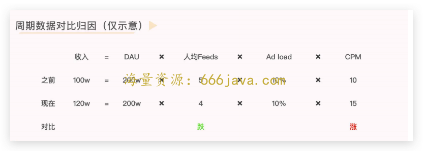

# 36-呈现：对上汇报方案什么样的结构最有效？

<audio controls="" title="36-呈现：对上汇报方案什么样的结构最有效？">
  <source
    id="mp3"
    src="/mp3/business-thinking/36-呈现：对上汇报方案什么样的结构最有效？.mp3"
  />
</audio>

你好，我是雄峰。今天我们聊一个老大难的问题，如何写对上汇报的材料。

语言表述的魅力往往可以把同一个事情表述成不同含义的东西，最后的结果也会大相径庭。这里我先说一个笑话。

> 一个教堂里，信众聚在一起，正一本正经地做礼拜。忽然有个信众烟瘾大发，他实在忍不住了，便去问主教：“我祈祷时可以抽烟吗？”
>
> 主教一听，大为光火，立即对他进行了严厉的呵斥：“什么？你祈祷时还要抽烟？上帝在你心中占有何种地位？”
>
> 这位信众烟没抽成，反而白挨了一顿训斥，只好垂头丧气，往肚里咽口水。
>
> 又过了一会儿，另一个信众也憋不住想抽烟，但他却换了一种非常聪明的说法，他悄悄问道：“主教大人，请问我在抽烟的时候，是不是可以做祈祷？”主教一听，此人诚心可嘉，莞尔一笑，点头同意。

你看，好的汇报材料也是一样，可以让你取得事半功倍的效果，把团队的业务工作、业绩成果以及后续优化的方向做一个清晰的结构性陈述。既可以跟上级有效对齐目标和进展，知道在上级的眼中哪些有问题、哪些做得好、哪些还有待商榷，为后续业务提供建议，也可以把对上汇报作为争取资源的机会，从而更好地推进自己负责的业务，获取升职加薪的机会。

可以说，每一次对上的汇报机会，都是风险与机会并存。那么问题来了，如何写好一份对上汇报的材料呢？

这个事情说起来容易做起来难，尤其是很多研发转业务岗的 leader，每次跟老板汇报的时候自己总是不太满意，写出来的东西也无法获得上级的认同。

今天我们就重点探讨三个问题：

1. 为什么很多时候大家写不好一份汇报材料？
2. 一份好的汇报材料具体要怎么写？
3. 在具体的对上汇报中，还要注意哪些东西？

## 写不好：汇报材料的视角差异

在工作中我经常会碰到一个场景，某合作的研发 leader 来找我，马上要跟大老板汇报半年工作总结了，或者最近有一个重点项目要推进需要老板支持，要写一个汇报材料，但是之前汇报得很一般，这次想要把业绩和问题都好好说清楚，应该要怎么办？

这种情况我往往有非常取巧的妙招：找好的产品帮忙写。

> 你自己先按照你自己的思路把汇报材料写一遍，然后你再找一个你觉得汇报不错的产品经理，帮你把汇报材料重写一遍，你对比一下两份材料的差异，基本就清楚自己的问题点是什么了。

这两份材料的差异往往是 **思维差异**。

**大部分人写材料，属于过程性思维**，巴不得把所有事情都事无巨细地同步给老板：我做了这么多，就要给你全部事无巨细地说出来，避免漏掉任何的细节。而且内容会大量聚焦在过程性细节内容点上，没有目标也缺少结果。属于典型的供给侧视角。

不少人都会这么汇报，结果就是被 gank 或者被忽视，无法达到自己想要的目的。

**汇报材料写得好的人，属于结论性思维，** 永远会换位到老板的视角，把当前业务上最关键的信息和结论按照老板的理解、思路去阐述，属于典型的需求侧视角。

这种方案的好处就是可以在最短的时间内，让老板知道你想说什么以及你要干什么，同时他需要给予你什么样的支持以及为什么。大量的业务细节会散落在各个业务模块，需要的时候会提到，不需要的时候就略过。

供给侧视角有什么问题？

我们换位想一下，一个大级别的会议，会上有各个部门的老板和大老板，总共一、二十人。在这种会议上，所有人的共同目标都是：了解清楚业务的运转逻辑以及业务的推进目的，你要干什么？你为什么要做这个事情？做了有什么结果？以及需要获得什么样的支持？

你作为一个项目的发言人去阐述部门的业务工作，事无巨细地说着业务细节，各个部门的人理解成本非常高，尤其是不知道你所在的部门和业务到底是什么情况的人，很容易听晕。有一部分人会沉默、不好意思问，为了避免觉得自己很蠢（往往是协作团队），就会失去耐心转头去玩手机；还有一部分人会不断地打断提问（往往是老板），导致汇报的故事线被打断，容易节外生枝，想推的事情没有推动，反而惹出了一堆麻烦。

**大量写不好汇报材料的同学，就是没有切换** **视角。** 需求视角是基于受众人群和参会目标反推要写的内容，供给视角则是陈列做过的事情。回想一下你过往没有做好的汇报材料，是什么原因呢？

## 怎么写：好材料的关键要素

一份材料除了说什么很重要以外，怎么说也非常关键。一份好的材料一定要具备这样几个关键要素：

1. 逻辑，不同内容选择不同的叙事逻辑；
2. 风格，内容的叙事方式贴近决策人的思路；
3. 简化，五分钟可以让人了解全文想说的信息和判断；
4. 问题，用可能提问的问题来检验内容的合理性。

### 合适的叙事逻辑

不同业务的叙事逻辑并不一致，我们汇报一个材料的场景大概可分为三类：

- **新项目** 探讨或者立项，需取得共识和支持；
- **日常业务** 进展推进，需同步现状、问题以及进展；
- **重要问题** 同步以及判断，需对齐接下来的处理方式。

我们一个一个来说。

**新项目的叙事逻辑是依靠故事驱动**，换句话说，做这个新项目的想象空间是什么？

新项目立项，大致可能有 4 类想象空间。要么能赚取较多的收入；要么跟现有的业务产生非常大的协同，比如应用分发，覆盖完手机这个场景之后还有什么可以覆盖呢？腾讯衍生出了 PC 手游模拟器业务；要么就是紧贴公司调整的大方向，是这个方向下的分支延展，比如腾讯进入 B 端之后的云游戏服务。

总的来说，一定详细凸显新项目立项后对于公司的价值，产生足够的想象力，吸引大家支持。此外，为了保障故事逻辑严谨合理，还需要回答这么几个分支问题：

> 为什么是你们团队来做这个事情？
>
> 你们做这个事情有什么优势或者禀赋？
>
> 你们需要获得什么样的支持来做这个第一阶段？
>
> 第一阶段成立的标准是什么？

**日常业务的叙事逻辑是依靠变化驱动，** 简单来说，这个周期对比前一个周期，什么地方发生了变化？

比如我们要分析收入发生的变化，这个维度下，选择适合的划分逻辑很重要。单从流量供给来看，总收入=A 流量+B 流量+C 流量+D 流量；从客户结构来看，总收入=A 类客户+B 类客户+C 类客户。

不同的维度得出来的视角分析也并不一致，多视角的拆解和分析可以看到的信息面也会更加完善。因此，在这类业务推进汇报的过程中，拆解的维度越多，归因的因素越关键，结果越理想。

举个例子。我们日常会有一个公式对齐收入指标波动的关键维度：

信息流广告的收入=DAU \* 人均 Feeds \* Ad load \* CPM。

把公式列出，再用两个周期的数据进行对比，即可归因到业务的增长和下跌到底出现在哪一个环节，再针对这个环节下钻分析，找到值得说的点，以小见大，从而找到后续优化的方式和逻辑，大部分公司的业绩复盘会都是这么做的。

**重要问题的叙事逻辑是依靠影响驱动，** 简单来说，这个事情如果出现，会有什么样的后果以及影响？

日常工作中会有很多突发的状况出现，要么是行业政策发生了大的调整，比如 21 年颁布的《个人信息保护法》，对于企业运用公民的个人信息提出了新的规范要求，如何适配政策要求且尽量不影响业务正常运转，则成为了思考的关键点。要么就是友商做了一个大的策略调整，那是选择跟进还是选择观望？

因此，在这类汇报上，最重要的叙事逻辑是要把问题的背景和可能产生的影响说清楚，当然，这个只是信息层面要做到的事情，同时你也要 **给予老板们选择的空间**：这个信息下我们要做哪些决策？我们有哪些决策点可以做？分别的优劣势是如何处理的？

### 内容的语言风格

在心理学和社会学中，有一种现象被称为“正选型交配”，它是指人们更容易接受那些自己熟悉的事物，对跟自己相似的人也会有一种熟悉感和亲密感。工作也是类似的。

很多领导喜欢的人是跟自己性格和业务能力相类似的人。在汇报的过程中，如果这个人的汇报思路贴近汇报对象，则容易获得更多的理解和忍耐。

跟一个产品背景的老板汇报，你的材料如果非常有条理，数据有论证，逻辑缜密，则是一个加分项；跟一个销售型出身的老板汇报，你的材料如果通俗易懂且关键信息和结论先行，大概率这次汇报不会差；跟一个战略出身的老板汇报，你的材料内容如果有详细的行业格局判断，很多新的思路和点子，则会收获较多的共鸣。

别小看这个细节，很多时候，这是非常大的一个业务加分项。

### 五分钟内讲述关键内容

一个会议有很多人，有兴趣全程参与的人必然是少数，同时大部分人也不太能够理解全部的专业内容，那么，如何让更多的与会人员听完你想说的内容呢？

这种期待下，就要在最开始表述清楚全文的关键内容，尽可能做到这个内容看完之后，与会人员可以做出判断：是否有必要继续听下去。

同时，不要写大量专业性词汇或者刻意雕琢文本内容，尽可能换位到小白的角度，尽量说人话、说大白话，尽可能降低所有人的理解成本。一个小技巧，如果部门新来的实习生也可以看懂，那就相当不错了。

这里我贴一个对外文档，感兴趣的可以翻看一下， [TapTap 广告投放指南（对外）](https://www.feishu.cn/docs/doccntofX49TnVQJK1HKUkHzYtc?from=from_copylink)，最开始的关键信息提炼，就是我们 5 分钟内的关键内容了。

### 用问题来检验材料合理性

经过上面三个步骤，一份基础的汇报材料也就出来了，但还不够完善，或者说还不够缜密。

一份好的汇报材料最终的评判标准则是：

> 要么与会人员看完材料基本上可以解答所有的问题，要么就是给你提的问题，基本上都可以从汇报内容里得到很好的回复。

因此在最后一部分则是设置问题 list，基于问题 list 反过来看材料什么环节会有问题，或者什么环节有所不足。这种时候就要 **换位提问题，一种是换位到大老板身上，把问题问深，一种是换位到业务协同部门，把问题问相关。**

假设我们现在在汇报一个新项目立项，判断这个市场空间比较大，在这种关键数据维度则会受到很大的挑战，一般这种情况会问这么几个问题：

> 你的数据哪里来的？来源的准确性如何保障？
>
> 有没有做交叉验证？交叉验证的方式是怎么样的？
>
> 如果是推算的，你的推算逻辑是怎么样的？如何保障数据的准确性？

我见过大量人在这个问题深挖上死得很惨，如果一个关键数据经不起三层细问，基本上汇报再天花乱坠都会出问题，再比如我们判断一个问题比较重要，需要花大力气去解决的时候，也会面临类似的发问：

> 这个问题如果不解决会是怎么样的？
>
> 如果不解决，这个结果我们是否可以承担？
>
> 友商对于这个事情是怎么判断的？
>
> 还没有其他的方案可以更低成本解决？
>
> 如果你说没有，你到底尝试过几次？

这类问题会倒逼你对于业务的本质理解更深。同理，切换到协同部门，他们的角度则会更多站在资源配合（研发/测试/策略）的角度，或者风险把控的角度（财务/风控/法务/PR），他们会提什么问题？也会让你有一个新的视角来看问题。

## 怎么说：汇报的过程中还要注意什么？

“向上汇报”粗看只有四个字，其实里面大有玄机。很多时候与会人员的小心思在这个场合下显露无疑。因此，对于写汇报材料的同学来说，也必须明白在写材料以外的地方，也有不少需要注意的地方，避免一个 100 分的业务材料只得到了 20 分。

### 重要项目会前开始说服

如果某一个项目极其重要，容不得一点点失误，那么我的建议是提前和你可以约上的与会人员单独过一遍内容，从而确保他们的问题可以提前处理和解决。同时，必要的时候争取盟友，让他们在会上给予支持和帮助，这样也可以确保项目通过。

### 压力挑战不要有情绪

任何一个汇报，与会人员都有三种态度：支持、反对以及沉默。这里最需要关注的是 **关键决策人对汇报的反对意见**，而反对的情况也可以分为三类：强烈反对、理性反对以及条件反对。

**理性反对** 是指关键人对于这个事情有比较大的疑虑。要么是事情本身是否成立，要么是实现方案有质疑，要么就是前面的汇报过程出现了问题，导致对整篇内容不信任，这种情况需要避免紧张，要么会上通过数据和逻辑再次说服，要么下次再准备。

**条件反对** 则是需要满足什么样的条件这个事情才可以做，提出这种问题大多数是在资源以及风险上的要求，反对感是较弱的，不用过于担心。

最大的问题是 **强烈反对**，碰到这种情况的话，建议尽早结束这个会议，结束后摸清楚背后的核心原因，只有摸底清楚之后，才可以准备下一次。

一旦被反对，一定不要有情绪，也不要害怕。只要你的目标是好好干活，就可以会后去找你的老板对齐下一次该如何处理，同时也要注意吸取教训。

除此之外，还有一种情况，就是 **老板挑战你对于业务的把控是否足够有信心**，因此会对一些数据和问题进行追问式提问。

如果你回答不上来或者磕磕绊绊，则会导致他进一步的给压力试探你真实的理解情况，这种时候一定不要怂，怂就完了。正面给予回应，比如在某一个数据上，大多数情况你懂的一定比你汇报的大老板知道得多，那么可以尝试赌一把，赌他肯定不如你清楚，会后再来补救，完善细节。

### 表述的节奏不要照本宣科

如果讲一份材料照本宣科的念，那还不如让人直接看。上台讲述的核心目标就是对齐内容和现场情绪，要重点关注听者的状态，确保你的故事线跟听众的状态保持一致。

如果听众表现出对当前的内容足够感兴趣，则可以详细讲，如果表现得不感兴趣，那么可以尝试着略过不重要的部分，直接跳到下一页去讲；如果你认为他没有听明白关键的信息，部分内容可以给予着重强调，对参会人进行内容唤醒；如果他提到了一个问题，则可以快速跳转到后面的内容对他的问题进行回应。

能做到这一点，整个汇报基本上就很不错了。

## 小结

在大厂待过的人非常反感汇报，我一定程度上是很认同的，因为汇报带来了效率低下和故事文化。但是我们可以反过来想一个问题：如果没有办法用一份汇报材料清晰地把自己要做的事说清楚，凭什么老板要认为你事情就可以做好？

另外，大厂之所以汇报多，本质上是通过人员的冗余来提升工作方向正确性的几率。试想一个汇报材料经过了几轮的判断和对齐，基本上可以确保方案的“相对机会”更大。

早期有一个朋友一直告诉我： **汇报如果是一个大厂的生存技巧，那么鄙视** **、** **反对都不是最好的办法，而是掌握它并成为游戏内的高端玩家。**

所以，这节课从三个点告诉了你写好一份材料都需要注意什么。

1. **汇报材料的视角差异**

汇报材料的视角分为两种，一种是供给侧视角，主要是把我做的事情事无巨细的进行展示，还有一种是需求侧视角，根据会与人员的参会目标以及材料的业务方向，反推要写的内容，尽可能用通俗易懂的语言讲述大家最为关注的内容，需求侧视角才是写材料的关键点。

1. **好材料的关键要素**

针对不同的业务找到不同的业务叙事逻辑，针对与会的关键决策人，用贴近决策人的思路阐释内容，尽可能降低内容的理解难度，在会议最开始的时候让大家知道今天重点要讲述的内容是什么，最后，用不断的提问来检验内容的合理性。

1. **“写**” **之外**， **还要注意什么**

这里最重要的就是三个点。一是不要有情绪，面对挑战是正常的，自信和情绪管控最为关键，关键时候不要怂；二是不要期望一个大的项目会上所有人都会同意，如果是很重要的会议，建议会前对齐和优化；三是不要照本宣科地讲内容，而是根据现场的人的状态调整叙事逻辑。

## 思考题

你还有哪些写汇报材料的技巧呢？

欢迎你在留言区和我交流互动。我们建立了一个 [读者交流群](http://jinshuju.net/f/DuxzBi)，欢迎你的加入！如果你觉得有所收获，也可以把这节课分享给你的朋友一起学习。我们下节课见。

**编辑来信**

> 「一起“费曼一下”」活动开启！🔛
>
> 商业思维是一门长期主义课程，唯有不断探索、反复输入、输出，才能让自己看到星辰大海。
>
> 在“技巧呈现”板块，我们推出「一起“费曼一下”」活动，鼓励你对自己感兴趣的任意一个商业问题进行总结和输出，最终形成小篇幅的文字记录。我们最终会制作成用户加餐，展示在专栏内，和每一位同学一起学习进步。
>
> 如果对内容有所疑问，也欢迎你加入 [读者交流群](http://jinshuju.net/f/DuxzBi)，和曹老板以及同学们一起探究行业热点、讨论问题。
>
> 划重点！划重点！划重点！
>
> 1. 参与方式：在读者交流群内交流分享；
>
> 2. 参与建议：费曼之前，建议学习 [22 课](http://time.geekbang.org/column/article/576925) 和 [29 课](http://time.geekbang.org/column/article/597880)“费曼学习法”相关内容，将会大大提升你第一次总结的内容质量，同时，提升自信哦～
>
> 3. 截止时间：成稿收集截止时间未定，专栏结课后会将部分“费曼一下”的成果展示不定期展示在专栏中，欢迎你随时加入课程交流群探讨问题，参与活动！
