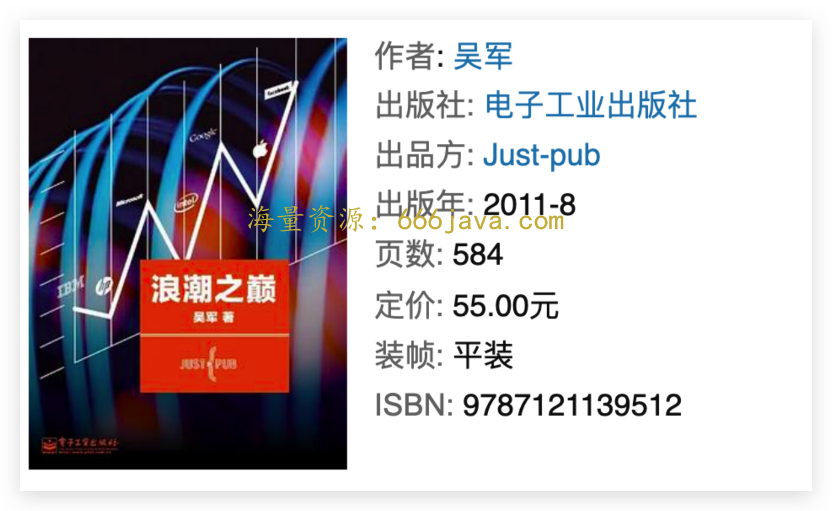
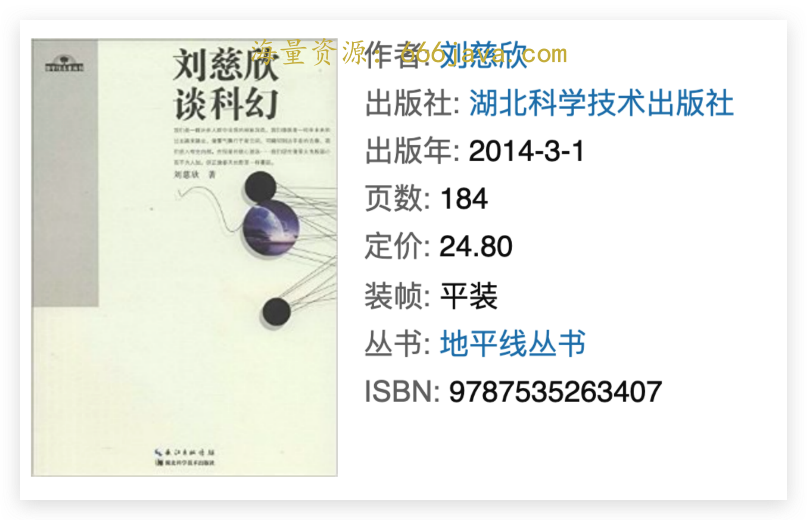
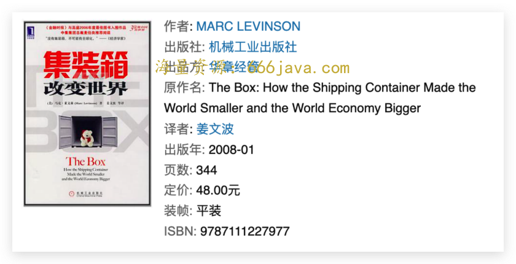
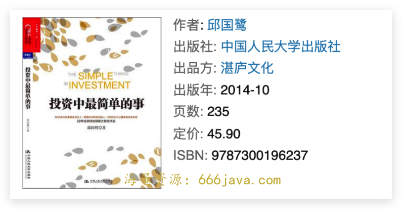

# 中秋加餐-《商业思维案例笔记》推荐书单

你好，我是雄峰。

明天就是中秋节了，在这里提前祝你中秋快乐！前面我们讲了这么多的商业案例，不知道你是不是觉得意犹未尽？

除了我们身边发生的这些鲜活的案例，我想你也一定希望学习更多相关的商业知识，拓展认知。所以，我特地为你准备了这篇加餐，从 **启蒙、思路、创新、颠覆、底层** 这 5 个维度，给你推荐几本我看过的书籍。

不同业务方向推荐的书籍并不一样，考虑到大多数的技术读者，这次书单的推荐会更倾向于帮助你扩展认知、打开思路。这几本书非常经典，也许你听过，但没读过，所以在每本书的下面，我也加入了一些个人对关键内容的提炼，希望能够勾起你的好奇心，真的动手翻一翻这几本书，你可以根据自己的兴趣和需要，先挑选出一本，以轻松的心态开启每一次阅读。

### 启蒙：《浪潮之巅》-吴军

如果要推荐一本书，来帮助你构建对行业的认知框架，我相信无论谁推荐都不可能落下这一本书。这本书，也是我从事互联网行业的 **启蒙书**，即使到现在也会经常拿出来翻看。

推荐理由有两点。

1. **构建认知框架**。

《浪潮之巅》是一本介绍互联网以及 IT 行业兴衰变化的书，包括了世界主流的 IT 公司是哪些，这些公司发展起来的背景、规律、商业模式以及行业定律，同时也阐明了其失败或者当前困境的原因。除此之外，也介绍了推动这些公司发展的幕后英雄，比如风险投资、美国大学等，可以帮助你 **以一个完整的框架来构建对互联网的认知**。

1. **内容深入浅出**。

当一个技术同学走出自己的舒适圈，从技术工作转到业务工作或者产品领域，一定会需要一个关键技能点： **把复杂的事情说简单**， **把枯燥的事情说有趣**。这可以帮助你有效地对上获取资源、横向协作沟通，因此，当技术同学咨询有啥好的办法提升这一块能力的时候，我都会推荐这一本。

### **思路** **：** **《刘慈欣谈科幻》-刘慈欣**

日常工作中，我们说一个想法不好的时候，通常会说： **这个想法不够性感**。

换句话说，就是这个想法不够酷，不够大，还缺点意思。那什么样的想法性感呢？别人问我这个问题的时候，我都会推荐他去看科幻小说，而谈到科幻，必然要谈到大刘（刘慈欣）。

为什么推荐这本集文章、书评、影评、访谈为一体的书，而不是推荐《三体》或者《流浪地球》呢？当然，你有时间看《三体》是最好的，但是如果没有那么多时间，就可以先从这本书读起。

这本小册子的前 6 篇文章，就可以让你脑洞大开，但你又不得不佩服其逻辑的缜密性。6 篇非常性感的故事，足以让你理解什么叫 **做脑洞大开的同时又有非常缜密的逻辑。**

### **创新：《集装箱改变世界》-马克·莱文森**

一些技术同学有另外一个执念：创新一定要具有很强的技术含量。因此，重心都会放到技术深度上，但实际上， **很多大的创新并不是什么高科技含量的东西，而集装箱就属于那种日常生活中那种毫不起眼却悄无声息地改变了世界的家伙**，在一定程度上可以类比互联网的创新。两者都是标准化传输的介质，实现了传输物（货物/信息）更快的传输，极大地降低了连接的成本。

小小地剧透一下，这本书可以带给你两个有意思的思考。

1. **简单的事物如何带来极大的价值。**

可以说，没有集装箱也不存在今天中国改革开放的成果。我们可以推演一下：

没有集装箱——不存在“集装箱标准化”——不存在极低的远洋运输成本——工厂仍然要建造在美国本土——日韩香港台湾就不会崛起（远洋航线上崛起）——上述企业不会到中国去建立工厂、设立企业——没有这些区域型的投资助力中国经济建设——生产线无法搬运到中国，最后成为世界工厂。

1. **新事物诞生后的相关利益链博弈。**

先进的生产力并不一定一帆风顺，在这之上，还需要对原有的利益链进行改革，而这个需要很长的时间。

第一艘集装箱在 50 年代就下水了，但是迅速引起了各方的抵制：政府、码头、工会。花了几年时间慢慢搞定之后，接下来又迎来了标准之争：尺寸。前前后后 30 多年，无数玩家前赴后继，才算是完成了这一次规则的迭代。 **不只是人的惯性大，从业者的惯性大，社会的惯性更大。**

### **颠覆：《投资中最简单的事》-邱国鹭**

工作中我们表达的内容包含三块：情绪、信息以及判断。其中情绪是最多的，判断是最少的。那么，如何增强自己的判断能力呢？有一个比较快捷的办法，就是 **看投资人是如何做判断的，他们的思考方式和判断机制是怎么样锻炼的**。

之所以推荐这本书，是因为这本书是作者的随笔合集，虽然缺乏系统性以及严谨数据的论证，但是 **鲜有晦涩难懂的专有名词，也没有让人眼花缭乱的数学公式，同时又有很多通俗易懂的案例和个人经验的支撑。**

书里的一个章节有讲到什么样的行业是一门好生意，哪些则不是，非常颠覆我们的固有观念。

比如现金流不好的行业不是一个好的行业，说清楚了手游和电影行业的陷阱、电影和内容行业的传统问题，以及收入与利润的不可持续性：出爆款的时候疯狂盈利，一旦爆款日活下降、青黄不接，就面临盈利下滑的窘境。消费者是善变和易忘的，一款产品大爆的时间不会太长，你需要不断地吸引消费者的关注，这就非常难。

### **底层：《俞军产品方法论》-俞军**

早年间，互联网有两个产品大神，一个是张小龙，一个是俞军。为什么俞军可以比肩张小龙？作为百度最早的产品经理，他一手缔造了百度早期的产品体系，不仅负责搜索质量的优化，还做出来了百度贴吧、百度百科等一系列产品。俞军有一个产品十二条在行业流传已久，摘录如下：

> 产品经理首先是用户；
>
> 站在用户角度看问题；
>
> 用户体验是一个完整的过程；
>
> 追求效果，不做没用的东西；
>
> 发现需求，而不是创造需求，决定不做什么往往比决定做什么更重要；
>
> 用户是很难被教育的，要 [迎合用户](https://time.geekbang.org/column/article/559278)，而不是改变用户；
>
> 关注最大多数用户，在关键点上超越竞争对手，快速上线，不断改进；
>
> 给用户稳定的体验预期；
>
> 如果不确定该怎么做，就先看别人是怎么做的；
>
> 把用户当傻瓜，不要让用户思考和选择，预先替用户想好；
>
> 不要给用户不想要的东西，这是对用户的一种伤害。

豆瓣上很多人给这本书打一二星的差评，可能也是这种自以为是的点评者太多了，导致很多大拿不愿意把自己的业务逻辑做一个梳理和分享，总担心丢失了那一份自己的神秘感和光芒。所以，还是非常感谢俞军老师把自己的产品经验总结了出来。

需要说明的地方在于，这本书并不是倚天剑和屠龙刀，并不是看了就会成为俞军一样的大拿。这本书的意义在于，一个前辈把过往自己对于产品的思考和过往的阅历整理出来，让你工作中进行参考印证。

书中除了详细介绍了理解企业、用户、产品、交易、决策等产品经理必备的知识外，还比较全面地介绍了产品经理岗位需要掌握和了解的底层知识，比如经济学、心理学、组织行为等。虽然没有全面展开，却能起到引导作用，对于产品工作不了解的技术同学来说，是一本很好的入门读物。

### 写在最后

好了，这次的书单推荐就先说到这里。

推荐的数量不多，不过推荐的角度都是做过针对性的筛选的，围绕着技术同学转业务方向之后可能面临的一些问题，都给出了相应的启发和解答。所以，我强烈推荐你沉下心来读下去。如果你觉得有趣，也可以围绕着推荐的角度持续深挖类似的书籍，扩展多维能力。

如果你恰好也看过这几本书，也欢迎你和我一起交流讨论。也欢迎你给我推荐你喜欢的书单，我们一起进步！我们建立了一个 [读者交流群](http://jinshuju.net/f/DuxzBi)，欢迎你的加入！如果你觉得有所收获，也可以把这节课分享给你的朋友一起学习。我们下节课见。

最后，再次祝你中秋快乐！
