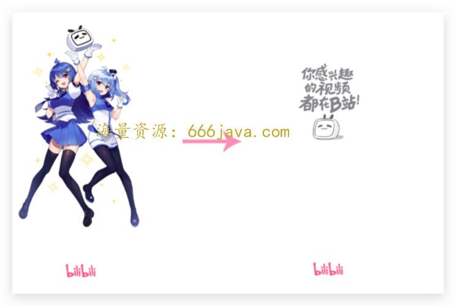
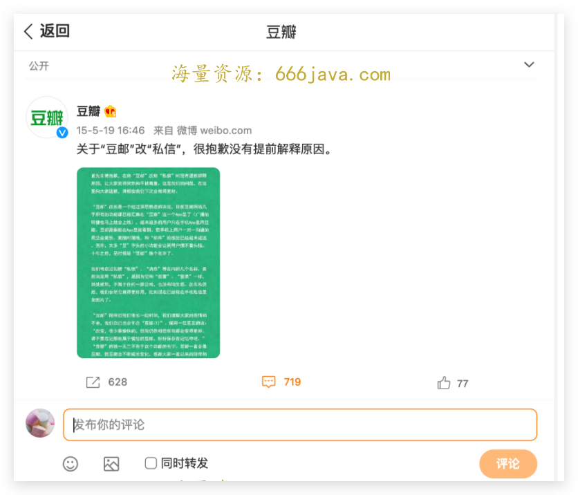

# 中秋加餐-直播回顾：B 站的商业化之路到底难在哪？

你好，我是《商业思维案例笔记》的编辑晓蕾。

中秋假期马上就要过去了，不知道你有没有好好休息，恢复好精力呢？

在假期的最后一天，也许你还想放松一下。今天这篇加餐，我为你带来了 [邱岳](http://time.geekbang.org/column/intro/100012001)（二爷）和雄峰关于“互联网下半场看法和选择”的 [直播回放](http://www.bilibili.com/video/BV1Xe4y1X7jt?spm_id_from=333.999.0.0&vd_source=871d0123bdbfbace29022959d335eb2f)，你可以边听边休息。

这场直播长达 2 小时，其中包括三大板块：以 B 站为起点的商业案例剖析，联盟业务的价值与字节跳动的启发，以及互联网下半场的剖析与建议。

这次加餐我选取了直播前 25 分钟的内容，“B 站的产品改版和商业化之路”，整理出了文字版的关键内容。阅读之前，你也可以先想想几个问题：

- B 站的产品改版中，新增加了短视频模式，这是为什么？
- B 站依靠什么盈利？
- 二次元用户的体验和商业化变现的瓶颈在哪里？
- 二次元平台的商业化有哪些特点？它和游戏垂直社区领域有什么相似的地方吗？

接下来，我们就先来了解一下 B 站的产品改版。

### **B 站产品改版：Story-Mode 新模式是个啥？**

**曹雄峰**：今天想和二爷聊一下 B 站业务的一个发展方向。B 站今年开始有一个比较大的产品改版，是在信息流里面的部分双列信息流模块里插入了单列信息流。他们的逻辑叫做 Story-Mode，其实跟抖音的短视频就很像。

我先从商业化的角度去说，分享一下自己关于这一块的看法。其实这个功能的上线本质上就是为了 **提升广告的露出率，（提升）交易漏斗的指标**。

因为如果是双列信息流的话，一页可以展示 6-8 条左右的信息流，但是广告只能插入一列。

但实际上来看的话，这种广告的展现率和点击率是偏低的。但如果是短视频那种沉浸式和速滑的模式，其实它的交易漏斗，按照抖音目前（的情况）来看的话，是能够提到 15%的。比如说我刷 10 条（短视频），可能广告能够露出 2-3 条，又因为是全沉浸式的方式，它整体的转化效果会远比目前 B 站这种商业化的形式来得更好、更快。

### B 站社区属性：商业化道路为什么难之又难？

**曹雄峰**：B 站这个公司也挺有意思，它基本上将互联网能做或者相关的方向全试了一遍，但实际上就每一块业务多少会存在一些瓶颈和空间，然后这东西又跟它社区属性又太相关。

**邱岳**：其实我个人还是蛮喜欢 B 站的。作为普通用户来说，在 B 站里面浏览有两个感受：一个是因为他 **没有视频前面的贴片广告**，所以你看视频的体验很好，不需要等；另外，B 站在国内所有的视频网站里头，我觉得气质上是最像 YouTube 的网站，非常突出 Up 主的个性， **会把内容放得很靠前**。

还有，他有自己的二次元文化对吧？他也一直都 **没有丢掉自己起源的东西**，所以我对 B 站一直都很有好感。

其实 B 站的商业化也是我一直都看得不是特别明白的一件事，因为它没有广告。那怎么才能支撑这个公司，让它的商业模式转得起来，难道就靠大会员吗？还是说靠文化周边或者什么别的东西？

你怎么看 B 站它的商业化模型？

**曹雄峰**：B 站的商业化，其实还是比较有意思的。因为就像二爷说的，B 站是一个社区产品起家的平台。

记得 18 年 B 站刚上市的时候，我就跟做投资的朋友就聊过，从未来的发展方向来看，它有两个核心指标：一个是 **泛化**，就怎么从小众人群往大众去泛化，但本身的社区品牌不丢；一个是 **商业化**。

基于这个点来看的话， B 站商业化最大的问题点就是， **社区的用户与平台商业化之间融合度的问题**。

以广告为例，正常的视频平台基本上会有开屏，会有前贴、中贴，一些品牌的合约招商，以及信息流等等。但你会发现 B 站只有信息流，基本上没有开屏，没有前贴，中贴和品牌可能也会相对比较少。因为 16 年的时候，陈睿为了维护社区的一种氛围，承诺了永不加前贴广告。

说到前贴广告，其实可以发现在 B 站做商业化，或者说作产品最大的一个问题点，就是： **考虑任何方案都会先做一个备案。**

比如， **假如我这个功能发布之后引起了核心用户的不满，那么我们怎么对外公关，或者说怎么去往回退，安抚用户？**

> 举个简单的例子，B 站上线任何功能都会先去看微博，知乎和 B 站本身三个平台里面有没有对新功能的讨论。如果有，而且是不利的方向，就会想办法做公关。
>
> 我记得大概是 20 年 B 站的 11 周年，当时它的主封面就是 2233 娘，也就是 B 站的两个妹子碰杯，发展到今天，整个社区基本上都是那两个形象代表，所以开屏从来没有变过。只有 20 年的时候变过一次，上了一个小电视的封面图。
>
> 

其实站在内部角度考虑，核心就是想试探一下，用户到底会不会因为我的封面换了之后对我有反感。（2233 娘的开屏）下线之后就方便准备两件事情：一个是为开屏广告做准备，后续开屏广告或者其他业务也会去做（广告）露出；还有一个点在于，B 站当时的核心目标是做用户泛化，如果一直是一个二次元形象，可能很多新用户接受度不高。

但结果是 2233 娘下线之后，基本上社区（反馈不是很好）。当时微博发酵了一段时间，内部一直扛着压力没有改，结果第三天实在扛不住了，就紧急做了一个公关说：2233 娘并不是换了，只是下去“化了一次妆”，会重新上线。

所以，B 站的问题点在于，因为之前社区的调性在，对用户也有承诺，没办法去做开屏，没办法开前贴，所以 **只能想办法在信息流里面挖空间**。在系统里挖空间的话，最好的方式就是模仿当年的快手， **从双列信息流改成单列信息流**。

目前来看，B 站一直在往里面加，如果不出意外的话，可能它整个 Q3 的广告收入应该会比之前好很多，因为整个的广告库存在涨。

**邱岳**：你刚刚提到公关事件，我就想起一个豆瓣的事情，不知道你还记不记得？

前几年，豆瓣把 [豆油换成了站内信](https://www.douban.com/note/666303315/?_i=2710588t4MPs30) 还是私信一类的功能。当时也是发酵得很厉害，基本上这种 **从某一种亚文化往外蔓延的过程里面，尝试把这种亚文化里面的专业术语或者文化壁垒消除掉的过程里面，通常都会引起这种巨大的原住民这种反感**，对吧？

比如说，咱们一伙人在城堡边上玩这个沙坑，你突然就得上市了，然后还弄出一堆不认识的人，把我们以前的话语体系改掉，这就会引起很大的反弹。

然后你刚刚说的双列和单列，就说实话我之前更多的还是从用户体验的角度，还有用户留存时长的角度去看，但我确实没有从纯从商业化的角度去看，并且你刚才在说的时候，我在想，如果让我用直觉去做判断，究竟双列的广告效率更高，还是单列的广告效率更高，我有可能会判断双列的广告效率更高，但是你说完之后，我觉得你说的是对的，我的直觉应该是错的，这个是很有意思的一个事儿。

其实我对于我个人来说，我是不太喜欢 B 站的竖屏的 story 故事的模式。因为我到 B 站的时候，我每次都是带着一个期望是我接下来要看一个长达 10 分钟左右的视频，它可能是一个完整的内容，但是我刷到那种内容的时候，我发现他还是短视频的模式，并且他这两种横屏的长视频和竖屏的短视频交叉的这种方式，我很长时间都很难适应。

但你说从商业化的角度来看，它是为了扩大广告的库存，然后扩大广告的占比，似乎也是能理解。

我记得曾经比较在微信朋友圈和在抖音放广告的差异的时候，就有一个广告行业的朋友跟我说过， **朋友圈广告可投放的容量太小了，你刷 10 条朋友圈，看到一条广告，就觉得非常反感了。但是在抖音里面你基本上刷三条给你推一条广告，你都不会那么的反感**，因为你那个时候是处于一种 [无意识的状态](https://time.geekbang.org/column/article/551301)。

所以真的可以说， **如果用广告的方式去变现的话，产品形态在非常大的程度上会决定收益的天花板** 在哪里。

### 产品形态和商业化的矛盾演进

**邱岳**：这是一个我觉得挺矛盾的事。因为你本来是做那个产品的，然后你说想通过这个产品赚点钱，那为了赚钱，你就必须 **转过头来把你做出来的，你喜欢你的样子改掉，就有点别扭。好像在商业化里经常会遇到这种问题。**

**曹雄峰**：这两年来说，这个思路可能都会有很大变化，比如说前几年，以腾讯为例，基本上是产品先做出来，然后怎么加广告后面再考虑。结果就会导致，产品往后面会伴随商业化的改版，不断地会有一些扭曲或者变形，然后双方都会有很长的不适和矛盾。

**但这两年来看，实际上新的产品出来之后，基本上商业化和用户产品的体验设计会并重，而且在初期就会做好设计。**

举个例子，比如说像现在很多垂直的潮玩社区，从第一天，他们就开始想办法做潮人和商家的入驻，以及和整个电商交易链路的搭建，可以说商业化从第一天就开始考虑进来了，这可能就是这两年有点不太一样地方。

我感觉，可能是因为有点被字节影响，或者说给带出来的。因为字节的产品，基本上第一天商业化中台就会开始介入，尝试把产品的 ROI 打正，然后增长开始介入，形成增长-商业化的飞轮模式，之后立马能够把增长打开。

其实字节这两年对行业商业化方法的影响还是挺大的。

**邱岳**：对。我们把功利这个词当做一个中性词，字节的产品不带价值评判地说，它做产品真的是极其功利，并且功利得让人心服口服。不论是产品形态，还是商业化的策略和商业化跟用户产品之间的结合，我觉得是极其功利的。不是说功利不好，它是中性词。如果功力是一个好事的话，字节基本上做到极致了，极致的好。

**曹雄峰**：短视频这个赛道基本上还是在吸纳一切。

如果最近刷抖音你就会发现一个很明显的问题，就是我们过往很难看到推销本地生活的短视频。探店现在特别多。然后你会发现，宇宙的尽头，或者说流量的尽头，它就是抖音，就是抖音吸纳一切，然后所有的环节都会想办法去做商业化的变现。

而字节过往的所有业务，基本上都属于是把流量卖给外部的 App 去做变现，不光是游戏，前两年电商起来之后，尤其是巨量千川（字节电商广告体系）起来之后，基本上他们就做了一个生态闭环，就是体系内进行循环，然后本地生活其实也属于这一类范畴，所以他往这边进的逻辑点就能理解。

但是我确实不是很看好这一块。因为美团线下的能力， [分层](https://time.geekbang.org/column/article/549599)、 [地推](https://time.geekbang.org/column/article/557431) 的能力还是挺强的，另一方面是（美团）他们认为自己属于一个物流公司，物流公司是非常重运营逻辑的，而字节是典型的偏算法效率的公司，这点实话实说，其实和 [百度](https://time.geekbang.org/column/article/557431) 当年做外卖有点像。

**曹雄峰**：说回到 B 站。

因为 B 站的广告只是它商业化过程中目前（占比）比较大的一种形态。它可能最开始的商业化是靠游戏联运，我们说回到二爷（邱岳）刚才聊过的一个点，就是 **社区类的产品做商业化，其实会存在原住民跟新进来的这种冲突**。

其实现在有一个行业术语叫做“二次元饭圈化”。就是，二次元的用户对于某一类非常沉迷的话，它会形成饭圈化，来形成很持久的付费留存。

这种心态就是我跟你产品进行同步成长，但是你不能变，你变了之后我可能会遗弃你，引发进一步的公关。

这点其实和游戏行业很像，因为去年有个新闻，不知道大家有没有就留意过。一家很出名的公司叫米哈游，他们的 [创始人被一位游戏玩家刺伤](https://baijiahao.baidu.com/s?id=1698015707553514690&wfr=spider&for=pc) 了。

后面抓来审讯，玩家的反馈是：你的 **产品（崩坏 3）做了一个改版**，影响了我对原有角色的体验和感受，我不开心。我觉得这个逻辑其实也可以说一下，因为它引发出了一个很明显的、游戏行业发行的问题，就是 **营销** 或者叫做 **社区化** 现在已经越来越火爆了。

举个例子，比如过往我们任何一个游戏去行业里面想获得流量，因为它毕竟是个内容。

好比一个电影，需要上架到各大影院里面去，需要跟影院沟通，要么确定我要怎么跟你进行分成，OK，我赚多少钱，给你分多少；要么做法很明确，我把你电影院包了，这个片子就给我我排了，要么所以过往的方式就是 **要么联运要么广告。**

但米哈游很厉害的地方在于，它做成了饭圈化模式，用户基本上不太用去平台买量，也不太用去走渠道游戏联运的模式，用户会主动过来下他们的新产品，因为已经形成了对米哈游的厂牌认知。他们有自己的游戏社区，米游社，三四百万的 DAU，这是很夸张的一个指标。

因为游戏行业里面可能一个产品 DAU 十万已经算不错了，所以他这种方式，让原神去年在行业里面基本上没有怎么花钱去买量、打广告，更多是走平台营销，所以原神产生了很大的收入，这也是 **二次元社区产品一个很有意思的地方，（除了对广告的依赖，它自己本身也有商业化变现的方法）**。

### 写在最后

好了，这次的直播加餐就到这里了。

在这节加餐课里，我们分析了 B 站社区属性特点，在商业化道路上所扮演的角色，也了解了近两年来产品形态和商业化之间的矛盾，在字节影响下逐渐消解的趋势。

等不及看后面内容的话，你也可以点击 [链接](https://www.bilibili.com/video/BV1Xe4y1X7jt?spm_id_from=333.999.0.0&vd_source=871d0123bdbfbace29022959d335eb2f) 跳转到 B 站观看回放。

如果你对 B 站产品改版、游戏垂直社区商业化等等类似的话题感兴趣，也欢迎你在留言区和我们一起交流讨论。我们建立了一个 [读者交流群](http://jinshuju.net/f/DuxzBi)，欢迎你的加入！如果你觉得有所收获，也可以把这节课分享给你的朋友一起学习。我们下节课见。

好好享受假期的最后一天，我们下节课见啦！
