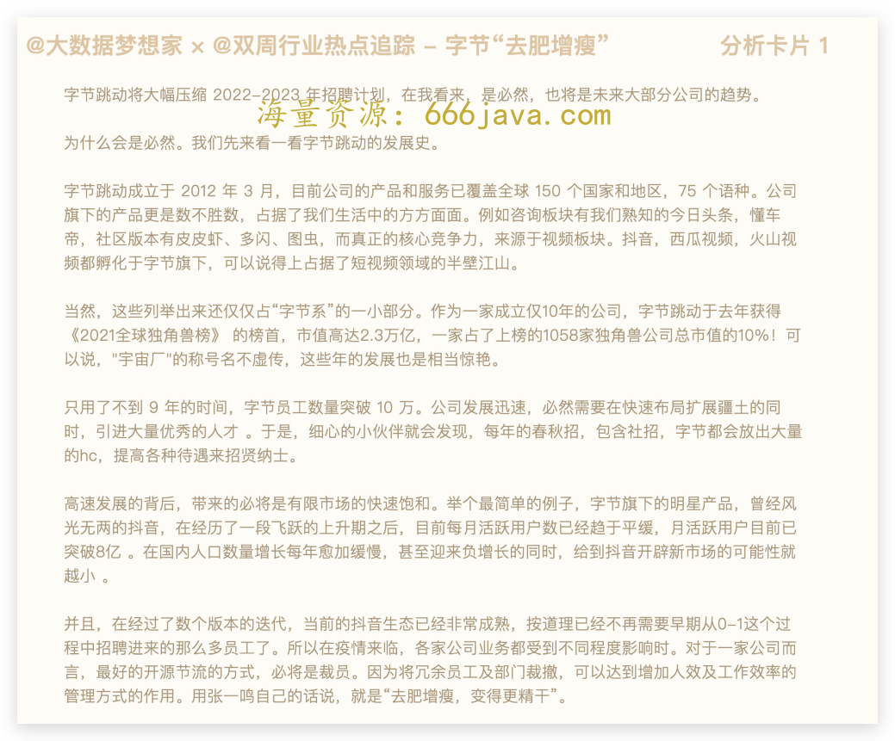
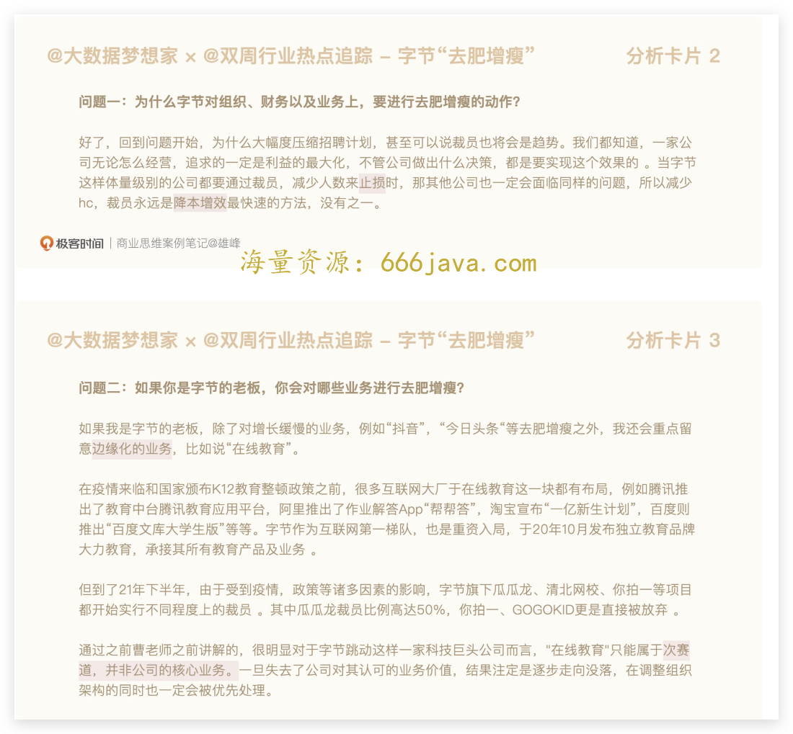
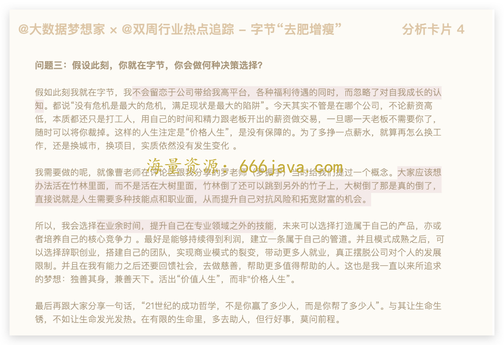
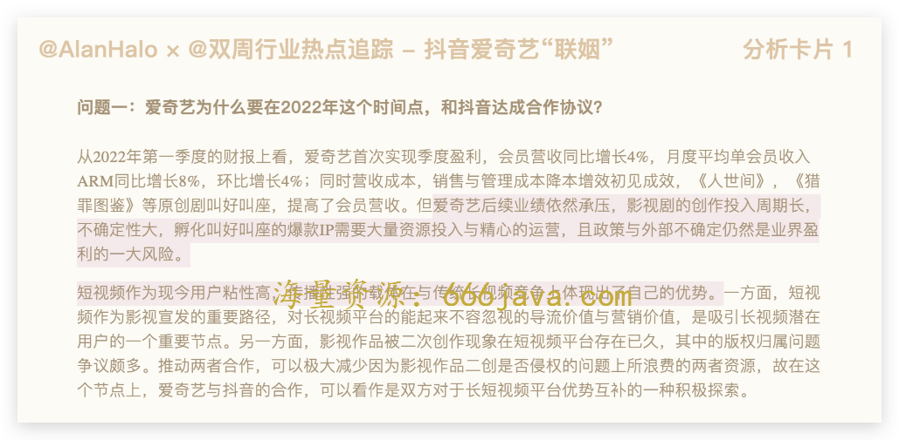
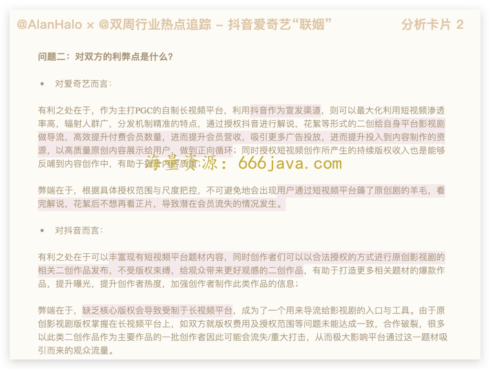
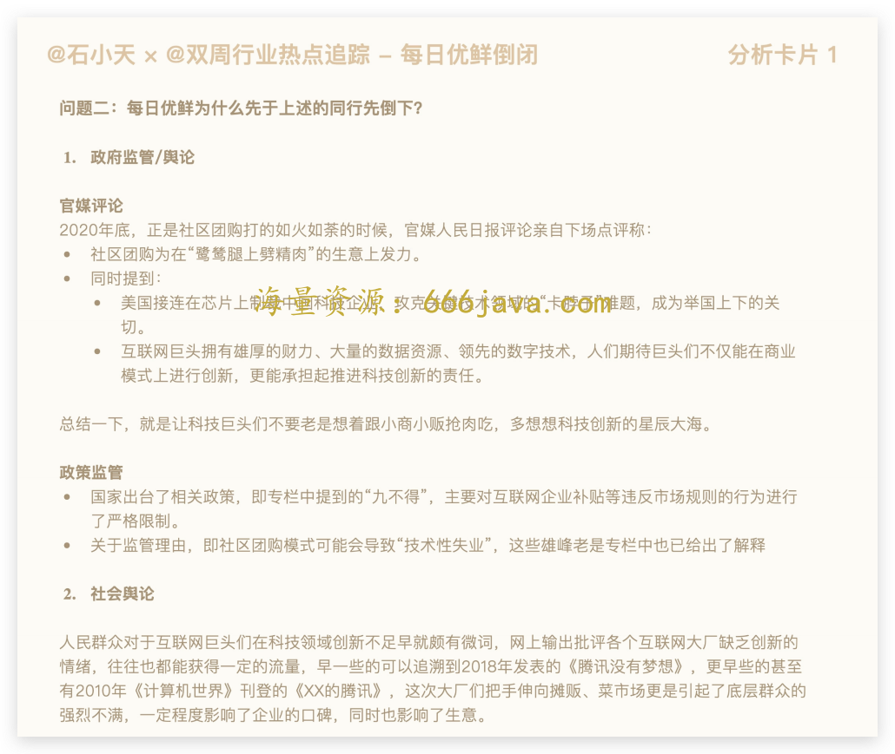
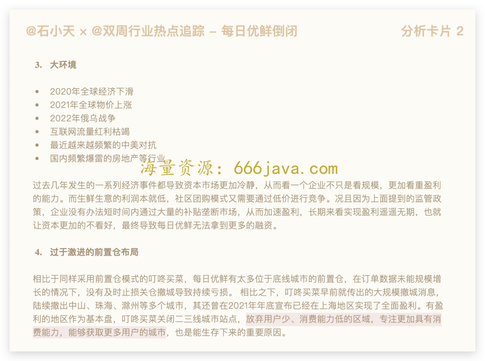

# 双周行业热点评论-字节去肥增瘦，抖音爱奇艺联姻，每日优鲜破产

你好，我是雄峰。

8 月 5 日我们开启了第一次双周行业热点追踪活动。许多同学通过编辑、留言的渠道分享了自己的看法和见解，感谢你对活动的关注，也恭喜你迈出了理解商业世界的第一步！

所以，这一讲，我们就来做一次“双周行业热点分析”，综合大家的分享，对追踪活动的三个热点：字节去肥增瘦、爱奇艺抖音联姻以及每日优鲜破产做个总结分析，补充一些遗漏的分析角度。没有来得及关注热点的同学也不要紧，可以先到“ [双周行业热点追踪](http://time.geekbang.org/column/article/547521)”看看，行业内到底有着哪些变动。

还是这句话，商业思维，不仅需要我们在课堂之中用心学习，更要保持一颗非常旺盛的好奇心去不断探索，把工作和生活中看到的现象和问题，用讲解过的技巧去解构分析。接下来，我们就一起看看第一次的行业热点追踪，可以带给我们哪些启发。

## 热点一：字节跳动将大幅压缩 2022-2023 年招聘计划

我们先来回顾一下热点内容。

> 7 月 21 日，从字节跳动内部人士处获悉，字节跳动 CEO 梁汝波近日更新个人 OKR。OKR 显示，字节跳动将根据业务形势更新人力计划，大幅降低 2022-2023 年招聘计划，降低组织规模增速，并提升组织效率。
>
> 据了解，梁汝波的 OKR 中并未明确招聘计划的压缩比例，但据字节跳动内部人士透露，此前公司内部已在强调组织去肥增瘦了。

基于去肥增瘦的热点，我们提出了三个可思考的问题：

- 为什么字节对组织、财务以及业务上，要进行去肥增瘦的动作？
- 如果你是字节的老板，你会对哪些业务进行去肥增瘦？
- 假设此刻，你就在字节，你会做何种决策选择？

我们先从第一个问题开始解答。

### 为什么字节要进行去肥增瘦的动作呢？

去肥增瘦的目的有多个，最直观的是降低企业支出， [@大数据梦想家](http://horde.geekbang.org/usercenter/0E0121AD1CB78F) 的回答也以“利益最大化”“降本增效”为核心展开了讨论。这里我也提一下另外两个角度：

1. **提升组织效率：** 人员冗余的时候，冗余本身也会造成效率的低下和内耗。假设一个简单的事情如果 5 个人同时做，那么每一个人为了凸显自己的价值，就有可能会相互做信息差、使绊子，反而不如一个人简单；
2. **聚焦核心业务：** 字节崇尚的业务思路叫做大力出奇迹，短时间内会在一个新业务上急速扩张，业务上会冗余招聘，但是如果这个业务持续投入且一直亏损的情况，短期也看不到有逆风翻盘或者盈利的机会，收缩也是必然，从而把主要资源投入到核心业务上，避免基本盘发生变化。

### 如果你是字节的老板，你会对哪些业务进行去肥增瘦？

我们再来看第二个问题。 [@大数据梦想家](http://horde.geekbang.org/usercenter/0E0121AD1CB78F) 运用了我们在第一次练习课中讲解过的赛道法，选出了属于次赛道的业务。如果你看了我们的第二次练习课，会发现他同样做到了“结论先行”。后续的分析中，也没有只着眼于边缘化的业务，比如说“在线教育”，还关注了增长缓慢的业务，非常全面。

这里我再提一个分析的方法。字节对哪些业务去肥增瘦，并不是这个问题的重点，重点是 **去肥增瘦的思路到底是什么。**

**动什么应该反过来看什么不能动**。我们还是以字节为例来分析。

字节的核心产品是抖音，且从字节内部的判断来看，短视频改造各行业的情况依旧在持续，那么我们可以把业务分为抖音和非抖音。而抖音内部的业务也可以依据当前发展情况进行拆分，分为存量、增量、探索三部分。 **存量业务优化人员结构，增量业务保持稳定，探索业务可维持一定的人员增加。**

非抖音业务可以看是否为行业相对优势业务。非领先业务都有可能被动刀子，比如飞书、比如朝夕光年，如果是领先业务则会有一定扩展机会，比如 Pico。下一步，可以再细分业务，拆解出存量、增量和探索三块细颗粒度的业务方向，但是这 **一部分的逻辑和核心业务会反过来，只有存量和增量相对会保留机会，探索业务大概率会被拆除。**

### 假设此刻，你就在字节，你会做何种决策选择？

[@大数据梦想家](http://horde.geekbang.org/usercenter/0E0121AD1CB78F) 的回答方向很明确，“不会留恋高平台和福利待遇，忽略对自我成长的认知”，也就是“自身能力的提升”才是首要目标，同时，也提到了“提升自己在专业领域之外的技能，未来可以选择打造属于自己的产品，抑或培养自己的核心竞争力”。

这两点是我们大部分人的选择和看法，这里，我也和 [@大数据梦想家](http://horde.geekbang.org/usercenter/0E0121AD1CB78F) 一样，以自己为例，给你一些提升能力和找寻场外机会的提示。

如果我在字节，我会去做一个关键选择的思考：是持续在 **职场里面找“场内机会”还是尝试往外部走“场外机会”。**

如果在职场内，继续在字节里面，我会思考怎么完善我个人的故事线。简单来说，就是我 **过往的工作内容和履历是否在完善我的核心竞争力。**

以我个人为例，选择来现在这家公司的核心目的就是完善核心竞争力。我在腾讯负责过游戏联运业务，又负责过广告行业的游戏运营业务，现在这家公司，不仅可以帮我 **补足** 对于游戏行业营销、发行模式的理解，也可以让我接触到游戏行业中另一类游戏公司的业务发展模式。在这一块能力补全之后，后续如果有公司想找一个理解全游戏商业模式和行业的，那么，我的竞争力相对大很多。

如果尝试换一种活法，就会开始尝试寻找场外机会。简单来说，就是个人兴趣或者能力项是否可成为赚取收入的一个方向，如果 **副业占收入的 30%或者更多**，就会有进一步的想法，出来自己做。但是据我了解，字节的同学大概率没有这个时间，毕竟卷得飞起。

## 热点二：爱奇艺抖音达成合作，其中包含长视频二创合作

我们同样先回顾一下热点二的内容。

> 7 月 19 日，抖音发布公告，称其已经和爱奇艺达成了合作，未来将围绕长视频内容的二次创作与推广等方面展开探索。根据公告，爱奇艺将向抖音集团授权其内容资产中拥有信息网络传播权及转授权的长视频内容，用于短视频创作。双方对解说、混剪、拆条等短视频“二创”形态作出具体约定，将共同推动长视频内容知识产权的规范使用。

关于热点二，我同样提出了三个问题：

- 爱奇艺为什么要和抖音达成合作协议，并且是在 2022 年的时间点上？
- 这个合作达成对于双方的利弊又是什么？
- 从终局角度考虑，双方的合作会走向什么样的一个方向？

我们先从第一个问题开始回答。

### 爱奇艺为什么要在 2022 年这个时间点，和抖音达成合作协议？

[@AlanHalo](http://horde.geekbang.org/usercenter/925D6BB52C6404) 的回答非常全面，可以说是标准答案。我们来看一下答案中最关键的两句话：

> 1. 爱奇艺后续业绩依然承压，影视剧的创作投入周期长，不确定性大，孵化叫好叫座的爆款 IP 需要大量资源投入与精心的运营，且政策与外部不确定（性）仍然是业界盈利的一大风险；
> 2. 短视频作为现今用户粘性高，传播性强的载体在与传统长视频竞争上体现出了自己的优势。

长视频的困境、短视频的优势，两者结合，促使爱奇艺、抖音联姻。

这其中的核心思想就是： **如果打不过，那最好的方式就是加入。** 现阶段爱奇艺的核心是缺钱，有抖音的合作之后，一方面是可以做内容合作产生收益，另一方面也可以从抖音侧导流。从我们上次提供的辅助材料 [2021，爱奇艺无能为力](https://m.thepaper.cn/newsDetail_forward_16353290) 里，你也一定能够发现，现在对于爱奇艺最大的命题是： **如何活下去。**

### 这个合作达成对于双方的利弊又是什么？

第二个问题 [@AlanHalo](http://horde.geekbang.org/usercenter/925D6BB52C6404) 的回答同样很好，我们把回答适当提炼一下，就会得出下面的答案：

**对爱奇艺来说，利是什么？**

1. 给自身平台影视剧做导流，高效提升付费会员数量，进而提升会员营收，吸引更多广告投放，进而提升投入到内容制作的资源，以高质量原创内容展示给用户，做到正向循环
2. 授权短视频创作所产生的持续版权收入能够反哺到内容创作中，有助于提升内容质量；

**弊端有哪些？**

会出现不可避免的薅羊毛情况，用户通过短视频平台看完解说、花絮后不想再看正片，导致潜在会员流失的情况发生。

**至于抖音方的利弊， [@AlanHalo](http://horde.geekbang.org/usercenter/925D6BB52C6404) 的分析也已经非常全面了：**

> 丰富现有短视频平台题材内容，平台创作者们也可以以合法授权的方式进行原创影视剧的相关二创作品发布，不受版权束缚，给观众带来更好观感的二创作品，有助于打造更多相关题材的爆款作品，提升曝光，提升创作者热度，加强创作者制作此类作品的信心。
>
> 弊端在于，缺乏核心版权会导致受制于长视频平台，成为了一个用来导流给影视剧的入口与工具。由于原创影视剧版权掌握在长视频平台上，如双方就版权费用及授权范围等问题未能达成一致，合作破裂，很多以此类二创作品作为主要作品的一批创作者因此可能会流失/重大打击，从而极大影响平台通过这一题材吸引而来的观众流量。

如果让我补充，还可以添加一句利弊相互比较多视角。我个人觉得，不管是对于爱奇艺还是抖音都是利大于弊，抖音缺少正版内容，爱奇艺缺少钱和流量。

### 从终局角度考虑，双方的合作会走向什么样的一个方向？

终局思维板块咱们还没有讲到，不过 [@AlanHalo](http://horde.geekbang.org/usercenter/925D6BB52C6404) 的分析也已经尽量在往后看了。如果再大胆一点，我会认为，很有可能爱奇艺会卖给抖音。

核心在于爱奇艺当前股票相对便宜不少，且百度急于甩开包袱，当对标的奈飞都一落千丈的时候，大家对于长视频这门生意其实在持续产生质疑的。打破质疑的核心在于如何解决盈利问题，给到抖音可以产生视频切条的二次价值，不仅有收入，对于抖音本身的活跃也有帮助。

当然，爱奇艺也需要持续证明自己在生产方面的能力，不然抖音纯买存量的版权内容，价值也不是很大。

## 热点三：网传每日优鲜破产，大部分员工解散

最后来说每日优鲜的话题。我们先回顾一下到底发生了什么事。

> 7 月 28 日下午，每日优鲜召开内部 20 分钟线上会议。主要讲述了如下内容：
>
> 1. 由于此前公布的融资事件现在还协调，融资款尚未到账，公司财务出现一些问题；
> 2. 公司大部分员工工作时间将于 7 月 28 日截止，只留少数人员接管公司业务和处理后续事宜；
> 3. 被离职的公司员工，7 月社保公积金由每日优鲜缴纳，8 月由自己缴纳；
> 4. 目前每日优鲜员工社保公积金已经欠了 3 个月，现在在调拨资金，优先发放员工工资，想办法补上前三个月欠缴的公积金；
> 5. 在会议过程中，有员工问发言人 6 月份和 7 月份工资什么时候发，发言人表示她不是很清楚。
>
>    这次会议相当于线上宣布了公司解散。每日优鲜的倒下让市场并不意外。虽然今年上半年上海、北京疫情之下，其它生鲜电商如盒马鲜生、叮咚买菜、美团买菜等公司业务都开展得不错，有的甚至成为了在当地保供的重要力量，但是这些业务无一例外当下都是亏损的存在。

关于每日优鲜的解读， [@石小天](http://horde.geekbang.org/usercenter/F0D55F911E989B) 补充了大量的背景分析，这些都是促使生鲜电商走入困局的因素，那为什么同行们还在不停尝试呢？

### 为什么前置仓业务都是亏损的存在，大家还在不断地尝试生鲜电商呢？

还记得上一次我们提到的社区团购这个领域么？巨头们之所以会涌入这个市场，本质上是希望可以从线下获取线下的流量，从而用互联网改造用户的生活习惯。

行业依旧看好这个赛道，只不过关注点变为了在扩大规模的同时，再去证明自己有盈利的可能性。目前这个领域对城市人口的渗透不足 5%，如果持续扩大且可盈利，就会出现一批人的日常生活用品全部通过前置仓进行解决，那么这个公司就是新时代的“沃尔玛”，一个非常理想的故事。

### 每日优鲜为什么先于上述的同行先倒下？

再来看最后一个问题。这个问题的重点在于“先于”两个字。 [@石小天](http://horde.geekbang.org/usercenter/F0D55F911E989B) 的回答里提到了叮咚买菜的克制，降低了亏损，是一个非常棒的切入角度，如果让我补充，我会从问题的三个角度“模式本身”“同行对比”“环境因素”来阐述。

1. **前置仓模式本身就很难盈利**

前置仓的优势是方便快捷，带给用户更好的购物体验，可以确保配送速度和产品新鲜度。劣势则在于前期投入居高不下，包括获客补贴、市场营销、人工成本和前置仓建设等，目前来看行业上基本没有盈利，所有人都在接近盈利的盈亏线上反复挣扎。

1. **每日优鲜的管理组织能力薄弱，导致无法管控成本**

相比较叮咚买菜对于成本的极致管控和效率的优化，每日优鲜存在大量的损耗和被薅羊毛的情况，所以叮咚的亏损一直在缩减，但是每日优鲜相反在扩大。

而这个问题也跟创始人的性格有关系。每日优鲜创始人来自战略，叮咚买菜创始人则是当兵出身。前者的问题是过于关注宏观，但是对于很多落地执行的东西并没有处理好，对细节损耗的把控还不够。一个很简单的例子就是，截止到破产前，每日优鲜被行业黑产刷单的问题都没有很好地解决。但是叮咚的损耗抓得很好。

1. **上海疫情的双刃剑**

在上海这一波疫情当中，叮咚对于上游供应链把控得相对好很多，可以稳定地做用户需求的供给，品控也相对来说有保障。但是每日优鲜在这个阶段已经出现了很多问题，一方面就是前置仓不够，导致服务面有限，另一方面是品控存在问题，经常出现缺斤少两的情况。我们公司就是通过每日优鲜进行食物投递，结果到手出了一些问题。在这个阶段，叮咚的规模达到了每日优鲜的 4 倍，亏损率也在降低，进一步获得了资本的支持。

## 小结

第一次的行业热点追踪活动到这里就结束了，和问题的答案相比，我更希望你能看到问题的分析思路是什么样的。

感谢你的热情参与。如果你还有对热点的不同看法，或者这段时间出现了你感兴趣的其他商业故事，也欢迎你和我探讨，也许它们就会出现在下一次的双周行业热点追踪活动中。

欢迎你在留言区和我交流互动。我们建立了一个 [读者交流群](http://jinshuju.net/f/DuxzBi)，欢迎你的加入！如果你觉得有所收获，也可以把这节课分享给你的朋友一起学习。我们下节课见。

## 彩蛋时刻

对参与活动的同学，我们也特意制作了专属回答卡片。期待你的再次参与，也欢迎更多的同学勇敢说出自己的想法！

