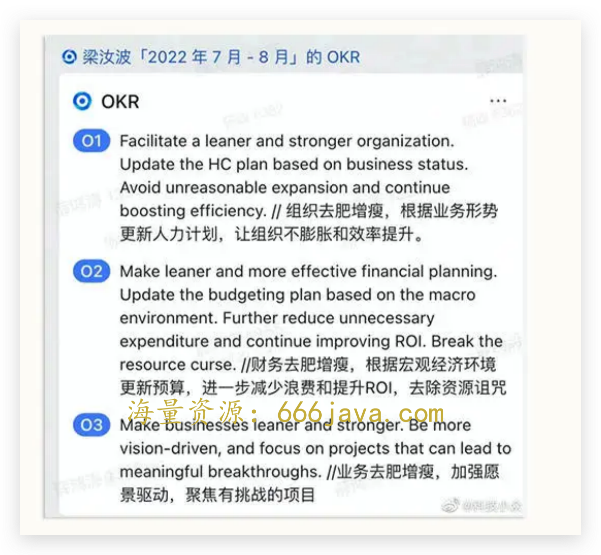

# 双周行业热点追踪-字节去肥增瘦，抖音爱奇艺联姻，每日优鲜破产

你好，我是雄峰。

我们在开篇词的时候讨论过，商业思维不仅需要我们在课堂之中用心学习，更要保持一颗非常旺盛的好奇心去不断探索，把工作和生活中看到的现象和问题，用讲解过的技巧去解构分析。

在学习完价值创造和部分商业洞察的板块之后，我相信你也已经跃跃欲试了。那么现在，这个分析的机会就来了。

我在课程中增加了 **双周行业热点追踪** 的活动，希望你能够把关于热点的一切分析和看法分享在评论区。当然，我先声明，双周目前还是个 Flag，也可能是三周？一个月？我会尽量以这样的频次为你带来热点汇总。

这不是一道练习，不是一场考试，更没有绝对的对与错，尝试切换角度，勇敢地分析商业世界，表达自己的所思所想吧。

第一次活动，我为你挑选了近两周的 3 个热点话题。这篇文章中包含了它们的来龙去脉，一些可以尝试思考的问题，以及后续思考必不可少的切入角度和材料。

那么接下来，咱们就先从第一个热点开始。

### **热点一：字节跳动将大幅压缩 2022-2023 年招聘计划**

7 月 21 日，从字节跳动内部人士处获悉，字节跳动 CEO 梁汝波近日更新个人 OKR。OKR 显示，字节跳动将根据业务形势更新人力计划，大幅降低 2022-2023 年招聘计划，降低组织规模增速，并提升组织效率。

据了解，梁汝波的 OKR 中并未明确招聘计划的压缩比例，但据字节跳动内部人士透露，此前公司内部已在强调组织去肥增瘦了。

- **可思考的问题**

为什么字节对组织、财务以及业务上，要进行去肥增瘦的动作？

如果你是字节的老板，你会对哪些业务进行去肥增瘦？

假设此刻，你就在字节，你会做何种决策选择？

- **分析的切入点**

可以使用此前讲解过的赛道法和换位法来分析；

可以参考人均产出收入、人均产出利润以及未来阶段的人均产出增量作为切入维度。

- **辅助材料**

[2020 年字节跳动专家会](https://wenku.baidu.com/view/04fadbf9b5360b4c2e3f5727a5e9856a561226a4.html)

[字节跳动公司的业务版图有多大？](https://zhuanlan.zhihu.com/p/272833751?ivk_sa=1024320u)

[字节去年收入约 3678 亿元：广告约 2500 亿，直播约 700 亿](https://baijiahao.baidu.com/s?id=1722554073825242764&wfr=spider&for=pc)

[06 \| 练习课：如何判断自己的业务是否靠谱？](https://time.geekbang.org/column/article/545373)

### **热点二：** 爱奇艺抖音达成合作，其中包含长视频二创合作

7 月 19 日，抖音发布公告，称其已经和爱奇艺达成了合作，未来将围绕长视频内容的二次创作与推广等方面展开探索。根据公告，爱奇艺将向抖音集团授权其内容资产中拥有信息网络传播权及转授权的长视频内容，用于短视频创作。双方对解说、混剪、拆条等短视频“二创”形态作出具体约定，将共同推动长视频内容知识产权的规范使用。

- **可思考的问题**

爱奇艺为什么要和抖音达成合作协议，并且是在 2022 年的时间点上？

这个合作达成对于双方的利弊又是什么？

从终局角度考虑，双方的合作会走向什么样的一个方向？

- **分析的切入点**

爱奇艺当前的盈利情况是怎么样的？可以从会员收入天花板的角度去思考；

抖音在面临行业竞争的时候，爱奇艺对抖音的价值是什么？

- **辅助材料**

[2021，爱奇艺无能为力。](https://m.thepaper.cn/newsDetail_forward_16353290)

[长视频战争：十年 1000 亿人民币，烧出了三家电视台。](https://zhuanlan.zhihu.com/p/328138029)

### **热点三：网传** 每日优鲜破产，大部分员工解散

7 月 28 日下午，每日优鲜召开内部 20 分钟线上会议。主要讲述了如下内容：

1. 由于此前公布的融资事件现在还协调，融资款尚未到账，公司财务出现一些问题；
2. 公司大部分员工工作时间将于 7 月 28 日截止，只留少数人员接管公司业务和处理后续事宜；
3. 被离职的公司员工，7 月社保公积金由每日优鲜缴纳，8 月由自己缴纳；
4. 目前每日优鲜员工社保公积金已经欠了 3 个月，现在在调拨资金，优先发放员工工资，想办法补上前三个月欠缴的公积金；
5. 在会议过程中，有员工问发言人 6 月份和 7 月份工资什么时候发，发言人表示她不是很清楚。

这次会议相当于线上宣布了公司解散。每日优鲜的倒下让市场并不意外。虽然今年上半年上海、北京疫情之下，其它生鲜电商如盒马鲜生、叮咚买菜、美团买菜等公司业务都开展得不错，有的甚至成为了在当地保供的重要力量，但是这些业务无一例外当下都是亏损的存在。

- **可思考的问题**

为什么前置仓业务都是亏损的存在，大家还在不断的尝试生鲜电商？

每日优鲜为什么先于上述的同行先倒下？

- **分析的切入点**

生鲜电商的盈利难点是什么？

相同模式下各家的策略又有什么不同？

- **辅助材料**

[每日优鲜大败局：生鲜电商还是一门好生意吗？](https://www.thepaper.cn/newsDetail_forward_19246384)

[07 \| 二维解构：社区团购为什么成为 20 年巨头必争的赛道？](https://time.geekbang.org/column/article/546060)

### 小结

好了，今天的热点内容梳理已经结束了。最后，我可以再给你一些提示。

如果对热点二没有分析思路，除了文章内提供的切入点和辅助材料，你也可以看看我们的 **课程目录**，把这次的双周行业热点追踪当作一次课程的预习。

想一想，第 11 课中， **“时间刻度”** 指的是什么？长视频和短视频平台的区别是什么？你在两类平台上对广告的印象有什么不同吗？这和它们的盈利有什么关系吗？

后续我会对三个热点的问题进行解答，不过现在还是你的时间。要知道，这些商业故事就这么真真切切地发生在我们身边，让我们一起迈出评论的第一步，也迈出更了解商业世界的一步吧。

期待你的犀利评论（和吐槽），我们建立了一个 [读者交流群](http://jinshuju.net/f/DuxzBi)，欢迎你的加入！如果你觉得有所收获，也可以把这节课分享给你的朋友一起学习。我们下节课见。
