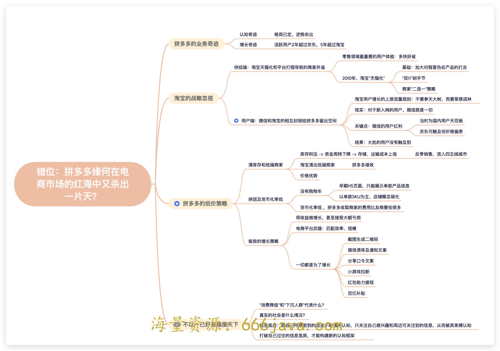
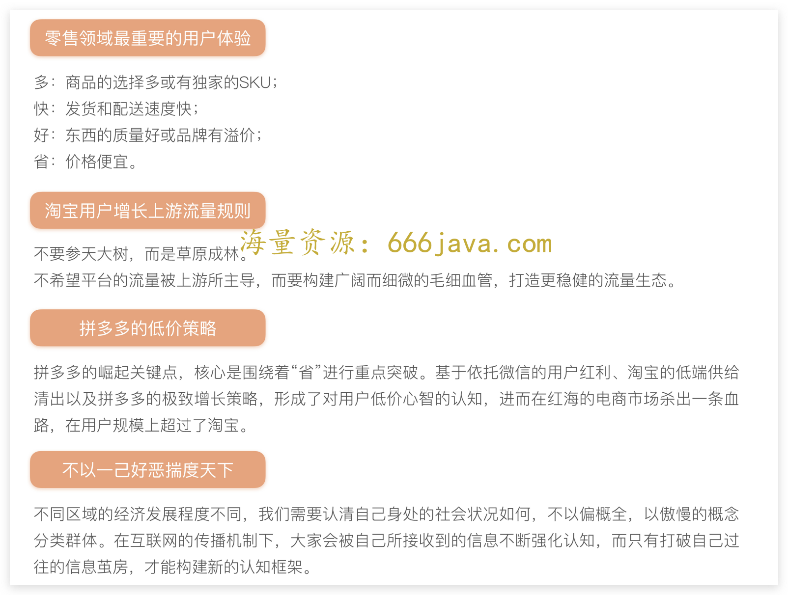
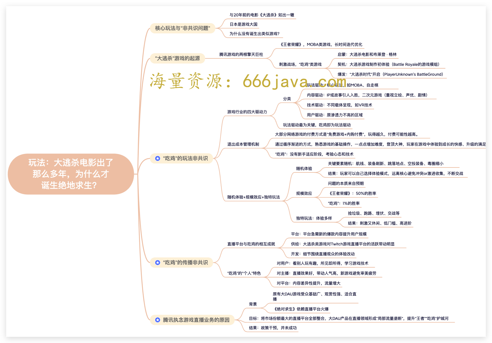
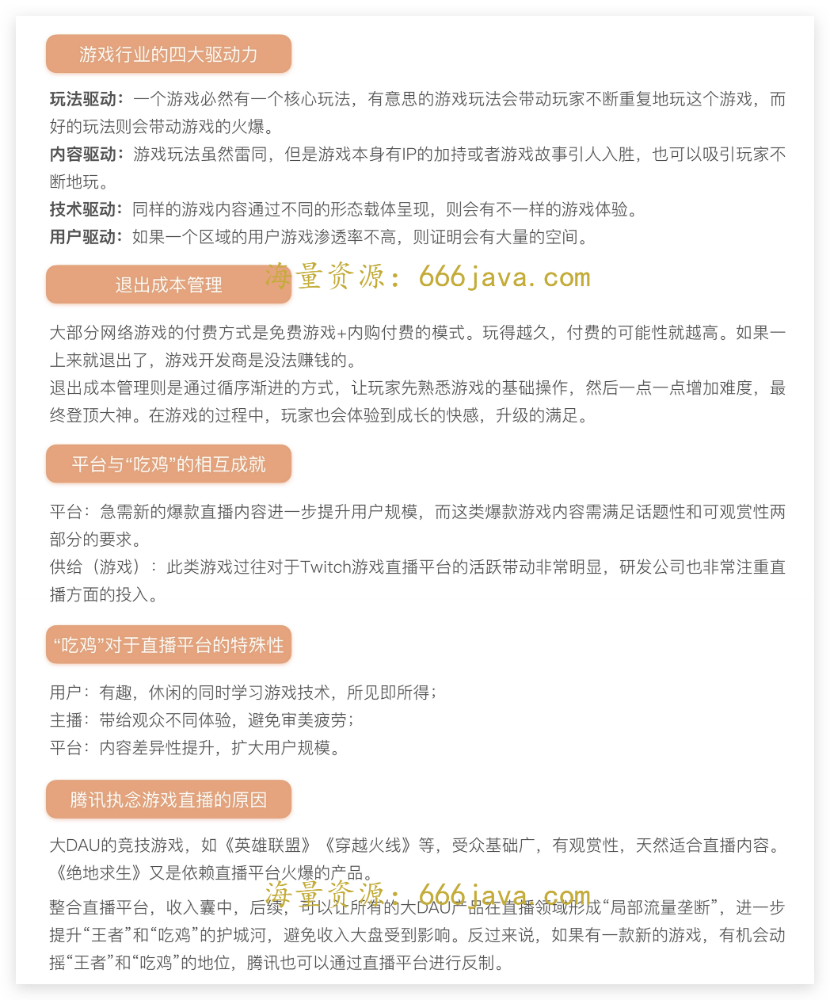
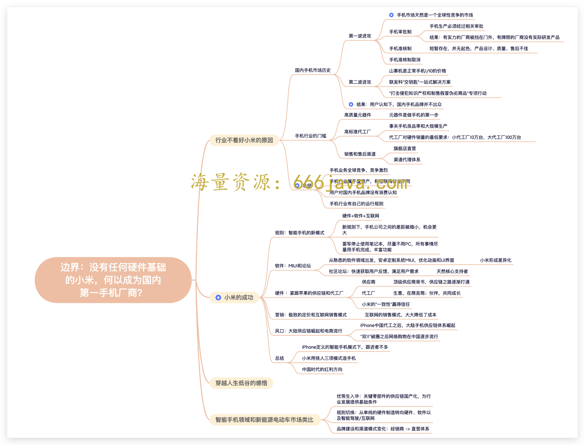
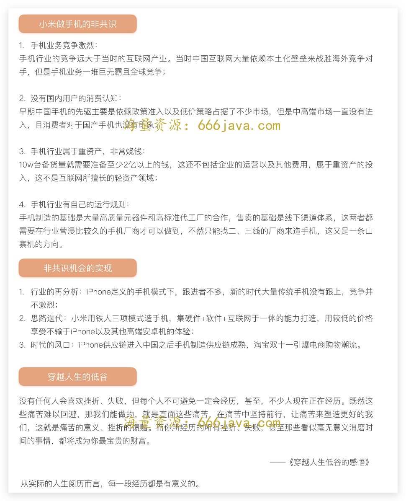

# 复习加餐-3 组图探寻非共识机会！

你好，我是晓蕾。

O2O 这节课是一个领域的大复盘，相信你已经有点疲惫了，这里我们插入一节复习课，回到“非共识机会”版块，看看这些机会都是怎么被挖掘出来的。

还记得什么是非共识机会吗？当一个行业的机会被大家都认为是机会的时候，那么它就不是机会，反其道而行说不定会有新的机会，非共识机会就是这么一个意思。

简单来说，非共识机会能够颠覆原有的行业规则，用违背直觉和行业惯性的方式去改造行业，这样做有争议、有风险且不被大多数人看好，但如果成功则会获得超额回报。

这个板块的设计逻辑非常有趣，先用拼多多的案例让我们拥有非共识的心态以看到更多的人群和机会，再在业务模式上有所突破，最后打破领域边界，给予我们实现非共识机会的勇气。

那接下来，我们就从拼多多开始复习吧！

## 放开心态：错位

> ……不理解这一点的人，就无法理解拼多多，不用常识去思考的人，也就无法理解拼多多，一个没有开放心态的人，又如何寻找非共识的机会呢？

问题分析： [拼多多缘何在电商市场的红海中又杀出一片天？](https://time.geekbang.org/column/article/573029)

思维导图：

重点卡片：

推荐阅读：

拼多多黄峥 [《第二封致股东信》](https://mp.weixin.qq.com/s/d0J4tM1m4v656FX4RF2m_g)

字节战略大神朱时雨 [《不以一己好恶来揣度天下》](https://mp.weixin.qq.com/s/tie4K-jAh3_9tkDUtpL81w)

## 尝试模式：玩法

> 《黑神话：悟空》没有花一分钱做推广，几个实机演示的游戏 PV 曝光，即引爆全网，形成了大量的传播。这个最划算的买量，也给了游戏发行从业者新的思考：下一个非共识的游戏发行机会在哪？

问题分析： [大逃杀电影出了那么多年，为什么才诞生绝地求生？](https://time.geekbang.org/column/article/573814)

思维导图：

重点卡片：

推荐阅读： [《专访〈绝地逃生〉开发商：贴近直播观众是成功关键，未来将与中国发行商合作》](https://youxiputao.com/articles/12318)

## 打破领域：边界

> 在小米成功之后，中国互联网涌现出了一批互联网手机品牌，知名的有华为的荣耀、锤子、360 特供机，不知名的有小辣椒、大可乐等。大家纷纷摸着小米过河，用互联网的方式杀入智能手机领域，从而有了今天我们看到的各式各样、好用又便宜的安卓手机。

问题分析：

[边界（上）：没有任何硬件基础的小米，为什么可以成为国内第一手机厂商？](https://time.geekbang.org/column/article/574545)

[边界（下）：没有任何硬件基础的小米，为什么可以成为国内第一手机厂商？](https://time.geekbang.org/column/article/575473)

思维导图：

重点卡片：

推荐阅读：

[《2022 雷军年度演讲全文：穿越人生低谷的感悟》](https://mp.weixin.qq.com/s/1uj6d9yY2wFKuqQXNzV4-g)

好了，这次的复习就到这里啦！更多版块复习链接如下：

[复习加餐｜ 4 组图看懂价值创造！](https://time.geekbang.org/column/article/577722)

[复习加餐｜ 5 组图读懂商业洞察！](https://time.geekbang.org/column/article/577985)

[复习加餐｜ 5 组图摸透非规律世界！](https://time.geekbang.org/column/article/578240)

你可以用我们在练习课中提到过的 [费曼学习法](https://time.geekbang.org/column/article/576925) 的思路，从课程的标题切入，尝试通过思维导图串起来这节课的内容。也欢迎你把每节课相应的知识卡片保存下来，时常复习。

最后，关于专栏和复习形式，如果你有什么建议或更好的想法，也欢迎分享在留言区，我一定会关注。如果你觉得这门课对你有所帮助的话，欢迎你把课程分享给同事或朋友，我们共同学习进步！
