# 复习加餐-5 组图读懂商业洞察！

<audio controls="" title="复习加餐-5组图读懂商业洞察！">
  <source
    id="mp3"
    src="/mp3/business-thinking/复习加餐-5组图读懂商业洞察！.mp3"
  />
</audio>

你好，我是晓蕾。

今天我们一起来复习一下“商业洞察”板块部分的内容。

还记得我们在导读说过什么是商业洞察力吗？所谓商业洞察力，就是要透过表象，看清楚行业各要素之间的结构关系，为产品和服务的优化找到可行的策略。有商业洞察力的人，可以直击业务本质，一针见血地找出问题并提出优化建议。

从这个板块开始，案例的体量就开始增加了，除去案例本身，曹老板也加入了一些社会现象的解读。不过不要紧，这次复习同样包含了思维导图和重点内容的图片，一张梳理思路，一张重点理解，绝对能让你的复习事半功倍。

好了，接下来就是你的时间了，快从从社区团购的案例开始复习吧！

## 二维解构

> 冗长的供应链也是维系就业稳定民生的关键，在企业发展的基础上，一定要承担更多的社会责任和外部影响。

问题分析： [社区团购为什么成为 20 年巨头必争的赛道？](https://time.geekbang.org/column/article/546060)

思维导图：

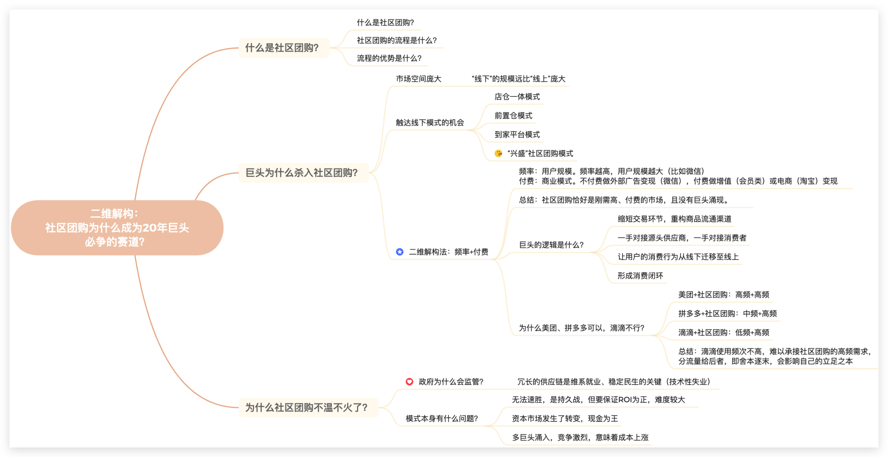

重点卡片：

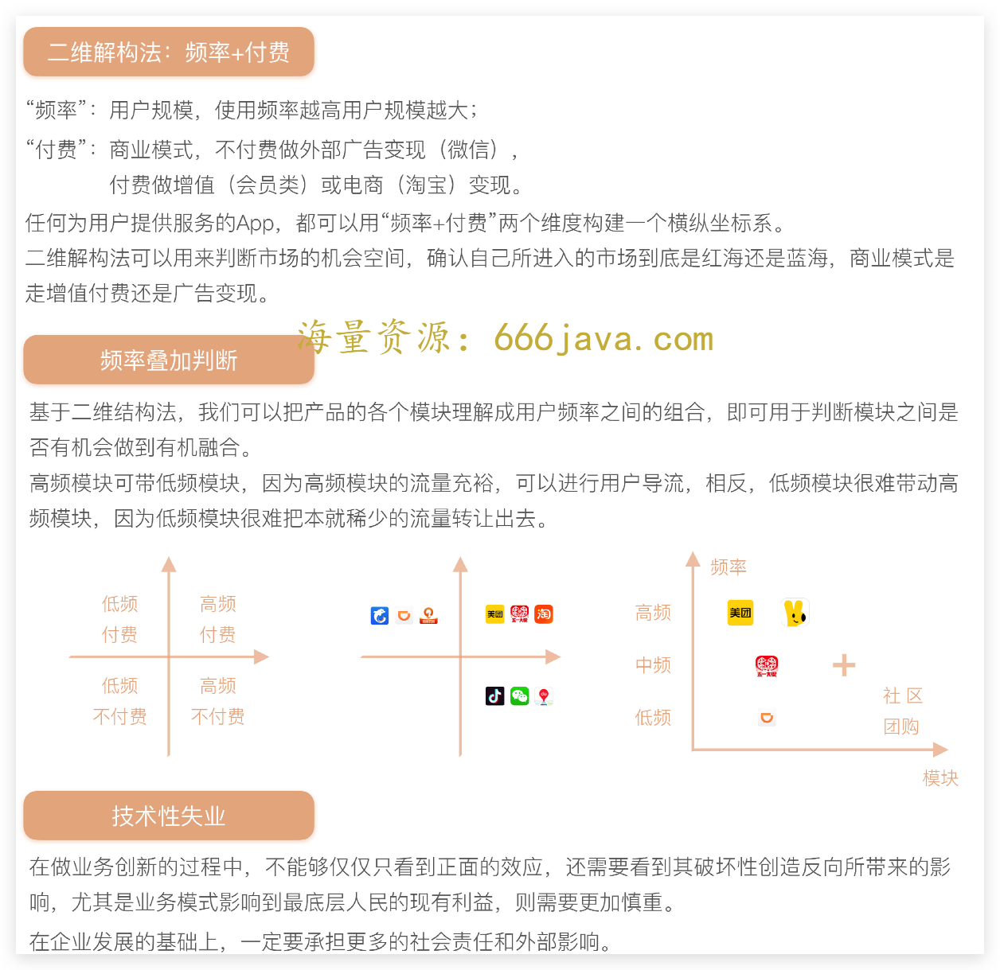

推荐拓展阅读： [《双周行业热点评论｜字节去肥增瘦，抖音爱奇艺联姻，每日优鲜破产》](https://time.geekbang.org/column/article/554629)

## 二八法则

> 80%用户的 80%需求，是高频产品需求，这类产品适合做广告变现。20%用户 80%的需求，是低频产品需求，这类产品适合做付费变现，前提是内容高质且独家。

问题切入与分析回顾： [为什么 Flipboard 等免费精品阅读领域做不大呢？](https://time.geekbang.org/column/article/546770)

思维导图：

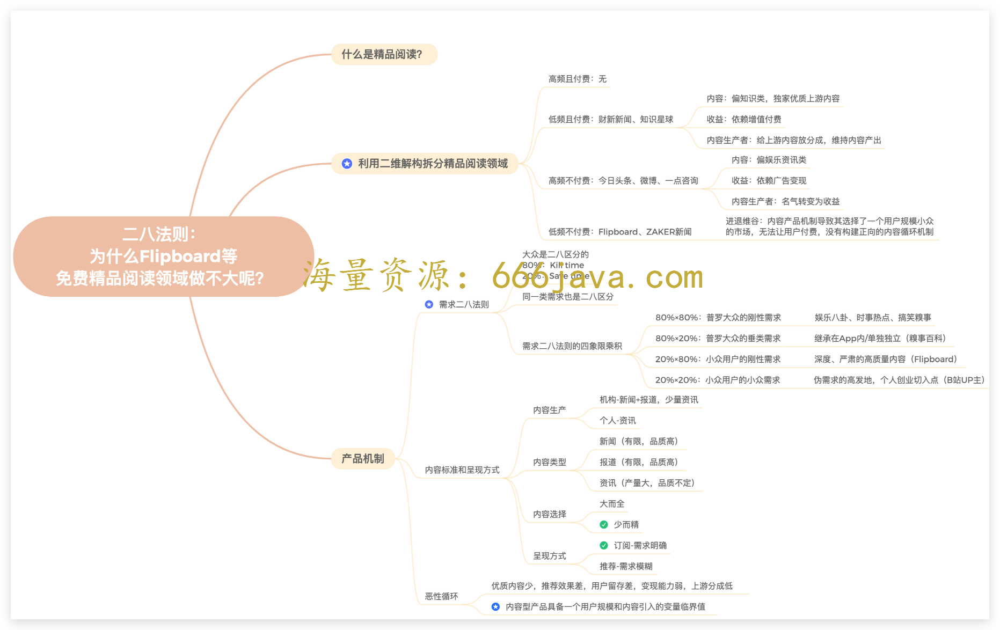

重点卡片：

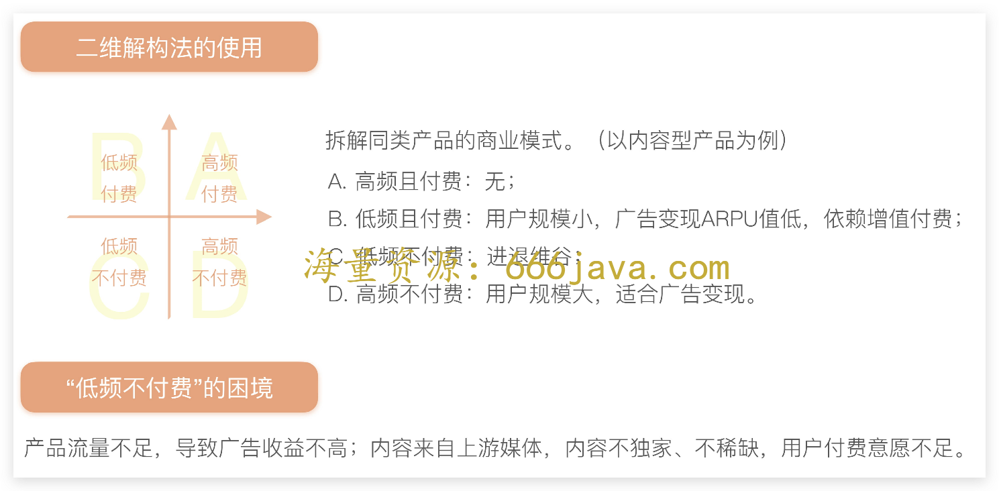

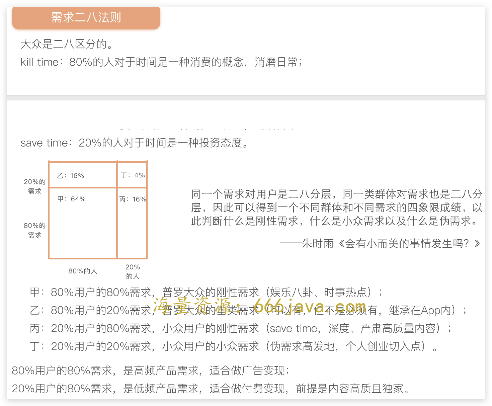

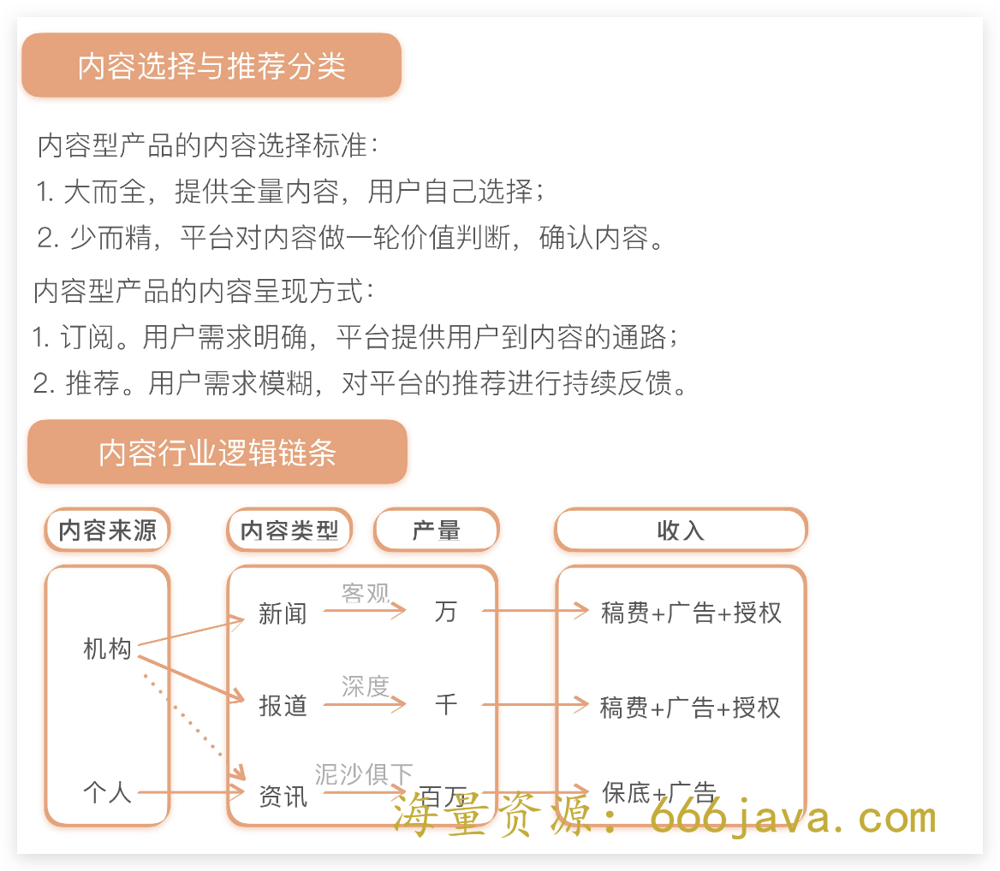

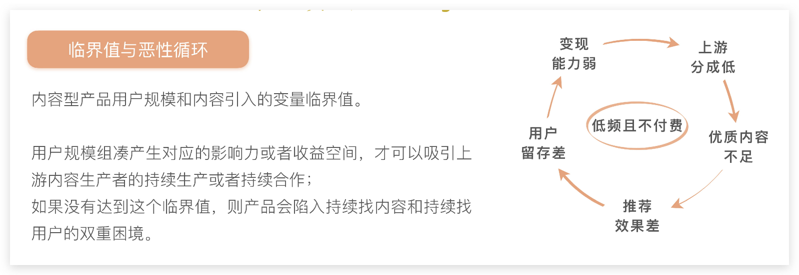

推荐拓展阅读：

[《会有小而美的事情发生吗》](https://mp.weixin.qq.com/s/lc5i1Pz6LXiI6kokTp_9lQ)

## 盐铁官营

> 厂商通过底层权限限制准入，把高收入、高利润的产业收归“国有”，从而实现高额利润。但是，如果硬件业务不行了，那相对应的互联网业务的变现天花板又在哪里呢？

问题切入与分析回顾： [手机厂商为什么可以在移动互联网时代闷声发大财？](https://time.geekbang.org/column/article/548476)

思维导图：

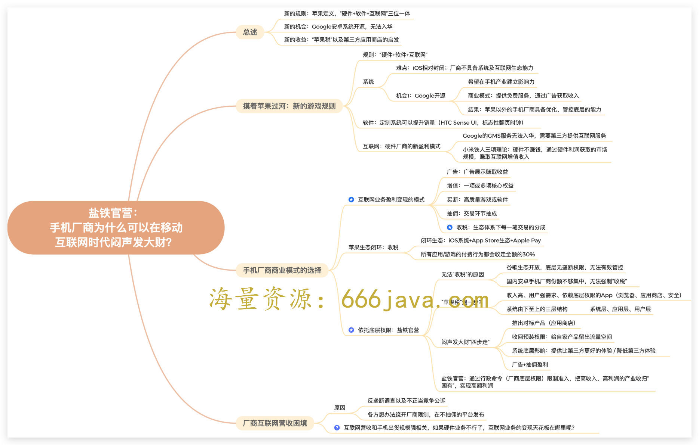

重点卡片：

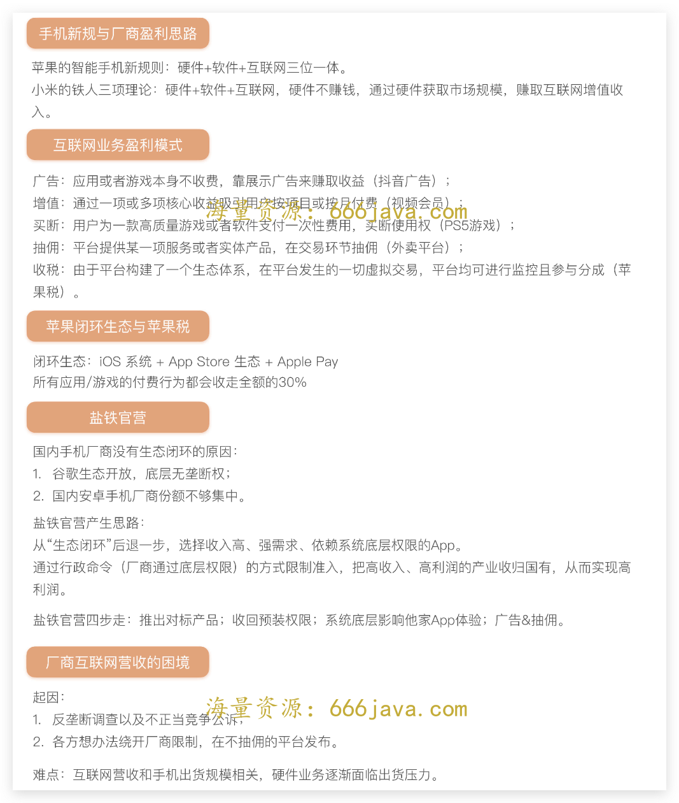

推荐拓展阅读：

[《规则：豌豆荚做不起来应用内搜索？》](https://time.geekbang.org/column/article/559278)

[《边界：没有任何硬件基础的小米，为什么可以成为国内第一手机厂商？》](https://time.geekbang.org/column/article/575473)

## 分层运营

> 研究市场、形成认知、找到对手致命错误、给出解决方案。通过某种维度对市场、商家或者用户分层，实现收益最大化。任何同时拥有供给端和用户端的平台型业务都可以运用分层运营的思路。

问题切入与分析回顾： [为什么外卖市场上美团可以后发制人？](https://time.geekbang.org/column/article/549599)

思维导图：

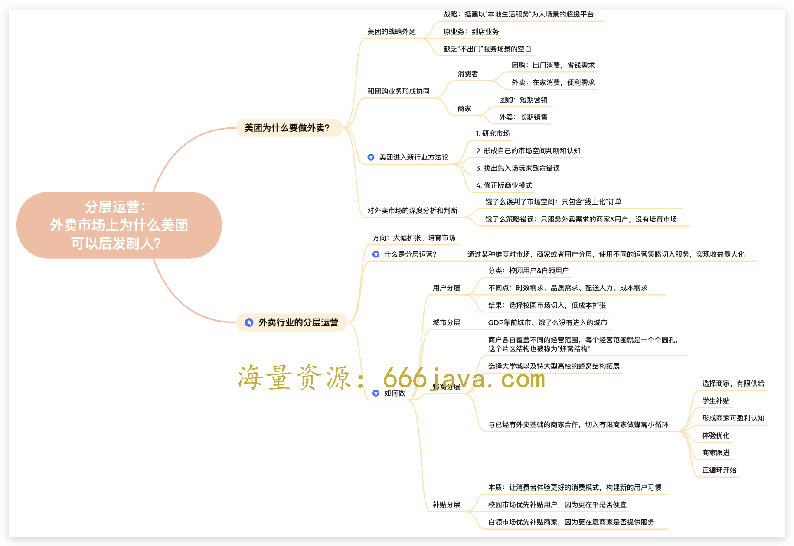

重点卡片：

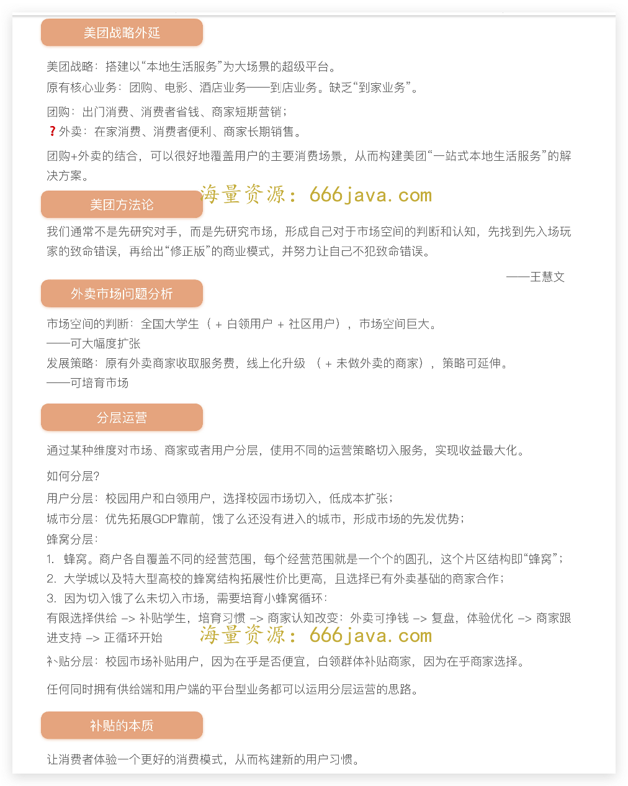

推荐拓展阅读：

[《资本（上）：为什么杨浩涌二次创业一定要融大钱？》](https://time.geekbang.org/column/article/560747)（补贴相关）

## 时间刻度

> 时间刻度可以用来衡量广告业务的潜力空间。一般来说，长视频领域，会员模式的收入会高于广告模式的收入。但是，会员模式真的就可以解决一切问题了吗？

问题切入与分析回顾：

[为什么优酷土豆会从行业第一下滑到行业第三？（上）](https://time.geekbang.org/column/article/550504)

[为什么优酷土豆会从行业第一下滑到行业第三？（下）](https://time.geekbang.org/column/article/551301)

思维导图：

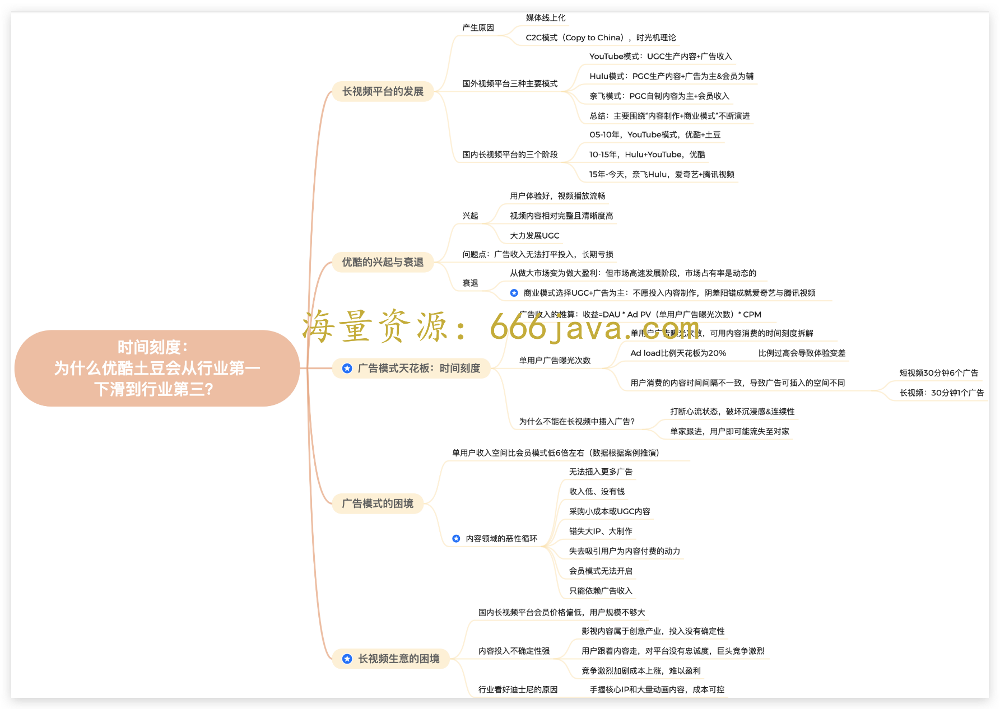

重点卡片：

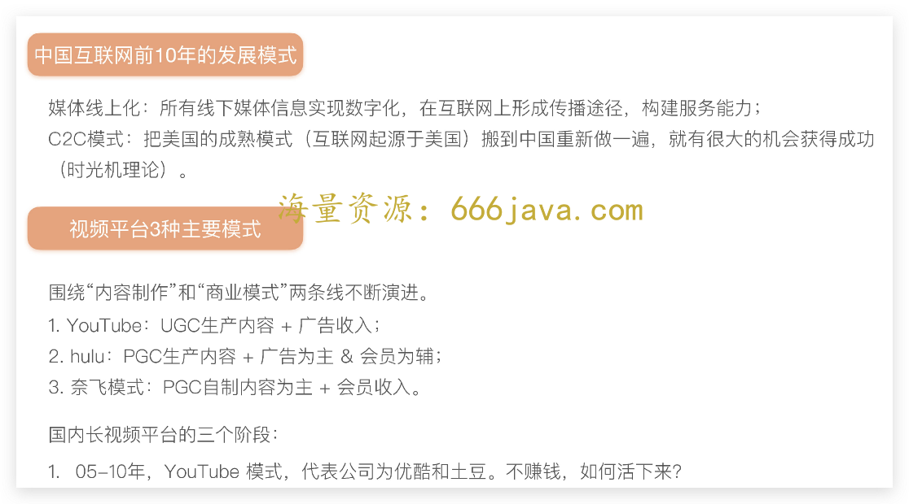

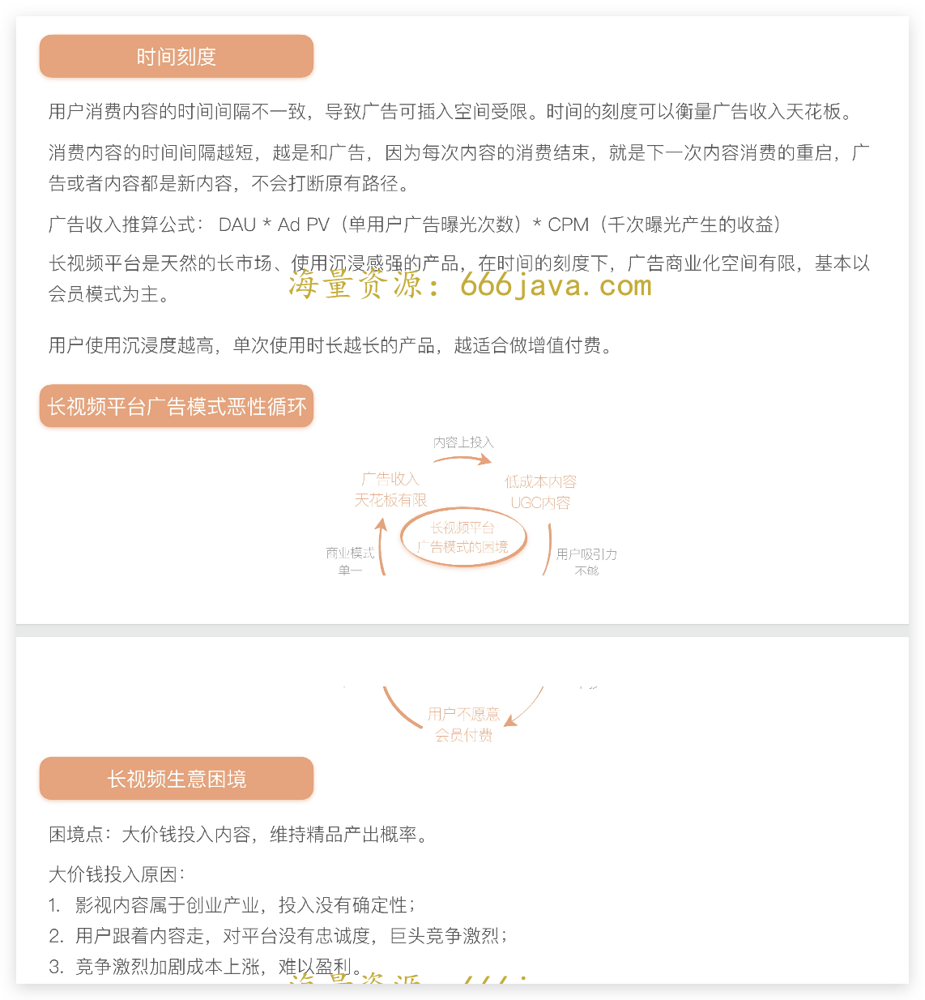

推荐拓展阅读：

[《双周行业热点评论｜字节去肥增瘦，抖音爱奇艺联姻，每日优鲜破产》](https://time.geekbang.org/column/article/554629)

最后，如果关于专栏，你有什么建议或更好的想法，也欢迎你分享在留言区，我一定会关注。

最后的最后，如果你觉得这门课对你有所帮助的话，欢迎你把课程分享给同事或朋友，我们共同学习进步！
