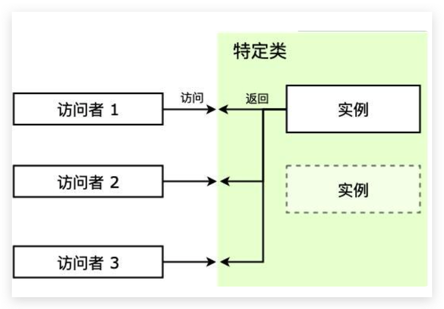

# 07-单例模式：游戏的存档


> 既然我已经踏上这条道路，那么，任何东西都不应妨碍我沿着这条路走下去。 ——康德

单例模式可能是设计模式里面最简单的模式了，虽然简单，但在我们日常生活和编程中却经常接触到，本节我们一起来学习一下。

**单例模式** （Singleton Pattern）又称为单体模式，保证一个类只有一个实例，并提供一个访问它的全局访问点。也就是说，第二次使用同一个类创建新对象的时候，应该得到与第一次创建的对象完全相同的对象。

> **注意：** 本文可能用到一些编码技巧比如 [IIFE](https://developer.mozilla.org/zh-CN/docs/Glossary/立即执行函数表达式)（Immediately Invoked Function Expression, 立即调用函数表达式），ES6 的语法 [let/const](http://es6.ruanyifeng.com/#docs/let) ，[短路运算符](https://juejin.im/post/5b51e5d3f265da0f4861143c#heading-5)，[Proxy](http://es6.ruanyifeng.com/#docs/proxy)，[Reflect](http://es6.ruanyifeng.com/#docs/reflect) 等，如果还没接触过可以点击链接稍加学习 ~

## 1. 你曾经遇见过的单例模式

当我们在电脑上玩经营类的游戏，经过一番眼花缭乱的骚操作好不容易走上正轨，夜深了我们去休息，第二天打开电脑，发现要从头玩，立马就把电脑扔窗外了，所以一般希望从前一天的进度接着打，这里就用到了存档。每次玩这游戏的时候，我们都希望拿到同一个存档接着玩，这就是属于单例模式的一个实例。

编程中也有很多对象我们只需要唯一一个，比如数据库连接、线程池、配置文件缓存、浏览器中的 window/document 等，如果创建多个实例，会带来资源耗费严重，或访问行为不一致等情况。

类似于数据库连接实例，我们可能频繁使用，但是创建它所需要的开销又比较大，这时只使用一个数据库连接就可以节约很多开销。一些文件的读取场景也类似，如果文件比较大，那么文件读取就是一个比较重的操作。比如这个文件是一个配置文件，那么完全可以将读取到的文件内容缓存一份，每次来读取的时候访问缓存即可，这样也可以达到节约开销的目的。

在类似场景中，这些例子有以下特点：

1. 每次访问者来访问，返回的都是同一个实例；
2. 如果一开始实例没有创建，那么这个特定类需要自行创建这个实例；

## 2. 实例的代码实现

如果你是一个前端er，那么你肯定知道浏览器中的 [window](https://developer.mozilla.org/zh-CN/docs/Web/API/Window) 和 [document](https://developer.mozilla.org/zh-CN/docs/Web/API/Document) 全局变量，这两个对象都是单例，任何时候访问他们都是一样的对象，`window` 表示包含 DOM 文档的窗口，`document` 是窗口中载入的 DOM 文档，分别提供了各自相关的方法。

在 ES6 新增语法的 Module 模块特性，通过 `import/export` 导出模块中的变量是单例的，也就是说，如果在某个地方改变了模块内部变量的值，别的地方再引用的这个值是改变之后的。除此之外，项目中的全局状态管理模式 Vuex、Redux、MobX 等维护的全局状态，vue-router、react-router 等维护的路由实例，在单页应用的单页面中都属于单例的应用（但不属于单例**模式**的应用）。

在 JavaScript 中使用字面量方式创建一个新对象时，实际上没有其他对象与其类似，因为新对象已经是单例了：

```javascript
{ a: 1 } === { a: 1 } 		// false
```

那么问题来了，如何对构造函数使用 `new` 操作符创建多个对象时，仅获取同一个单例对象呢。

对于刚刚打经营游戏的例子，我们可以用 JavaScript 来实现一下：

```javascript
function ManageGame() {
    if (ManageGame._schedule) {        // 判断是否已经有单例了
        return ManageGame._schedule
    }
    ManageGame._schedule = this
}

ManageGame.getInstance = function() {
    if (ManageGame._schedule) {        // 判断是否已经有单例了
        return ManageGame._schedule
    }
    return ManageGame._schedule = new ManageGame()
}

const schedule1 = new ManageGame()
const schedule2 = ManageGame.getInstance()

console.log(schedule1 === schedule2)
```

稍微解释一下，这个构造函数在内部维护（或者直接挂载自己身上）一个实例，第一次执行 `new` 的时候判断这个实例有没有创建过，创建过就直接返回，否则走创建流程。我们可以用 ES6 的 class 语法改造一下：

```javascript
class ManageGame {
    static _schedule = null
    
    static getInstance() {
        if (ManageGame._schedule) {        // 判断是否已经有单例了
            return ManageGame._schedule
        }
        return ManageGame._schedule = new ManageGame()
    }
    
    constructor() {
        if (ManageGame._schedule) {        // 判断是否已经有单例了
            return ManageGame._schedule
        }
        ManageGame._schedule = this
    }
}

const schedule1 = new ManageGame()
const schedule2 = ManageGame.getInstance()

console.log(schedule1 === schedule2)	// true
```

上面方法的缺点在于维护的实例作为静态属性直接暴露，外部可以直接修改。

## 3. 单例模式的通用实现

根据上面的例子提炼一下单例模式，游戏可以被认为是一个特定的类（Singleton），而存档是单例（instance），每次访问特定类的时候，都会拿到同一个实例。主要有下面几个概念：

1. **Singleton** ：特定类，这是我们需要访问的类，访问者要拿到的是它的实例；
2. **instance** ：单例，是特定类的实例，特定类一般会提供 `getInstance` 方法来获取该单例；
3. **getInstance** ：获取单例的方法，或者直接由 `new` 操作符获取；

这里有几个实现点要关注一下：

1. 访问时始终返回的是同一个实例；
2. 自行实例化，无论是一开始加载的时候就创建好，还是在第一次被访问时；
3. 一般还会提供一个 `getInstance` 方法用来获取它的实例；

结构大概如下图：



下面使用通用的方法来实现一下。

### 3.1 IIFE 方式创建单例模式

简单实现中，我们提到了缺点是实例会暴露，那么这里我们首先使用立即调用函数 IIFE 将不希望公开的单例实例 `instance` 隐藏。

> 当然也可以使用构造函数复写将闭包进行的更彻底，具体代码参看 [Github 仓库地址](https://github.com/SHERlocked93/imooc-frontend-design-pattern/blob/master/07-单例模式/07-06.singleton overwrite 构造函数复写方式.js)，这里就不贴了。

```javascript
const Singleton = (function() {
  let _instance = null        // 存储单例

  const Singleton = function() {
    if (_instance) return _instance     // 判断是否已有单例
    _instance = this
    this.init()                         // 初始化操作
    return _instance
  }

  Singleton.prototype.init = function() {
    this.foo = 'Singleton Pattern'
  }

    return Singleton
})()

const visitor1 = new Singleton()
const visitor2 = new Singleton()

console.log(visitor1 === visitor2)	// true
```

这样一来，虽然仍使用一个变量 `_instance` 来保存单例，但是由于在闭包的内部，所以外部代码无法直接修改。

在这个基础上，我们可以继续改进，增加 `getInstance` 静态方法：

```javascript
const Singleton = (function() {
  let _instance = null        // 存储单例

  const Singleton = function() {
    if (_instance) return _instance     // 判断是否已有单例
    _instance = this
    this.init()                         // 初始化操作
    return _instance
  }

  Singleton.prototype.init = function() {
    this.foo = 'Singleton Pattern'
  }

  Singleton.getInstance = function() {
    if (_instance) return _instance
    _instance = new Singleton()
    return _instance
  }

  return Singleton
})()

const visitor1 = new Singleton()
const visitor2 = new Singleton()         // 既可以 new 获取单例
const visitor3 = Singleton.getInstance() // 也可以 getInstance 获取单例

console.log(visitor1 === visitor2)	// true
console.log(visitor1 === visitor3)	// true
```

代价和上例一样是闭包开销，并且因为 IIFE 操作带来了额外的复杂度，让可读性变差。

IIFE 内部返回的 `Singleton` 才是我们真正需要的单例的构造函数，外部的 `Singleton` 把它和一些单例模式的创建逻辑进行了一些封装。

IIFE 方式除了直接返回一个方法/类实例之外，还可以通过模块模式的方式来进行，就不贴代码了，代码实现在 [Github 仓库](https://github.com/SHERlocked93/imooc-frontend-design-pattern/blob/20190625/07-单例模式/07-08.singleton 模块模式方式.js) 中，读者可以自己瞅瞅。

### 3.2 块级作用域方式创建单例

IIFE 方式本质还是通过函数作用域的方式来隐藏内部作用域的变量，有了 ES6 的 let/const 之后，可以通过 `{ }` 块级作用域的方式来隐藏内部变量：

```javascript
let getInstance
{
  let _instance = null        // 存储单例

  const Singleton = function() {
    if (_instance) return _instance     // 判断是否已有单例
    _instance = this
    this.init()                         // 初始化操作
    return _instance
  }

  Singleton.prototype.init = function() {
    this.foo = 'Singleton Pattern'
  }

  getInstance = function() {
    if (_instance) return _instance
    _instance = new Singleton()
    return _instance
  }
}

const visitor1 = getInstance()
const visitor2 = getInstance()

console.log(visitor1 === visitor2)

// 输出: true
```

怎么样，是不是对块级作用域的理解更深了呢～

### 3.3 单例模式赋能

之前的例子中，单例模式的创建逻辑和原先这个类的一些功能逻辑（比如 `init` 等操作）混杂在一起，根据**单一职责原则**，这个例子我们还可以继续改进一下，将单例模式的创建逻辑和特定类的功能逻辑拆开，这样功能逻辑就可以和正常的类一样。

```javascript
/* 功能类 */
class FuncClass {
  constructor(bar) { 
    this.bar = bar
    this.init()
  }

  init() {
    this.foo = 'Singleton Pattern'
  }
}

/* 单例模式的赋能类 */
const Singleton = (function() {
  let _instance = null        // 存储单例

  const ProxySingleton = function(bar) {
    if (_instance) return _instance     // 判断是否已有单例
    _instance = new FuncClass(bar)
    return _instance
  }

  ProxySingleton.getInstance = function(bar) {
    if (_instance) return _instance
    _instance = new Singleton(bar)
    return _instance
  }

  return ProxySingleton
})()

const visitor1 = new Singleton('单例1')
const visitor2 = new Singleton('单例2')
const visitor3 = Singleton.getInstance()

console.log(visitor1 === visitor2)	// true
console.log(visitor1 === visitor3)	// true
```

这样的单例模式赋能类也可被称为**代理类**，将业务类和单例模式的逻辑解耦，把单例的创建逻辑抽象封装出来，有利于业务类的扩展和维护。代理的概念我们将在后面**代理模式**的章节中更加详细地探讨。

使用类似的概念，配合 ES6 引入的 `Proxy` 来拦截默认的 `new` 方式，我们可以写出更简化的单例模式赋能方法：

```javascript
/* Person 类 */
class Person {
  constructor(name, age) {
    this.name = name
    this.age = age
  }
}

/* 单例模式的赋能方法 */
function Singleton(FuncClass) {
  let _instance
  return new Proxy(FuncClass, {
    construct(target, args) {
      return _instance || (_instance = Reflect.construct(FuncClass, args)) // 使用 new FuncClass(...args) 也可以
    }
  })
}

const PersonInstance = Singleton(Person)

const person1 = new PersonInstance('张小帅', 25)
const person2 = new PersonInstance('李小美', 23)

console.log(person1 === person2)	// true
```

## 4. 惰性单例、懒汉式-饿汉式

有时候一个实例化过程比较耗费性能的类，但是却一直用不到，如果一开始就对这个类进行实例化就显得有些浪费，那么这时我们就可以使用**惰性创建**，即延迟创建该类的单例。之前的例子都属于惰性单例，实例的创建都是 `new` 的时候才进行。

惰性单例又被成为**懒汉式**，相对应的概念是**饿汉式**：

- 懒汉式单例是在使用时才实例化
- 饿汉式是当程序启动时或单例模式类一加载的时候就被创建。

我们可以举一个简单的例子比较一下：

```js
class FuncClass {
  constructor() { this.bar = 'bar' }
}

// 饿汉式
const HungrySingleton = (function() {
    const _instance = new FuncClass()
    
    return function() {
      return _instance
    }
})()

// 懒汉式
const LazySingleton = (function() {
  let _instance = null
    
  return function() {
    return _instance || (_instance = new FuncClass())
  }
})()

const visitor1 = new HungrySingleton()
const visitor2 = new HungrySingleton()
const visitor3 = new LazySingleton()
const visitor4 = new LazySingleton()

console.log(visitor1 === visitor2)	// true
console.log(visitor3 === visitor4)	// true
```

可以打上 `debugger` 在控制台中看一下，饿汉式在 `HungrySingleton` 这个 IIFE 执行的时候就进入到 `FuncClass` 的实例化流程了，而懒汉式的 `LazySingleton` 中 `FuncClass` 的实例化过程是在第一次 `new` 的时候才进行的。

惰性创建在实际开发中使用很普遍，了解一下对以后的开发工作很有帮助。

## 5. 源码中的单例模式

以 ElementUI 为例，ElementUI 中的全屏 Loading 蒙层调用有两种形式：

```javascript
// 1. 指令形式
Vue.use(Loading.directive)
// 2. 服务形式
Vue.prototype.$loading = service
```

1. 上面的是指令形式注册，使用的方式 `<div :v-loading.fullscreen="true">...</div>`；
2. 下面的是服务形式注册，使用的方式 `this.$loading({ fullscreen: true })`；

用服务方式使用全屏 Loading 是单例的，即在前一个全屏 Loading 关闭前再次调用全屏 Loading，并不会创建一个新的 Loading 实例，而是返回现有全屏 Loading 的实例。

下面我们可以看看 ElementUI 2.9.2 的[源码](https://github.com/ElemeFE/element/blob/v2.9.2/packages/loading/src/index.js)是如何实现的，为了观看方便，省略了部分代码：

```javascript
import Vue from 'vue'
import loadingVue from './loading.vue'

const LoadingConstructor = Vue.extend(loadingVue)

let fullscreenLoading

const Loading = (options = {}) => {
  if (options.fullscreen && fullscreenLoading) {
    return fullscreenLoading
  }

  let instance = new LoadingConstructor({
    el: document.createElement('div'),
    data: options
  })

  if (options.fullscreen) {
    fullscreenLoading = instance
  }
  return instance
}

export default Loading
```

这里的单例是 `fullscreenLoading`，是存放在闭包中的，如果用户传的 `options` 的 `fullscreen` 为 true 且已经创建了单例的情况下则回直接返回之前创建的单例，如果之前没有创建过，则创建单例并赋值给闭包中的 `fullscreenLoading` 后返回新创建的单例实例。

这是一个典型的单例模式的应用，通过复用之前创建的全屏蒙层单例，不仅减少了实例化过程，而且避免了蒙层叠加蒙层出现的底色变深的情况。

## 6. 单例模式的优缺点

单例模式主要解决的问题就是**节约资源，保持访问一致性**。

简单分析一下它的**优点**：

1. 单例模式在创建后在内存中只存在一个实例，节约了内存开支和实例化时的性能开支，特别是需要重复使用一个创建开销比较大的类时，比起实例不断地销毁和重新实例化，单例能节约更多资源，比如数据库连接；
2. 单例模式可以解决对资源的多重占用，比如写文件操作时，因为只有一个实例，可以避免对一个文件进行同时操作；
3. 只使用一个实例，也可以减小垃圾回收机制 GC（Garbage Collecation） 的压力，表现在浏览器中就是系统卡顿减少，操作更流畅，CPU 资源占用更少；

单例模式也是有**缺点**的

1. 单例模式对扩展不友好，一般**不容易扩展**，因为单例模式一般自行实例化，没有接口；
2. **与单一职责原则冲突**，一个类应该只关心内部逻辑，而不关心外面怎么样来实例化；

## 7. 单例模式的使用场景

那我们应该在什么场景下使用单例模式呢：

1. 当一个类的**实例化过程消耗的资源过多**，可以使用单例模式来避免性能浪费；
2. 当项目中需要一个公共的状态，那么需要使用单例模式来**保证访问一致性**；