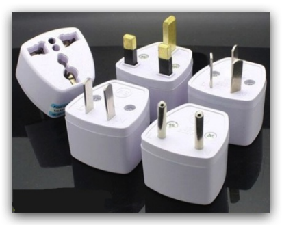
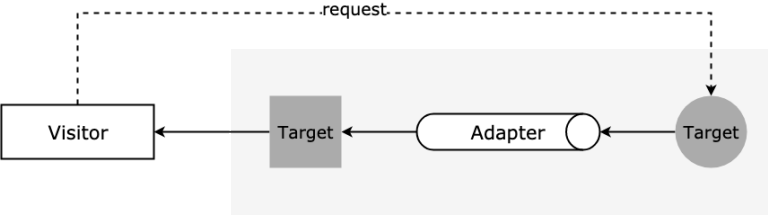

# 13-**适配器模式：电源适配器**


> 没有智慧的头脑，就像没有蜡烛的灯笼。 —— 托尔斯泰

**适配器模式**（Adapter Pattern）又称包装器模式，将一个类（对象）的接口（方法、属性）转化为用户需要的另一个接口，解决类（对象）之间接口不兼容的问题。

主要功能是进行**转换匹配**，目的是复用已有的功能，而不是来实现新的接口。也就是说，访问者需要的功能应该是已经实现好了的，不需要适配器模式来实现，适配器模式主要是负责把不兼容的接口转换成访问者期望的格式而已。

> **注意：** 本文用到 ES6 的语法 [let/const](http://es6.ruanyifeng.com/#docs/let) 、[Class](http://es6.ruanyifeng.com/#docs/class)、[解构赋值](http://es6.ruanyifeng.com/#docs/destructuring)、[函数参数的默认值](http://es6.ruanyifeng.com/#docs/function) 等，如果还没接触过可以点击链接稍加学习 ~

## 1. 你曾见过的适配器模式

现实生活中我们会遇到形形色色的适配器，最常见的就是转接头了，比如不同规格电源接口的转接头、iPhone 手机的 3.5 毫米耳机插口转接头、DP/miniDP/HDMI/DVI/VGA 等视频转接头、电脑、手机、ipad 的电源适配器，都是属于适配器的范畴。



还有一个比较典型的翻译官场景，比如老板张三去国外谈合作，带了个翻译官李四，那么李四就是作为讲不同语言的人之间交流的适配器 ?，老板张三的话的内容含义没有变化，翻译官将老板的话转换成国外客户希望的形式。

在类似场景中，这些例子有以下特点：

1. 旧有接口格式已经不满足现在的需要；
2. 通过增加适配器来更好地使用旧有接口；

## 2. 适配器模式的实现

我们可以实现一下电源适配器的例子，一开始我们使用的中国插头标准：

```javascript
var chinaPlug = {
  type: '中国插头',
  chinaInPlug() {
    console.log('开始供电')
  },
}

chinaPlug.chinaInPlug()
// 输出：开始供电
```

但是我们出国旅游了，到了日本，需要增加一个日本插头到中国插头的电源适配器，来将我们原来的电源线用起来：

```javascript
var chinaPlug = {
  type: '中国插头',
  chinaInPlug() {
    console.log('开始供电')
  },
}

var japanPlug = {
  type: '日本插头',
  japanInPlug() {
    console.log('开始供电')
  },
}

/* 日本插头电源适配器 */
function japanPlugAdapter(plug) {
  return {
    chinaInPlug() {
      return plug.japanInPlug()
    },
  }
}

japanPlugAdapter(japanPlug).chinaInPlug()
// 输出：开始供电
```

由于适配器模式的例子太简单，如果希望看更多的实战相关应用，可以看下一个小节。

适配器模式的原理大概如下图：



访问者需要目标对象的某个功能，但是这个对象的接口不是自己期望的，那么通过适配器模式对现有对象的接口进行包装，来获得自己需要的接口格式。

## 3. 适配器模式在实战中的应用

适配器模式在日常开发中还是比较频繁的，其实可能你已经使用了，但却不知道原来这就是适配器模式啊。 ?

我们可以推而广之，适配器可以将新的软件实体适配到老的接口，也可以将老的软件实体适配到新的接口，具体如何来进行适配，可以根据具体使用场景来灵活使用。

### 3.1 jQuery.ajax 适配 Axios

有的使用 jQuery 的老项目使用 `$.ajax` 来发送请求，现在的新项目一般使用 Axios，那么现在有个老项目的代码中全是 `$.ajax`，如果你挨个修改，那么 bug 可能就跟地鼠一样到处冒出来让你焦头烂额，这时可以采用适配器模式来将老的使用形式适配到新的技术栈上：

```javascript
/* 适配器 */
function ajax2AxiosAdapter(ajaxOptions) {
  return axios({
    url: ajaxOptions.url,
    method: ajaxOptions.type,
    responseType: ajaxOptions.dataType,
    data: ajaxOptions.data,
  })
    .then(ajaxOptions.success)
    .catch(ajaxOptions.error)
}

/* 经过适配器包装 */
$.ajax = function (options) {
  return ajax2AxiosAdapter(options)
}

$.ajax({
  url: '/demo-url',
  type: 'POST',
  dataType: 'json',
  data: {
    name: '张三',
    id: '2345',
  },
  success: function (data) {
    console.log('访问成功！')
  },
  error: function (err) {
    console.err('访问失败～')
  },
})
```

可以看到老的代码表现形式依然不变，但是真正发送请求是通过新的发送方式来进行的。当然你也可以把 Axios 的请求适配到 `$.ajax` 上，就看你如何使用适配器了。

### 3.2 业务数据适配

在实际项目中，我们经常会遇到树形数据结构和表形数据结构的转换，比如全国省市区结构、公司组织结构、军队编制结构等等。以公司组织结构为例，在历史代码中，后端给了公司组织结构的树形数据，在以后的业务迭代中，会增加一些要求非树形结构的场景。比如增加了将组织维护起来的功能，因此就需要在新增组织的时候选择上级组织，在某个下拉菜单中选择这个新增组织的上级菜单。或者增加了将人员归属到某一级组织的需求，需要在某个下拉菜单中选择任一级组织。

在这些业务场景中，都需要将树形结构平铺开，但是我们又不能直接将旧有的树形结构状态进行修改，因为在项目别的地方已经使用了老的树形结构状态，这时我们可以引入适配器来将老的数据结构进行适配：

```javascript
/* 原来的树形结构 */
const oldTreeData = [
  {
    name: '总部',
    place: '一楼',
    children: [
      { name: '财务部', place: '二楼' },
      { name: '生产部', place: '三楼' },
      {
        name: '开发部',
        place: '三楼',
        children: [
          {
            name: '软件部',
            place: '四楼',
            children: [
              { name: '后端部', place: '五楼' },
              { name: '前端部', place: '七楼' },
              { name: '技术支持部', place: '六楼' },
            ],
          },
          {
            name: '硬件部',
            place: '四楼',
            children: [
              { name: 'DSP部', place: '八楼' },
              { name: 'ARM部', place: '二楼' },
              { name: '调试部', place: '三楼' },
            ],
          },
        ],
      },
    ],
  },
]

/* 树形结构平铺 */
function treeDataAdapter(treeData, lastArrayData = []) {
  treeData.forEach((item) => {
    if (item.children) {
      treeDataAdapter(item.children, lastArrayData)
    }
    const { name, place } = item
    lastArrayData.push({ name, place })
  })
  return lastArrayData
}

treeDataAdapter(oldTreeData)

// 返回平铺的组织结构
```

增加适配器后，就可以将原先状态的树形结构转化为所需的结构，而并不改动原先的数据，也不对原来使用旧数据结构的代码有所影响。

### 3.3 Vue 计算属性

Vue 中的计算属性也是一个适配器模式的实例，以官网的例子为例，我们可以一起来理解一下：

```html
<template>
  <div id="example">
    <p>Original message: "{{ message }}"</p>
    <!-- Hello -->
    <p>Computed reversed message: "{{ reversedMessage }}"</p>
    <!-- olleH -->
  </div>
</template>

<script type="text/javascript">
  export default {
    name: 'demo',
    data() {
      return {
        message: 'Hello',
      }
    },
    computed: {
      reversedMessage: function () {
        return this.message.split('').reverse().join('')
      },
    },
  }
</script>
```

旧有 data 中的数据不满足当前的要求，通过计算属性的规则来适配成我们需要的格式，对原有数据并没有改变，只改变了原有数据的表现形式。

## 4. 源码中的适配器模式

Axios 是比较热门的网络请求库，在浏览器中使用的时候，Axios 的用来发送请求的 `adapter` 本质上是封装浏览器提供的 API [XMLHttpRequest](https://developer.mozilla.org/en-US/docs/Web/API/XMLHttpRequest)，我们可以看看源码中是如何封装这个 API 的，为了方便观看，进行了一些省略：

```javascript
module.exports = function xhrAdapter(config) {
    return new Promise(function dispatchXhrRequest(resolve, reject) {
        var requestData = config.data
        var requestHeaders = config.headers

        var request = new XMLHttpRequest()

        // 初始化一个请求
        request.open(config.method.toUpperCase(),
          buildURL(config.url, config.params, config.paramsSerializer), true)

        // 设置最大超时时间
        request.timeout = config.timeout

        // readyState 属性发生变化时的回调
        request.onreadystatechange = function handleLoad() { ... }

        // 浏览器请求退出时的回调
        request.onabort = function handleAbort() { ... }

        // 当请求报错时的回调
        request.onerror = function handleError() { ... }

        // 当请求超时调用的回调
        request.ontimeout = function handleTimeout() { ... }

        // 设置HTTP请求头的值
        if ('setRequestHeader' in request) {
            request.setRequestHeader(key, val)
        }

        // 跨域的请求是否应该使用证书
        if (config.withCredentials) {
            request.withCredentials = true
        }

        // 响应类型
        if (config.responseType) {
            request.responseType = config.responseType
        }

        // 发送请求
        request.send(requestData)
    })
}
```

可以看到这个模块主要是对请求头、请求配置和一些回调的设置，并没有对原生的 API 有改动，所以也可以在其他地方正常使用。这个适配器可以看作是对 `XMLHttpRequest` 的适配，是用户对 Axios 调用层到原生 `XMLHttpRequest` 这个 API 之间的适配层。

源码可以参见 Github 仓库： [axios/lib/adapters/xhr.js](https://github.com/axios/axios/blob/v0.19.0/lib/adapters/xhr.js)

## 5. 适配器模式的优缺点

适配器模式的优点：

1. 已有的功能如果只是接口不兼容，使用适配器适配已有功能，可以使原有逻辑得到**更好的复用**，有助于避免大规模改写现有代码；
2. **可扩展性良好**，在实现适配器功能的时候，可以调用自己开发的功能，从而方便地扩展系统的功能；
3. **灵活性好**，因为适配器并没有对原有对象的功能有所影响，如果不想使用适配器了，那么直接删掉即可，不会对使用原有对象的代码有影响；

适配器模式的缺点：会让系统变得零乱，明明调用 A，却被适配到了 B，如果系统中这样的情况很多，那么对**可阅读性不太友好**。如果没必要使用适配器模式的话，可以考虑重构，如果使用的话，可以考虑尽量把文档完善。

## 6. 适配器模式的适用场景

当你想用已有对象的功能，却想修改它的接口时，一般可以考虑一下是不是可以应用适配器模式。

1. 如果你想要使用一个已经存在的对象，但是它的接口不满足需求，那么可以使用适配器模式，把已有的实现转换成你需要的接口；
2. 如果你想创建一个可以复用的对象，而且确定需要和一些不兼容的对象一起工作，这种情况可以使用适配器模式，然后需要什么就适配什么；

## 7. 其他相关模式

适配器模式和代理模式、装饰者模式看起来比较类似，都是属于包装模式，也就是用一个对象来包装另一个对象的模式，他们之间的异同在代理模式中已经详细介绍了，这里再简单对比一下。

### 7.1 适配器模式与代理模式

1. **适配器模式：** 提供一个不一样的接口，由于原来的接口格式**不能用了**，提供新的接口以满足新场景下的需求；
2. **代理模式：** 提供一模一样的接口，由于不能直接访问目标对象，找个代理来帮忙访问，使用者可以就像访问目标对象一样来访问代理对象；

### 7.2 适配器模式、装饰者模式与代理模式

1. **适配器模式：** 功能不变，只转换了原有接口访问格式；
2. **装饰者模式：** 扩展功能，原有功能不变且可直接使用；
3. **代理模式：** 原有功能不变，但一般是经过限制访问的；
