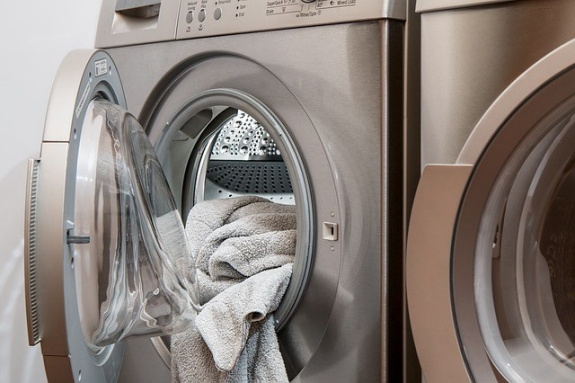
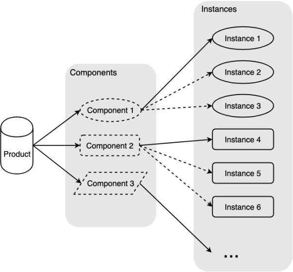

# 17-**桥接模式：组装变频洗衣机**


> 什么是路？就是从没路的地方践踏出来的，从只有荆棘的地方开辟出来的。 ——  鲁迅

**桥接模式**（Bridge Pattern）又称桥梁模式，将抽象部分与它的实现部分分离，使它们都可以独立地变化。使用组合关系代替继承关系，降低抽象和实现两个可变维度的耦合度。

抽象部分和实现部分可能不太好理解，举个例子，香蕉、苹果、西瓜，它们共同的抽象部分就是水果，可以吃，实现部分就是不同的水果实体。再比如黑色手提包、红色钱包、蓝色公文包，它们共同的抽象部分是包和颜色，这部分的共性就可以被作为抽象提取出来。

> **注意：** 本文可能用到一些编程技巧比如 [短路运算符](https://juejin.im/post/5b51e5d3f265da0f4861143c#heading-5)，还有一些 ES6 的语法 [let/const](http://es6.ruanyifeng.com/#docs/let) 、[Class](http://es6.ruanyifeng.com/#docs/class) 等，如果还没接触过可以点击链接稍加学习 ~

## 1. 你曾见过的桥接模式

厂家在生产洗衣机、冰箱、空调等电器的时候，不同型号产品之间有一些部件，比如变频洗衣机：

1. 产品型号 A 有小功率电机、直立滚筒、小功率变频器；
2. 产品型号 B 有中功率电机、横置滚筒、中功率变频器；
3. 产品型号 C 有大功率电机、横置滚筒、大功率变频器；

洗衣机产品由这三个部分组成，那么可以提取电机、滚筒、变频器部件作为抽象维度，在新建洗衣机实例的时候，把抽象出来的部件桥接起来组成一个完整的洗衣机实例。在变频洗衣机系列产品中，产品的部件可以沿着各自维度独立地变化。



再比如皮包，包的种类比如钱包、书包、公文包是一个维度，包的尺寸是一个维度，包的颜色又是一个维度，这些维度可以自由变化。这种情况在系统设计中，如果给每个种类对应的每个尺寸和颜色都设置一个类，那么系统中的类就会很多，如果根据实际需要对种类、尺寸、颜色这些维度进行组合，那么将大大减少系统中类的个数。

在类似场景中，这些例子有以下特点：

1. 将抽象和实现分离，互相独立互不影响；
2. 产品有多个维度（部件），每个维度都可以独立变化（实例化过程），洗衣机这个例子的维度就是电机、滚筒、变频器，洗衣机产品在这几个维度可以独立地进行变化，从而组装成不同的洗衣机产品；

## 2. 实例的代码实现

我们可以使用 JavaScript 来将之前的变频洗衣机例子实现一下。

```javascript
/* 组装洗衣机 */
function Washer(motorType, rollerType, transducerType) {
  this.motor = new Motor(motorType)
  this.roller = new Roller(rollerType)
  this.transducer = new Transducer(transducerType)
}

Washer.prototype.work = function () {
  this.motor.run()
  this.roller.run()
  this.transducer.run()
}

/* 电机 */
function Motor(type) {
  this.motorType = type + '电机'
}

Motor.prototype.run = function () {
  console.log(this.motorType + '开始工作')
}

/* 滚筒 */
function Roller(type) {
  this.rollerType = type + '滚筒'
}

Roller.prototype.run = function () {
  console.log(this.rollerType + '开始工作')
}

/* 变频器 */
function Transducer(type) {
  this.transducerType = type + '变频器'
}

Transducer.prototype.run = function () {
  console.log(this.transducerType + '开始工作')
}

// 新建洗衣机
var washerA = new Washer('小功率', '直立', '小功率')
washerA.work()

// 输出：小功率电机开始工作
//      直立滚筒开始工作
//      小功率变频器开始工作
```

由于产品部件可以独立变化，所以创建新的洗衣机产品就非常容易：

```javascript
var washerD = new Washer('小功率', '直立', '中功率')
washerD.work()

// 输出：小功率电机开始工作
//      直立滚筒开始工作
//      中功率变频器开始工作
```

可以看到由于洗衣机的结构被分别抽象为几个部件的组合，部件的实例化是在部件类各自的构造函数中完成，因此部件之间的实例化不会相互影响，新产品的创建也变得容易，这就是桥接模式的好处。

下面我们用 ES6 的 Class 语法实现一下：

```javascript
/* 组装洗衣机 */
class Washer {
  constructor(motorType, rollerType, transducerType) {
    this.motor = new Motor(motorType)
    this.roller = new Roller(rollerType)
    this.transducer = new Transducer(transducerType)
  }

  /* 开始使用 */
  work() {
    this.motor.run()
    this.roller.run()
    this.transducer.run()
  }
}

/* 电机 */
class Motor {
  constructor(type) {
    this.motorType = type + '电机'
  }

  run() {
    console.log(this.motorType + '开始工作')
  }
}

/* 滚筒 */
class Roller {
  constructor(type) {
    this.rollerType = type + '滚筒'
  }

  run() {
    console.log(this.rollerType + '开始工作')
  }
}

/* 变频器 */
class Transducer {
  constructor(type) {
    this.transducerType = type + '变频器'
  }

  run() {
    console.log(this.transducerType + '开始工作')
  }
}

const washerA = new Washer('小功率', '直立', '小功率')
washerA.work()

// 输出：小功率电机开始工作
//      直立滚筒开始工作
//      小功率变频器开始工作
```

如果再精致一点，可以让电机、滚筒、变频器等部件实例继承自各自的抽象类，将面向抽象进行到底，但是桥接模式在 JavaScript 中应用不多，适当了解即可，不用太死扣。

有时候为了更复用部件，可以将部件的实例化拿出来，对于洗衣机来说一个实体部件当然不能用两次，这里使用皮包的例子：

```javascript
/* 皮包 */
class Bag {
  constructor(type, color) {
    this.type = type
    this.color = color
  }

  /* 展示 */
  show() {
    console.log(this.color.show() + this.type.show())
  }
}

/* 皮包类型 */
class Type {
  constructor(type) {
    this.typeType = type
  }

  show() {
    return this.typeType
  }
}

/* 皮包颜色 */
class Color {
  constructor(type) {
    this.colorType = type
  }

  show() {
    return this.colorType
  }
}

/* 抽象实例化 */
const redColor = new Color('红色')
const walletType = new Type('钱包')
const briefcaseType = new Type('公文包')

const bagA = new Bag(walletType, redColor)
bagA.show()

// 输出：红色钱包

const bagB = new Bag(briefcaseType, redColor)
bagB.show()

// 输出：红色公文包
```

## 3. 桥接模式的原理

我们可以提炼一下桥接模式，洗衣机是产品（Product），电机、滚筒、变频器属于抽象出来的部件种类（Components），也属于独立的维度，而具体的部件实体小功率电机、直立滚筒、大功率变频器等属于部件实例（Instances），这些实例可以沿着各自维度变化，共同组成对应产品。主要有以下几个概念：

1. **Product：** 产品，由多个独立部件组成的产品；
2. **Component：** 部件，组成产品的部件类；
3. **Instance：** 部件类的实例；

概略图如下：



## 4. 实战中的桥接模式

在某一个开发场景，一个按钮的前景色本为黑色背景色为浅灰色，当光标 `mouseover` 的时候改变前景色为蓝色、背景色为绿色、尺寸变为 `1.5` 倍，当光标 `mouseleave` 的时候还原前景色、背景色、尺寸，在鼠标按下的时候前景色变为红色、背景色变为紫色、尺寸变为 `0.5` 倍，抬起后恢复原状。怎么样，这个需求是不是有点麻烦，别管为什么有这么奇葩的需求（产品：这个需求很简单，怎么实现我不管），现在需求已经怼到脸上了，我们要如何去实现呢？

我们自然可以这样写：

```javascript
var btn = document.getElementById('btn')

btn.addEventListener('mouseover', function () {
  btn.style.setProperty('color', 'blue')
  btn.style.setProperty('background-color', 'green')
  btn.style.setProperty('transform', 'scale(1.5)')
})

btn.addEventListener('mouseleave', function () {
  btn.style.setProperty('color', 'black')
  btn.style.setProperty('background-color', 'lightgray')
  btn.style.setProperty('transform', 'scale(1)')
})

btn.addEventListener('mousedown', function () {
  btn.style.setProperty('color', 'red')
  btn.style.setProperty('background-color', 'purple')
  btn.style.setProperty('transform', 'scale(.5)')
})

btn.addEventListener('mouseup', function () {
  btn.style.setProperty('color', 'black')
  btn.style.setProperty('background-color', 'lightgray')
  btn.style.setProperty('transform', 'scale(1)')
})
```

代码和预览参见： [Codepen - 桥接模式反模式](https://codepen.io/SHERlocked93/pen/gVmBKW)

的确可以达到目标需求，但是我们可以使用桥接模式来改造一下，我们可以把 DOM 对象的前景色、背景色作为其外观部件，尺寸属性是另一个尺寸部件，这样的话对各自部件的操作可以作为抽象被提取出来，使得对各自部件可以独立且方便地操作：

```javascript
var btn = document.getElementById('btn')

/* 设置前景色和背景色 */
function setColor(element, color = 'black', bgc = 'lightgray') {
  element.style.setProperty('color', color)
  element.style.setProperty('background-color', bgc)
}

/* 设置尺寸 */
function setSize(element, size = '1') {
  element.style.setProperty('transform', `scale(${size})`)
}

btn.addEventListener('mouseover', function () {
  setColor(btn, 'blue', 'green')
  setSize(btn, '1.5')
})

btn.addEventListener('mouseleave', function () {
  setColor(btn)
  setSize(btn)
})

btn.addEventListener('mousedown', function () {
  setColor(btn, 'red', 'purple')
  setSize(btn, '.5')
})

btn.addEventListener('mouseup', function () {
  setColor(btn)
  setSize(btn)
})
```

代码和预览参见： [Codepen - 桥接模式示例](https://codepen.io/SHERlocked93/pen/GVWweY)

是不是看起来清晰多了，这里的 `setColor`、`setSize` 就是桥接函数，是将 DOM （产品）及其属性（部件）连接在一起的桥梁，用户只要给桥接函数传递参数即可，十分便捷。其他 DOM 要有类似的对外观部件和尺寸部件的操作，也可以方便地进行复用。

效果如下：


## 5. 桥接模式的优缺点

桥接模式的优点：

1. 分离了抽象和实现部分，将实现层（DOM 元素事件触发并执行具体修改逻辑）和抽象层（ 元素外观、尺寸部分的修改函数）解耦，**有利于分层**；
2. 提高了**可扩展性**，多个维度的部件自由组合，避免了类继承带来的强耦合关系，也减少了部件类的数量；
3. 使用者**不用关心细节的实现**，可以方便快捷地进行使用；

桥接模式的缺点：

1. 桥接模式要求两个部件没有耦合关系，否则无法独立地变化，因此要求正确的对系统变化的维度进行识别，使用范围存在局限性；
2. 桥接模式的引入增加了系统复杂度；

## 6. 桥接模式的适用场景

1. 如果产品的部件有独立的变化维度，可以考虑桥接模式；
2. 不希望使用继承，或因为多层次继承导致系统类的个数急剧增加的系统；
3. 产品部件的粒度越细，部件复用的必要性越大，可以考虑桥接模式；

## 7. 其他相关模式

### 7.1 桥接模式和策略模式

1. **桥接模式：** 复用部件类，不同部件的实例相互之间无法替换，但是相同部件的实例一般可以替换；
2. **策略模式：** 复用策略类，不同策略之间地位平等，可以相互替换；

### 7.2 桥接模式与模板方法模式

1. **桥接模式：** 将组成产品的部件实例的创建，延迟到实例的具体创建过程中；
2. **模版方法模式：** 将创建产品的某一步骤，延迟到子类中实现；

### 7.3 桥接模式与抽象工厂模式

这两个模式可以组合使用，比如部件类实例的创建可以结合抽象工厂模式，因为部件类实例也属于一个产品类簇，明显属于抽象工厂模式的适用范围，如果创建的部件类不多，或者比较简单，也可以使用简单工厂模式。
