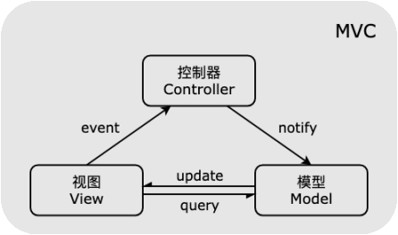
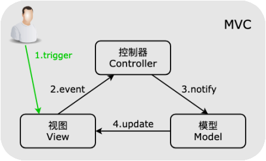
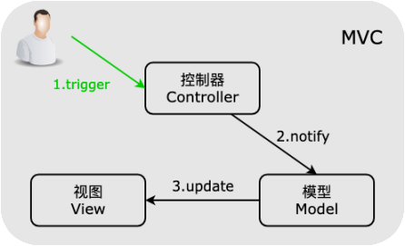
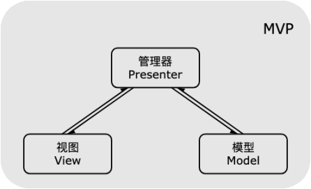
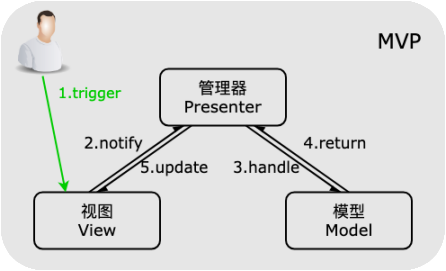
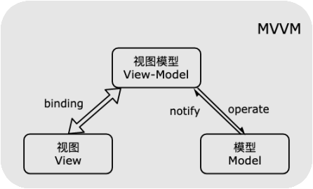
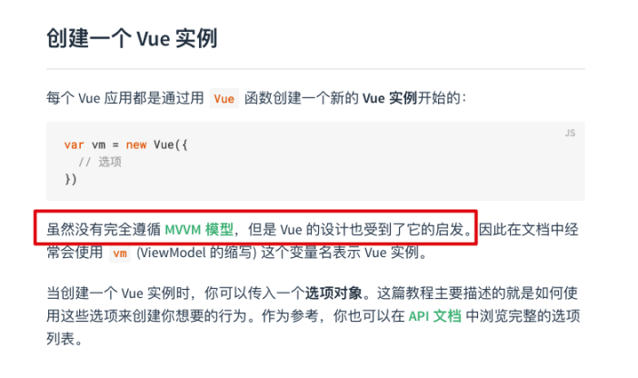
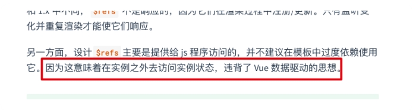

# 26-**MVC、MVP、MVVM**

> 理想必须要人们去实现它，它不但需要决心和勇敢而且需要知识。 ——吴玉章

在下文中，如果某些内容和你看的某本书或者某个帖子上的不一样，不要惊慌，多看几本书，多打开几个帖子，你会发现每个都不一样，所以模式具体是如何表现并不重要，重要的是，了解这三个模式主要的目的和思想是什么：

1. **MVC 模式：** 从大锅烩时代进化，引入了分层的概念，但是层与层之间耦合明显，维护起来不容易；
2. **MVP 模式：** 在 MVC 基础上进一步解耦，视图层和模型层完全隔离，交互只能通过管理层来进行，问题是更新视图需要管理层手动来进行；
3. **MVVM 模式：** 引入双向绑定机制，帮助实现一些更新视图层和模型层的工作，让开发者可以更专注于业务逻辑，相比于之前的模式，可以使用更少的代码量完成更复杂的交互；

MVC、MVP、MVVM 模式是我们经常遇到的概念，其中 MVVM 是最常用到的，在实际项目中往往没有严格按照模式的定义来设计的系统，开发中也不一定要纠结自己用的到底是哪个模式，合适的才是最好的。

## 1. MVC （Model View Controller）

**MVC** 模式将程序分为三个部分：模型（Model）、视图（View）、控制器（Controller）。

1. **Model 模型层：** 业务数据的处理和存储，数据更新后更新；
2. **View 视图层：** 人机交互接口，一般为展示给用户的界面；
3. **Controller 控制器层 ：** 负责连接 Model 层和 View 层，接受并处理 View 层触发的事件，并在 Model 层的数据状态变动时更新 View 层；

MVC 模式的目的是**通过引入 Controller 层来将 Model 层和 View 层分离**，分层的引入是原来大锅烩方式的改进，使得系统在可维护性和可读性上有了进步。

MVC 模式提出已经有四十余年，MVC 模式在各个书、各个教程、WIKI 的解释有各种版本，甚至 MVC 模式在不同系统中的具体表现也不同，这里只介绍典型 MVC 模式的思路。

典型思路是 View 层通过事件通知到 Controller 层，Controller 层经过对事件的处理完成相关业务逻辑，要求 Model 层改变数据状态，Model 层再将新数据更新到 View 层。示意图如下：

在实际操作时，用户可以直接对 View 层的 UI 进行操作，以通过事件通知 Controller 层，经过处理后修改 Model 层的数据，Model 层使用最新数据更新 View。示意图如下：

用户也可以直接触发 Controller 去更新 Model 层状态，再更新 View 层：

某些场景下，View 层直接采用观察者/发布订阅模式监听 Model 层的变化，这样 View 层和 Model 层相互持有、相互操作，导致紧密耦合，在可维护性上有待提升。由此，MVP 模式应运而生 。

## 2. MVP （Model View Presenter）

**MVP** 模式将程序分为三个部分：模型（Model）、视图（View）、管理层（Presenter）。

1. **Model 模型层：** 只负责存储数据，与 View 呈现无关，也与 UI 处理逻辑无关，发生更新也不用主动通知 View；
2. **View 视图层：** 人机交互接口，一般为展示给用户的界面；
3. **Presenter 管理层 ：** 负责连接 Model 层和 View 层，处理 View 层的事件，负责获取数据并将获取的数据经过处理后更新 View；

MVC 模式的 View 层和 Model 层存在耦合，为了解决这个问题，MVP 模式将 View 层和 Model 层解耦，之间的交互只能通过 Presenter 层，实际上，MVP 模式的目的就是**将 View 层和 Model 层完全解耦**，使得对 View 层的修改不会影响到 Model 层，而对 Model 层的数据改动也不会影响到 View 层。

典型流程是 View 层触发的事件传递到 Presenter 层中处理，Presenter 层去操作 Model 层，并且将数据返回给 View 层，这个过程中，View 层和 Model 层没有直接联系。而 View 层不部署业务逻辑，除了展示数据和触发事件之外，其它时间都在等着 Presenter 层来更新自己，被称为「被动视图」。

示意图如下：

在实际操作时，用户可以直接对 View 层的 UI 进行操作，View 层通知 Presenter 层，Presenter 层操作 Model 层的数据，Presenter 层获取到数据之后更新 View。示意图如下：

由于 Presenter 层负责了数据获取、数据处理、交互逻辑、UI 效果等等功能，所以 Presenter 层就变得强大起来，相应的，Model 层只负责数据存储，而 View 层只负责视图，Model 和 View 层的责任纯粹而单一，如果我们需要添加或修改功能模块，只需要修改 Presenter 层就够了。由于 Presenter 层需要调用 View 层的方法更新视图，Presenter 层直接持有 View 层导致了 Presenter 对 View 的依赖。

正如上所说，更新视图需要 Presenter 层直接持有 View 层，并通过调用 View 层中的方法来实现，还是需要一系列复杂操作，有没有什么机制自动去更新视图而不用我们手动去更新呢，所以，MVVM 模式应运而生。

## 3. MVVM （Model View ViewModel）

**MVVM** 模式将程序分为三个部分：模型（Model）、视图（View）、视图模型（View-Model）。

和 MVP 模式类似，Model 层和 View 层也被隔离开，彻底解耦，ViewModel 层相当于 Presenter 层，负责绑定 Model 层和 View 层，相比于 MVP 增加了双向绑定机制。

结构图如下：

MVVM 模式的特征是 ViewModel 层和 View 层采用双向绑定的形式（Binding），View 层的变动，将自动反映在 ViewModel 层，反之亦然。

但是双向绑定给调试和错误定位带来困难，View 层的异常可能是 View 的代码有问题，也有可能是 Model 层的问题。数据绑定使得一个位置的 Bug 被传递到别的位置，要定位原始出问题的地方就变得不那么容易了。

对简单 UI 来说，实现 MVVM 模式的开销是不必要的，而对于大型应用来说，引入 MVVM 模式则会节约大量手动更新视图的复杂过程，是否使用，还是看使用场景。

Vue 的双向绑定机制应该算是比较有 MVVM 模式的影子，但 [Vue 文档](https://cn.vuejs.org/v2/guide/instance.html#创建一个-Vue-实例) 里面是这么描述：

这是为什么呢，因为 MVVM 模式要求 Model 层和 View 层完全解耦，但是由于 Vue 还提供了 `ref` 这样的 API，使得 Model 也可以直接持有 View：

但是大多数帖子都说直接称呼 Vue 为 MVVM 框架，可见这些模式的划分也不是那么严格。

参考文献：

1. [MVC，MVP 和 MVVM 的图示 - 阮一峰](http://www.ruanyifeng.com/blog/2015/02/mvcmvp_mvvm.html)
2. [MVVM - 廖雪峰](https://www.liaoxuefeng.com/wiki/1022910821149312/1109447325776608)