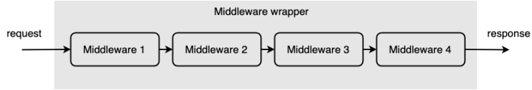
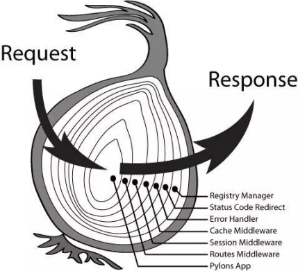
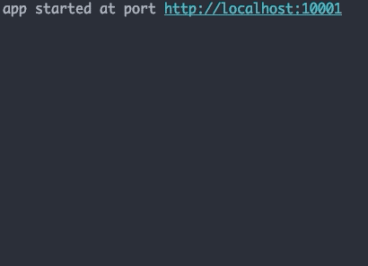

# 29-**中间件**


> 没有智慧的头脑，就像没有蜡烛的灯笼。 ——托尔斯泰

**中间件** （Middleware），又称中介层，是提供系统软件和应用软件之间连接的软件，以便于软件各部件之间的沟通，特别是应用软件对于系统软件的集中的逻辑。中间件在企业架构中表示各种软件套件，有助于抽象底层机制，比如操作系统 API、网络通信、内存管理等，开发者只需要关注应用中的业务模块。

从更广义的角度来看，中间件也可以定义为链接底层服务和应用的软件层。后文我们主要使用 Node.js 里最近很热门的框架 Koa2 里的中间件概念为例，并且自己实现一个中间件来加深理解。

> **注意：** 本文可能用到一些 ES6 的语法 [let/const](http://es6.ruanyifeng.com/#docs/let)、[箭头函数](http://es6.ruanyifeng.com/#docs/function)、[async/await](http://es6.ruanyifeng.com/#docs/async) 等，如果还没接触过可以点击链接稍加学习 ~

## 1. 什么是中间件

在 Express、Koa2 中，中间件代表一系列以管道形式被连接起来，以处理 HTTP 请求和响应的函数。换句话说，中间件其实**就是一个函数**，一个执行特定逻辑的函数。前端中类似的概念还有拦截器、Vue 中的过滤器、`vue-router` 中的路由守卫等。

工作原理就是进入具体业务之前，先对其进行预处理（在这一点上有点类似于装饰器模式），或者在进行业务之后，对其进行后处理。

示意图如下：



当接受到一个请求，对这个请求的处理过程可以看作是一个串联的管道，比如对于每个请求，我们都想插入一些相同的逻辑比如权限验证、数据过滤、日志统计、参数验证、异常处理等功能。对于开发者而言，自然不希望对于每个请求都特殊处理，因此引入中间件来简化和隔离这些基础设施与业务逻辑之间的细节，让开发者能够关注在业务的开发上，以达到提升开发效率的目的。

## 2. Koa 里的中间件

### 2.1 Koa2 里的中间件使用

Koa2 中的中间件形式为：

```javascript
app.use(async function middleware(context, next){ 
    // ... 前处理
    await next()     // 下一个中间件
    // ... 后处理
})
```

其中第一个参数 `context` 作为上下文封装了 `request` 和 `response` 信息，我们可以通过它来访问 `request` 和 `response`；`next` 是下一个中间件，当一个中间件处理完毕，调用 `next()` 就可以执行下一个中间件，下一个中间件处理完再使用 `next()`，从而实现中间件的管道化，对消息的依次处理。

一般中间件模式都约定有个 `use` 方法来注册中间件，Koa2 也是如此。千言万语不及一行代码，这里写一个简单的中间件：

```javascript
const koa = require('koa')
const app = new koa()

app.use((ctx, next) => {      // 没错，这就是中间件
    console.log('in 中间件1')
})

app.listen(10001)

// 输出： in 中间件1
```

Koa2 中的中间件有多种类型：

1. 应用级中间件；
2. 路由级中间件；
3. 错误处理中间件；
4. 第三方中间件；

除了使用第三方中间件比如 `koa-router`、`koa-bodyparser`、`koa-static`、`koa-logger` 等提供一些通用的路由、序列化、反序列化、日志记录等功能外，我们还可以编写自己的应用级中间件，来完成业务相关的逻辑。

通过引入各种功能各异的中间件，可以完成很多业务相关的功能：

1. `request` 和 `response` 的解析和处理；
2. 生成访问日志；
3. 管理 `session`、`cookie` 等；
4. 提供网络安全防护；

### 2.2 洋葱模型

在使用多个中间件时，引用一张著名的洋葱模型图：



正如上面的洋葱图所示，请求在进入业务逻辑时，会依次经过一系列中间件，对数据进行有序处理，业务逻辑之后，又像栈的先入后出一样，倒序经过之前的中间件。洋葱模型允许当应用执行完主要逻辑之后进行一些后处理，再将响应返回给用户。

使用如下：

```javascript
const Koa = require('koa')
const app = new Koa()

// 中间件1
app.use(async (ctx, next) => {
    console.log('in 中间件1')
    await next()
    console.log('out 中间件1')
})

// 中间件2
app.use(async (ctx, next) => {
    console.log('in 中间件2')
    await next()
    console.log('out 中间件2')
})

// response
app.use(async ctx => { ctx.body = 'Hello World' })

app.listen(10001)
console.log('app started at port http://localhost:10001')

// 输出：  in  中间件1
// 输出：  in  中间件2
// 输出：  out 中间件2
// 输出：  out 中间件1
```

我们可以引入 `setTimeout` 来模拟异步请求的过程：

```javascript
const Koa = require('koa')
const app = new Koa()

// 中间件1
app.use(async (ctx, next) => {
    console.log('in 中间件1')
    await next()
    console.log('out 中间件1')
})

// 中间件2
app.use(async (ctx, next) => {
    console.log('in 中间件2')
    await new Promise((resolve, reject) => {
          ctx.zjj_start2 = Date.now()
          setTimeout(() => resolve(), 1000 + Math.random() * 1000)
      }
    )
    await next()
    const duration = Date.now() - ctx.zjj_start2
    console.log('out 中间件2 耗时：' + duration + 'ms')
})

// 中间件3
app.use(async (ctx, next) => {
    console.log('in 中间件3')
    await new Promise((resolve, reject) => {
          ctx.zjj_start3 = Date.now()
          setTimeout(() => resolve(), 1000 + Math.random() * 1000)
      }
    )
    await next()
    const duration = Date.now() - ctx.zjj_start3
    console.log('out 中间件3 耗时：' + duration + 'ms')
})

// response
app.use(async ctx => {
    console.log(' ... 业务逻辑处理过程 ... ')
})

app.listen(10001)
console.log('app started at port http://localhost:10001')
```

效果如下：



在使用多个中间件时，特别是存在异步的场景，一般要 `await` 来调用 `next` 来保证在异步场景中，中间件仍按照洋葱模型的顺序来执行，因此别忘了 `next` 也要通过 `await` 调用。

参考文档：

1. [Koajs 中文文档](https://koa.bootcss.com/)
2. [Koa 框架教程 - 阮一峰](http://www.ruanyifeng.com/blog/2017/08/koa.html)