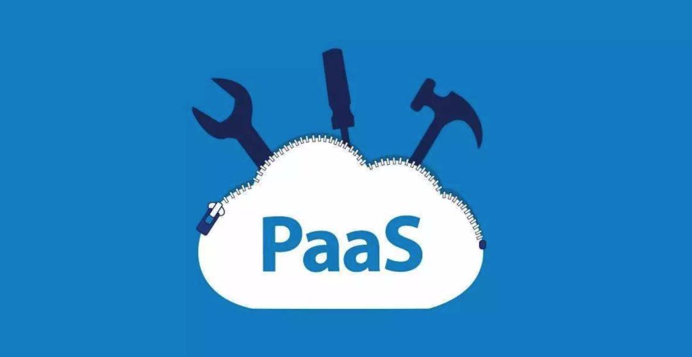
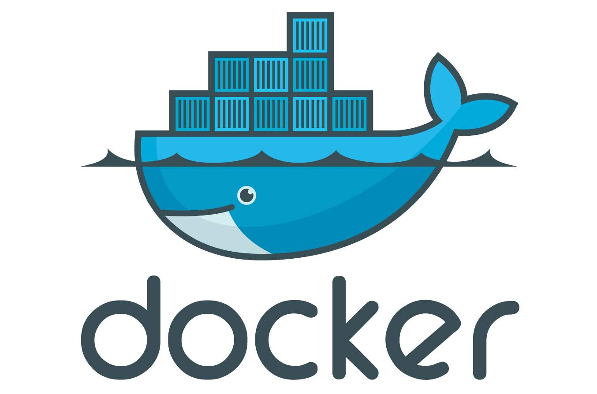

# 02-成王败寇容器的发展之路


> 既然我已经踏上这条道路，那么，任何东西都不应妨碍我沿着这条路走下去。——康德

这篇文章我们来回顾一下 Docker 容器的发展之路，如何在巨头中崭露头角，并在群雄逐鹿中脱颖而出的。在了解了这些历史背景之后，我们就能明白 Docker 容器技术的必然性和其伟大之处。

## 1. 历史环境：PaaS

我们从 2013 年开始说起，那时候云计算技术逐渐开始落地，各项主流技术也开始蓬勃发展。这里面的代表有如日中天的 AWS 和 IBM 的 OpenStack，以及后起之秀——诞生于 VMware 的 Cloud Foundry。我们下面以 Cloud Foundry 介绍一下 PaaS 的理念和核心问题。



Cloud Foundry 号称是业界第一个开源 PaaS 云平台，它支持多种框架、语言、运行时环境、云平台及应用服务，使开发人员能够在几秒钟内进行应用程序的部署和扩展，无需担心任何基础架构的问题。该软件最初由 VMWare 开发，于 2014 年转入 Pivotal 和 open source。2015 年，Cloud Foundry 基金会成立。

PaaS 的核心在于为应用提供一套打包和分发机制，Cloud Foundry 为多种主流语言都提供了一种打包格式。所谓打包就是将我们的应用程序的可执行文件和启动脚本打成一个压缩包，然后上传到 Cloud Foundry 的存储中心，然后有调度器选择将压缩包分发到特定的虚拟机上。

以 Cloud Foundary 为例，把本地的应用部署到云端只需要一条命令：

```bash
$ cf push "应用"
```

在应用部署完之后，要在同一台虚拟机上启动来自不同用户的多个应用。Cloud Foundry 会使用 Linux 提供的 NameSpace 和 CGroup 技术对不同的应用进行隔离和资源限制。

稍微了解容器技术的同学，应该知道 **Linux 容器也是采用了这个技术**。严格意义上来说，**Cloud Foundry 也是使用的容器技术**。所以在 Docker 诞生之后，Cloud Foundry 的产品经理 James Bayer 就在社区进行了一次详细的对比，最后结论是 Docker 使用的技术和 Cloud Foundry 没有本质区别，不值得关注，言下之意就是 Docker 难以撼动 Cloud Foundry 的市场地位。但是我们知道，这次 Cloud Foundry 判断错了。

## 2. 崭露头角

Docker 确实是也是使用 NameSpace 和 CGroup 技术没有错，但是 **Docker 相比于各种 PaaS 云平台技术的核心优势其实是它的镜像技术**。正是利用镜像技术，Docker 在诞生之后的几个月在各大 PaaS 软件还没有反应过来的时候迅速占领市场的有力地位。



PaaS 软件在运行用户的应用上和 Docker 技术没有区别，但是在打包应用上却显得极为繁琐。以 Cloud Foundry 为例，**它为不同的主流编程语言定义不同的打包方式，维护起来极其繁琐且容易出问题，用户往往也是因为这个环节苦不堪言**。那么 Docker 镜像是如何解决这个问题呢？

很简单，**Docker 镜像是一套操作系统文件 + 应用程序**。镜像一般都会有一个 base 镜像，而这个 base 镜像一般都是操作系统或者其 mini 版本。这样如果我们的应用在云端是运行在 Centos 7.4 上面，那么我们的 base 镜像直接使用 Centos 7.4 的操作系统文件即可，这样就解除了用户要保持本地环境和云上环境的底层一致的心智负担。简单来说，**Docker 镜像的精髓是保证了环境的一致性**。

除此之外，**Docker 镜像技术是一套统一的技术**，我们再也**不需要根据我们应用的开发语言不同而选择不同的打包方式**。在 Docker 中，我们打包镜像使用的技术叫做 Dockerfile 技术，我们只需要按照镜像技术的规范去编写 Dockerfile 即可，下面是一个简单的 Dockerfile 例子。

```dockerfile
FROM        quay.io/prometheus/busybox:glibc
LABEL maintainer="The Prometheus Authors <prometheus-developers@googlegroups.com>"

COPY node_exporter /bin/node_exporter

EXPOSE      9100
USER        nobody
ENTRYPOINT  [ "/bin/node_exporter" ]
```

其中第一行 FROM 就是引用基础镜像，这里的 busybox 就是一个精简版的操作系统镜像，相当于 Docker 镜像中 hello world。第 4 行将我们本地的可执行文件拷贝到镜像中；第 6 行和第 7 行设置端口和用户，最后一行设置应用的启动入口。如果没有看懂，也没有关系，后面我们会针对 Dockerfile 的编写有一节单独的内容说明。

## 3. 群雄逐鹿

容器技术的繁荣促进其生态快速发展，这其中最重要的就是**容器编排技术**。对于规模稍微大一点应用，在生存环境中，需要发布的容器数量很可能极其庞大，这也就意味着如何管理容器之间的联系和拓扑结构并不是一件简单的事情。

举个例子，对于**一个成熟的 web 应用，首先要具备高可用架构，其次其内部可能包含数据库、缓存等各种依赖，除此之外还有很多运维管理需求，比如监控告警等**。对于这些操作，通过人工来管理肯定是不现实的。这个时候我们就需要定义容器集群的编排和部署工具。

说到容器编排，不得不提三剑客：Compose、Machine 和 Swarm。

### compose

为了展示容器编排的内容，我们这里简单展示一下如何去部署一个 Flask 应用。Flask 应用如下，定义一个 route："/"，当访问到来的时候，redis 会做一个访问计数。

```python
from flask import Flask
from redis import Redis
import os

app = Flask(__name__)
redis = Redis(host='redis', port=6379)

@app.route('/')
def hello():
    redis.incr('hits')
    return "Hello World. I am a Flask App!"

if __name__ == "__main__":
    app.run(host="0.0.0.0", debug=True)
```

然后我们要生成一个 Docker 镜像，打包镜像只需要定义一个 Dockerfile，如下：

```dockerfile
From python:2.7
ADD . /code
WORKDIR /code
RUN pip install flask
RUN pip install redis
```

最后我们通过 compose.yml 来定义部署拓扑。

```yaml
web:
  build: .
  command: python app.py
  ports:
    - '5000:5000'
  volumes:
    - .:/code
  links:
    - redis
redis:
  image: redis
```

这里是编排部署的核心，这里定义了两个最高级别的 key: web 和 redis，也就是说 compose 定义了由两个 ”服务“ （web 和 redis）组成的 Docker ”集群“。这里 compose 部署的 docker 集群其实是在一台机器上的。

通过 compose 定义完 Docker 集群之后，通过 docker-compose up 就可以将服务部署起来了。限于篇幅，我们这里不对这些 yaml 的编排规范做过多解释。

### Machine

Machine 的主要功能是帮助用户在不同的云主机提供商上创建和管理虚拟机，并在虚拟机中安装 Docker。除了搭建环境之外，Machine 还可以帮助用户配置 Docker 的连接参数等、管理 Docker 主机，比如启动、关闭、重启、删除等操作。

Machine 简单来说就是一个统一管理工具，成功的关键与否还是要看各大云厂商买不买单，接不接入。目前来看，情况不太乐观。

### Swarm

Swarm 也是 Docker 集群的编排和管理工具，和 Compose 不同的是，这里的集群是真正的由多个主机组成的集群。

Docker 生态依托 Compose、Machine 和 Swarm 重新定义了一个容器生态的 PaaS。

### Marathon

但是现实往往伴随着搅局者，这个搅局者就是 Mesosphere，Mesosphere 公司成名作是 Mesos，属于 Apache 社区，具有和大数据调度系统 Yarn 一样的统治力。但是 Mesos 由于其初衷是针对大数据系统的调度，让它来处理 Docker 典型应用 long-running 应用并不是具有太大的优势。

Mesosphere 随之提出了针对容器系统编排的 Marathon，相比如 Docker 公司这个年轻后生，Mesosphere 具有足够大规模集群资源管理的经验，2014 年，Mesos 就能够管理 10000 规模的集群调度。

Marathon 诞生之后就以 Swarm 的强力竞争者而存在，但是由于 Mesosphere 公司的 Apache 属性，生态显得略微封闭，同时 Swarm 作为 Docker 的亲儿子，与 Marathon 竞争起来并没有显现出过多的颓势，说势均力敌也不为过。

### Kubernetes

真正的转机出现在 2015 年，随着 Docker 技术的火热，容器领域的玩家开始对 Docker 公司体现出的强硬态度开始不满。自然而然地，几家大公司开始商量对 Docker 公司的话语权进行切割，于是一个中立的基金会成立了，这个基金会叫做 CNCF。

CNCF，全名 Cloud Native Computing Foundation，由 Google、RedHat 等开源基础设施领域玩家们共同发起。这个基金会的目的其实很容易理解：**它希望以 Kubernetes 项目为基础，建立一个由开源基础设施领域厂商主导的、按照独立基金会方式运营的平台级社区，来对抗以 Docker 公司为核心的容器商业生态**。而为了打造出这样一个围绕 Kubernetes 项目的“护城河”，CNCF 社区就需要至少确保两件事情：

- Kubernetes 项目必须能够在容器编排领域取得足够大的竞争优势；
- CNCF 社区必须以 Kubernetes 项目为核心，覆盖足够多的场景。

Kubernetes 项目就是在这样的环境下开始飞速成长。但是这并不是说 Kubernetes 是靠着 “**政治**” 取胜的，**Kubernetes 项目具有非常优秀的设计理念和健康的社区基础**，其对于开发者的开放态度也迅速吸引着大量的开发者。

```python
from flask import Flask
from redis import Redis
import os

app = Flask(__name__)
redis = Redis(host='redis', port=6379)

@app.route('/')
def hello():
    redis.incr('hits')
    return "hello world. I am a Flask App"

if __name__ == "__main__":
    app.run(host="0.0.0.0", debug=True)
```

## 4. 鹿死谁手

鹿死谁手，这两年市场已经告诉了我们答案，赢家是 Kubernetes 了。Kubernetes 凭借其优秀的设计理念和 Google 背后的技术领导力加持，迅速在市场上占据大部分和容器相关场景。早期的容器编排软件逐渐退出了历史舞台，比如阿里云的容器服务就宣布自 2019 年 12 月份将不再支持 Swarm，而形成鲜明对比的是，基于 Kubernetes 的产品形态却越来越多。

Kubernetes 的特点主要包括如下几个方面：

### 优秀的设计理念

Kubernetes 并不是凭空设计出来的，其前身来自 Google 内部的 Borg 和 Omega 系统。我们可以看一下下图，感受一下 Borg 和 Omega 系统在 Google 内部的位置。


Borg 亦或是 Omega 在 Google 内部是作为底层调度系统存在的，并且是经过系统内部多年的生产环境考验的。Kubernetes 相当于 Borg 和 Omega 针对容器的调度系统，这里的容器可以是 Docker 也可以是其他 Linux 容器，目前默认是 Docker。关于优秀的设计理念，这里简单举一个例子：**Pod**。

如果我们有两个容器 A 和 B 需要调度在一台机器上，其中 A 和 B 各需要内存 1 G，但是这个时候机器只有 1.5 G，如果先调度 A，A 是可以被调度到机器上的，但是后面的 B 调度却会有问题了。要想解决这个问题，如果 A 和 B 单独调度，往往需要考虑非常多的场景和复杂的解决算法。

Kubernetes 针对这个问题提出了 Pod 的概念，Pod 是一组容器的集合，类似进程组，Pod 是 Kubernetes 中一个最小的调度单位，也就是说同一个 Pod 中的不同容器一定会被调度到一台机器上，并且可以互相共享 NameSpace。Pod 的提出解决了很多调度需要考虑的复杂问题。

### 声明式 API

所谓声明式 API，是直接描述我们要什么或者要达到一种什么状态。与之对于是命令式 API，命令式 API 对应的则是一个具体的动作：比如 “创建容器”，“修改容器” 等。

声明式 API 的一个典型例子就是 SQL，在下面的 SQL 中，我们直接说明我们需要的东西是 a, b, c 三个字段，现在条件是 id > 123。但是我们并不需要管这条 SQL 如果是数据库引擎中的真正的执行计划是什么样的。

```sql
select a, b, c from table where id > 123;
```

那么在 Kubernetes 中，我们如何去声明我们需要什么呢？下面是一个创建两个 nginx 副本的 Deployment。其中的 replicas 就是我们最终需要的副本数，也就是最终状态需要有两个副本运行，Kubernetes 如何去保证，我们不需要关心。

```yaml
apiVersion: apps/v1 # for versions before 1.9.0 use apps/v1beta2
kind: Deployment
metadata:
  name: nginx-deployment
spec:
  selector:
    matchLabels:
      app: nginx
  replicas: 2 # tells deployment to run 2 pods matching the template
  template:
    metadata:
      labels:
        app: nginx
    spec:
      containers:
        - name: nginx
          image: nginx:1.7.9
          ports:
            - containerPort: 80
```

声明式 API 的最大好处是解放开发者的心智负担，让编程变得简单。

### 开放的生态

我们看一下下面的 Kubernetes 分层架构图。


在上图的最底部包含了很多开放生态，包括容器运行时，网络插件，存储插件、以及云厂商 Provider。这样各大云厂商在将 Kubernetes 运行在自己的云上环境的时候就可以很方便的将自己的存储以及网络产品以一种插件式的方式集成到 Kubernetes 中。

Kubernetes 正是靠着这种开放的开发者生态，吸引了越来越多的开发者投入其中，并乐此不疲。反过来，生态的繁荣也促进 Kubernetes 在历史车轮的推动下不断向前。

## 5. 结语

在本篇文章中，我们回顾了 Docker 技术的诞生和发展，以及 Kubernetes 的简介。后面专栏中，这些内容我们将会进行由浅入深的讨论。
