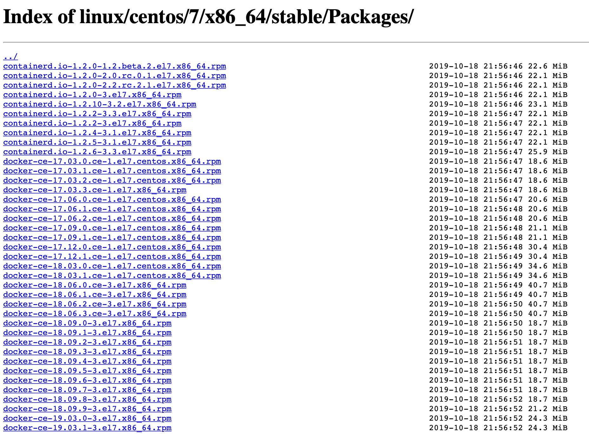
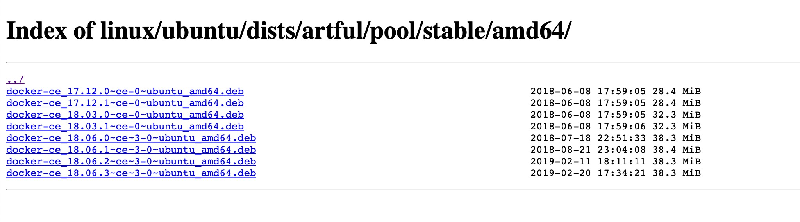
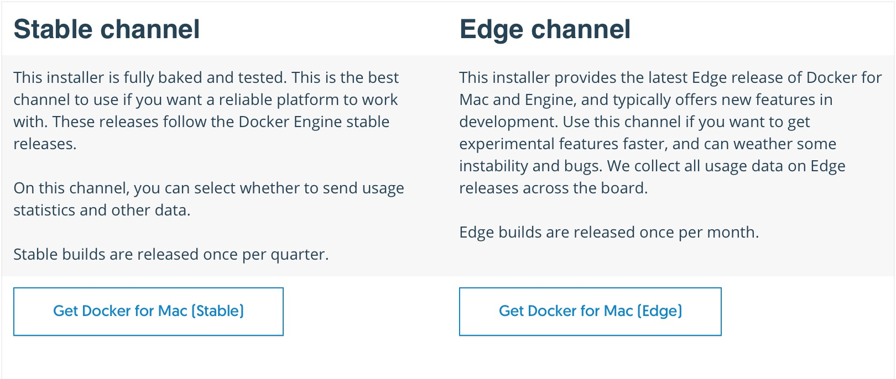
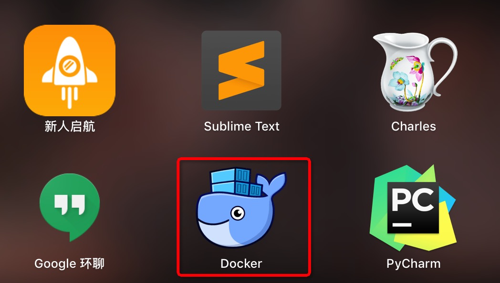
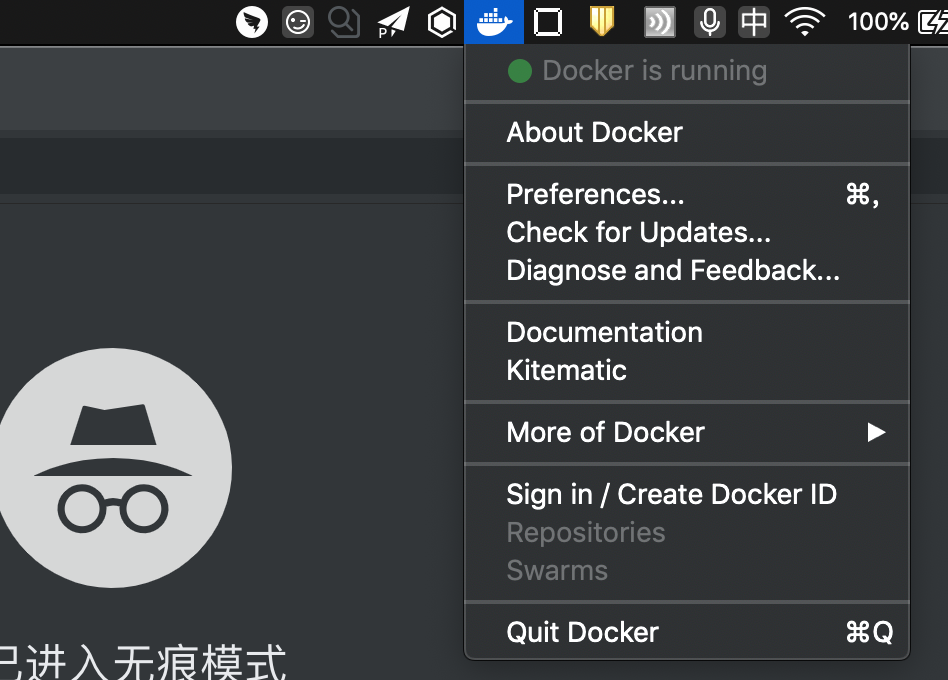

# 03-Docker 安装与运行


> 知识犹如人体的血液一样宝贵。——高士其

这一小节我们介绍一下 Docker 安装与运行，在开始之后，我们需要明白的时候，Docker 有两个版本：一个是商业版收费的：**Enterprice Edition，一般简称 Docker EE**；另一个是社区版，也就是 **Community Edition，一般简称为 Docker CE**。

这里安装我们会介绍在 Linux 平台、Mac 平台、Windows 平台的安装。重点会介绍一下在 Linux 平台的安装，Linux 平台又会细分两个：Centos 和 Ubuntu。

## 1. Linux 安装

Linux 下安装 Docker 我们将主要介绍 Centos 和 Ubuntu 系统

### Centos

我们这里的示例 OS 版本是 Centos 7.4，使用命令 `lsb_release -a` 可以看到系统版本。

```bash
# lsb_release -a
LSB Version:	:core-4.1-amd64:core-4.1-noarch
Distributor ID:	CentOS
Description:	CentOS Linux release 7.4.1708 (Core)
Release:	7.4.1708
Codename:	Core
```

在 Centos 下面安装我们可以采用两种安装方式，一种是 yum 安装，一种是下载 rpm 包进行安装。

#### yum 安装

yum 安装需要确保 yum 源里面含有 Docker 软件包，国内的话推荐使用阿里云的 yum 源。如果要查看自己的系统的 yum 源，可以在目录 `/etc/yum.repos.d/` 下查看，下面是我自己的阿里云的 ecs 虚拟机 yum 源文件，包含两个部分：`CentOS-Base.repo` 和 `epel.repo` 。内容分别如下

```bash
[base]
name=CentOS-$releasever
enabled=1
failovermethod=priority
baseurl=http://mirrors.cloud.aliyuncs.com/centos/$releasever/os/$basearch/
gpgcheck=1
gpgkey=http://mirrors.cloud.aliyuncs.com/centos/RPM-GPG-KEY-CentOS-7

[updates]
name=CentOS-$releasever
enabled=1
failovermethod=priority
baseurl=http://mirrors.cloud.aliyuncs.com/centos/$releasever/updates/$basearch/
gpgcheck=1
gpgkey=http://mirrors.cloud.aliyuncs.com/centos/RPM-GPG-KEY-CentOS-7

[extras]
name=CentOS-$releasever
enabled=1
failovermethod=priority
baseurl=http://mirrors.cloud.aliyuncs.com/centos/$releasever/extras/$basearch/
gpgcheck=1
gpgkey=http://mirrors.cloud.aliyuncs.com/centos/RPM-GPG-KEY-CentOS-7
[epel]
name=Extra Packages for Enterprise Linux 7 - $basearch
enabled=1
failovermethod=priority
baseurl=http://mirrors.cloud.aliyuncs.com/epel/7/$basearch
gpgcheck=0
gpgkey=http://mirrors.cloud.aliyuncs.com/epel/RPM-GPG-KEY-EPEL-7
```

使用阿里云的 yum 源安装 Docker 非常简单，强烈建议各位同学配置阿里云的 yum 源。安装使用下面一条命令即可：

```bash
yum install docker
```

执行完之后，可以通过如下命令查看 Docker 的版本：

```bash
# docker version
Client:
 Version:         1.13.1
 API version:     1.26
 Package version:
Cannot connect to the Docker daemon at unix:///var/run/docker.sock. Is the docker daemon running?
```

这个输出表示 Docker 的版本是 1.13.1。细心的同学会注意到最后一句提示，是因为 Docker Daemon 进程还没有启动，启动命令如下：

```bash
service docker start
```

或者：

```bash
systemctl start docker.service
```

启动完之后，我们就可以通过 docker 的命令来查看 Docker 是不是运行正常了，比如使用 `docker images` 查看本地所有的镜像。如下输出是正常的。

```bash
# docker images
REPOSITORY          TAG                 IMAGE ID            CREATED             SIZE
```

#### 下载 rpm 包安装

哪里下载呢？[当然是 dockerhub](https://download.docker.com/linux/centos/7/x86_64/stable/Packages/)，截图如下图所示：



其中 containerd 和 docker-ce-cli 是 docker-ce 安装的前置条件，也就是要安装 docker-ce，需要先安装 containerd 和 docker-ce-cli。版本之间保证 docker-ce 和 docker-ce-cli 的版本一致，containerd 的版本尽可能新就 ok。下载到本地之后，使用 yum 安装。

```bash
yum install <pkg_name>.rpm
```

我这里选的版本是：

- docker-ce-cli-19.03.5-3.el7.x86_64.rpm
- containerd.io-1.2.6-3.3.el7.x86_64.rpm
- docker-ce-19.03.5-3.el7.x86_64.rpm

按上面的顺序安装之后启动 docker

```bash
systemctl start docker.service
```

我们看一下 docker version:

```bash
# docker version
Client: Docker Engine - Community
 Version:           19.03.5
 API version:       1.40
 Go version:        go1.12.12
 Git commit:        633a0ea
 Built:             Wed Nov 13 07:25:41 2019
 OS/Arch:           linux/amd64
 Experimental:      false

Server: Docker Engine - Community
 Engine:
  Version:          19.03.5
  API version:      1.40 (minimum version 1.12)
  Go version:       go1.12.12
  Git commit:       633a0ea
  Built:            Wed Nov 13 07:24:18 2019
  OS/Arch:          linux/amd64
  Experimental:     false
 containerd:
  Version:          1.2.6
  GitCommit:        894b81a4b802e4eb2a91d1ce216b8817763c29fb
 runc:
  Version:          1.0.0-rc8
  GitCommit:        425e105d5a03fabd737a126ad93d62a9eeede87f
 docker-init:
  Version:          0.18.0
  GitCommit:        fec3683
```

这个要比阿里云的 Yum 源中的 Docker 版本高很多，如果需要新的版本的 feature 的话，建议自己下载对应的 rpm 包进行安装。

### Ubuntu

我们知道 ubuntu 的包管理是通过 apt-get 来做的，但是默认的 apt-get 里面是没有包含 docker 的软件包的，我们需要将 Docker 的官方仓库加进来。

#### apt-get 安装

更新 ubuntu 的 apt 源索引

```bash
sudo apt-get update
```

安装包允许 apt 通过 HTTPS 使用仓库

```bash
sudo apt-get install \
    apt-transport-https \
    ca-certificates \
    curl \
    software-properties-common
```

添加 Docker 官方 GPG key

```bash
curl -fsSL https://download.docker.com/linux/ubuntu/gpg | sudo apt-key add -
```

设置 Docker 稳定版仓库

```bash
sudo add-apt-repository \
   "deb [arch=amd64] https://download.docker.com/linux/ubuntu \
   $(lsb_release -cs) \
   stable"
```

添加仓库后，更新 apt 源索引

```bash
sudo apt-get update
```

安装 Docker CE，不如过不输入 Version，则默认安装最新版本

```bash
sudo apt-get install docker-ce=<VERSION>
```

启动 Docker

```bash
systemctl start docker.service
```

使用这种方式安装的最大劣势就是 Docker 官方仓库和我们国内的机器网速捉急，相比之下将 deb 包下载到本地再进行安装往往是一种更好的安装方式。

#### deb 软件包安装

软件包下载地址为：https://download.docker.com/linux/ubuntu/dists/，这个地方先选择自己的 ubuntu 版本，比如我们选择 artful，则软件包的完整路径为：https://download.docker.com/linux/ubuntu/dists/artful/pool/stable/amd64/



然后我们选择一个 docker-ce 版本，直接本地安装即可。

```bash
sudo dpkg -i <deb pkg name>
```

## 2. Mac 安装

Mac 版本的安装页面地址为：https://docs.docker.com/v17.09/docker-for-mac/install/#download-docker-for-mac 。Docker 针对 Mac 平台提供了两个不同的版本：

- stable: 稳定版
- edge: 最新的 release，稳定性不保障



然后我们通过上图中 “Get Docker for Mac” 链接获取 dmg 安装文件。

### 启动 Docker

启动，找到你的 Application 中的下面这个 Docker 图标，点击运行即可。



启动之后，我们可以在导航栏上发现这么一个小图标，就表示 Docker 运行成功了。



## 3. Windows 安装

Windows 安装链接：https://docs.docker.com/v17.09/docker-for-windows/install/#download-docker-for-windows ，和 Mac 版类似，提供了 stable 和 edge 版本。我们只需要下载对应的版本的可执行文件进行安装即可。启动也是类似的，这里就不再赘述了。
