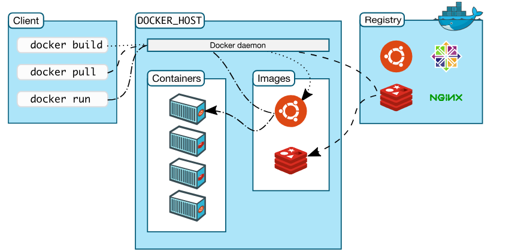

# 04-**小身材大能量：Docker 概览**


>  生活永远不像我们想像的那样好，但也不会像我们想像的那样糟。——莫泊桑

这篇文章我们将来介绍一下 Docker 的基本情况，主要包括如下几个部分：

- Docker 是什么；
- Docker v.s. 虚拟机；
- Docker 的应用场景；
- Docker 架构浅析。

## 1. Docker 是什么

相信有很多同学在平时的工作或者学习中应该都或多或少地使用过 Docker 了，那么 Docker 究竟是什么呢？有没有一个准确的定义来定义 Docker 呢？我们不妨先来看一下官方是如何来定义 Docker 的。

> Docker is an open platform for developing, shipping, and running applications. Docker enables you to separate your applications from your infrastructure so you can deliver software quickly. With Docker, you can manage your infrastructure in the same ways you manage your applications. By taking advantage of Docker’s methodologies for shipping, testing, and deploying code quickly, you can significantly reduce the delay between writing code and running it in production.

简单翻译下就是：

> Docker 是一个开源的平台，我们可以用 Docker 来开发、部署和运行我们的应用程序。Docker 可以帮助我们将应用程序和底层基础设施进行分离，以帮助我们更快的实现交付。通过 Docker 技术，我们可以像管理我们的应用一样管理我们的基础设施（比如基础依赖等，这里的具体技术其实就是镜像）。通过 Docker 技术，我们可以精简我们的整个开发和交互流程。

这里面的几个核心点包括：

- **平台（platform）**：官方将 Docker 定义为一个平台，但是其实更准确的来说，Docker 其实是一个技术栈，包括 Docker 镜像，可以类比为程序，是磁盘上面的静态文件，可以通过 Docker 来启动运行；Docker 容器，也就是 Docker 镜像的运行时实例；Docker Daemon，用来管理机器上的镜像、容器等。

- **应用程序和底层基础设施分离**：传统的软件开发模式是我们先开发好我们的应用，然后在线上环境或者测试环境上先安装应用的基础依赖，比如像一些 C++ 的二进制文件会依赖一些操作系统的动态链接库。

  依赖安装完成之后，然后将应用程序部署上去。使用 Docker 的镜像技术我们可以将这些依赖和应用程序都打包到镜像中，然后测试或者正式上线的时候只需要将整个镜像部署上去就可以了，不需要关心目标服务器上面的基础环境，这也就是应用程序和基础设施分离。也是精简开发流程的核心的所在。

熟悉 Docker 的同学肯定会意识到这里对 Docker 的定义其实少了很多东西，确实是这样的，比如 Docker 的隔离性和资源限制在定义里面都没有体现出来。定义还是从一种更加宏观的角度来介绍 Docker，也没错。

## 2. Docker v.s. 虚拟机

很多人学习 Docker 的过程中都会看到有人把 Docker 拿来和虚拟机做对比，也就是下面这张图。左边是 Docker 的架构，右边是虚拟机的架构图。我们可以看到 Docker 和虚拟机的主要区别有：

- 所有的 **Docker 应用共享一个宿主机操作系统**，每个虚拟机有自己的操作系统；
- 每个 **Docker 应用通过 Docker 层和宿主机的操作系统交互**，而虚拟机应用直接和操作系统交互。


但是上图左边的图中的 Docker 的位置其实很不严谨，实际上 **Docker 并不会像 Hypervisor 那样对应用进程的隔离环境负责，也不会创建任何实体的容器，真正对环境负责的是宿主机操作系统本身**。所以上图中 Docker 的问题应该是处于靠边的位置，因为通过 Docker 启动的容器本质上和操作系统中运行的进程并没有本质的区别。这个我们后面再细说。

## 3. Docker 的应用场景

### 应用交付

Docker 技术为应用交付领域带来的最大的变化就是**开发环境的一致性**。传统的开发方式需要开发者自己在本地进行开发，但是**本地的开发环境和远端的测试和正式环境还是存在差异，所以每次开发完成都需要反复比对环境的差异**，**包括操作系统以及操作系统里面的依赖软件包是否齐全，非常的麻烦**。

但是**使用 Docker 镜像，我们可以将所有的环境依赖都打包到镜像中**，然后通过镜像来传输，这样会更加地高效。

试想下面几种场景：

- 开发者在本地编写代码进行开发，然后通过 Docker 镜像和其他协作者共享；
- 使用 Docker 技术将应用 push 到测试环境，自动触发自动化 test case；
- 当开发者发现应用程序的 bug 时，可以在本地开发环境进行修复。修复完之后再将应用重新部署到测试环境进行测试验证；
- 当测试完成之后，需要给客户的环境升级，只要把修复完的应用镜像推送到客户可以访问的镜像中心即可。

### 多版本混合部署

随着产品的不断更新换代，**一台服务器上部署同一个应用的多个版本在企业内部非常常见**。但一台服务器上部署同一个软件的多个版本，**文件路径、端口等资源往往会发生冲突，造成多个版本无法共存的问题**。

如果用 docker，这个问题将非常简单。由于**每个容器都有自己独立的文件系统，所以根本不存在文件路径冲突的问题**；对于端口冲突问题，只需要在启动容器时指定不同的端口映射即可解决问题。

### 内部开发测试环境

传统的开发测试环境都是由运维人员进行专门的环境配置而搭建出来的，而且需要运维人员进行专门维护。环境一旦出现问题，恢复起来也很麻烦。

借助于 Docker 技术，我们**将应用程序需要的依赖都固化到 Docker 镜像中，然后在对应的 Docker 容器中进行开发测试**。就算环境出现问题，我们只要将当前容器删除重新启动即可恢复。

使用 Docker 镜像来维护内部开发测试环境还有另一个好处就是 **DevOps**，传统的应用开发部署要跨两个团队：**开发团队负责开发，运维团队服务部署，一旦涉及到跨团队合作就要牵扯到沟通成本**。而且开发作为应用的 owner，实际上对其依赖环境会更加的熟悉才对。

通过 Docker 镜像技术，**开发人员在开发应用的过程中就将这些依赖固化到镜像中。在环境部署环节，即使需要运维人员参与，也只是负责拉起 Docker。整个过程都会更加的高效**。

Docker 的使用场景是非常多的，在这里我们主要讨论几种主要的应用场景。

## 4. Docker 架构浅析

很多人说 Docker 是简单的 Server-Client 的架构，其实并不一定准确。Docker 的架构比较复杂，并不是纯粹的只有 Server 和 Client。下图是 Docker 架构的一个详细的图。几个主要的组成部分有：

- Docker Client；
- Docker Daemon；
- Docker Registry。



#### Docker Client

我们安装完 Docker 包之后，直接使用敲命令：`docker` ，界面是有提示的，这个 docker 就是 docker client。

docker client 都是用来和 docker daemon 交互的。

#### Docker Daemon

docker daemon 是一个 docker 后台运行的守护进程，我们的 docker client 的命令就是和 Docker Daemon 来进行交互的。

Docker daemon 启动可以使用 service 或者 systemctl 操作.

```bash
service docker start
systemctl start docker.service
```

然后我们使用 ps 命令就能看到 docker daemon 进程了。

```bash
$ ps aux | grep dockerd
root     10214  1.2  0.0 1014252 23768 ?       Ssl  00:58   0:00 /usr/bin/dockerd-current --add-runtime docker-runc=/usr/libexec/docker/docker-runc-current --default-runtime=docker-runc --exec-opt native.cgroupdriver=systemd --userland-proxy-path=/usr/libexec/docker/docker-proxy-current --init-path=/usr/libexec/docker/docker-init-current --seccomp-profile=/etc/docker/seccomp.json --selinux-enabled --log-driver=journald --signature-verification=false --storage-driver overlay2
```

然后我们查看和 client 交互的 socket 文件也存在了。

```bash
$ll /var/run/docker.sock
srw-rw---- 1 root root 0 Dec  3 00:58 /var/run/docker.sock
```

#### Docker Registry

Registry 中文一般翻译为**注册中心**，是用来**存储 Docker 镜像**的地方。Docker Registry 有多种不同的表现，比如 Docker Hub 就是一个公开的注册中心，同时各大云厂商也提供了自己的注册中心，比如阿里云、腾讯云等，甚至你可以搭建自己的私有注册中心。

Docker 默认使用 Docker Hub，比如我们执行 `docker pull <image-name>` 时，Docker 默认去 Docker Hub 中寻找名字为 image-name 的镜像。如果使用自己的 Registry 需要进行单独的配置。

#### Docker Images

Image 一般中文称之为**镜像**。官方对镜像的定义比较复杂，我一般使用类比的方式来理解镜像。**镜像可以理解成计算机系统中的程序，也就是静态的位于磁盘上面可以通过特定方式执行的文件**（程序是操作系统可以识别的特定的二进制文件，Docker 镜像是可以被 Docker Daemon 识别并执行的特定文件）。

镜像和普通的可执行文件的区别在于**镜像是分层架构，每个镜像一般都依赖于一个基础镜像**。最基本的镜像叫 scratch 镜像。当然我们也可以构建自己的镜像，然后发布到镜像中心别人就也可以使用了。

Docker 镜像的构建是通过一个 DSL 语言来编写的，叫 Dockerfile。后文我们会细说，这里就先不赘述了。

#### Docker Container

Container 也就是容器。Docker 官方对容器的定义非常的优雅。

> A container is a runnable instance of an image.

翻译过来就是：

> 容器是镜像的运行实例。

这个定义和进程的定义非常类似：**进程是程序的运行实例**。这样我们就**可以将镜像类比为程序，容器类比为进程**，这样就更好理解了。

我们可以使用 Docker 的 CLI 命令或者 API 来创建、启动、停止和删除容器等操作。同时对于运行状态的容器我们可以登录进去，类似 ssh 命令等操作。

容器默认是和其他容器以及其宿主机隔离开的。具体的隔离策略可以进行自定义设置。

## 5. 总结

本篇文章先从宏观角度介绍了 Docker 的定位和应用场景，然后又浅析了 Docker 的架构，学完本篇文章，对于完全的新手已经对 Docker 有一个基本的认识了。后面我们将循序渐进，不断深入介绍 Docker 技术。