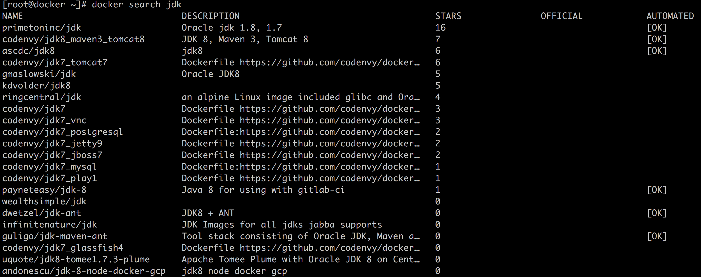
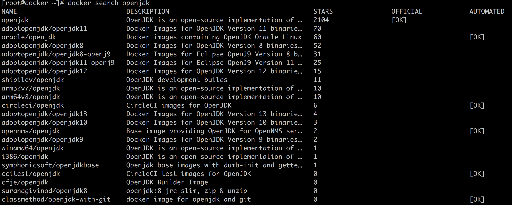
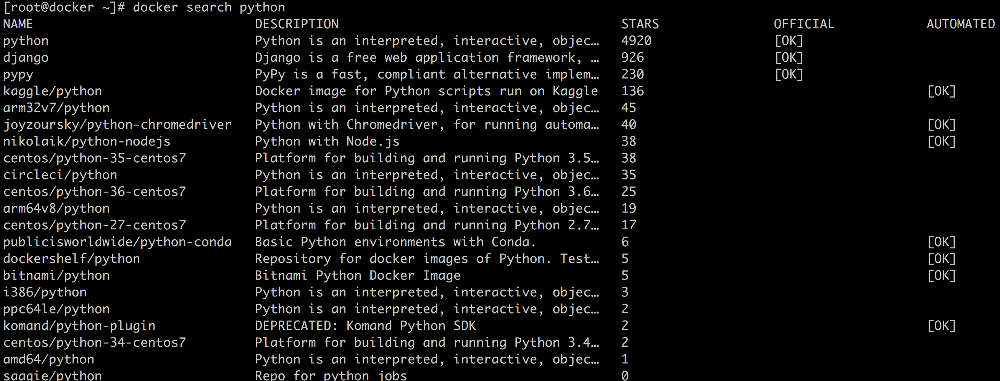
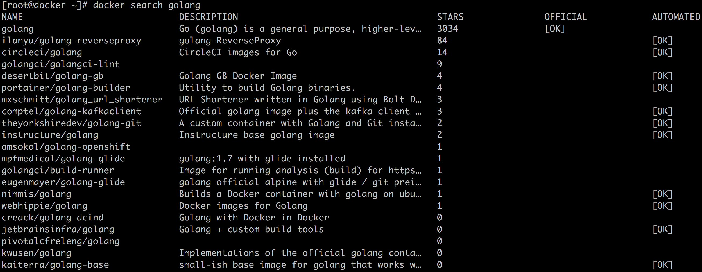
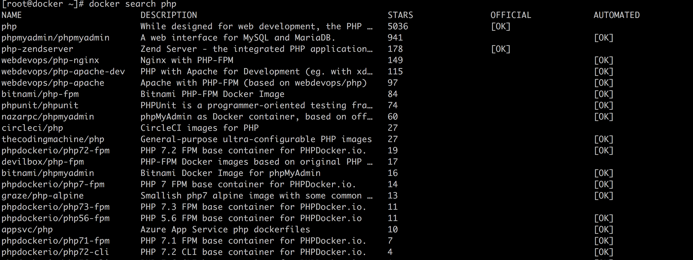

# 10-站在巨人的肩膀上热门 Docker 镜像介绍（三）


>  要成就一件大事业，必须从小事做起。——列宁

作为镜像介绍篇的最后一篇，这篇文章继续介绍 Docker 镜像，但是针对的使用使用场景和前面两节有一点微小的差别。这一节对应使用场景主要有两个：

- **应用相关的语言环境**：比如我的应用是一个 Python Web 应用，那么我不希望从操作系统的基础镜像或者裁剪的基础镜像自己中安装 Python 环境。这个时候我希望有一个 Python 各个版本的 Docker 镜像可以作为基础镜像供我们使用。
- **学习新语言使用**：比如 Golang 发布了新的版本，但是我本地的环境由于开发需要不能够安装最新的版本，那么这个时候我们就可以下载一个对应 Golang 新版本的 Docker 镜像来使用。

这篇文章主要介绍几大主流语言对应的镜像，包括 Java、Python、Golang、PHP、Node.js，由于 C++ 一般都是编译出来二进制再进行部署，所以这里就不介绍了。限于篇幅，本文主要介绍前面三种语言的基础镜像，PHP 和 Node.js ，读者可以参考我给出来的实验步骤进行学习。

## 1. Java

Java 应用运行起来的话需要 JDK 环境，Docker Hub 中目前官方的只有 OpenJDK 的镜像，Oracle JDK 的话有一些个人开发者制作的镜像，但是 STAR 数都不多（关于 OpenJDK 和 JDK 的差异，我们这篇文章就不赘述了）。我们可以通过 docker search 来搜索一下 jdk 镜像。



我们再看一下 openjdk 的镜像，如下。我们可以看到第一个 openjdk 是带有官方标志的。



我们可以通过 https://hub.docker.com/_/openjdk 查看到镜像中心的 openjdk 的镜像版本，读者朋友可以自行查看。我们下面下载 openjdk 的镜像，下载版本为 jdk 8。然后通过 docker images 命令进行查看，我们可以看到 openjdk 的镜像大小为 510M。

```bash
[root@docker ~]# docker pull openjdk:8
...
[root@docker ~]# docker images | grep openjdk
openjdk             8                   e890fe39c302        2 days ago          510MB
```

我们可以通过 docker run 启动 openjdk 容器。其中的参数 `-ti` 表示以交互模式启动，也就是打开 Linux 的 tty 登录；/bin/bash 表示运行镜像中的命令 /bin/bash。启动之后我们通过 `java -version` 查看到镜像中包含的 java 版本是 1.8.0_242。

```bash
[root@docker ~]# docker run -ti openjdk:8 /bin/bash
root@1589b87cd790:/# java -version
openjdk version "1.8.0_242"
OpenJDK Runtime Environment (build 1.8.0_242-b08)
OpenJDK 64-Bit Server VM (build 25.242-b08, mixed mode)
```

下面我们说一下如何将 openjdk 的镜像作为一个基础镜像来构建我们自己的应用镜像。

最简单的方式是我们在 Dockerfile 中将 openjdk 的镜像引入，然后将 Java 应用的 with-dependency 打出来的包拷贝进去就可以了，下面是一个简单的示例。

```dockerfile
FROM openjdk:7
COPY . /usr/src/myapp
WORKDIR /usr/src/myapp
RUN javac Main.java
CMD ["java", "Main"]
```

## 2. Python

相似的，官方的 Docker Hub 也提供了 Python 的官方镜像，我们还是通过 docker search 来搜索。



其中第一个就是官方的 Python 镜像。读者朋友可以通过 https://hub.docker.com/_/python 查看 python 镜像包含的信息，支持的版本等。这里我们下载版本为 python:3 的镜像。

```bash
[root@docker ~]# docker pull python:3
...
[root@docker ~]# docker images | grep python
python              3                   efdecc2e377a        3 days ago          933MB
```

通过 docker run 运行 Python 镜像，参数和上面运行 openjdk 镜像的参数类似，然后通过 Python --version 可以看到 Python 版本。

```bash
[root@docker ~]# docker run -ti python:3 /bin/bash
root@170d6a115afb:/# python --version
Python 3.8.1
```

使用 Python 镜像要比 openjdk 镜像稍微麻烦一点，因为 **Python 需要的很多依赖的第三方包**，这个在 Python 的 base 镜像里面是没有的，**需要我们自己将这些依赖打包到镜像里面**，打包的过程我们写到 dockerfile 文件里面，下面是一个简单的示例：

其中 requirements.txt 包含的是我们的应用依赖的 python 第三方包，以行分割；第四行的 `RUN pip install` 即为安装依赖。然后最后一行 `CMD` 是启动命令，表示我们启动进行的时候运行命令在工作目录 `/usr/src/app` 下运行命令 `python ./your-daemon-or-script.py` 。

```dockerfile
FROM python:3

WORKDIR /usr/src/app

COPY requirements.txt ./
RUN pip install --no-cache-dir -r requirements.txt

COPY . .

CMD [ "python", "./your-daemon-or-script.py" ]
```

## 3. Golang

Golang 也就是 Go 语言，截止我这篇文章编写的时候 1.14 将要发布。同样的我们通过 docker search 查询 golang 的镜像。



我们这里下载 1.13 版本的 golang 镜像。

```bash
[root@docker ~]# docker pull golang:1.13
1.13: Pulling from library/golang
dc65f448a2e2: Already exists
346ffb2b67d7: Already exists
dea4ecac934f: Already exists
8ac92ddf84b3: Already exists
7ca605383307: Pull complete
bd20b51e1705: Pull complete
844755650966: Pull complete
Digest: sha256:de83180c8374e56166542909101c91f7f653edc525f017b2d58f55b33cd28883
Status: Downloaded newer image for golang:1.13
[root@docker ~]# docker images | grep golang
golang              1.13                6586e3d10e96        7 days ago          803MB
```

运行，参数同上。然后通过 go version 我们可以看到镜像中包含的 golang 版本。

```bash
[root@docker ~]# docker run -ti golang:1.13 /bin/bash
root@1a9aaaec9e77:/go# go version
go version go1.13.7 linux/amd64
```

其实并不是很建议将 golang 镜像作为基础镜像使用。我们知道 golang 的部署一般都是部署二进制文件，并不依赖 golang 运行环境。如果是学习使用的话，倒是可以使用。下面是使用 golang 作为 base 镜像的一个简单的 dockerfile 的例子。其中第四行为依赖安装，第五行位编译安装。

```dockerfile
FROM golang:1.13

WORKDIR /go/src/app
COPY . .

RUN go get -d -v ./...
RUN go install -v ./...

CMD ["app"]
```

## 4. PHP

Docker Hub 中也提供了 PHP 的镜像，我们也可以通过 docker search 搜索到。



然后镜像安装和运行和上面也是类似的，限于篇幅这里就不再介绍了。

## 5. 总结

本文从编程语言运行环境的用户场景着手像大家重点介绍了 Java、Python、Golang 的基础镜像，希望读者朋友后面遇到这种类似的运行环境的问题，也可以用相同的思路来解决。
