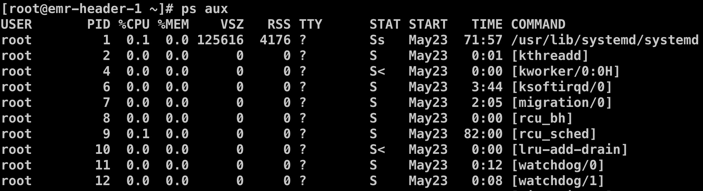

# 15-**Docker 的本质是进程**


> 读书而不思考，等于吃饭而不消化。——波尔克

前面我们深入剖析了 Docker 的隔离技术 namespace 和资源隔离 cgroup，以及镜像技术，这篇文章我们再来重新认识一下 Docker 容器。

如果用精简的一句话来描述容器，应该如何来表达？

> 容器就是进程。

够简单，但是不够准确。

> 容器是使用 namespace 进行隔离，cgroup 进行资源限制的进程。

还少了镜像。

> 容器是使用 namespace 进行隔离，cgroup 进行资源限制，并且带有 rootfs 的进程。

这么看上去差不多了。

## 1. 进程

在 *Operating Systems: Three Easy Pieces* 这本书对进程的定义如下：

> The definition of a process, infor- mally, is quite simple: it is a **running program**.

这句话有一种比较合适的翻译：**进程是程序的运行实例**。我们最常见的可执行文件就是程序，不同操作系统平台上面对应的可执行文件的组织结构不尽相同，比如 **Linux 平台上的可执行文件就包含代码段、数据段等。概括来说，程序是一段操作系统可以识别的指令的集合，其中可能还包含部分数据**。

进程作为操作系统提供的抽象概念，它代表了一个运行实体。操作系统就是由一组进程组成，root 进程为 1 号进程，init 0，或者说 systemd，剩下的所有进程都是 0 号进程的后代。我们可以通过 Linux 提供的 ps 命令来查看当前系统中运行的进程，如下所示。



从上图我们可以看进程的信息包括：

- **USER**：进程的启动用户；
- **PID**：进程号，每个进程都会被分配一个 PID，是一种系统资源，并且每个系统中的进程号个数是有限的；
- **%CPU**：CPU 使用率；
- **%MEM**：内存使用率；
- …

## 2. 容器

理解容器的本质最简单的方式就是类比。

- 进程是程序的运行实体；
- 容器是镜像的运行实体。

镜像和程序的角色是一样的，只不过镜像要比程序更加的丰富。**程序只是按简单的格式存储在文件系统中，而镜像是按层，以联合文件系统的方式存储**。

容器和进程的角色也是类似的，只不过容器相比于普通进程多了更多地附加属性。

既然容器也是进程，那么它一定也有进程号，那么如何将容器映射到操作系统的进程呢？我们这里还是以 Docker 容器为例。通过 `docker top <container-id>` 命令可以看到容器的进程号。下面举个例子。

```bash
[root@xxx ~]# docker ps
CONTAINER ID        IMAGE                    COMMAND                  CREATED             STATUS              PORTS                    NAMES
d3973eb73bec        http-server:v1           "/http-server"           35 hours ago        Up 35 hours         0.0.0.0:8091->8091/tcp   clever_nobel
bf90054c3017        google/cadvisor:latest   "/usr/bin/cadvisor -…"   12 days ago         Up 12 days          0.0.0.0:8081->8080/tcp   cadvisor
246cf9479cdf        busybox                  "sh"                     12 days ago         Up 12 days                                   ecstatic_shirley
ff4f54614a02        busybox                  "sh"                     12 days ago         Up 12 days                                   boring_meitner
9d72cb96129c        busybox                  "sh"                     13 days ago         Up 13 days                                   priceless_shannon
[root@xxx ~]# docker top d3973eb73bec
UID                 PID                 PPID                C                   STIME               TTY                 TIME                CMD
root                25533               25514               0                   Jun25               ?                   00:00:00            /http-server
[root@xxx ~]# ps aux | grep 25533
root      7008  0.0  0.0 112716   964 pts/0    S+   20:26   0:00 grep --color=auto 25533
root     25533  0.0  0.0 707104  2564 ?        Ssl  Jun25   0:00 /http-server
```

我们的 http-server 容器对应的操作系统进程号就为 25533 号进程。为了更加直接的感受一下容器是一种进程，我们可以看一下 `/proc/<process-id>` 这个目录。在 Linux 中，每个进程的信息都可以通过目录 `/proc` 下面查找到，进程号会作为目录的名称。

```bash
[root@xxx proc]# ls
1      10733  13860  18     2227   25514  3041   33    456   542   659   7922  8440       cpuinfo      irq         modules       swaps
10     10773  14     1843   22270  25533  3042   3327  46    543   7     7923  8442       crypto       kallsyms    mounts        sys
1006   1078   14011  19     22288  26     3043   3333  47    57    7274  7941  8443       devices      kcore       mtrr          sysrq-trigger
10148  11     14180  2      22392  260    30526  34    4765  5716  7283  7994  8450       diskstats    keys        net           sysvipc
10173  11247  1502   2068   23     26513  306    3475  4767  5718  75    8     8988       dma          key-users   pagetypeinfo  timer_list
10338  11632  1503   2083   2312   27900  3074   35    49    59    7618  8043  9          driver       kmsg        partitions    timer_stats
1035   12     1505   20890  24     28     3075   36    5163  6     7624  8062  9006       execdomains  kpagecount  sched_debug   tty
10353  12461  15489  20892  24985  28390  30761  3600  517   60    7626  8122  acpi       fb           kpageflags  schedstat     uptime
1036   13     16     21     2500   289    31     37    529   61    7730  8205  buddyinfo  filesystems  loadavg     scsi          version
1038   1301   17     21249  2520   29     32     3706  531   611   7740  8252  bus        fs           locks       self          vmallocinfo
1039   13267  17030  2140   25247  294    32226  38    532   62    7774  8341  cgroups    interrupts   mdstat      slabinfo      vmstat
1046   1372   17165  22     2531   30     32676  39    5343  624   7806  8343  cmdline    iomem        meminfo     softirqs      zoneinfo
1051   1376   172    22264  25508  301    3277   4     5361  646   7814  8439  consoles   ioports      misc        stat
[root@emr-header-1 proc]# cd 25533
[root@emr-header-1 25533]# ls
attr       clear_refs       cpuset   fd       limits     mem         net        oom_score      personality  schedstat  stack   syscall  wchan
autogroup  cmdline          cwd      fdinfo   loginuid   mountinfo   ns         oom_score_adj  projid_map   sessionid  stat    task
auxv       comm             environ  gid_map  map_files  mounts      numa_maps  pagemap        root         setgroups  statm   timers
cgroup     coredump_filter  exe      io       maps       mountstats  oom_adj    patch_state    sched        smaps      status  uid_map
[root@xxx 25533]# ls -al ns
total 0
dr-x--x--x 2 root root 0 Jun 25 09:40 .
dr-xr-xr-x 9 root root 0 Jun 25 09:40 ..
lrwxrwxrwx 1 root root 0 Jun 26 20:29 ipc -> ipc:[4026532462]
lrwxrwxrwx 1 root root 0 Jun 26 20:29 mnt -> mnt:[4026532460]
lrwxrwxrwx 1 root root 0 Jun 25 09:40 net -> net:[4026532524]
lrwxrwxrwx 1 root root 0 Jun 26 20:29 pid -> pid:[4026532463]
lrwxrwxrwx 1 root root 0 Jun 26 20:29 user -> user:[4026531837]
lrwxrwxrwx 1 root root 0 Jun 26 20:29 uts -> uts:[4026532461]
[root@xxx 25533]# cat cgroup
11:cpuset:/docker/d3973eb73bec5e62bf47710d8607a87ce27973c3dcd653b39eae41da25564d4d
10:hugetlb:/docker/d3973eb73bec5e62bf47710d8607a87ce27973c3dcd653b39eae41da25564d4d
9:perf_event:/docker/d3973eb73bec5e62bf47710d8607a87ce27973c3dcd653b39eae41da25564d4d
8:pids:/docker/d3973eb73bec5e62bf47710d8607a87ce27973c3dcd653b39eae41da25564d4d
7:freezer:/docker/d3973eb73bec5e62bf47710d8607a87ce27973c3dcd653b39eae41da25564d4d
6:memory:/docker/d3973eb73bec5e62bf47710d8607a87ce27973c3dcd653b39eae41da25564d4d
5:net_prio,net_cls:/docker/d3973eb73bec5e62bf47710d8607a87ce27973c3dcd653b39eae41da25564d4d
4:devices:/docker/d3973eb73bec5e62bf47710d8607a87ce27973c3dcd653b39eae41da25564d4d
3:blkio:/docker/d3973eb73bec5e62bf47710d8607a87ce27973c3dcd653b39eae41da25564d4d
2:cpuacct,cpu:/docker/d3973eb73bec5e62bf47710d8607a87ce27973c3dcd653b39eae41da25564d4d
1:name=systemd:/docker/d3973eb73bec5e62bf47710d8607a87ce27973c3dcd653b39eae41da25564d4d
```

上图显示的就是 http-server 这个容器作为操作系统的进程的一些基本信息，比如 ns 目录就对应 6 个不同的 namespace，而 cgroup 则对应 11 种不同的 cgroup。

## 3. rootfs

那么容器的 rootfs 又是如何体现的呢？

如果记得之前那篇 namespace 的文章，应该还记得 Mount Namespace。在 Linux 的 manpage 上面是这么定义 Mount Namespace。

> Mount namespaces provide isolation of the list of mount points seen by the processes in each namespace instance. Thus, the processes in each of the mount namespace instances will see distinct single-directory hierarchies.

简而言之，**Mount Namespace 隔离实现处于不同 namespace 中的进程的不同的挂载点视图**。Mount Namespace 的特别之处在于，**Mount Namespace 必须要和挂载操作结合使用，进程的视图才会被真正的改变**。否则，容器将直接继承宿主机的各个挂载点。

下面我们看一个小程序：

```c
#define _GNU_SOURCE
#include <sys/mount.h> 
#include <sys/types.h>
#include <sys/wait.h>
#include <stdio.h>
#include <sched.h>
#include <signal.h>
#include <unistd.h>
#define STACK_SIZE (1024 * 1024)
static char container_stack[STACK_SIZE];
char* const container_args[] = {
  "/bin/bash",
  NULL
};

int container_main(void* arg)
{  
  printf("Container - inside the container!\n");
  execv(container_args[0], container_args);
  printf("Something's wrong!\n");
  return 1;
}

int main()
{
  printf("Parent - start a container!\n");
  int container_pid = clone(container_main, container_stack+STACK_SIZE, CLONE_NEWNS | SIGCHLD , NULL);
  waitpid(container_pid, NULL, 0);
  printf("Parent - container stopped!\n");
  return 0;
}
```

这是一个 C 语言程序，在第 28 行使用 clone() 系统调用创建了一个新的子进程 container_main，并声明启用 Mount Namespace（即 CLONE_NEWNS）。新的子进程运行之后会启动 `/bin/bash` 。

但是这个时候我们编译执行之后进入子进程执行 `ls` 发现还是宿主机的视图。这就是因为我们只是启用了 Mount Namespace 但是并没有做挂载这个动作导致的。我们对子进程 container_main 做如下修改。

```c
int container_main(void* arg)
{
  printf("Container - inside the container!\n");
  // 如果你的机器的根目录的挂载类型是shared，那必须先重新挂载根目录
  // mount("", "/", NULL, MS_PRIVATE, "");
  mount("none", "/tmp", "tmpfs", 0, "");
  execv(container_args[0], container_args);
  printf("Something's wrong!\n");
  return 1;
}
```

其中第 7 行代码就是挂载的动作，将目录 /tmp 以 tmpfs 也就是内存文件系统的格式进行挂载。这个时候重新编译运行会发现目录 /tmp 下面是空的，也就是表示我们的试验成功了。

我们正常启动容器之后会发现整个根目录都发生了变化，其实就相当于重新挂载了根目录。在 Linux 操作系统中，有一个系统调用叫 chroot 就是用来改变根目录挂载的。

为了能够让容器的根目录看起来更像一个操作系统，一般会在容器的根目录下挂载一个完整的操作系统的文件，这也是我们在容器中通过命令 `ls /` 看到的样子。这个挂载在容器根目录上，用来为容器进程提供隔离（比如文件中包含一下依赖包）后执行环境的文件系统，就是文件镜像，或者说 rootfs。

## 4. 总结

很多人学习 Docker 过程中，长时间纠结于各种细枝末节而无法自拔。而一旦抓住 ***容器是一种特殊的进程*** 这一本质，一切都将变得明朗起来。