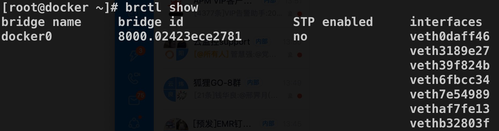

# 17-Docker 网络初探


> 没有智慧的头脑，就象没有腊烛的灯笼。——列夫·托尔斯泰

从本节课开始，我们将正式进入 Docker 网络这一重要环节，在开始介绍 Docker 网络之前，我们先来了解一下 Docker 网络是如何工作的。

## 1. docker0 网桥（Bridge）

我们在 Linux 宿主机上面启动了 Docker Daemon 进程之后，通过 ifconfig 查看，会发现多了一个叫 docker0 的网卡，这个就是 docker0 网桥。

```bash
[root@docker ~]# ifconfig
docker0: flags=4163<UP,BROADCAST,RUNNING,MULTICAST>  mtu 1500
        inet 172.17.0.1  netmask 255.255.0.0  broadcast 172.17.255.255
        ether 02:42:3e:ce:27:81  txqueuelen 0  (Ethernet)
        RX packets 3643  bytes 311618 (304.3 KiB)
        RX errors 0  dropped 0  overruns 0  frame 0
        TX packets 3017  bytes 3388653 (3.2 MiB)
        TX errors 0  dropped 0 overruns 0  carrier 0  collisions 0
```

网桥，简而言之，就是**早期的两端口二层网络设备，用来连接不同的局域网，对数据包进行存储、转发操作**。这里的一个关键点就是两端口，**docker0 网桥连接的就是容器网段和宿主机网段**。

**docker0 网桥是在 Docker Daemon 启动的时候自动创建的**，从我们上面的结果 (inet 和 netmask) 可以看出来 docker0 的 IP 为 172.17.0.1/16。**之后使用 bridge 模式（默认）创建出来的 Docker 容器都将在 docker0 子网的范围内选取一个未被占用的 IP 使用**，并连接到 docker0 网桥上。

docker0 网桥的 IP 地址和子网范围是可以通过参数修改的，使用 CIDR 的格式，感兴趣的同学可以自行查阅 `--bip=CIDR`。


在 Linux 系统中，我们可以通过 brctl 命令来查看网桥的信息（如果提示找不到命令，需要先安装 bridge-utils 软件包）。下面是我的一台运行了多个 Docker 容器的 Centos 机器的 brctl 的显示结果。



我们从 brctl 的结果中可以看到网桥上面连接了很多了 veth 设备，同时 veth 设备总是成对出现的，那么也就意味着 veth 的另一端连接的是容器的 eth0，正如上面那幅图所示。

## 2. iptables

介绍完了 Bridge 之后，我们还需要了解一下 iptables。

iptables 可以简单理解为是**一个命令行防火墙（firewall）工具，我们可以设置一些 iptables 规则来达到流量控制**。Docker 会在宿主机系统上增加一些 iptables 规则，以用来管理 Docker 容器和容器之间以及和外界的通信。

下面我们通过命令 `iptables-save` 命令来查看一下我的这台虚拟机（运行着多个 Docker 容器）上面的 iptable 规则情况，下面是全部命令输出，我们下面就看看 Docker 的数据转发是怎么做的？

```bash
[root@docker ~]# clear
[root@docker ~]# iptables-save
# Generated by iptables-save v1.4.21 on Sun Mar 29 14:28:38 2020
*nat
:PREROUTING ACCEPT [904001:54226848]
:INPUT ACCEPT [904000:54226788]
:OUTPUT ACCEPT [60846644:3691707360]
:POSTROUTING ACCEPT [60846645:3691707420]
:DOCKER - [0:0]
-A PREROUTING -m addrtype --dst-type LOCAL -j DOCKER
-A OUTPUT ! -d 127.0.0.0/8 -m addrtype --dst-type LOCAL -j DOCKER
-A POSTROUTING -s 172.17.0.0/16 ! -o docker0 -j MASQUERADE
-A POSTROUTING -s 172.17.0.4/32 -d 172.17.0.4/32 -p tcp -m tcp --dport 80 -j MASQUERADE
-A POSTROUTING -s 172.17.0.5/32 -d 172.17.0.5/32 -p tcp -m tcp --dport 6379 -j MASQUERADE
-A POSTROUTING -s 172.17.0.6/32 -d 172.17.0.6/32 -p tcp -m tcp --dport 5000 -j MASQUERADE
-A DOCKER -i docker0 -j RETURN
-A DOCKER ! -i docker0 -p tcp -m tcp --dport 8080 -j DNAT --to-destination 172.17.0.4:80
-A DOCKER ! -i docker0 -p tcp -m tcp --dport 6379 -j DNAT --to-destination 172.17.0.5:6379
-A DOCKER ! -i docker0 -p tcp -m tcp --dport 5000 -j DNAT --to-destination 172.17.0.6:5000
COMMIT
# Completed on Sun Mar 29 14:28:38 2020
# Generated by iptables-save v1.4.21 on Sun Mar 29 14:28:38 2020
*filter
:INPUT ACCEPT [450195298:73092369567]
:FORWARD DROP [0:0]
:OUTPUT ACCEPT [802081724:168977653504]
:DOCKER - [0:0]
:DOCKER-ISOLATION-STAGE-1 - [0:0]
:DOCKER-ISOLATION-STAGE-2 - [0:0]
:DOCKER-USER - [0:0]
-A FORWARD -j DOCKER-USER
-A FORWARD -j DOCKER-ISOLATION-STAGE-1
-A FORWARD -o docker0 -m conntrack --ctstate RELATED,ESTABLISHED -j ACCEPT
-A FORWARD -o docker0 -j DOCKER
-A FORWARD -i docker0 ! -o docker0 -j ACCEPT
-A FORWARD -i docker0 -o docker0 -j ACCEPT
-A DOCKER -d 172.17.0.4/32 ! -i docker0 -o docker0 -p tcp -m tcp --dport 80 -j ACCEPT
-A DOCKER -d 172.17.0.5/32 ! -i docker0 -o docker0 -p tcp -m tcp --dport 6379 -j ACCEPT
-A DOCKER -d 172.17.0.6/32 ! -i docker0 -o docker0 -p tcp -m tcp --dport 5000 -j ACCEPT
-A DOCKER-ISOLATION-STAGE-1 -i docker0 ! -o docker0 -j DOCKER-ISOLATION-STAGE-2
-A DOCKER-ISOLATION-STAGE-1 -j RETURN
-A DOCKER-ISOLATION-STAGE-2 -o docker0 -j DROP
-A DOCKER-ISOLATION-STAGE-2 -j RETURN
-A DOCKER-USER -j RETURN
COMMIT
# Completed on Sun Mar 29 14:28:38 2020
[root@docker ~]#
```

iptables 默认有 4 个表：

- ***nat***：地址转换表；
- ***filter***：数据过滤表；
- ***raw***：状态跟踪表；
- ***mangle***：包标记表。

我们这里的输出只有 ***nat*** 表和 ***filter*** 表。其中 ***nat*** 表中有一条规则如下：

```bash
-A POSTROUTING -s 172.17.0.0/16 ! -o docker0 -j MASQUERADE
```

这条规则的含义定义了 Docker 容器和外界的通信，含义是将源地址为 172.17.0.0/16 （docker0 网桥的子网，也就是 Docker 容器发出的数据） 的数据包，当不是从 docker0 网卡发出时做 SNAT 转换。

SNAT 的意思是源地址转换，将 IP 包的源地址转换为相应网卡的地址。这条规则的作用是当我们从 Docker 容器访问外网时，在外边看来就是从宿主机上发出的，外部对于 Docker 容器无感知。

上面这条规则定义 Docker 容器访问外部，那么从外部访问 Docker 容器服务时，是怎么处理的呢？我们可以看一下两条规则

```bash
*nat
...
-A DOCKER ! -i docker0 -p tcp -m tcp --dport 6379 -j DNAT --to-destination 172.17.0.5:6379
...
*filter
...
-A DOCKER -d 172.17.0.5/32 ! -i docker0 -o docker0 -p tcp -m tcp --dport 6379 -j ACCEPT
...
```

其中 ***nat*** 表中的规则含义是将访问宿主机的 6379 端口流量转发到 172.17.0.5 的 6379 端口上。熟悉 redis 的同学这个时候一定反应过来了，172.17.0.5 一定是一个运行着 redis-server 的 Docker 容器，同时在启动的时候做了容器端口 6379 到宿主机端口 6379 的端口映射。

事实确实是这样的。所以我们可以得出结论：**外界访问 Docker 容器是通过 iptables 做 DNAT 实现的**。DNAT 将 SNAT 中的 Source 换成 Destination，表示目的地址转换。

***filter*** 表中的规则用来对流量做限制，这里的这条规则表示允许所有的外部 IP 访问容器，可以通过在 filter 的 Docker 链上添加规则来对外部的 IP 访问做出限制，这里就不再演示了。

不光是与外界通信，Docker 容器之间通信也受到 iptables 规则限制。我们前面也了解到宿主机上面的所有 Docker 容器都位于 docker0 网桥的子网内。同时我们从 iptables 中的输出看到一条 ***filter*** 规则。

```bash
-A FORWARD -i docker0 -o docker0 -j ACCEPT
```

这条规则保证容器之间可以互相通信，如果将 Docker Server 启动参数 `--icc` 设置为 false，则这条规则会被设置为 DROP，容器之间的相互通信就会被禁止。

## 3. IP-Forward

在 Docker 容器网络通信的过程中，还涉及到数据包在多个网卡间的转发，这需要将内核参数 **ip-forward** 打开，参数位于 /proc/sys/net/ipv4/ip_forward。

```bash
[root@docker ~]# cat /proc/sys/net/ipv4/ip_forward
1
```

通常这一步不需要我们手动来设置，Docker server 启动的时候默认会将 ip-forward 设置为 1。

## 4. DNS 和主机名

容器的主机名以及 DNS 是设置在文件 /etc/hostname、/etc/hosts、/etc/resolv.conf 中的，对于容器来说，在容器启动后会覆盖这些文件从而达到修改属性的目的。下面是我的机器上面的示例。

```bash
[root@docker ~]# docker exec -ti 4be4cca01392 sh
/ # mount
...
/dev/vda1 on /etc/hostname type ext4 (rw,relatime,data=ordered)
/dev/vda1 on /etc/hosts type ext4 (rw,relatime,data=ordered)
/dev/vda1 on /etc/resolv.conf type ext4 (rw,relatime,data=ordered)
...
```

同时我们也可以通过参数 `-h HOSTNAME` 和 `--dns=IP_ADDRESS…` 来对 hostname 和 DNS 进行设置。

## 5. 总结

本文介绍了 Docker 网络的工作模式，主要包括 docker0 网桥和 iptables，可能有些同学对于这些网络基础知识看的一头雾水，希望大家可以自己多实践。对于计算机网络的知识学习确实没有什么好的途径，唯有实践出真知。

下一章我们介绍 Docker 支持的多种网络模式。
