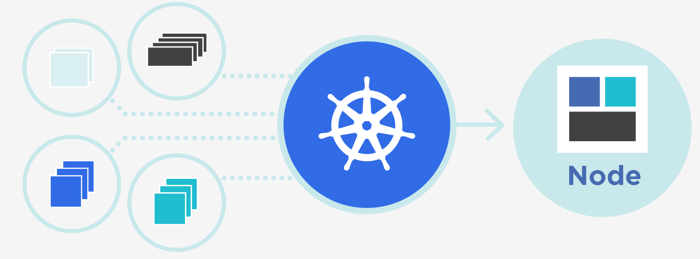

# 30-Kubernetes 是什么？

> 才能一旦让懒惰支配，它就一无可为。——克雷洛夫

这篇文章介绍一下 Kubernetes，主要包括下面三个部分：

1. Kubernetes 是什么
2. Kubernetes 的核心功能
3. Kubernetes 的核心概念

## 1. Kubernetes 是什么

根据 Kubernetes 官方网站（[kubernetes.io](http://kubernetes.io)）上面的定义如下：

> Kubernetes (K8s) is an open-source system for automating deployment, scaling, and management of containerized applications.
>
> It groups containers that make up an application into logical units for easy management and discovery. Kubernetes builds upon 15 years of experience of running production workloads at Google, combined with best-of-breed ideas and practices from the community.

简单翻译一下

> Kubernetes 一个开源的系统，用于容器化应用的自动化部署、扩缩容和管理。
>
> Kubernetes 将多个容器组成一个逻辑单元便于管理。Kubernetes 是基于 Google 内部的 15 年调度经验设计出来的系统，参考了业界的智慧。

这里面提到的 ***Google 内部 15 年调度经验*** 就是业界有名的 ***Borg*** 系统，而 ***逻辑单元*** 实际上就是 ***Pod***，可以认为是 Kubernetes 的精髓设计了。

我们把 Kubernetes 的定义分解一下：

- 容器化应用：Kubernetes 管理的应用都是容器化的，可以是 Docker 容器，也可以是其他容器，比如 Kata 安全容器。容器的好处是应用之间资源隔离，便于管理。
- 自动化部署：Kubernetes 可以将容器组织成应用自动化部署到集群中。
- 扩缩容：扩缩容对应的是应用的副本数可以根据需要进行 scale-up 或者 scale-down。
- 管理：对容器化应用的管理，比如说容器之间的依赖关系，编排关系等。

## 2. Kubernetes 的核心功能

Kubernetes 的核心功能包括：

- 服务发现和负载均衡：不需要修改应用程序去适配一些服务发现的机制。在 Kubernetes 里面可以给应用的每个 Pod 分配一个 IP 地址，然后这些 Pod 前面挂一个 DNS 就可以实现负载均衡了。最重要的是，这些在 Kubernetes 里面实现起来非常的简单。
- 自动装箱（Automatic bin packing）：可以根据容器的描述定义（资源需求和限制，比如 CPU、内存、存储等）将容器自动打包成一个调度单元，并通过特定的调度算法，将其调度到集群的某一台机器上运行。
- 自动修复（Self-healing）：Kubernetes 会帮助我们做一系列的 failover 的处理工作，以达到自动恢复的目的。比如当容器 fail 的时候进行重启，nodes （也就是主机节点）挂掉的时候将其上面的容器重新调度到其他 node 上，当容器不影响预先定义的健康检测时重启容器。
- 存储编排（Storage orchestration）：Kubernetes 支持多种存储，比如本地存储、云产商（GCP 或者 AWS）提供的云存储或者远端存储（NFS，Ceph 等）。我们只需要在配置文件中指定存储类型，Kubernetes 就会自动帮助我们做存储的编排，并保证存储和应用的生命周期一致。
- 应用自动发布和回滚（Automated rollouts and rollbacks）：Kubernetes 提供了应用自动发布和回滚的机制。回滚的版本可以支持保存多个版本。
- 配置管理（Secret and configuration managerment）：secret 是 kubernetes 中提供的用于管理敏感信息的一种 API 对象，我们可以将容器的配置保存为这种配置对象，从而和镜像进行解耦。
- 批任务执行（Batch execution）：Kubernetes 诞生之初对于 Long-running 的服务支持良好，后来慢慢提供对批任务执行的支持，在 Kubernetes 中这种对象叫 Job。
- 弹性伸缩（Horizontal Scaling）：Kubernetes 可以对应用进行弹性伸缩，包括手动和自动的方式。

## 3. Kubernetes 的核心概念

下面介绍几个 Kubernetes 的核心概念，包括：

- Pod
- Deployment
- Service
- Configmap
- Namespace

#### Pod

Pod 是 Kubernetes 中的最小调度单元，一个 Pod 可以由多个容器组成，同一个 Pod 内的容器之间没有进行隔离。容器和 Pod 的关系可以类比进程和进程组的关系，这个也是 Kubernetes 借鉴于 Google 内部调度系统 Borg 的设计。

Pod 内的每个容器可以定义自己需要的资源大小，比如 CPU、内存，同时 Pod 内可以包含一些其他的资源，比如说 Volume 数据卷等。

Pod 是 Kubernetes 的精髓所在，在没有 Pod 之前，如果我们要将两个有依赖关系的容器调度到同一个节点上需要调度器做很多复杂的工作。使用 Pod 之后，我们只需要将 Pod 作为一个单元进行调度就可以了。

#### Deployment

我们的应用会启动在一个 Pod 里面，有时候为了系统的高可用或者应对大流量的时候，需要启动多个应用实例，也就是启动多个相同的 Pod。这个时候就需要 Deployment 了，Deployment 可以理解为一组 Pod 的管理器。可以通过 Deployment 定义 Pod 的一些元信息，比如资源使用限制等，还可以定义一组 Pod 的副本数量。

实际上我们真正的应用管理都是通过 Deployment 来做的，这样应用不管有几个副本我们都只需要管理一个 Deployment 对象即可。Deployment 管理 Pod 在 Kubernetes 里面是通过控制器的方式管理的，控制器会不断的检测 Pod 的状态，比如 Pod 的健康检测是否正常，副本数是否正常，一旦出现异常情况，Deployment 就会通过控制器去做一些操作，比如重启 Pod，以达到期望的状态。

通过 Deployment 我们还可以对应用做到滚动升级、版本回滚等发布运维相关的操作。

#### Service

我们前面说到 Kubernetes 的核心功能的时候提到服务发现和负载均衡就是通过 Service 来做的。举个例子，在 Kubernetes 中，我们通过 Deployment 管理多个 Pod，每个 Pod 对应一个应用实例，比如 Web 服务。每个 Pod 都有一个 IP，但是我们并不希望用户直接去访问 Pod 的 IP，一是这样用户需要自己管理 Pod 的 IP 列表，并实现自己的负载均衡策略；二是 Pod 可能重启，重启之后 Pod 的 IP 会发生变化。对于这种情况就可以通过 Service 来处理。

在 Kubernetes 中 Service 也是一个对象，Service 后面可以关联一组 Pod。Service 对象创建成功之后会映射到一个域名和固定的 IP，这样这个 IP 相当于一个 VIP，用户只需要访问这个固定的 IP 就可以访问的后端的 Pod 中运行的应用了。

Kubernetes 中的 Service 有多种实现，比如 ClusterIP、NodePort、LoadBalancer 和 Ingress 等，这个后面会有专门的章节进行讲解。

#### Configmap

一个正规的开发流程中会包括多个环境，比如开发环境、预发环境和线上生产环境。这些不同环境中使用的代码还是同一套，区别在于配置不同。使用同一套代码保证了我们的 Pod 中使用的镜像是同一个，对于配置，在 Kubernetes 中可以通过一个叫 Configmap 的对象来管理和创建。这样就将配置和应用进行了解耦。

#### Namespace

Namespace 这个词在很多地方都有使用，比如编程语言中的命名空间。在 Kubernetes 中，Namespace 可以理解为一个资源的逻辑空间，包括鉴权（rbac）、资源管理等。Kubernetes 中的每个资源，比如刚才 Pod、Deployment、Service 等都有一个 Namespace 属主，不同 Namespace 的资源不能跨 Namespace 访问。另外一个 Namespace 内的资源要求命名具有唯一性。

## 4. 总结

本文向大家简单介绍了 Kubernetes 的基本情况，但是 Kubernetes 的特性非常多，也就意味这篇文章只能管中窥豹似的简单介绍一下，后面的文章会为大家尽量详细的介绍 Kubernetes 的使用和原理。