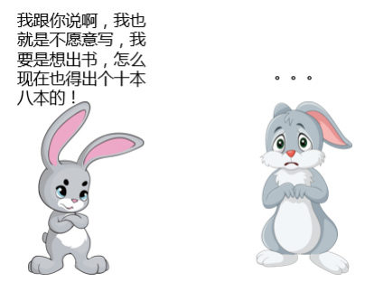

# 04-与“难缠面试官”不得不说的故事

> 每个人都是自己命运的主宰。 ——斯蒂尔斯

上一趴我们主要聊的是**“从自身做起”**，完善自己的面试情商，争取在面试过程中不犯错，但是呢，不排除我们在面试过程中，遇到各式各样奇葩的面试官。比如，在我来蚂蚁之前，曾经去某二线互联网车企面试：

当时的我啊，也是“年轻气盛”，直接回复他：那您真厉害，我就等着拜读您大作了，到时候别忘了打电话通知我一声。然后扭头离开了。

当时的我啊，也是“年轻气盛”，直接回复他：**那您真厉害，我就等着拜读您大作了，到时候别**

**忘了打电话通知我一声**。然后扭头离开了。

后来随着自己开始不断地面试别人，加上参加了更多的面试，也结识了身边更多的面试官，发现

每个面试官都会有自己不同的性格，甚至于同一个面试官，在不同的时间和心情下也会表现出不

同的面试风格。

所以，接下来的时间，我们一起聊聊那些“**奇葩的面试官**”。

**“谦虚和善”到不像面试官的面试官**

这里要**高能预警**下！这类面试官看上去非常友善，用轻松的语调寒暄、用夸赞的语气回复，所以

很多人在面对这类面试官的时候会心情愉快，自信暴涨。

**这都是假象！**

**这都是假象！**

**这都是假象！**

重要的事情说三遍。为什么说的这么肯定呢？因为我自己大多数时间也属于这种。虽然看上去非

常容易打交道，但是实际上却还是很有城府，内心非常严谨，拥有还比较强的洞察力。但是，这

种面试官会非常喜欢赞扬、同意的对话方式，让你感觉自己面试的表现非常成功，然而实际上稍

有不慎，就会被默默淘汰。

