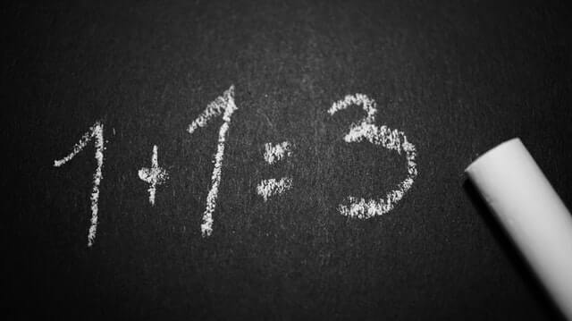

# 14-**“多干多错，少干少错？”**

> 路漫漫其修远兮，吾将上下而求索。——屈原

不知道从什么时候开始，职场上有一个很通俗的观点：多做多错，少做少错，不做不错。

这个观点往往还是那些看起来很靠谱的“老同事”传达出来的，乍一听似乎有点毁三观，稍微一想却又有点道理。为什么呢？让我们来看看小灰的经历：

由此很多人，尤其是职场老人总结出了一条职场潜规则：**多干多错，少干少错，不干不错**。并且不断向外扩散，当做自己明哲保身的真理来用了。

那么这句话到底有没有道理呢？

**从短期利益上看，不犯错的确是可以规避很多错误带来的风险**。这当然是没问题的，可是仔细想想呢？

**从长远的角度看**，这样所谓的潜规则是荒谬的。

## **一、老板视角**

我们先来想想，老板为什么要雇佣你？是因为你不犯错么？不是吧。**老板雇佣你是为了产出成果的。** 如果你少干甚至不干，的确不容易犯错，但是也不会有什么成果，试想一下，你的老板为什么要雇佣一个“无法产出成果”的人呢？总不会是因为你长得漂亮或者长得帅气吧。

退一万步说，我们假设一个公司就是需要少犯错的人，每个人都遵守着“少做少错”这样明哲保身的规则，那么这样的公司会怎样？

我想，这样的公司，办事没效率、拖拉、不靠能力靠关系，遇事能躲就躲，能甩锅就甩锅。日子久了，问题多多，能处理问题的人又都走了，自然也就很难长久。

所以，一个员工的价值不在于“少犯错”，而在于“多成果”。优秀的老板，衡量下属是不是合格，依据的绝对不是他犯了什么错误，而是他为公司、为老板创造了多少价值。

这也是资本主义经济观所决定的。

从这个角度上说，其实仍然有一种例外，就是那些所谓的“关系户”，他们可能是大客户的千金，某书记的宝贝或者是大老板的亲朋。同样，留住他们也不是因为他们少干少错，而是因为他们的存在能够带来更高的价值和成果。

## **二、个人视角**

如果说前边这一段还是从老板、从公司角度考虑哪种人才优秀，那么我们再从个人角度想想。

经验这个东西都是经历过、错过之后才能总结获取的。我们说一个人人生阅历丰富，绝对不是再说因为他富二代的身份一路顺风顺水，而是他浮浮沉沉的经历多；我们聊一个人恋爱经验丰富，也绝不是因为他跟女友长跑了几个“七年之痒“，而是因为他有了几段没有修成正果的恋情。

人嘛，只有错过，才能考虑为什么错，才会想办法避免这个错误。

到了最后，干多了错多了经验也多了，慢慢错误就变少了。这样的人，才能成为“解决问题”的人，才是职场上不可缺少的人，甜头在后边。

少干多错，就是因为做的少，经验积攒不起来。以前做这个可能会犯错误躲开了，那以后做这个还是犯错。总体来说，其实个人能力没有提升，这种人没有什么大用处，只能做小活，运气好可以这样干一辈子。

不干不错的，因为他什么也没有干，如果有关系，还能混混，没关系，迟早被踹了。

于是，最终获胜者还是多干的人，平庸的是少干的人，自以为聪明把自己坑了的是不干的人。

## **三、全局视角**

可能有的人还是固执地选择拒绝犯错，担心犯错的风险和结果自己承受不来，所以干脆选择少做不做。

大家跳出自己是个普通职员的角度，想一想，老板会赏识什么样的人？

是默默无闻，既不知道他做了什么，也没看到他犯了什么错，更见不到他解决了什么问题的人？

又或者是到处都有他的身影，偶尔犯一些错误，但是积极努力解决问题，不断提升的人？

我想结果显而易见的吧。

在职场上就是这样，不要害怕出错。你出了错就会有人关注，我们本身一介小人物，能犯多大的错，给公司带来多大的损失？

也许当你犯了错，并及时弥补甚至是改进，更能够得到领导的青睐吧。

那么最后，我也多说一点，“多做”与“少做”也有个边界，不要去做别人应该做的事情，更不要去尝试做自己尚且没有能力去做的事情，优先提升自己再多干多做。

不要相信所谓老人言“多干错，少干少错”，请不要做一个没有亮点、没有进步，只能抱怨和陷在基础工作的泥潭中无法自拔的人。
