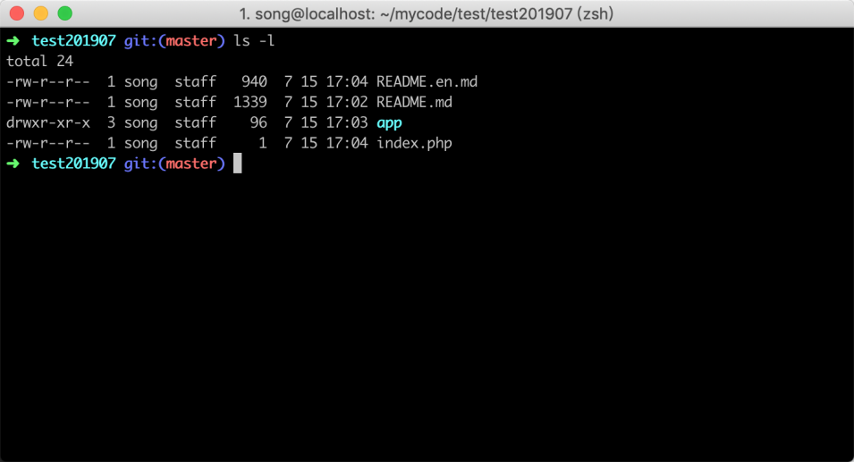
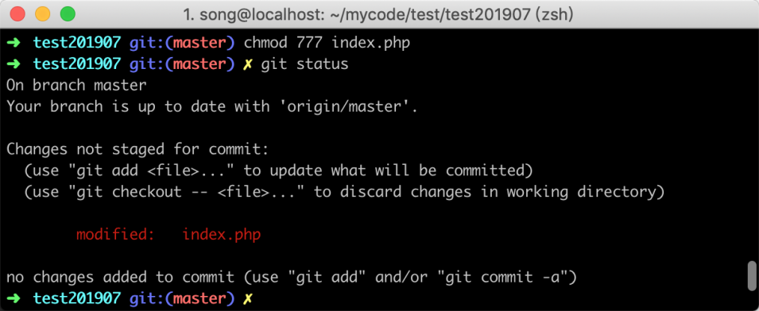
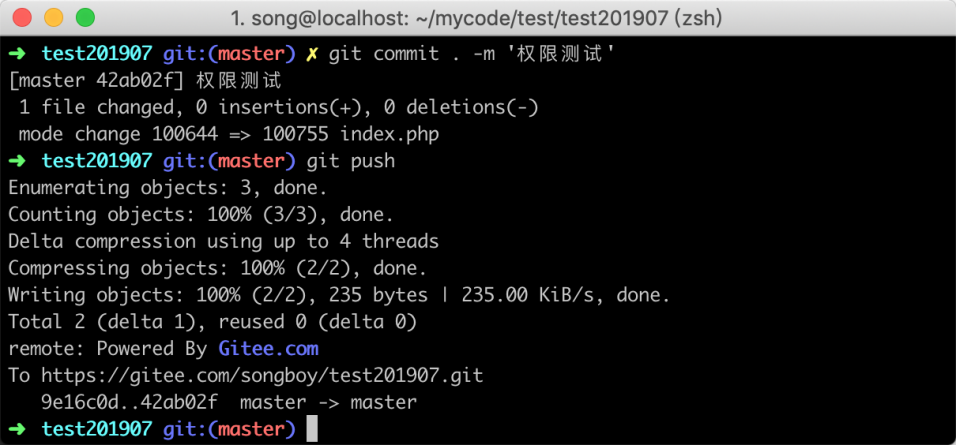
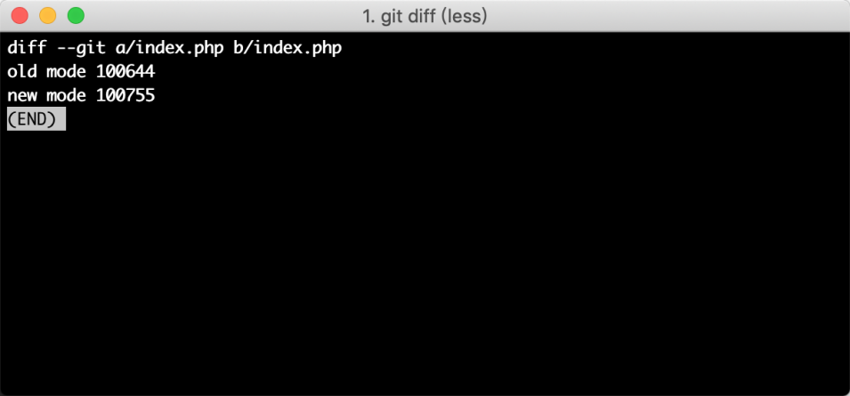
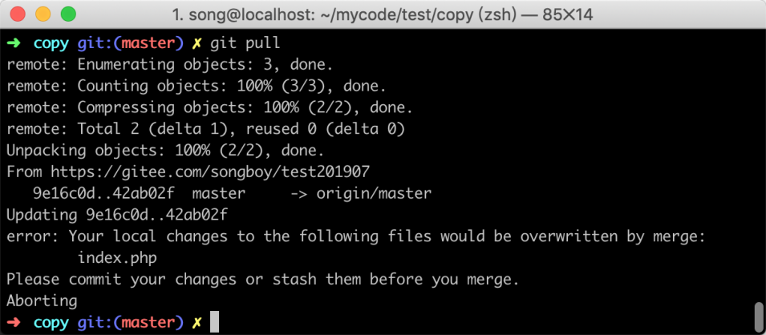
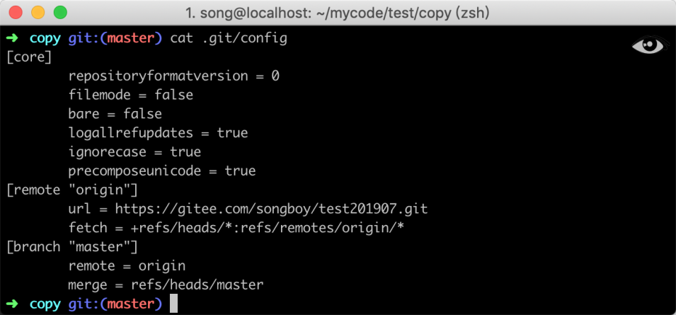
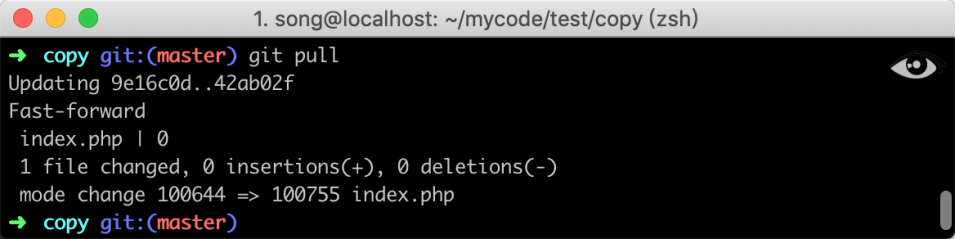

# 07-忽略文件权限：解决提示文件权限被修改问题


> 老骥伏枥，志在千里；  烈士暮年，壮心不已。  ——曹操

Git 在进行版本管理的时候，默认将文件权限也包含在内，但很多时候，我们可能并不需要让文件权限保持一致。比如当我们代码发布到生产服务器中，然后修改了某个文件的权限，当我再次拉取代码时，如果这个文件正好有代码修改，这个时候 Git 就会提示文件冲突。

## 7.1 权限冲突实验

为了让大家更好地理解忽略文件权限，下面我做一个简单的实验，来演示文件权限冲突的情况：首先我们模拟两个客户端，通过 cp 命令先复制一个版本库，并进入其中一个目录，参考命令如下：

```
cp -r test201907   copy  &&  cd test201907
```

### 7.1.1 修改权限

进入文件夹之后，先通过 `ls -l` 命令，查看当前文件夹权限信息，结果如下图所示：



然后通过 `chmod` 命令，修改一个文件的权限，然后使用 `git status` 命令查看文件修改列表，参考命令如下：

```
chmod 777 index.php && git status
```

命令执行后结果如下图所示，在图中可以看到 `index.php` 文件已经变成了 `modified` 状态



### 7.1.2 提交代码

接着再将 index.php 文件提交到版本控制器，并推送到远程，参考命令如下：

```
git commit . -m '权限测试' && git push
```

命令执行后结果如下图所示：



### 7.1.3 冲突验证

现在我们进入另外一个文件夹，参考命令如下：

```
cd ../copy
```

进入文件夹之后，先不要拉取代码，然后同样修改 `index.php` 文件的权限，参考命令如下：

```
chmod 755 index.php
```

文件权限被修改之后，我们使用 `git diff` 命令查看一下文件修改的内容，可以看到原始文件的权限是 644，新的权限已经变成了 755，如下图所示：



在确认文件权限修改之后，我们再在这里拉取一下代码，会提示文件冲突，如下图所示：



通过上面的实验可以看出，git 会记录文件权限，如果两个地方的文件权限不一样，很有可能会导致代码冲突问题。

## 7.2 解决办法

在 Git 进行代码管理时，如果不想让 Git 记录文件权限，可以通过 git 配置让其忽略文件权限的信息，参考命令如下：

\#当前版本库

```
#当前版本库
git config core.filemode false
```

如果你想让你电脑上所有的版本库，都忽略文件权限，可以在命令中加入 `--global`，参考命令如下所示：

```
git config --global core.fileMode false
```

当上面的命令被执行之后，就设置了忽略文件权限，此时通过 `cat` 查看配置文件`.git/config`，参考命令如下：

```
cat .git/config
```

在配置文件中，如果看到 `fileMode false` 则代表配置成功，如下图所示：



这时候再次使用 `git pull` 命令更新代码就不会再提示有冲突，如下图所示：



## 7.3 小结

在这一节当中，主要通过一个小实验演示了文件权限冲突问题，以及如何解决此问题，包含以下几个知识点：

1. Git 会记录文件的权限信息；
2. 可以通过配置忽略文件权限；
3. 忽略文件权限配置，支持按照版本库和全局。
