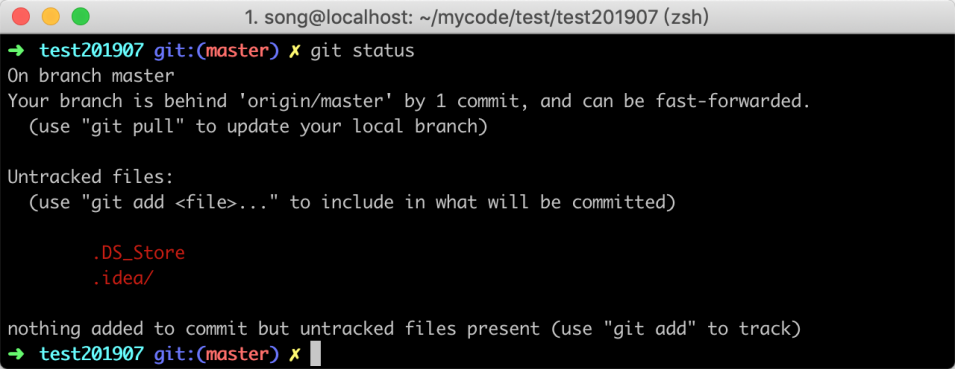
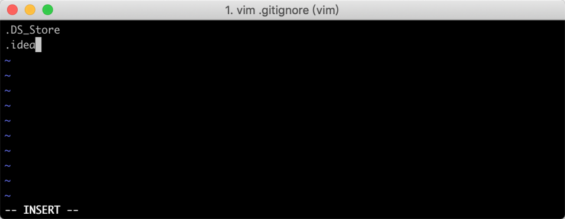
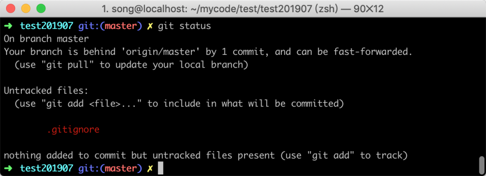
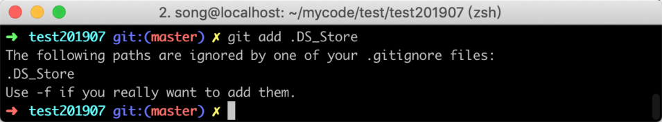
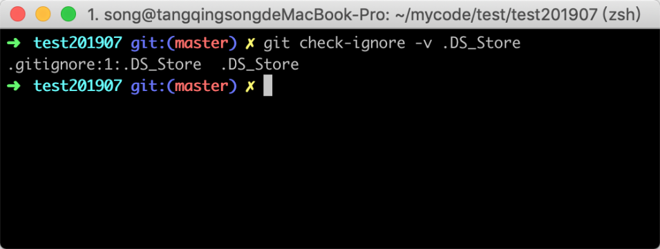
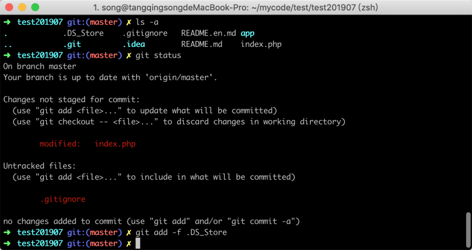

# 08-忽略指定文件或目录：排除项目配置文件


> 合理安排时间，就等于节约时间。 ——培根

在平时工作中可能需要把一些文件放到 Git 工作目录中，但又不想把他们提交到版本控制器里面，比如说，项目的配置文件、IDE 自己产生的目录文件等等。

## 8.1 问题场景

每次提交代码之前，我都会用 `git status` 来查看有哪些文件有改动，但有时候，莫名其妙多出一些不是我手动增加的文件，显示为 `Untracked files` 状态，如下图所示


上图显示的 `.DS_Store` 和 `.idea` 是新增加的两个文件，但这两个文件并不是我手动新增加的，而是程序自动产生的，这种文件对项目没有实际上的意义；还有可能导致在团队协作中让两个人的代码冲突，如果直接删除这种文件也没用什么用，因为过不了多久程序又会自动产生，所以最好的办法就是让 `git` 对他视而不见。

## 8.2 解决方案

这种需求其实非常常见，因此 `Git` 本身也提供了忽略某些文件的功能，解决起来相对比较简单；我们可以在在 `Git` 工作区的根目录下创建一个`.gitignore` 文件，把想忽略的文件名或者目录填进去，Git 就会自动忽略这些文件，如下图所示



在上图中我把 Mac 系统中经常产生的 .DS_Store 和 IDE 产生的 .idea 放到了文件中去，每个文件占用一行。

保存修改之后，我们再次在 Git 工作区的根目录使用 `git status` 命令查看，可以看到之前的提示已经没有了，说明已经生效：



## 8.3 常见问题

在添加 `.gitignore` 文件后可能会遇到一些相关的问题，我把比较常见的问题在下面列出来，如果你遇到了可以参考解决。

### 8.3.1 无法添加`.gitignore`

在 Windows 系统中因为文件命名的规则是 `.` 之前必须要有字符，所以如果你直接在资源管理器里新建一个 `.gitignore` 文件，系统会提示你必须输入文件名；这个时候，你可以通过一些第三方的文本编辑器新建一个文本文件，然后通过 “保存” 或者 “另存为” 就可以把文件保存为 `.gitignore`，如下图是笔者使用 notpad++ 保存



### 8.3.2 添加忽略文件

`.gitignore` 文件支持通配符，当你在文件中添加一些忽略规则之后，可能匹配过于宽松，导致某一个文件无法提交到 `git` ; 这个时候你有两种方式来处理，

或者你发现，可能是 `.gitignore` 写得有问题，需要找出来到底哪个规则写错了，可以用 `git check-ignore` 命令检查：

```
$ git check-ignore -v 文件名
```



Git 会告诉我们，`.gitignore` 的第 3 行规则忽略了该文件，于是我们就可以知道应该修订哪个规则。

除了修改 `.gitignore` 文件的规则之外还可以使用强制添加的方式，如下图所示



如果你确实想添加该文件，可以用 `-f` 强制添加到 Git：

```
git add -f .DS_Store
```

## 8.4 小结

当需要忽略某些文件时，可以在 git 工作目录中编辑 `.gitignore` 文件的规则，`.gitignore` 文件本身要放到版本库里，并且可以对 `.gitignore` 做版本管理，大部分情况下以下类型会把它忽略：

1. 忽略操作系统自动生成的文件，比如缩略图等；
2. 忽略编译生成的中间文件、可执行文件以及一些编辑器自动生成的文件；
3. 忽略你自己的带有敏感信息的配置文件，比如存放口令的配置文件；
