# 09-图形工具使用：各系统通过图形管理git代码仓库


> 我们有力的道德就是通过奋斗取得物质上的成功；这种道德既适用于国家，也适用于个人。 ——罗素

在 Windows 中很多人都习惯使用图形化操作，在这一节中，我教大家怎么使用图形化来操作 Git，主要包含图形化工具安装、图形化的常用操作，经过前面章节的知识后，图形化操作理解起来就非常简单；

大部分般情况下，我依然并不推荐大家使用图形化操作，因为命令行操作用习惯之后，操作速度会更快。

## 9.1 安装软件

首先，我们需要安装一个图形化的 Git 管理工具，在 Windows 中 `TortoiseGit` 非常流行，因此，我们在这节中主要使用它来进行讲解，主要包含主程序安装、配置向导、软件汉化三个部分。

下载地址：

```
https://download.tortoisegit.org/tgit/2.8.0.0/TortoiseGit-2.8.0.0-64bit.msi
```

### 9.1.1 主程序安装

打开安装包，可以看到一个安装向导，点击 `next` 按钮即可，如下图所示

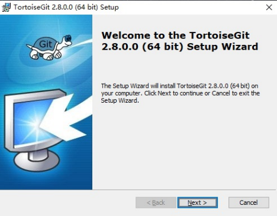

当点击下一步之后，会进入一个确认安装位置界面，我一般喜欢将软件安装到 D 盘当中，你也可以默认，然后单击 `next` 按钮，如下图所示：

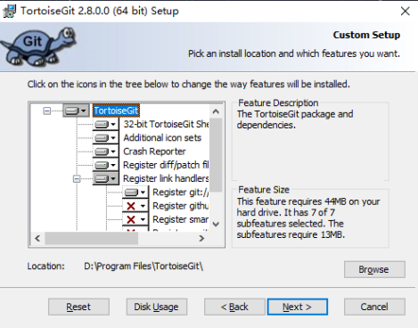

在选择软件安装位置，点击下一步之后，就会开始进行安装，安装的过程大概在 30 秒作业，具体时间会根据你电脑的 CPU 和硬盘速度所决定，如下图所示：

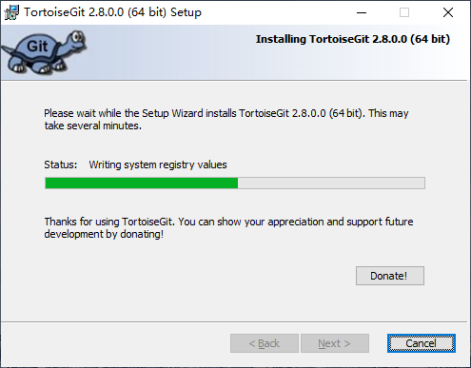

### 9.1.2 配置向导

当软件自己安装完成之后，就会进入配置向导页面，在这个页面当中会让你选择语言，但因为你还没有安装语言包，所以其实只有一个 `English` 可以选择，如下图所示

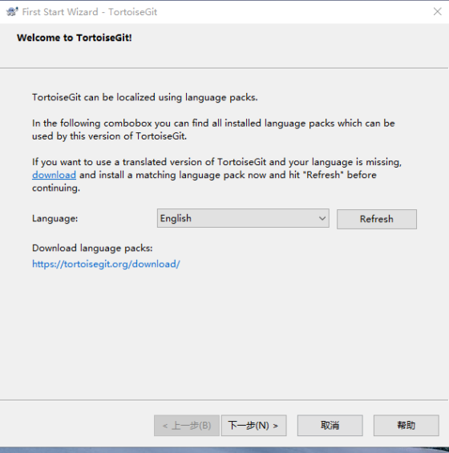

在上图点击下一步之后，又会出现一些提示信息，无需理会它直接点击下一步，如下图所示：


接着会进入一个关键的页面，小乌龟是基于 Git 的，所以这里需要你选择 Git 的安装位置，不过一般他会自动识别 Git 目录的，如下图所示

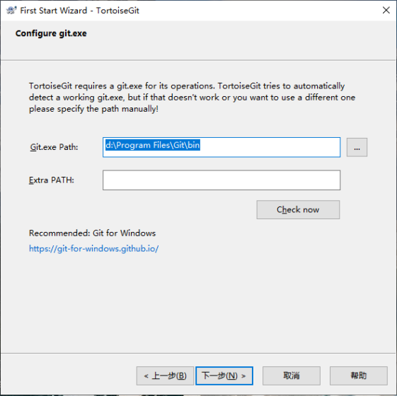

在前面，我们学过使用命令配置昵称和邮箱，使用图形界面也同样会让你输入昵称和邮箱，如下图所示

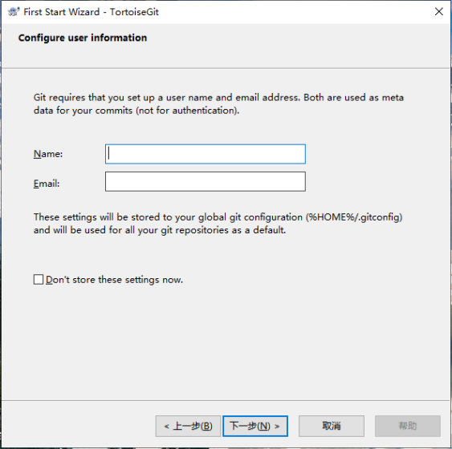

接着，会让你配置一些权限认证方式，这里你可以忽略它，直接点击下一步即可，如下图所示

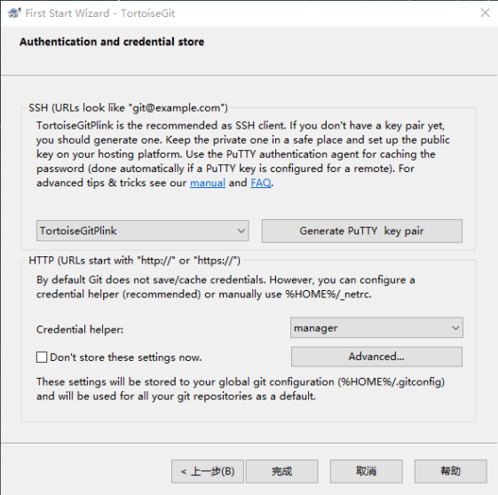

### 9.1.3 软件汉化

打开汉化的可执行文件之后，会弹出一个欢迎页，点击 `下一步` 按钮即可，如下图所示

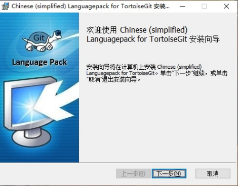

在欢迎页点击下一步之后，会自动进行汉化，汉化完成之后会提示你汉化完成，如下图所示
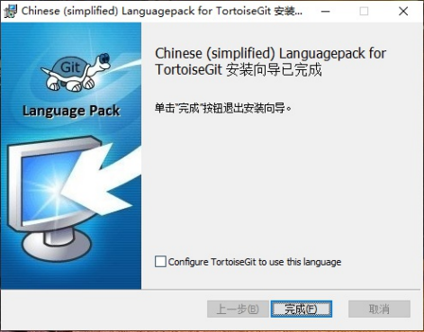

## 9.2 图形基本操作

Git 的功能比较多，这里讲解图形化的几个常规操作，主要是拉取代码、提交代码、推送代码。

### 9.2.1 克隆 (clone) 代码

在一个文件里面单击鼠标右键，可以看到，右键菜单当中多出了三个选项，其中有一个 `Git 克隆...`，这个其实对应的就是命令行中的 `git clone`，如下图所示

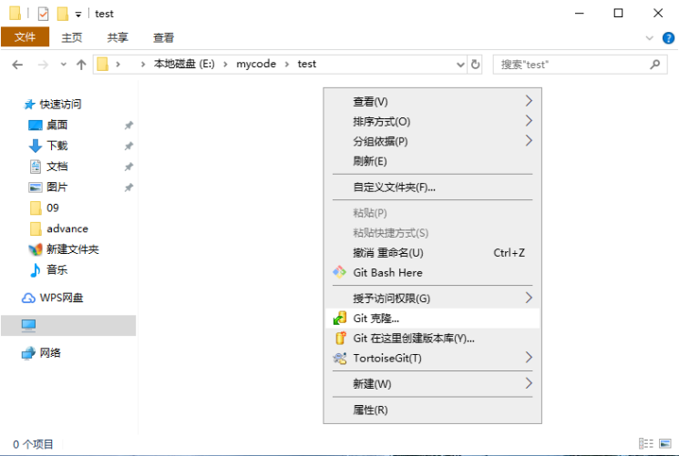

在右键菜单中，选择 `git clone` 之后，会弹出一个确认框，再确认框中会显示你要拉去仓库的地址，以及本地存放路径等相关信息（如果你剪贴板中有一个 Git 地址，它会自动将地址放入确认框中)，如下图所示

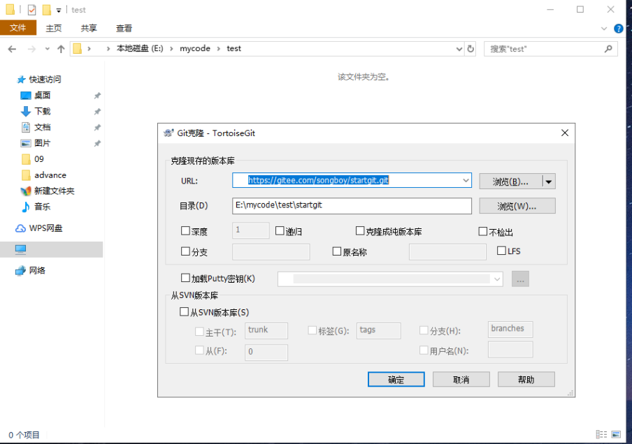

在确认框中点击`确定`按钮，Git 就会开始工作，如果你是通过 HTTPS 拉取，并且第一次去拉取会弹出一个验证框，让你输入用户名和密码，如下图所示：

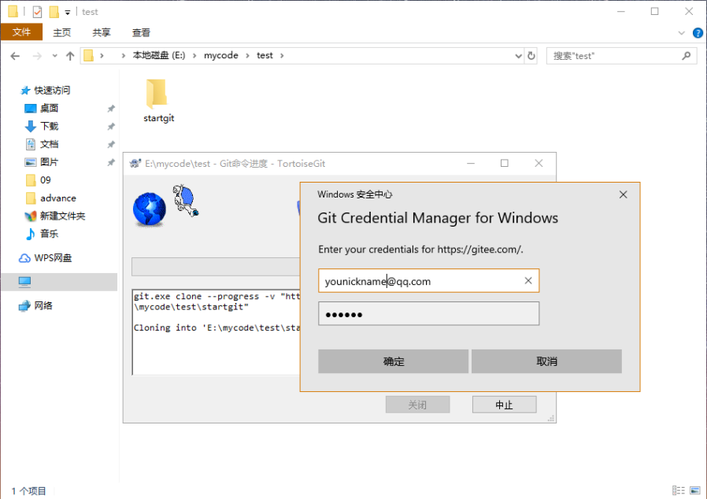

在弹出的认证框中，输入你的认证用户名和密码，然后点击确定，就完成了拉取步骤，如下图所示：

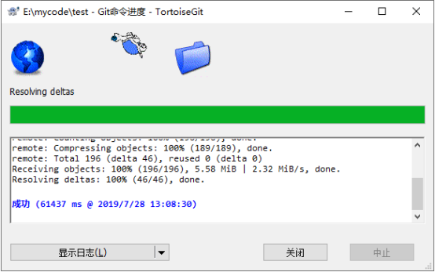

在图中可以看到成功的提示，以及整个克隆代码的时间。

### 9.2.2 拉取 (pull) 代码

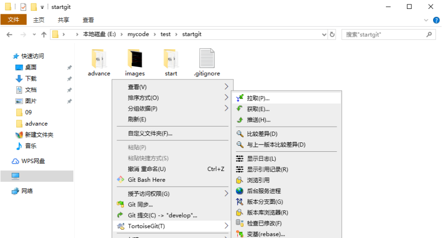

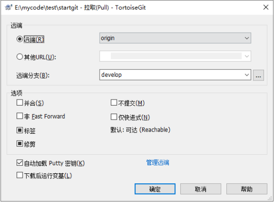

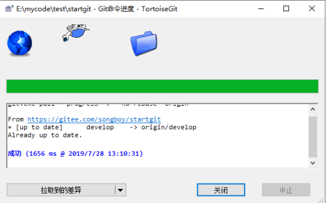

### 9.2.3 提交 (commit) 代码

在修改文件后，如果我们在命令行中提交代码的命令为 `git commit 文件名 -m '备注'`, 在图形操作中则是在 Git 的工作目录中，单击鼠标右键，然后在弹出的菜单中选择 `Git 提交...` 选项，如下图所示：

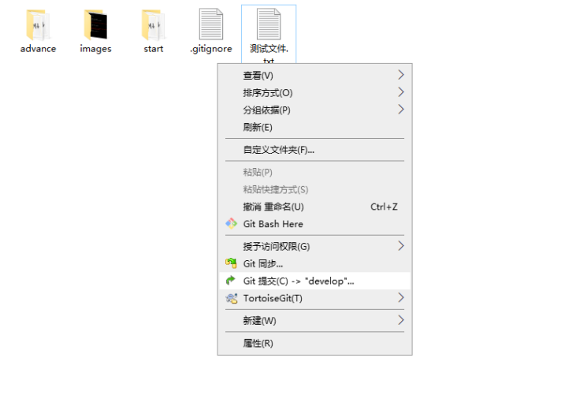

接着会出现一个确认框，然你输出注释，下面还有一个变更列表，在变更列表中你可以勾选需要提交的文件，如下图所示：

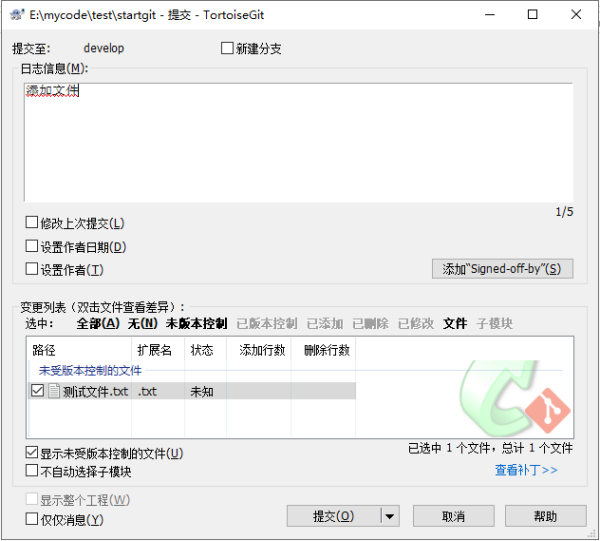

### 9.2.4 推送 (push) 代码

在点击`提交`按钮之后，会看到一个提交成功的输出信息，在下方还有一个`推送`按钮，点击这个按钮就会将代码推送到远端仓库，如下图所示

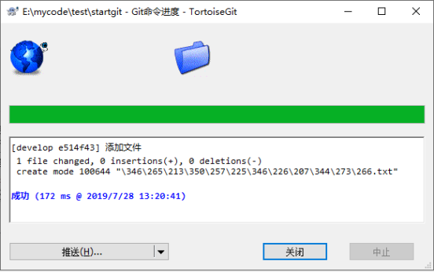

### 9.3 查看历史修改

Git 命令行与图形界面操作我觉得大部分情况下都是命令行比较好用，但也有少数几个功能图形化更加有优势，比如查看仓库历史改动情况用命令行操作起来比较繁琐，而图形化操作就比较方便；下面介绍主要介绍怎么使用图形化查看提交记录和对比代码差异。

### 9.3.1 提交记录

有时候你提交了代码，单想回过头来看下刚查提交了哪几个文件，这个时候你可以在代码仓库中，单击鼠标右键，在 Git 的选项中找到 `显示日志` 这个选项，如下图所示

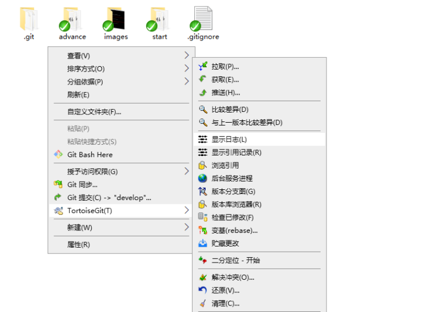

### 9.3.2 查看详情

点击显示日志之后，会弹出一个窗口，在窗口主要有两部分内容，提交日志，和变动详情如下图所示

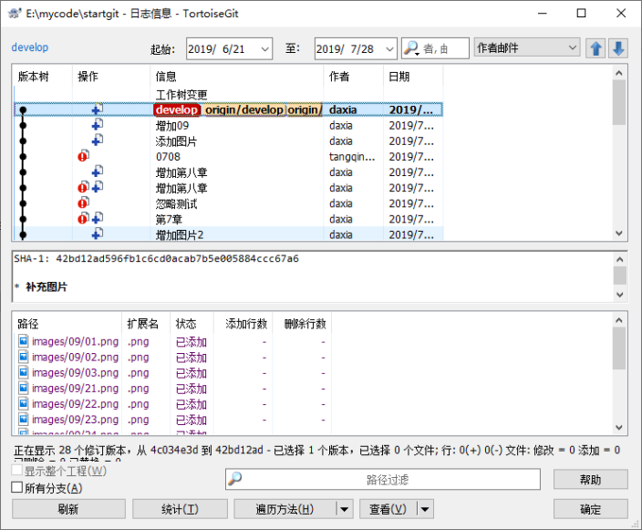

在图中可以看到提交记录中会显示操作类型、备注信息、作者、日期等信息，在下方的窗口中则是当前选中的提交记录改动详情。

## 9.4 小结

在这一节中主要讲到了如何安装 Git 的图形化工具、以及工具的常用操作方式，有以下几点需要注意：

1. 安装 TortoiseGit 工具之前需要先安装 Git
2. 图形化工具操作速度，不如命令行操作
3. 比较适合用于最终历史改动记录
