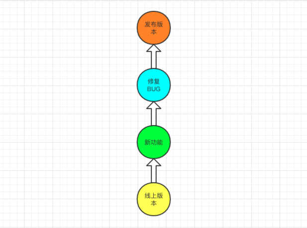
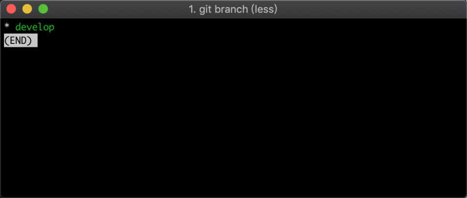
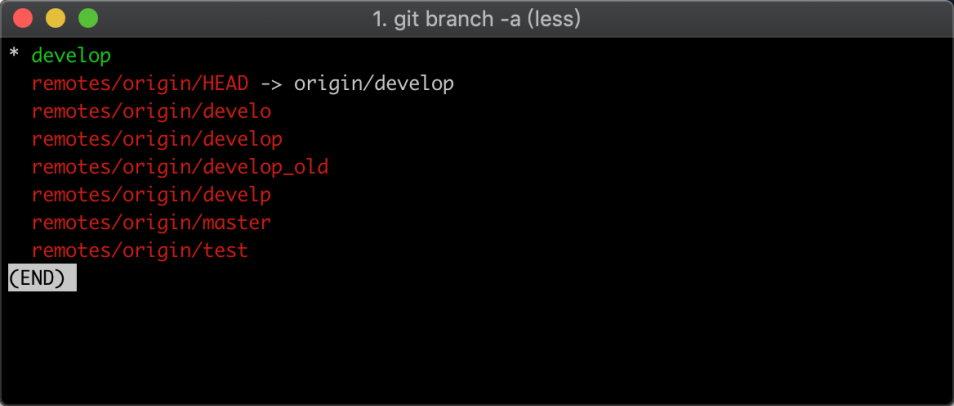
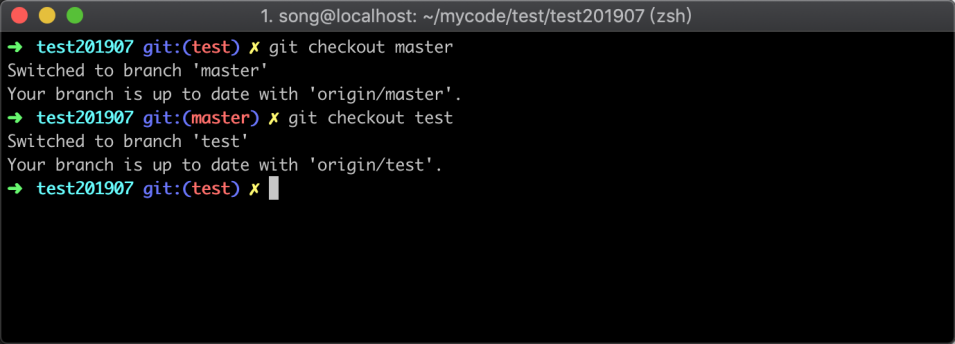
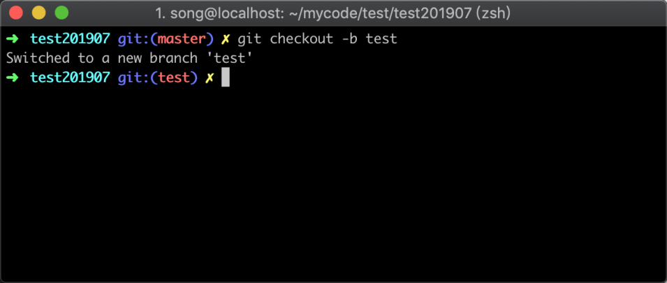
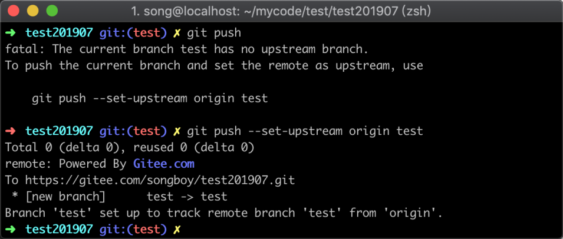
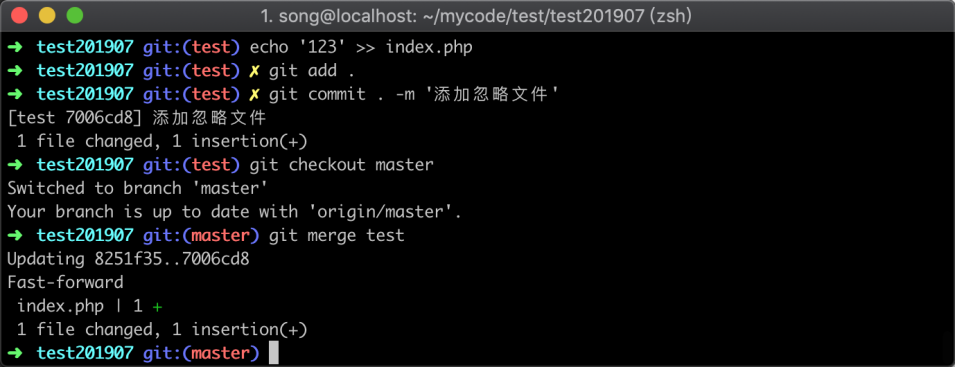
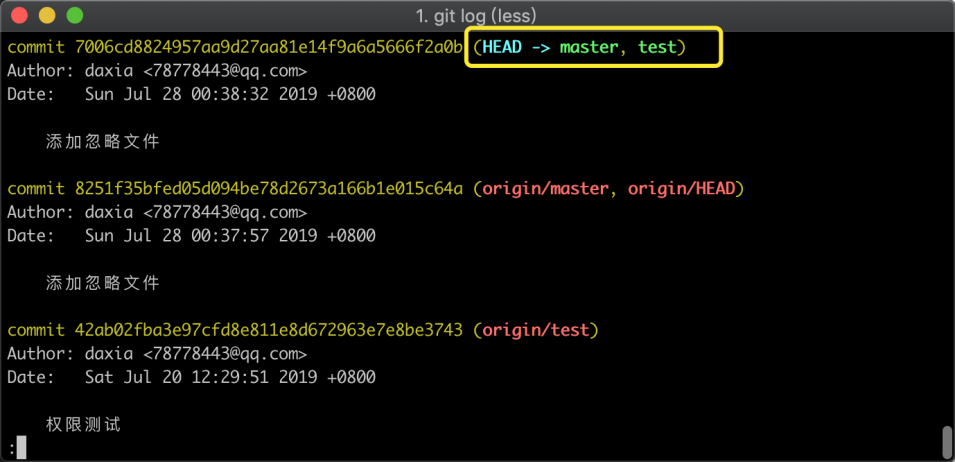
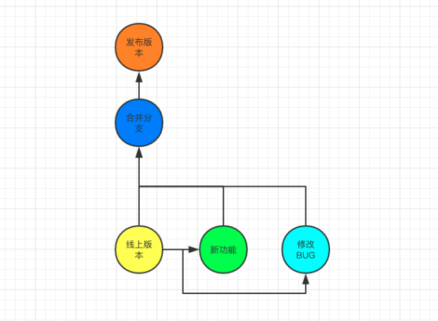

# 10-分支管理：掌握快速切换分支和新建分支能力


> 耐心是一切聪明才智的基础。 ——柏拉图

在最开始学习本专栏时候，我提到了 Git 非常好用的一个功能，是客户端也可以随意对分支进行管理。在这一节当中，我们将具体展开讲解：为什么要使用分支，以及如何管理分支等。

## 10.1 为什么要使用分支

在工作当中，你可能会遇到这样的情况，有一天有人告诉你线上出现紧急 BUG，需要你马上修复并上线。

### 10.1.1 没使用分支

假设我们现在是单分支在管理代码，在有人通知你修复 BUG 之前，你正在开发一个新功能，这个功能还没有开发完成，而且一时半会也没办法开发完，如下图所示：



在图中可以看到，如果你在这个基础上去修复 BUG 并发布到线上去，就会把还没有开发完成的功能发布上去，这样很有可能造成新的问题。

所以你可能会把未开发完成的代码文件手动先备份，然后将代码回滚到线上版本，再在这个基础上去修复 BUG 上线，这种方式虽然可以实现，但显然是一个很麻烦的事情。

### 10.1.2 使用了分支

那现在，我们如果使用多个分支，可以怎么去解决呢？假设我们线上生产环境用的是 `master` 分支，平时开发使用 `develop` 分支开发，同样遇到这个问题的时候，我们可以基于 `master` 分支上复制出一个新分支取名为 `temp_bug` 临时分支，如下图所示：


在图中有一个分支单独用来修复 BUG，确认修复无误后，再将这个分支提交的代码合并到 `master` 分支中，然后将 master 分支上线，就不会影响我们正在开发的新功能了。

## 10.2 查看分支

在学习分支管理之前，我们先来查看一下分支。分支分为两种，一种是本地已经存在的，还有一种是服务器上有，但本地不存在的分支，查看的方式稍有区别。

### 10.2.1 查看本地的分支

Git 查看分支的命令为 `git branch`，在不带参数的情况下，默认查看到的是本地分支列表，参考命令如下：

```
git branch
```

我在我的一个 Git 目录中，把命令执行成功之后，返回的结果如下图所示：



在图中只看到一个 `develop` 并且为绿色，说明当前本地的仓库中只有一个分支，绿色则代表当前所处的分支。

### 10.2.2 查看所有分支

在 `git branch` 中再加入一个 `-a` 参数，可以理解为 `all` 的意思，就是查看本地的分支和远程的所有分支，参考命令如下：

```
git branch -a
```

现在我还是在这个目录中去执行，看到的结果和之前就不一样了，如下图所示：



在图中可以看到列出了很多个分支名，其中包含了绿色的和红色的。红色的有个特点：都是以 `remotes/` 开头，这说明这个分支并不在本地。

## 10.3 新建分支

新建分支有两种情况，第一种是远程已经有的分支，需要把它在本地也同样创建一份；还有一种是新建一个远端和本地都不存在的分支。

### 10.3.1 导入远程分支

把远程分支在本地创建，可以通过 `git checkout 分支名` 命令进行，这个命令其实是切换分支用的。但当它发现你本地不存在这个分支，会自动找到远程对应的分支然后在本地进行创建，参考命令如下所示：

```
git checkout master
```

在执行前，需要确保这个分支在远程或者本地已经存在，执行结果如下图所示：



切换分支成功之后，会提示已经切换分支成功，以及提示你当前分支对应远程的分支名。

### 10.3.2 新建本地分支

新建一个远程和本地都不存在的分支方式，和切换分支区别不大，只需要在 `git checkout 分支名` 中间加入参数 `-b` 即可。通过这种方式，创建的分支结构和内容会与当前所在的分支一模一样，也就是说，它其实就是复制了当前的分支，参考命令如下：

```
git checkout -b test
```

在命令执行之后，参考结果如下图所示：



在提示中，同样可以看到会告诉你切换分支成功，但没有提示你对应远程的分支名，因为远程现在还不存在这个分支。所以你此时如果使用 `git push` 是不能直接推送的，需要在第一次推送的时候指定远程分支名，参考命令如下图所示：

```
git push --set-upstream origin test
```

在下图中，演示直接推送失败返回的信息，和加上对应参数成功的返回信息，如下图所示：



在上图中可以看到，当你没加参数的时候会提示你失败，并告知你相应的解决办法；当把它提示的命令执行之后便推送成功，并且在返回的信息中告知了你远程也创建了一个 `test` 分支。

## 10.4 合并分支

假设我们现在有三个分支，分别是:`master` 生产环境、`develop` 开发环境、`test` bug 修复分支。现在我在 `test` 分支中修复了 BUG，需要发布到线上生产服务器上，那么我们就可以通过合并分支的方式将 `test` 分支的代码合并到 `master` 分支中去。

### 10.4.1 合并代码

合并的时候， Git 会对比两个分支代码的差异，当 test 分支处于比较新的状态时候，Git 会将 test 分支的代码和提交记录复制到 master 分支中来，合并代码的参考命令如下：

```
git merge test
```

在没有代码冲突的情况下，执行合并命令的返回结果信息如下图所示：



在图中可以看到总共一个文件被修改，其中 `index.php` 文件增加了一行代码。

### 10.4.2 查看合并记录

在代码合并之后，可以通过 `git log` 方式查看到合并记录，参考命令如下：

```
git log
```

在命令执行完毕之后，会返回仓库的提交记录，如下图所示：



在图中黄色框中可以看到，我刚才在 test 分支中的提交记录，已经在 master 分支出现。

## 10.5 删除分支

一般用来修复 BUG 的分支，我们可以把它当做是一个临时分支，当合并到 master 之后，就可以删除掉它了，这样可以减少 Git 仓库的体积。删除分支有两种方式，普通删除和强制删除。

### 10.5.1 普通删除

Git 中删除分支的命令为 `git branch -d 分支名`，其中参数 `-d` 代表的是普通删除。一般情况下，删除使用普通删除即可。普通删除相对来说比较安全，避免造成数据丢失的情况，参考命令如下：

```
git branch -d test
```

### 10.5.2 强制删除

在极少数情况下你可能会遇到普通删除无法将分支删除的情况，这个时候你可以将 `-d` 替换成 `-D`，这样就可以进行强制删除，参考命令如下：

```
git branch -D test
```

强制删除命令执行完毕之后，使用 `git log` 会发现原来的分支已经没有了。为了方便让大家在截图中看到效果，我在删除分支前执行了 `git branch` 并将结果输出到文件。执行删除分支命令之后，再次查看分值列表，也将结果输出到文件，最后再查看文件的输出结果，结果如下图所示：



在图中可以看到，提示我们 test 分支已经删除成功。第一次使用 `git branch` 查看的时候，两个分支还都存在，后面再一次查看的时候只有一个 `master` 分支了。

## 10.6 小结

在这一节中，主要说明了分支的 “增删查”，在具体实践过程中有这几点需要记住：

1. 查看分支命令 `git branch` 默认情况下只展示本地分支，加上 `-a` 参数展示所有分支；
2. 增加远程分支到本地使用 `git checkout 分支名`，完全创建一个新分支加上参数 `-b`；
3. 删除分支大部分情况下使用 `git branch -d 分支名`，在少数情况下强制删除可以将 `-d` 替换成 `-D`。
