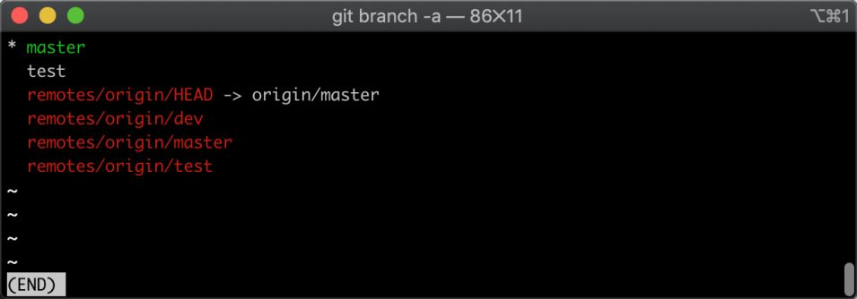
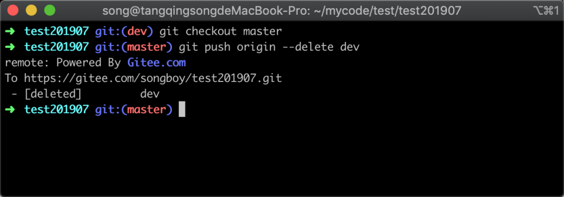
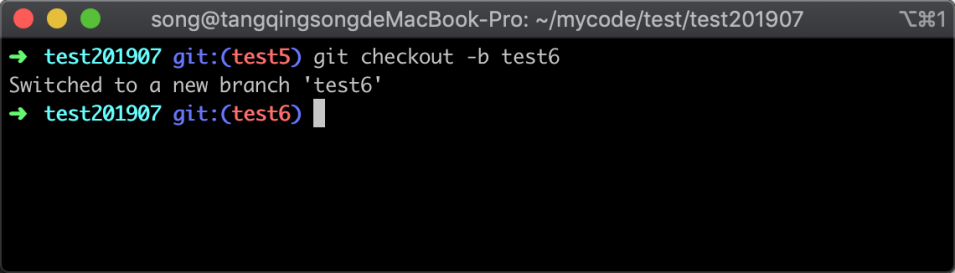
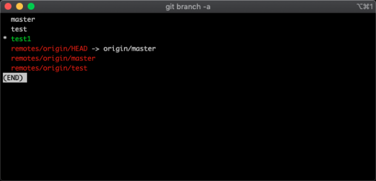
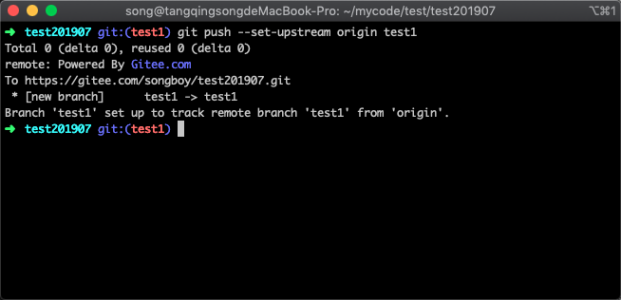
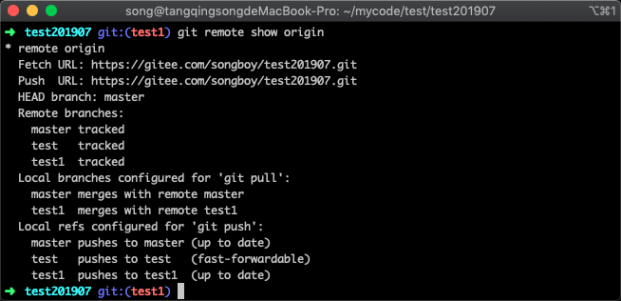
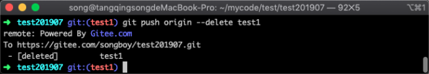
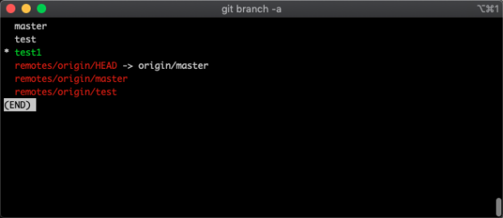
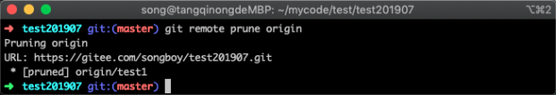
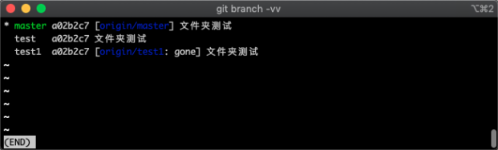

# 14-删除过期分支：清理无意义的分支数据


> 成功的奥秘在于目标的坚定。——迪斯雷利

Git 会保留从项目最开始保留所有的数据，当一个代码仓库长期使用后，会发现代码仓库越来越大，分支也越来越多；这些都会影响到我们 Git 仓库的速度，如果发现一些分支不需要了，我们可以手动删除，以此提高响应速度；
一般两类分支可能需要清理：

1. 本地不存在，远程存在该分支，但不需要了
2. 远程不存在，本地存在该分支，也不需要了

## 14.1 清理远程分支

很多时候我们删除分支实际上只是在本地将分支删除，但远程依然会存在，如果我们确认远程也不需要该分支可以手动给删除一下，一般有两个步骤需要操作，首先查看远程分支列表，参考命令如下：

```
git branch -a
```

执行命令后，结果如下图所示：



在图中可以看到本地分支和远程分支，远程分支显示颜色为红色，可以看到都是以 `remotes` 开头的，把需要删除的分支记录下来，然后执行删除远程分支命令，参考命令如下：

```
git push origin --delete dev
```

执行命令后，结果如下图所示：


在图中可以看到返回了 `[deleted]` 等信息，说明我们已经成功将远程分支删除。

## 14.2 清理本地分支

有些时候我们在本地新建了一个临时分支，或者服务器已经将某一分支删除，本地遗留了很多废弃的分支，当我们想进行清理的时候，如果一个个删除的话效率非常低；这里教大家使用一种比较简单的方法来清理这些分支；我们可以根据分支在远程是否存在作为依据，决定是否将它删除，如果不存在则删除，反之则保留，具体操作如下。

### 14.2.1 模拟场景

下面我新建一些分支，这些分支只存在本地，来模拟上述提到的情况，新建分支参考命令如下：

```
git checkout -b test1
```

命令执行后，会以当前所处的分支基础上新建一个分支，执行返回结果如下：



接着我们查看当前的版本库的分支列表，参考命令如下：

```
git branch -a
```

命令执行后，返回结果如下：



在图中可以看到所有的分支信息，绿色的代表当前所处的分支，红色的代表远程存在的分支，可以看出刚才新建的分支远程中并不存在；

现在继续将 test1 分支推送到远程服务器当中，推送的参考命令如下：

```
git push --set-upstream origin test1
```

命令执行后，返回结果如下图所示：



在图中可以看到远程仓库提示已经成功新建了一个分支，我们还可以使用查看远程仓库的信息，参考命令如下 ：

```
git remote show origin
```

命令执行后，返回结果信息如下图所示：



在图中可以看到 origin 的具体地址，远程分支列表，以及本地分支与远程分支相对应的关联关系等信息，接下来我们只需要删除远程分支，便完成了模拟场景的最后一步，操作命令如下：

```
git push origin --delete test1
```

执行命令之后，返回结果如下图所示：



从图中的返回信息中心可以看出，远程的 test1 分支已经删除成功。

### 14.2.1 清理本地分支

经过上面的场景模拟，现在我们可以开始进行正式清理分支操作了，首先我们查看分支情况，参考命令如下

```
git branch -a 
```

执行命令之后，返回的信息如下图所示



从图中可以看出，本地存在 `test1` 分支，远程不存在此分支；说明删除远程已经被删除，但本地还存在的分支，我们如果想将远程的分支与本地保持一致，直接使用 `git pull` 是不够的，可以使用 `git fetch --prune origin`，参考命令如下：

```
git fetch --prune origin 
```

命令执行之后，返回信息如下图所示：



Git 会从拉取远程的分支信息与本地的进行对比，当发现远程的分支已经删除，便会对本地的分支进行标注；我们可以使用 Git 的命令查看关联失效的分支，参考命令如下：

```
git branch -vv
```

命令执行之后，返回结果如下图所示：



在分支列表中，test1 分支后面有一个 `：gone` 的标识，说明远程分支已经被删除，通过这个标识我们能够很清晰的知道该需要删除那些分支，删除分支的命令参考如下：

```
git branch -d test1
```

## 14.3 小结

在本节内容中主要讲解了如何清理 Git 分支，清理分支主要原因是版本库太大会导致速度变慢，通常会清理两种情况的分支：

1. 清理远程仓库分支，本地已删除但远程未删除
2. 清除本地仓库分支，远程已删除但本地未删除的分支
