# 15-配置多个远端仓库：把代码推送到不同的服务器


> 人生太短，要干的事太多，我要争分夺秒。 ——爱迪生

有时候，我们需要将一个改动推送到多个远程仓库去，比如说你做了一个开源项目，既想发布到 GitHub 又想发布到国内的码云上，如果建立两个文件夹分别去推送，就非常麻烦，其实 Git 已经有相关的功能，在这一节中我们来学习如何使用。

## 15.1 环境准备

首先我去 GitHub 上创建一个远程仓库，创建地址为 `https://github.com/new` ，如下图所示：

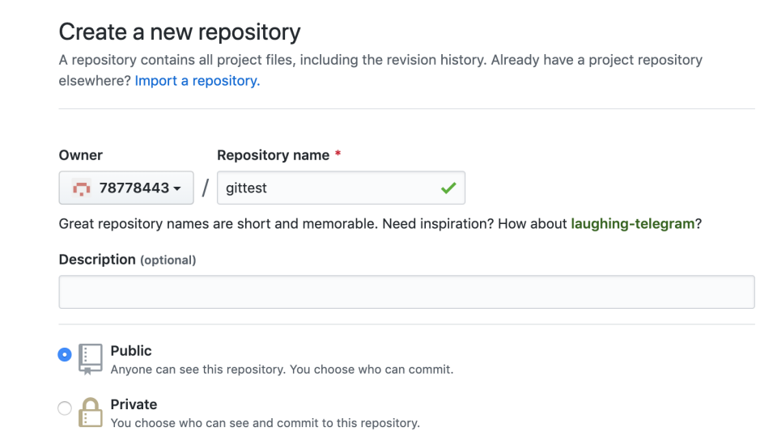

在表单下方有一个提交表单按钮，点击后会自动跳转到仓库页面，如下图所示：

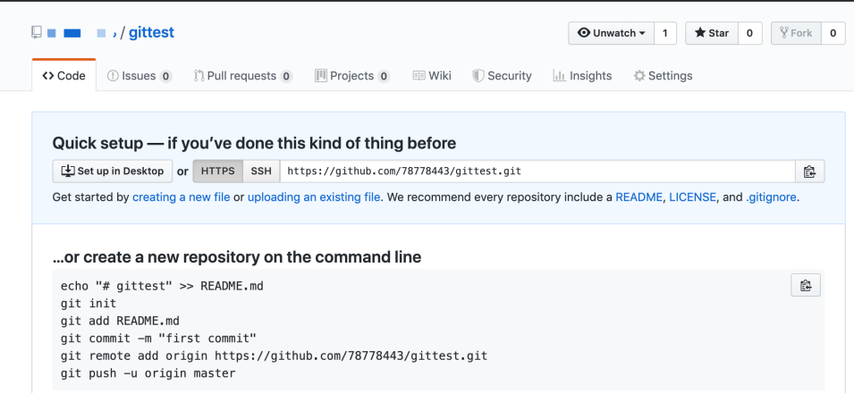

在上图中可以看到有一个仓库地址，我们把仓库地址复制一下，然后打开终端窗口，然后在终端窗口中查看当前的地址，参考命令如下图所示：

```
git remote -v
```

命令执行后，返回信息如下图所示：

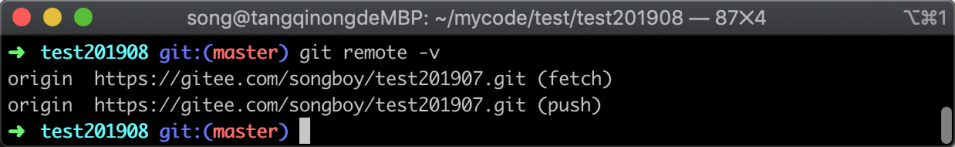

在上图中可以看到远程仓库地址信息，我们在这些信息中可以看到两个 origin，这两个 origin 是代表远程仓库的一个名字，默认情况下就是 origin；

在地址后面有一个括号里面有 `push` 和 `fetch` 两种，当我们执行 `git push` 时候他会调用对应 `push` 地址，同样当我们执行命令 `git featch` 的时候则会调用 `fetch` 地址；当拉去代码之后默认情况下会产生一个远程仓库 origin，并且对应的 push 地址也只有一个；

## 15.2 添加多个仓库

在前面的内容中，我们学习了使用命令 `git push` 把代码推送到远程仓库中去，其实这条命令是一条简写的命令，因为我们没有指定仓库地址完整的命令是 `git push origin`，在执行简写命令时 Git 会找一个默认的仓库；如果我们想把代码往多个代码托管平台推送只需要添加一个远程地址即可，参考命令如下：

```
git remote add github https://github.com/78778443/gittest.git
```

命令参数 `git remote add` 是添加远程仓库地址固定写法，`github` 是我给远程仓库自定义的一个名字，`https://github.com/78778443/gittest.git` 则是的远程仓库地址，命令执行完成之后，我们再使用 `git remote -v` 查看远程地址列表，返回信息如下图所示：

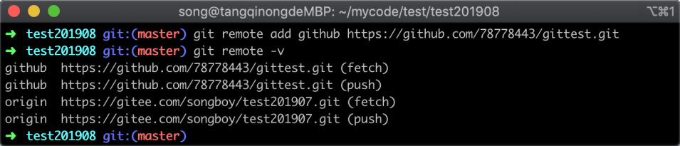

在图中可以看到已经新增了一个 `github` 的仓库地址，接下来，我们使用完整的推送命令把代码推送到 GitHub 的代码仓库当中去，参考推送命令如下：

```
git push github
```

命令执行后，返回的信息如下图所示：

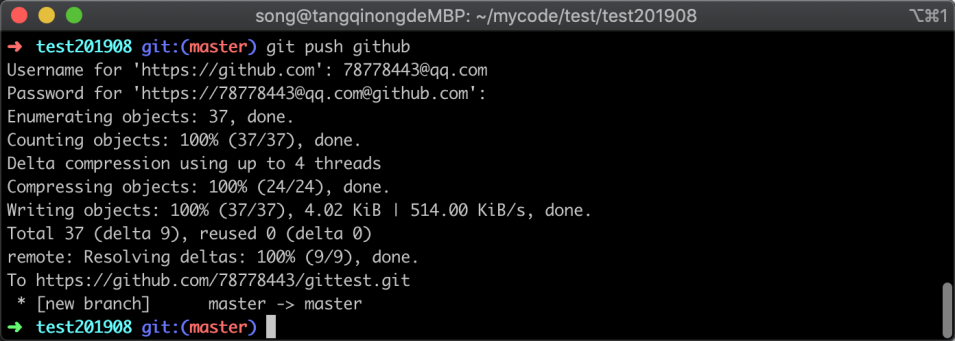

在图中可以看到，GitHub 需要让我进行认证，输入用户名和密码之后，成功把本地代码推送到了远程仓库中；我们回到 GitHub 网页中，可以看到已经上传上来，如下图所示：

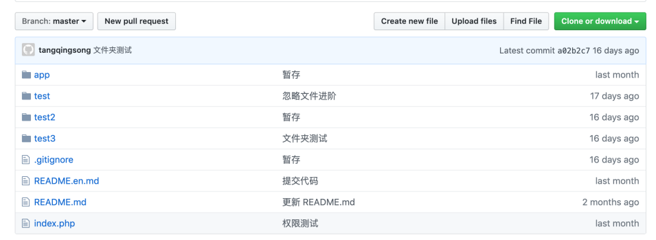

在上图中可以看到 GitHub 页面当中已经可以看到我们刚才推送上来的代码。

接下来我们再尝试用简写的推送命令推送代码，看看会把修改推送到什么哪一个仓库中去，执行的命令和返回结果如下图所示：

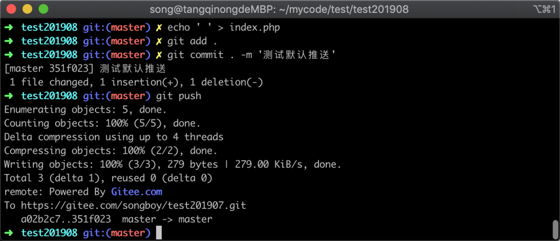

在图中可以看到，当我使用简写的推送命令进行推送时候，并不会往 GitHub 这个仓库进行推送，只会往默认的 origin 仓库中推送。

在这里说一个小技巧，如果我们想将通过简写的命令让他推送到 GitHub 而不是 origin，可以在推送的命令中加上 `-u` 参数来进行修改默指定的仓库，参考命令如下：

```
git push -u github 
```

这句命令执行之后，会首先将代码推送到 GitHub 仓库中，并且以后使用 `git push` 推送时也会往 GitHub 中推送，执行结果如下图所示：

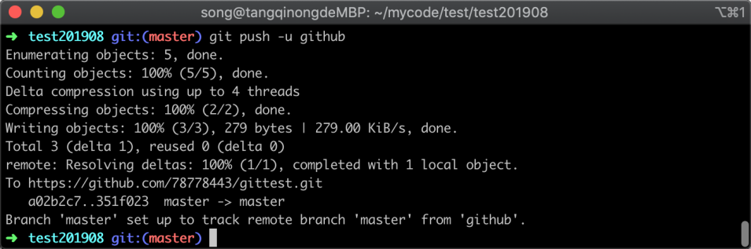

在返回的信息中可以看到已经把当前的内容推送到 Git 仓库中，并且成功修改了推送默认的仓库。

接下来我们来验证一下刚才的操作正确性，我们随意修改一个文件里面的内容，然后提交到本地仓库，最后使用简写的推送命令 `git push` 进行推送，执行的命令和返回结果如下图所示：

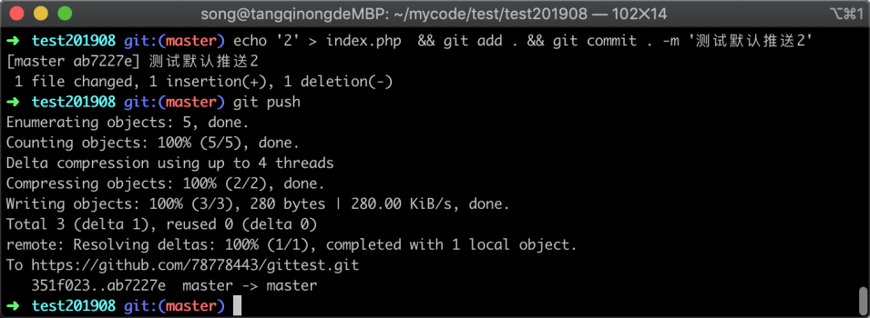

在图中可以看到当执行了 `git push` 之后，已经变成了 GitHub 的地址，说明修改默认的推送地址成功。

### 15.3 一个仓库多个地址

有时候你可能还有这种需求，就是想推送的时候执行一条命令，就把代码往两个地址同时推送，这种操作 Git 也是支持的；和上一小节往 Git 中配置两个远程仓库的方式略有不同，我们可以在一个远程仓库中配置多个 push 地址，下面我们来实践一下。

首先我们把上面一小节中添加的 GitHub 地址给删除，让仓库恢复成之前的效果，删除 GitHub 远程仓库执行的命令和删除验证的结果如下图所示：

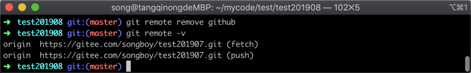

在上图中可以看到已经删除成功， 使用 `git remote -v` 展示的只保留了 origin 的地址。

接着我们往 origin 仓库中添加多个地址，参考的命令如下：

```
git remote set-url --add origin https://github.com/78778443/gittest.git
```

命令执行之后，我们再次使用 `git remote -v` 来查看远程仓库地址信息，返回结果如下图所示：

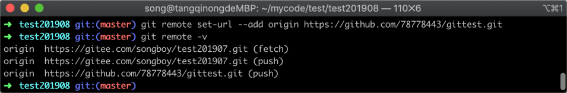

在返回的信息中，可以看到在 origin 远程仓库中增加了一个 GitHub 的 push 地址，这个时候我们再去修改内容，然后推送查看效果，如下图所示：

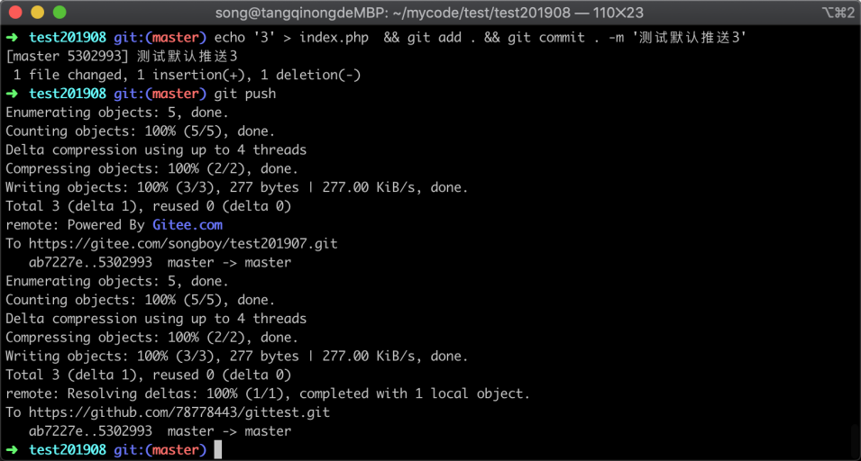

在上图中可以看到，只需要执行 `git push` 命令，Git 就会一次性把本地仓库的代码推送到多个远程地址去。

## 15.4 小结

在这一节中我们主要学习了 Git 远程仓库的管理，解决如何把一份代码快速推送到多个仓库中，主要有以下两种方式：

1. 新增多个远程仓库，不同的仓库配置不同的仓库地址
2. 新增多个远程仓库地址，把多个远程仓库地址放到一个仓库中
