# 17-远端覆盖本地：把远端代码覆盖本地


> 读书给人以快乐、给人以光彩、给人以才干。——培根

有时候我们本地仓库代码比较混乱，不能保证代码的质量，但是远程仓库代码是整洁的，需要以远程仓库代码为基准，这个时候有些开发者可能会重新拉取一个仓库，不过实际是还有一种更加简单的方法让你的仓库与远程保持一模一样。

## 17.2 场景复现

我们先来复现一下场景，新建两个仓库分别是 A 仓库和 B 仓库，A 仓库为正确提交代码，并推送到远程；B 仓库使用 `git commit` 提交了错误代码，但还未进行推送，希望以远程仓库为基准去回滚代码。

### 17.2.1 模拟正常提交

首先我把仓库 A 复制一份一模一样的，文件夹名字随意，在文章后面我称之为仓库 B，并查看当前文件夹的文件列表，参考命令如下所示：

```sh
cp -r test201907  test201910  && ls
```

命令执行完毕后，返回的信息，如下图所示：

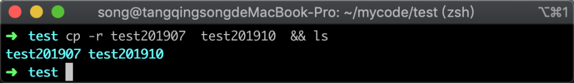

在上图中，可以看到已经成功的复制了一份代码，接着我们通过 `cd test201907` 命令进入 A 仓库，并修改文件，同时去查看文件的修改状态，参考命令，如下所示：

```sh
echo '远端覆盖本地A仓库内容' >> index.php  && git status
```

命令执行之后返回的仓库状态如下图所示：

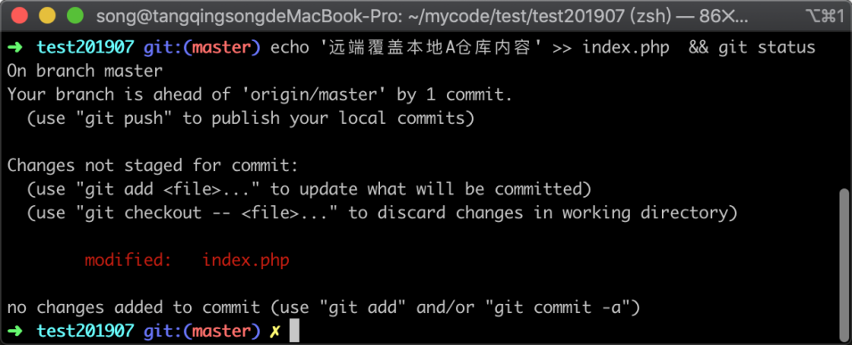

可以看到 index.php 文件已经被成功修改，接着我们将修改的文件通过 `git commit` 命令提交到 Git 版本中去，参考命令如下：

```
git commit . -m '远端覆盖本地测试仓库A'
```

命令执行之后，返回的提示信息如下图：

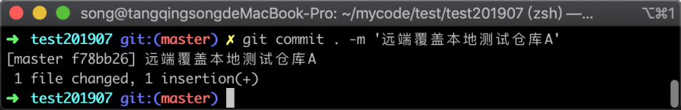

在图中，可以看到已经成功将修改提交到 Git 仓库当中，接着将新的版本推送到远端，参考命令如下所示：

```
git push
```

命令执行之后，远程仓库返回的信息如下图所示：

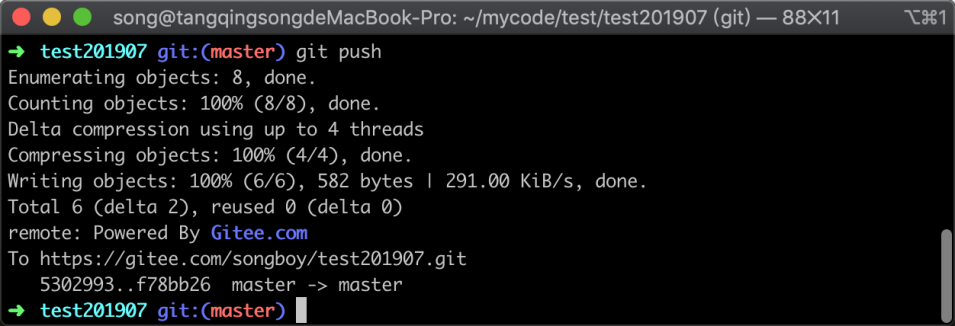

在上图中可以看到，已经成功将新的版本记录推送到远程仓库当中，接着我们再去 B 仓库中去构建错误的提交。

### 17.2.2 构建错误记录

通过 `cd ../test201910` 命令进入 B 仓库，同样修改一个代码文件，参考命令如下所示：

```
echo '空文件' > index.php
```

修改代码文件之后，同样适用 `git commit` 提交修改到版本控制器当中，参考命令如下：

```
 git add . && git commit . -m '误操作'
```

命令执行完毕之后，返回的信息如下图所示：

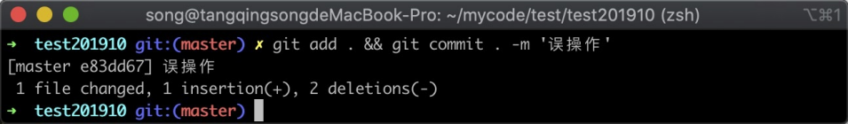

在上图中可以看到一件成功提交版本记录，接着我们使用 `git log` 命令来查看提交记录，参考命令如下

```
git log
```

执行命令后，返回的版本记录历史，如下图所示：

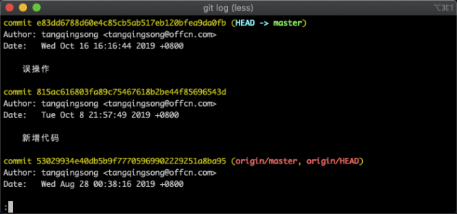

在上图中可以看到刚才提交的记录，B 仓库的错误提交已经构建完成；整个实验场景复现完毕，A 仓库正确的代码已经推送到远程服务器；B 仓库提交了错误代码，想让远程仓库的代码完全覆盖到本地，下面我们复现这个过程。

## 17.3 覆盖本地

首先拉取远程最新的代码，这里不适用 `git pull` 而是使用 `git fetch`，因为 `git pull` 拉取远程最新分支之后，会自动对本地分支进行合并，而 `git fetch` 则只会拉取远程分支不进行自动合并，参考命令如下：

```
git fetch
```

命令执行完毕之后，返回的信息如下图所示：

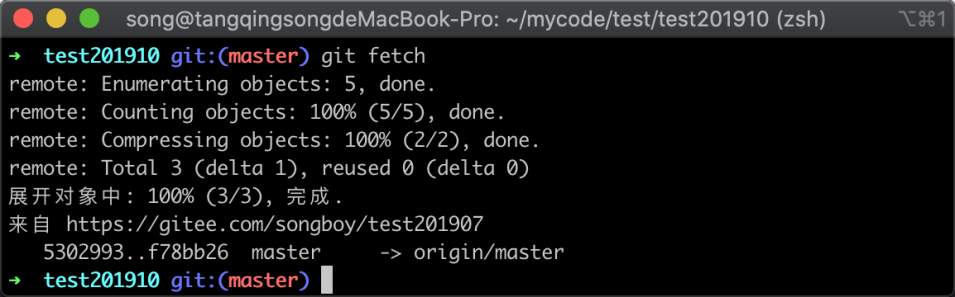

从上图中可以看出已经成功获取远程仓库的信息，接下来我们通过 `git log` 命令查看提交记录是有改变，以此来验证 `git fetch` 不会自动合并的特点，参考命令如下所示：

```
git log
```

命令执行完毕之后，返回的版本信息如下图所示：

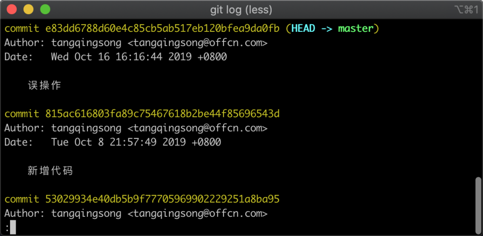

在上图中可以看出并没有增加版本记录，说明没有进行自动合并。接着我们学习一下 `git reset` 命令的一种使用方法，命令如下所示：

```
git reset --hard origin/master
```

在这条命令中，`--hard` 为 `git reset` 的选项，它的作用是 reset 之后把当前工作的差异部分丢弃掉，完全与目标一致，`origin/master` 则是目标比较分支，命令执行后，返回的信息如下图所示：

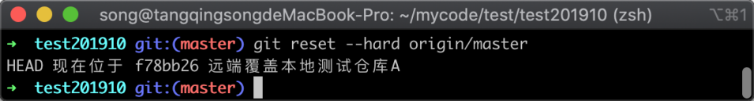

在图中可以看到 Git 提示，当前的位置已经处于 A 仓库推送的位置。但这里还看不出 B 仓库提交的记录是否还存在，以及代码本身是否已经与远程保持一致，这里我们可以通过 `git status` 来确定工作区是否有修改，参考命令如下：

```
git status
```

命令执行之后，可以看到工作区的状态，返回信息如下图所示：

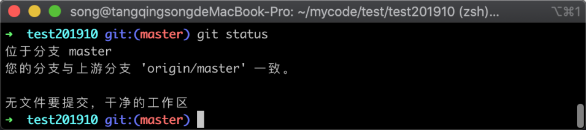

在上图中可以看到工作区的文件与最新版本并没有差异，接着再通过 `git log` 确认版本记录是否与远程一致，参考命令如下所示：

```
git log
```

命令执行之后，可以看到当前仓库的版本记录列表，返回的信息如下图所示：

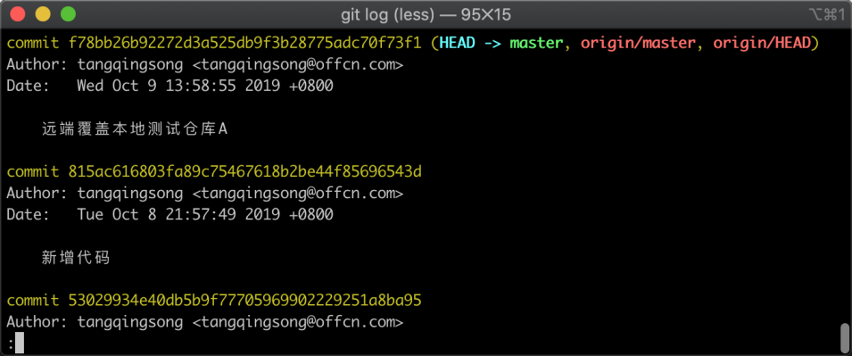

在上图中可以看到版本记录已经发生了变化，错误的提交版本已经不存在，A 仓库正确的代码已经到了 B 仓库当中，到此整个远程仓库覆盖本地实验已经完成。

## 17.4 小结

在这一节中学习了，让本地仓库完全与远程仓库保持一致，并且以远程仓库为基准的操作方式，主要的操作流程有两点:

1. 使用 `git fetch` 拉取远程仓库信息（不会自动进行合并）;
2. 使用 `git reset --hard origin/分支名` 命令将远程仓库完全覆盖本地仓库。
