# 19-比较历史版本差异：比较两个分支下指定版本的区别


> 成功＝艰苦的劳动＋正确的方法＋少谈空话。——爱因斯坦

在前面的章节中，我们学习了对比分支间的差异，包括文件差异，代码差异等。

在这一节中重点讲解通过 `git diff` 命令的使用，包括了同分支不同版本的差异、不同分支不同版本的差异两部分。

## 19.1 同分支不同版本差异

有时候，我们需要查看当前分支的最新版本或工作区和两天前的某一个版本有什么区别，此时便是在同一个分支进行对比，两种对比的方法略有不同。

### 19.1.1 工作区与历史版本

我们先来学习一下如何使用工作区和历史版本进行对比，首先我们需要通过 `git log` 命令查看历史记录，然后找到需要对比的 commitid，参考命令如下：

```
git log
```

命令执行之后，返回的版本记录如下图所示：

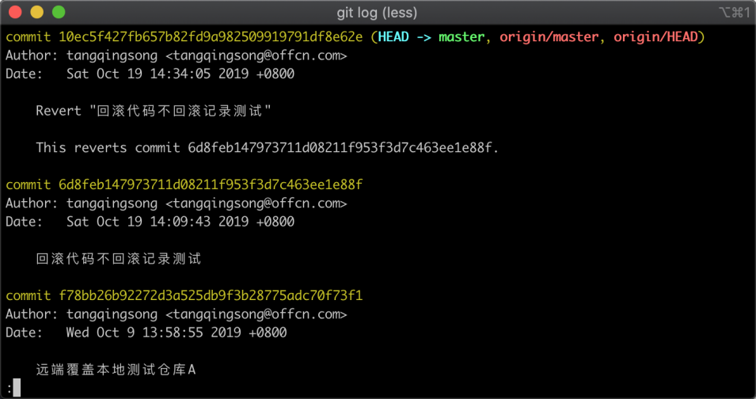

在上图中，我们可以通过版本的注释和相应的日期找到对应的版本的 commitid，将它复制下来，接着就可以使用 `git diff` 命令对比代码差异，参考命令如下：

```
git diff 6d8feb147973711d08211f953f3d7c463ee1e88f
```

在这条命令中，第三个参数便是要对比的版本的 commitid，如果不填默认值是当前分支的最后一个版本 id，如果 commitid 则是当前的工作区与此版本进行对比，命令执行完毕之后，返回的结果如下图所示：

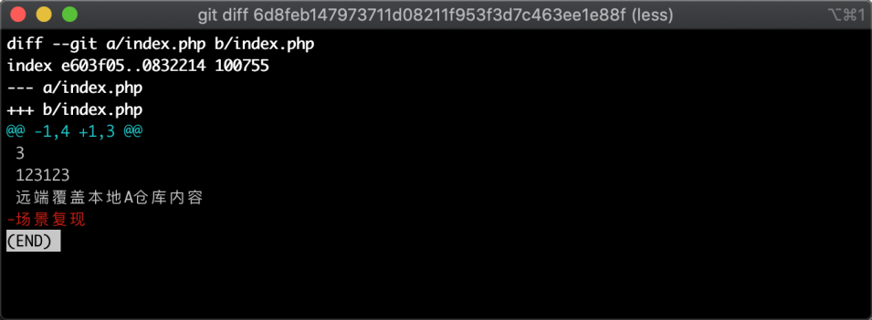

在图中可以看出当前的工作区相比指定的版本，`index.php` 文件中少了一行。

### 19.1.2 两个历史版本对比

有些时候我们除了拿当前的工作区与某一个版本进行对比，还会有两个版本间的对比需求，此时我们则在 `git diff` 命令中传递两个版本号即可，参考命令如下：

```
git diff 4c64ecd48d7ac2b32b35ece080a5ae1f7256f9d9 6d8feb147973711d08211f953f3d7c463ee1e88f
```

命令执行之后，会把命令中最后一个参数的版本与前面一个参数的版本进行对比，返回的结果如下图所示：

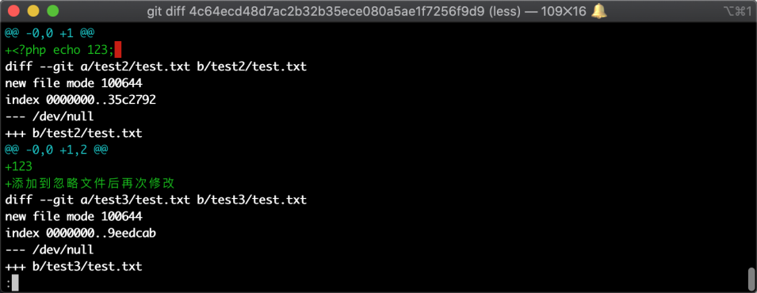

在图中可以看到有多个文件有发生过变更，绿色部分为增加的代码部分。

## 19.2 跨分支比较差异

在一些少数情况下我们还会跨分支比较代码差异，下面我们来构造实验环境，然后跨分支对比版本差异；

### 19.2.1 实验环境准备

首先我们需要新建一个一模一样分支，参考命令如下：

```
git checkout -b difftest
```

在执行的命令中，参数 `-b` 的作用为新建分支，参数 `difftest` 则是需要创建的分支名，命令执行后，返回的结果如下图所示：


在图中可以看到已经新建分支成功，并自动切换到了 `difftest` 中，接着我们再修改代码并查看修改状态，参考命令如下

```
echo 'diff测试' > diff.php  && git status
```

命令执行后，返回的结果如下图所示：

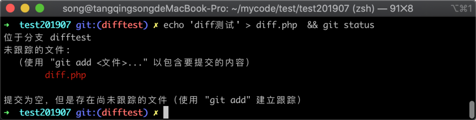

在图中可以看到文件 `diff.php` 已经被修改，接着我们将修改的内容提交到版本控制器中，参考命令如下图所示：

```
git add . && git commit . -m '新增加一个文件'
```

命令执行完毕之后，返回的信息如下图所示：

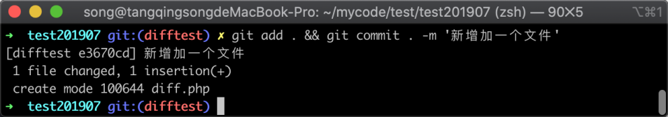

在图中可以看到 Git 提示有一个文件被修改，增加了一行代码，说明已经提交成功。

### 19.2.2 不同分支不同版本比较

接着我们将此分支与其他分支最新版本进行比较，参考命令如下：

```
git diff master
```

在命令中最后一个参数 `master` 代表的是分支名，Git 会自动获取该分支下最后一个版本的 commit，命令执行之后返回的信息如下图所示：

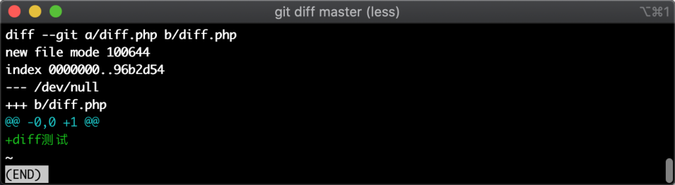

在图中可以看到当前分支的最后一个版本与 master 分支的差异提示，此时我们是将两个分支的最新版本进行对比。

但有些时候我们可能还会将两个分支的历史版本进行对比。接下来我们来尝试一下，首先使用 `git log` 查看当前版本的 commit，参考命令如下：

```
git log
```

命令执行之后，Git 返回的信息如下图所示：

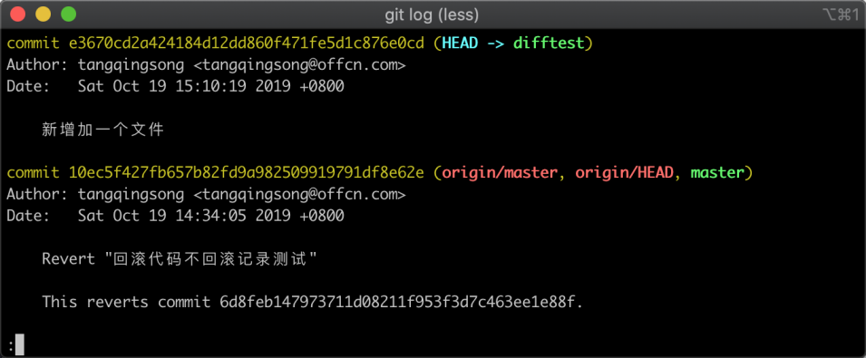

我们将上图中的一个 commitid 复制下来，接着去执行切换分支操作，参考命令如下：

```
git checkout master
```

命令执行之后，返回的信息如下图所示：


在图中可以看出已经切换到了 master 分支。

接着我需要在当前分支修改文件，并查看 Git 的工作区状态，参考命令如下：

```
echo '在master分支中diff测试' > diff.php  && git status
```

命令执行之后，返回的信息如下图所示：

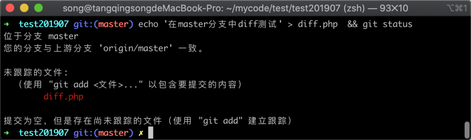

可以看到文件状态为被修改的状态，接下来我将修改的文件提交一个新版本，参考命令如下：

```
 git add . && git commit . -m '新增加一个文件'
```

命令执行之后，返回的信息如下图所示：

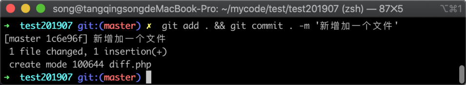

在上图中可以看到已经成功创建一个文件到 Git 仓库当中，接着我使用当前分支版本对比另外一个分支历史版本，参考命令如下：

```
git diff e3670cd2a424184d12dd860f471fe5d1c876e0cd
```

在上面的参考命令中，commitid 是 `difftest` 分支的一个历史记录，命令执行之后返回的信息如下图所示：

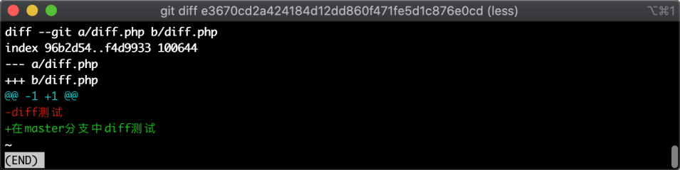

在上图中可以看到，已经展示了当前分支最新版本与另外一个分支的历史版本的差异，说明 `git diff` 命令是可以跨分支进行对比的。

### 19.2.3

接着我们再做一个实验，用当前分支的历史版本与 `difftest` 分支的历史版本进行对比，依然通过 `git log` 命令找一个当前分支历史版本的 `commitid`，参考命令如下：

```
git log
```

命令执行之后，可以看到当前分支的版本记录，如下图所示：

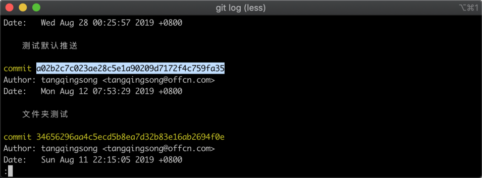

在上图中我们任意选择一个版本的 commitid，然后将它复制下来，接着就可以使用当前分支的历史版本对比另外一个分支历史版本，参考命令如下：

```
git diff a02b2c7c023ae28c5e1a90209d7172f4c759fa35 e3670cd2a424184d12dd860f471fe5d1c876e0cd
```

命令执行之后，返回的差异信息如下图所示：

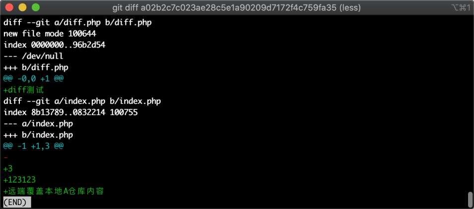

在图中我们看到已经展示出了差异部分信息，说明可以跨分支比较两个版本信息的。

## 19.3 小结

在这一章节当中我们主要加强了对 `git diff` 的理解，`git diff` 不仅可以比较工作区与最后一个版本的差异，还可以比较两个任意版本的区别，即使两个版本不在一个分支当中；

在这一节当中我们主要做的实验有下面几个：

1. 工作区与当前分支历史版本差异；
2. 当前分支下的两个历史版本差异；
3. 当前分支最新版本与其他分支最新版本的差异；
4. 当前分支最新版本与其他分支历史版本差异；
5. 当前分支历史版本与其他分支历史版本差异。
