# 22-客户端钩子使用：提交代码时触发事件案例


> 耐心是一切聪明才智的基础。——柏拉图


有些时候，我们想在提交版本时候触发一些事件，触发事件的这个动作我们称之为钩子。 在 Git 中有两种类型的钩子，分别是客户端的和服务器端的。 客户端钩子主要是提交和合并这些的操作所调用，服务器端钩子主要是在接收被推送的提交这样的操作。

## 22.1 认识钩子

Git 客户端钩子存储在 `.git/hooks` 目录中，在你初始化一个 Git 仓库时候这个目录便会产生，同时还会在里面放一些示例脚本，这些脚本都是以`.sample` 结尾，我们可以使用 ls 命令查看一下，执行命令如下所示：

```
ls .git/hooks
```

`ls` 命令执行之后，返回的文件列表如下图所示：

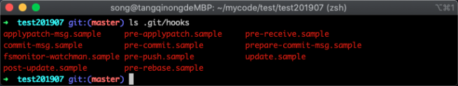

在上图中可以看出，有很多个钩子示例文件，这些钩子分别会在不同的事件中被触发，在下面会详细介绍每个钩子的触发时机。

### 22.1.1 钩子语法

示例钩子都是 `shell` 脚本，部分钩子示例混杂了 Perl 代码，不过只要命名正确的可执行脚本都可以使用，比如 Python 或其它语言编写，我们可以使用 `cat` 命令查看一个示例钩子，执行命令如下所示：

```
cat .git/hooks/pre-commit.sample
```

命令执行之后，返回的示例代码如下图所示：

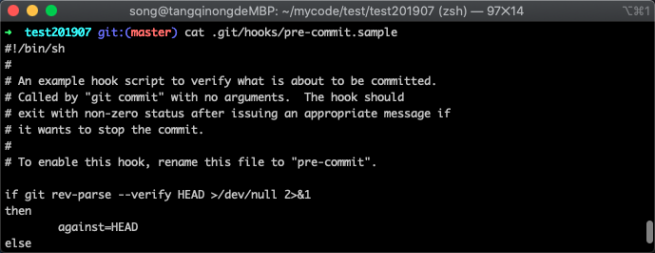

在上图中，可以看出一些钩子备注信息，以及示例代码。

### 22.1.2 钩子触发

| 钩子名字           | 触发时间                                                     |
| :----------------- | :----------------------------------------------------------- |
| pre-commit         | 执行 `git commit` 命令完成前被执行。                         |
| prepare-commit-msg | 在执行完 `pre-commit` 钩子之后被调用。                       |
| commit-msg         | `git commit` 执行完成后被调用。                              |
| post-commit        | `post-commit` 钩子在 `commit-msg` 钩子之后立即被运行 。      |
| post-checkout      | `post-checkout` 钩子在使用 `git checkout` 命令时候会被调用。 |
| pre-rebase         | `pre-rebase` 钩子在使用 `git rebase` 命令发生更改之前运行    |
| pre-receive        | `pre-receive` 钩子在有人用 `git push` 向仓库推送代码时被执行。 |
| update             | `update` 钩子在 `pre-receive` 之后被调用，分别被每个推送上来的引用分别调用。 |
| post-receive       | 在成功推送后被调用，适合用于发送通知。                       |

### 22.1.3 钩子试验

在简单了解 Git 钩子之后，我们先来简单的触发一个钩子，做个试验，实验非常简单，把一个正确命名且可执行的文件放入 Git 目录下的 hooks 子目录中，并且对应相应的文件名即可，如果触发便成功。

我们选择使用 `pre-commit` 进行测试，这个钩子是在执行命令 `git commit` 时所触发，使用 `vim` 编写钩子，执行命令如下所示：

```
vim .git/hooks/pre-commit
```

命令执行之后，我们在文本框中输入 `echo 1111111111111`，如下图所示：

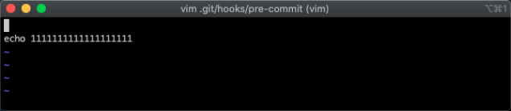

代码写完之后，我们使用`:x` 进行保存，保存完毕之后需要保证钩子有运行权限，因此还需要修改钩子的权限，为了避免权限没给对，这里我直接给出 `777` 权限，执行命令如下所示：

```
chmod 777 .git/hooks/pre-commit
```

钩子准备完毕之后，我们添加一个文件，然后使用 `git commit` 提交到新版本，首先添加一个文件，执行的命令如下所示：

```
echo 111111 > aa.txt  && git status
```

命令执行之后，返回的信息如下图所示：

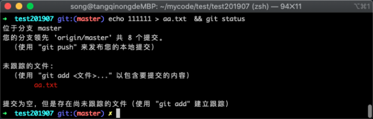

在上图中可以看出，添加文件已经成功，接下来就可以使用 `git commit` 命令进行提交，用来验证钩子是否触发，执行命令如下所示：

```
git add . && git commit . -m '测试'
```

提交新版本命令执行之后，返回信息如下所示：

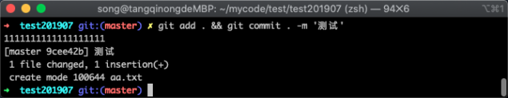

在上图中，我们看到输出的信息里面比以往多出了 `111111111111` 的提示，说明我们的钩子事件已经成功的被执行。

## 22.2 钩子案例

前面虽然我们演示了一个钩子被执行，但并没有看到钩子到底如何帮助我们提高工作效率，这里用一个 “代码风格检测” 的示例做演示。

### 22.2.1 使用场景

平常我们团队以 PHP 开发为主，每个人使用的编辑器并不一致，代码风格各不相同，这样当我们来看别人代码的时候就会相对吃力，为了让大家代码风格能保持一致，我们使用了 Git 钩子作为辅助，当我们提交新版本时候，会自动检测我们代码的风格。如果风格符合 `PSR-2`，则通过；如果不符合，给出具体行数和相对应的提示。

### 22.2.2 环境依赖

下面我们来实现这样一个功能，在我们这个功能中依赖了两个组件 `phpcs` 和 `composer`，其实最主要是 `phpcs`，但是按照它最简单的方式是通过 `composer`，所以我们先来安装 composer，执行命令如下所示：

```
php -r "copy('https://install.phpcomposer.com/installer', 'composer-setup.php');"
```

命令执行之后，会下载一个 PHP 文件下来，如下图所示：

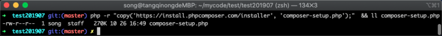

在上图中，我们可以看到 PHP 文件已经被下载下来，接着我们使用 PHP 去执行这个 PHP 文件（一定要安装 PHP 才可以)，用来安装 `composer`，执行的命令如下所示：

```
php composer-setup.php
```

命令执行之后，返回的信息如下图所示

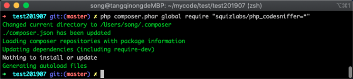

在上图中，我们看到命令已经执行完毕，并返回了绿色的提示信息告知我们已经成功执行，接着我们就可以通过 `composer` 来安装 `phpcs` 了，安装 `phpcs` 的命令如下所示：

```
php composer.phar global require "squizlabs/php_codesniffer=*"
```

命令成功执行之后，我们需要先验证 `phpcs` 是否确认安装成功，执行命令如下所示：

```
~/.composer/vendor/bin/phpcs --help
```

命令执行之后，返回的信息如下所示：

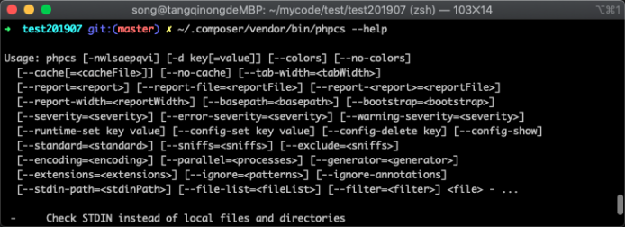

在上图中我们可以看到 phpcs 的一些使用参数，说明 `phpcs` 安装成功了，到此我们所依赖的工具都好了，接下来就可以开始编写钩子代码了。

### 22.2.3 钩子编写

因为我对 `shell` 代码不如 `Python` 熟练，所以这里我简单编写了一段 `Python` 代码，代码中都包含了注释，这里可以使用 `vim` 去编写，也可以使用你的代码编辑器去，我这里以 vim 作为演示，执行命令如下所示：

```
vim .git/hooks/pre-commit
```

命令执行之后，就可以在里面编写钩子代码了，我编写的代码如下图所示：

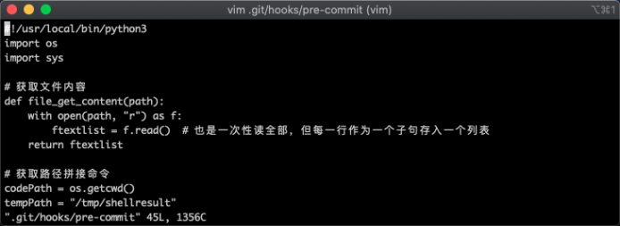

在图中，可以看到第一行中声明了以 `Python3` 去执行下面的代码，完整代码如下所示：

```
#!/usr/local/bin/python3
import os
import sys

# 获取文件内容
def file_get_content(path):
    with open(path, "r") as f:
        ftextlist = f.read()  # 也是一次性读全部，但每一行作为一个子句存入一个列表
    return ftextlist

# 获取路径拼接命令
codePath = os.getcwd()
tempPath = "/tmp/shellresult"
cmd = "cd %s && git diff HEAD^..HEAD --stat   > %s" % (codePath, tempPath)
phpcsPath = "/Users/song/.composer/vendor/bin/phpcs"

# 执行后获取改动的文件列表
result = os.system(cmd)
ftextlist = file_get_content(tempPath).strip()

# 字符串分割将每个文件做一个元素
ftextlist = ftextlist.split("\n")

fileList = []
for value in ftextlist:
    # 通过字符串分割，获取文件名和其他信息
    tempArr = value.split(' ')
    # 如果路径中不包含.php字符，说明不是php文件，过滤它
    if '.php' not in tempArr[0]:
        continue

    # 拼接路径
    fullPath = os.path.join(codePath, tempArr[0])

    # 执行phpcs命令
    cmd = "%s %s > %s" % (phpcsPath, fullPath, tempPath)
    resultCode = os.system(cmd)
    
    #错误执行返回的状态码不等于0,说明有异常,状态码便输出非0
    if int(resultCode) != 0:
        print(file_get_content(tempPath))
        sys.exit(1)

#r如果上面都正常，则输出0，告诉Git代码正常
sys.exit(0)
```

代码编写结束后，需要经过反复测试，上面的代码我已测试可以使用。接下来我们将做一个小实验来验证这段代码和钩子搭配起来的可用性。

## 22.3 效果验证

现在我需要这样去测试，首先修改一个 PHP 文件，然后用错误的风格去编写，然后提交，如果提交不通过说明我们的钩子起了效果；接着再以正确风格的代码进行测试，如果提交通过说明我们的正向测试通过。

### 22.3.1 反向测试

现在我们首先修改一个 PHP 文件，因为钩子事件里面我过滤了其他后缀，使用 `vim` 编写一段简单的 PHP 代码，执行命令如下所示：

```
vim index.php
```

命令执行之后，终端的展示信息如下：

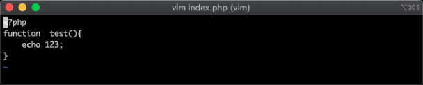

在上图中我们可以看到我们的 `{`没有换行，这是不符合 PHP 中 `PSR-2` 风格的，为了方便大家做测试，我把代码贴到下面，如下代码所示：

```
<?php
function  test(){
    echo 123;
}
```

代码编写完毕之后，我们使用 Git 的 `git commit` 命令进行提交到新版本中，执行命令如下所示：

```
git add . && git commit . -m 'phpcs测试'
```

命令执行完毕之后，返回的信息如下图所示：

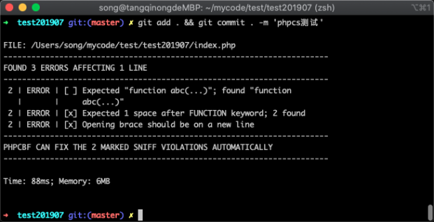

在图中可以看到 Git 没有给返回新版本的信息，而是给出了 `index.php` 文件的风格不符合规则信息，里面有错误等级，错误原因等详细信息，说明我们编写的钩子事件是成功的，为了验证没有提交到新版本，我们可以通过 `git log` 命令来查看版本记录，执行命令如下：

```
git log
```

命令执行之后，返回的版本列表信息如下图所示：

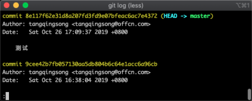

在上图当中，我们可以看到我们刚才提交的备注信息并没有进来，因此可以确实被钩子事件给阻止了；

### 22.3.2 正向测试

接下来我们正向验证，当代码风格符合 `PSR-2` 的时候，钩子是否会阻止我们提交到新版本，现在我依然通过 `vim` 命令，将 `index.php` 文件里面的代码替换成如下代码，参考代码如下所示：

```
<?php
function test()
{
    echo 123;
}
```

将代码替换完成并保存之后，我们再次提交修改到新版本当中，执行命令如下所示：

```
git add . && git commit . -m 'phpcs测试'
```

命令执行完毕之后，Git 返回的信息如下图所示：

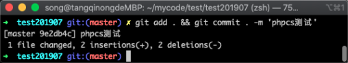

在上图当中我们看到 Git 给出了提交成功的信息，提示一个文件被更改，增加了两行内容等信息，我们同样再次通过 `git log` 来验证是否成功提交到新版本中，执行命令如下所示：

```
git log
```

命令执行完毕之后，返回的信息如下图所示：

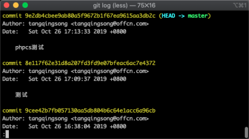

在上图中可以看到我们刚才提交的版本已经在版本记录列表中了，说明正向测试也通过。

## 22.4 小结

在这节中主要认识了 Git 的客户端钩子，包括钩子的使用方法，支持语法，使用场景等，我们需要记住以下几点：

1. 客户端钩子存放目录位于`.git/hooks` 下，需要有运行权限才会被触发；
2. 钩子支持多种语言，默认为了 shell 脚本，也可以指定 `Python` 或其他语言。