# 23-服务端钩子使用：服务端接受推送时事件处理


> 机会不会上门来找人，只有人去找机会。 ——狄更斯

在上一节中，我们学习了客户端钩子使用，在这一节中我们继续学习服务端的钩子使用，服务端钩子同样存放在`.git` 目录下，不过是放在服务端的`.git` 目录下，钩子文件名称也有相对应的文件名，但这里并不需要大家去记，因为我们平时使用服务端钩子基本不会通过文件名去找对应的钩子。

通常搭建 Git 服务器后，并不需要我们登陆服务器去编辑 .git/hooks 目录下的钩子，而是在 web 页面中设置，在这节中我们以使用者角度去讲解钩子使用方法，只需要在 web 管理界面设置钩子地址即可。

## 23.1 设置钩子事件

我们依然以码云平台为例，在码云平台中设置服务端钩子需要找到仓库的`管理` ->`WebHooks`-> `增加`页面，然后将我们的 URL 地址准备好就可以了。

当我们使用 `git push` 命令推送代码到码云平台时候，码云接收成功就会调用我们此 URL 地址，并将事件的参数传递到设置的 URL 地址中，设置钩子方法如下图所示：

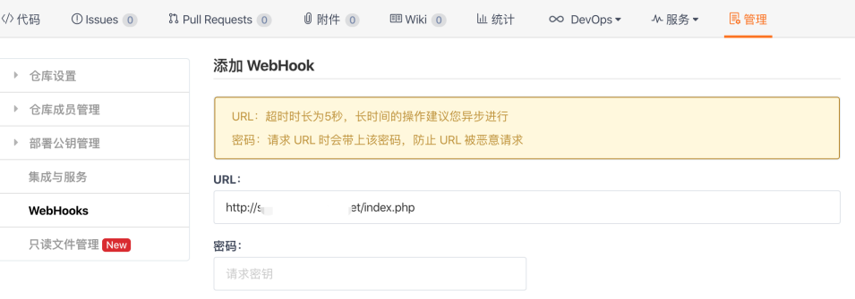

在上图中，我们在 WebHook 中填写了一个外网可访问的 URL 地址，这个地址的后端使用何种语言都可以，只要能接收参数并执行代码即可，我们的钩子操作将在这份代码里面实现。

## 23.2 分析钩子参数

在设置好钩子地址之后，在编写钩子代码之前，我需要知道码云平台会将哪些参数给我传递过来，才好进行下一步编写。因此我在编写钩子代码最开始的位置，会先将参数接收，然后保存到本地，用来分析钩子的参数结构。

> 大家在实践我这个实验的时候，需要在你的服务器中安装 PHP 运行环境，每个系统的安装方法有一定的区别，这篇文章不展开怎么安装 PHP+Nginx 环境了。

下面是我用 PHP 代码实现钩子的接收，我这里使用 vim 去编辑 PHP 代码文件，执行命令如下所示：

```
vim index.php
```

vim 命令执行之后，我需要在里面编写钩子所执行的具体代码，如下图所示：

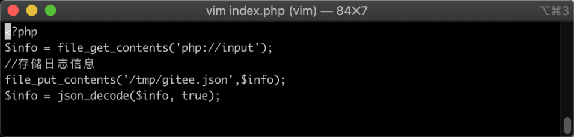

在上图当中，我用 PHP 语言编写，首先接收了码云传递过来的参数，然后将参数写入到文件当中，为了方便大家做实验：

```php
<?php
	$info = file_get_contents('php://input');
	//存储日志信息
	file_put_contents('/tmp/gitee.json',$info);
	$info = json_decode($info,true);
```

钩子代码准备完毕之后，我们回到本地代码仓库，在仓库中修改代码，然后提交新版本并推送到码云中，码云便会调用我们的钩子接口，修改代码命令如下所示：

```shell
echo '123123'  >  a.txt  && git status
```

命令执行完毕之后，Git 仓库的文件状态如下图所示：

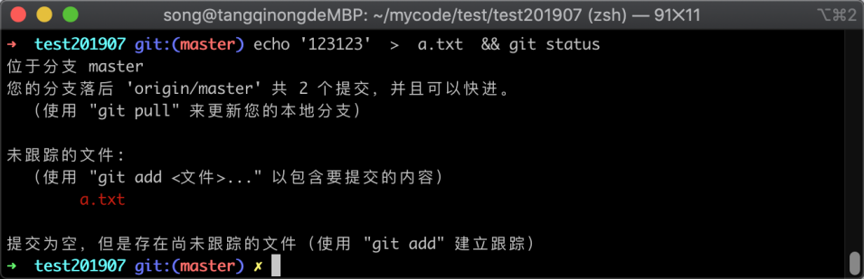

在上图中，可以看到文件 `a.txt` 处于新增状态，接着我们将此文件通过 `git commit` 提交到新版本当中，执行命令如下所示：

```
git add . && git commit . -m '服务端钩子测试'
```

命令执行完毕之后，如下图所示：

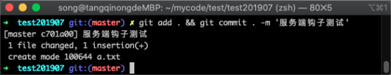

在上图中，可以看到已经将新增加的文件添加到版本控制器当中，我们可以使用 `git log` 命令查看一下版本列表，执行命令如下所示：

```
git log
```

命令执行之后，返回的版本信息如下图所示：

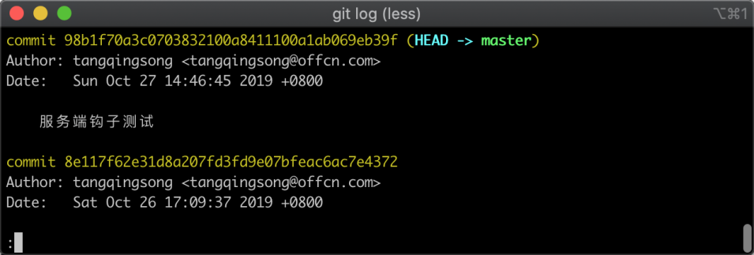

在上图中我们可以看出已经新增版本成功， 接着我们使用 `git push` 推送到码云平台中，推送后码云便会调用我们的钩子事件，推送到远程仓库的命令如下所示：

```
git push
```

命令执行之后，远端返回的信息如下所示：

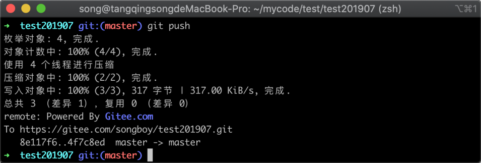

在图中我们可以看到码云平台接收推送的数据已经成功，推送完成之后，我们去钩子所在的服务器查看参数是否被打印出来，执行命令如下所示：

```
cat /tmp/gitee.json
```

命令执行之后，如果提示文件不存在，那么可能你填写在码云的 URL 地址不正确，可以先自己打开 URL 尝试是否能打开；如果执行之后能查看到里面的参数，就说明钩子调用成功，如下图所示：

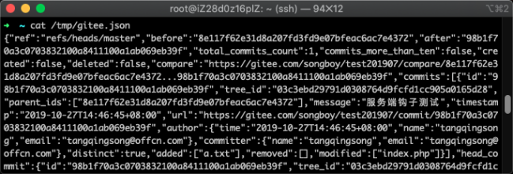

在上图中可以看到一串 Json 格式的数据，我们将内容复制出来，然后去[开发工具箱](http://www.box3.cn/)点击通用代码美化，就会将压缩的 Json 数据格式化出来，便于我们分析， 如下图所示：

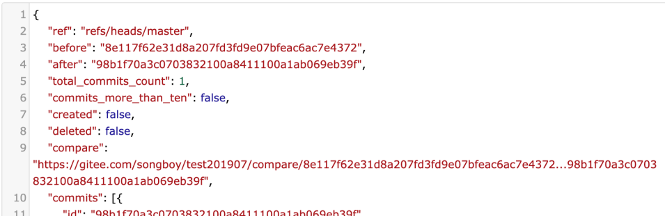

在上图中，可以看到很多个参数，其中 `after` 和 `before` 参数分别代表是接收推送之前的 commitid 和接收之后的 commitid，在我们这个钩子中暂时不需要用到这两个。

## 23.3 编写钩子代码

在最上方有一个 `ref` 参数，我们可以用来判断提交的分支是哪一个，比如我们只在 master 分支收到推送的时候才更新，那么就可以判断值里面是否包含 `master`，根据需要分析了钩子的参数之后，我们就可以继续编写钩子的代码了，在这里需要注意：

> 后台的程序一定要有操作 Git 的权限，Nginx 运行和 PHP 的运行用户与当前登陆的账户是否一致。

现在我们先手动新建目录，并且把码云仓库的代码克隆下来，执行的命令如下所示：

```shell
cd /data/code && git clone git@gitee.com:songboy/test201907.git
```

命令执行完毕之后，如下图所示：

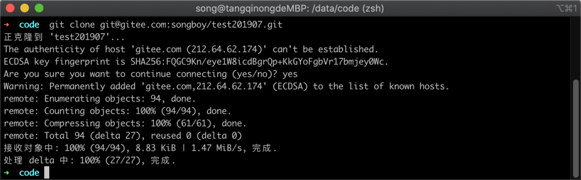

在上图中可以看到远程仓库的代码已经被克隆到本地了，接着我们开始编写钩子代码，这里我使用 vim 编辑器去编辑，执行的命令如下所示：

```
vim index.php
```

命令执行之后，会出现一个 vim 提供的编辑界面，我们在里面编写代码，如下图所示：

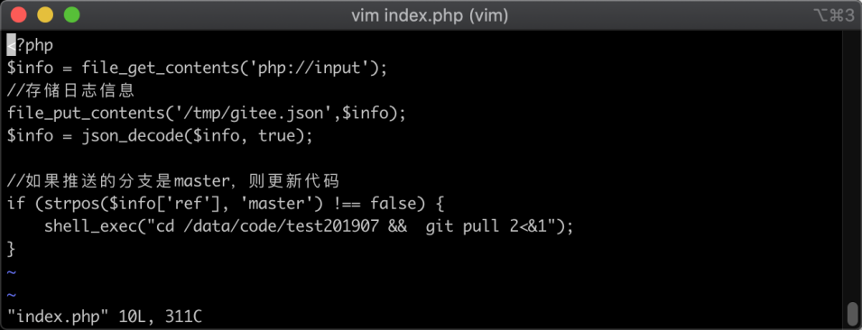

为了大家调试方便，我将上图中的代码复制了下来，参考代码如下所示：

```php
<?php
    $info = file_get_contents('php://input');
    //存储日志信息
    file_put_contents('/tmp/gitee.json',$info);
    $info = json_decode($info,true);

    //如果推送的分支是master，则更新代码
    if(strpos($info['ref'],'master') !== false){
        shell_exec("cd /data/code/test201907 &&  git pull 2<&1");
    }
```

代码逻辑比较简单，首先是接收参数，然后将参数使用 `json_decode` 函数转换为数组，在判断参数 `ref` 中是否包含了 `master` 字符，如果包含说明推送的分支是 `master` 分支，那么就进入刚才克隆代码的目录，并执行 `git pull` 命令。

## 23.4 验证钩子效果

钩子代码写完之后，我们回到本地的开发仓库，重新修改代码，提交新版本并推送到远程仓库中，执行命令如下所示：

```shell
echo   'daxia' > c.txt  && git add . && git commit . -m  '推送服务端钩子测试V2' && git push
```

命令执行完毕之后，如下图所示：

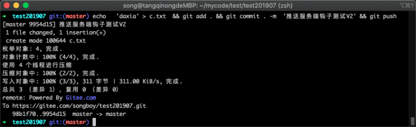

在上图中可以看到已经将新版本推送到码云平台中，推送后，码云平台依然会调用我们的 URL 地址，然后我们 URL 对应的钩子事件会被执行，执行后会拉取最新代码到本地，现在我们进入刚才新建的仓库目录，并查看版本记录，执行命令如下所示：

```shell
cd /data/code/test201907 && git log
```

命令执行完毕之后，如下图所示：

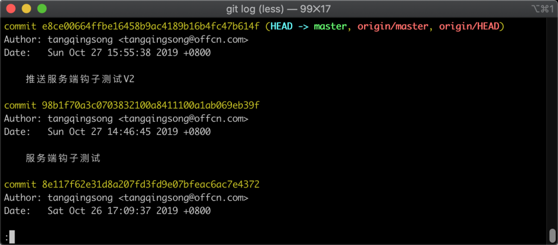

在上图中可以看到我们在本地仓库推送到码云的新版本已经被钩子拉取下来。

如果发现仓库版本并没有变更，你可以按照以下 2 步骤进行检查：

> 1. 本地版本是否成功推送到码云平台
> 2. 码云平台设置的钩子地址是否能被公网所访问
> 3. 钩子增加访问日志，查看码云是否访问到钩子
> 4. 手动执行 `git pull` 命令是否能拉取代码
> 5. 检查钩子需要操作仓库的位置文件夹的权限是否足够
> 6. 使用 `ps -ef` 命令检查运行钩子的账户，是否有权限拉取 Git 仓库

## 23.5 小结

在这一节当中，我们主要学习服务端钩子的使用方法，主要有以下 3 个步骤：

1. 在 Git 服务端的 web 页面中设置一个钩子地址，需要公网可访问
2. 编写钩子代码，支持各种语言，根据需要可以分析钩子的参数
3. 验证钩子运行效果，通常大部分不成功的原因是因为权限不正确
