# 26-工作区暂存：stash解决提示代码未提交问题


> 不安于小成，然后足以成大器；不诱于小利，然后可以立远功。——方孝孺

在团队合作开发中，我们尽量会将一个功能完整开发后再提交版本，这样当其他人拉取代码时候，就不会因为功能不完整而产生报错问题；但有时候线上出现紧急 bug，需要把已经提交的版本发布到线上，这个时候还没有开发完整的改动就比较尴尬；如果丢弃未开发完整的代码有点可惜，但提交又可能会导致其他人拉取到未开发完整的代码，从而导致出现问题。

不提交也不丢弃也不行，因为如果需要去切换分支去合并代码，Git 会提示有未提交的改动，而不允许切换分支；遇到这种问题时候，可以使用这一节中的 `git stash` 命令，将工作区改动临时存储起来，然后就可以切换分支了，等处理完一切事物后，再回到开发分支将暂存区域恢复，继续进行开发。

## 26.1 场景复现

工作区暂存使用的场景有很多，下面我们模拟一个现象来举例，平时遇到 Git 提示工作区改动未提交不能切换分支，就可以使用工作区暂存方式解决，下面带着大家来熟悉 `git stash` 命令的使用。

首先我们切换到 `develop` 这个开发分支中，随意修改一些代码然后提交一个版本；然后再次修改一些代码，但不提交版本，进行切换分支，我们看看会提示什么，切换到 develop 分支命令如下所示：

```
git checkout develop
```

命令执行完毕之后，终端展示的信息如下图所示：

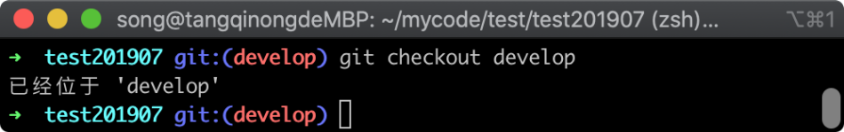

在上图中可以看到已经成功切换到了 develop 分支，现在我随意修改一些代码，然后提交一个新版本，代表这是我们开发完成功能后提交的版本，执行的命令如下所示：

```
echo '222221112' > aa.txt && git add . && git commit . -m '暂存功能测试'
```

命令执行完毕之后，Git 返回的信息如下图所示：

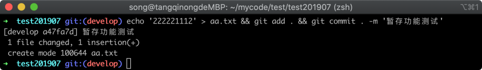

在上图中可以看到文件 `aa.txt` 已经成功的添加到新版本控制器中去，接着我们继续开发新功能，这里我们随意修改代码，执行命令如下：

```
echo '333333333' > aa.txt  && git status
```

命令执行完毕之后，Git 仓库的文件状态如下图所示：

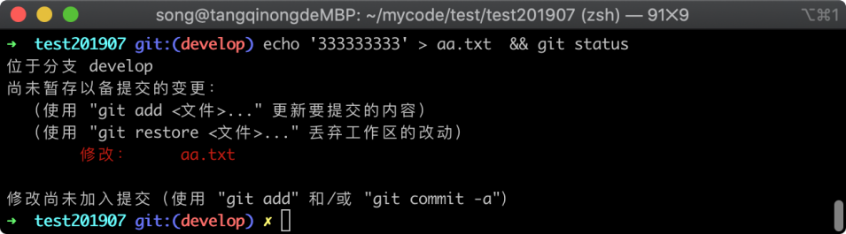

在上图中可以看到 `aa.txt` 文件已经内容已经发生了变更。就在这个时候有人反馈线上代码发现了一个重大的 bug，需要立即切换分支去修复 bug，于是我们准备切换分支，参考命令如下所示：

```
git checkout test
```

命令执行完毕之后，Git 返回的提示信息如下图所示：

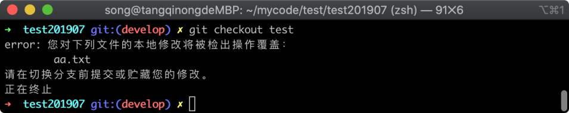

在上图中可以看到无法切换分支，并且提示需要将工作区提交存储起来。

## 26.2 工作区暂存

但刚才的开发只开发到一半，并不合适把它单独存到一个版本，这个时候我们就可以使用 `git stash` 命令来解决这个尴尬，执行如下命令：

```
git stash
```

命令执行完毕之后，Git 返回的信息如下图所示：

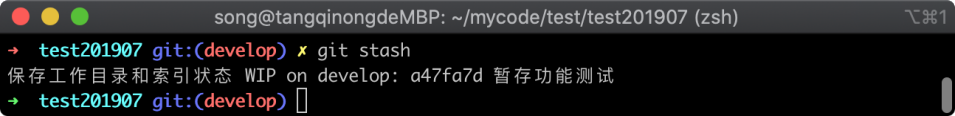

在上图中看到的这个提示，代表我们将工作区改动暂存成功， 我们可以通过 `git status` 命令查看当前状态，执行命令如下所示：

```
git status
```

命令执行完毕之后，Git 仓库的文件状态如下图所示：


在上图中可以看到当前工作区没有任何改动的提示，这是因为我们已经成功把修改的代码存储到暂存区了，接着再次尝试切换到 test 分支，执行命令如下所示：

```
git checkout test
```

命令执行完毕之后，Git 返回的信息如下图所示：

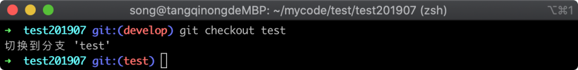

在上图中可以看到切换到 `test` 分支已经成功，接下来我们将在 `develop` 分支中提交的版本合并过来，合并分支的命令如下所示：

```
git merge develop
```

命令执行完毕之后，Git 仓库的文件状态如下图所示：

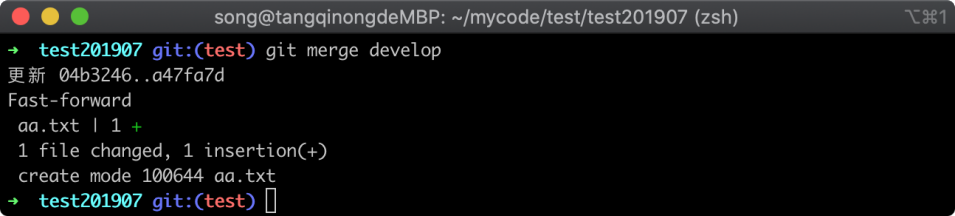

在上图中可以看到合并代码已经成功，我们通过 `cat` 命令查看 `aa.txt` 文件是否已经过来，用来验证合并是否成功，执行命令如下：

```
cat aa.txt
```

命令执行完毕之后，展示 `aa.txt` 文件内容如下图所示：

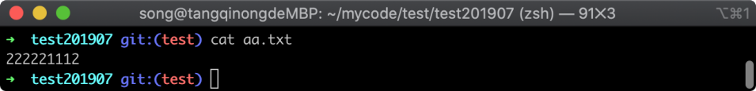

在上图中可以看到提交的版本代码已经成功复制过来，到这里我们就解决了未提交版本不能切换分支的尴尬。

## 26.3 暂存区查看

既然已经把可以合并的版本合并完成，那么接下来就可以回到 develop 分支继续进行开发，切回 `develop` 分支执行命令如下：

```
git checkout develop
```

命令执行完毕之后，Git 仓库的文件状态如下图所示：

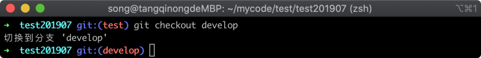

在上图中可以看到已经成功切换回 develop 分支，到现在我们就解决了不能切换分支的问题，接着我们需要将刚暂存的改动恢复到工作区，这样就可以继续我们的开发任务，恢复暂存改动的命令也非常简单，我们使用 `git stash apply` 命令即可，不过在执行恢复暂存区之前，我们可以先看暂存区列表，执行的命令如下所示：

```
git stash list
```

命令执行完毕之后，Git 返回的信息如下图所示：

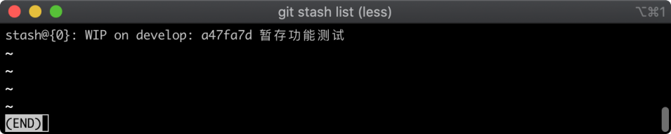

在上图中可以看到有一个暂存的记录，既然是列表就说明暂存区也是可以存放多个的，当我们需要恢复时候，可以使用如下命令：

```
git stash apply stash@{0}
```

在上面命令中，`git stash apply` 为固定格式，`stash@{0}` 为编号，如果想恢复最近的一个改动也可以不填写编号，直接执行命令的前半部分就可以了，如下命令所示：

```
git stash apply
```

命令执行完毕之后，Git 返回如下图所示：

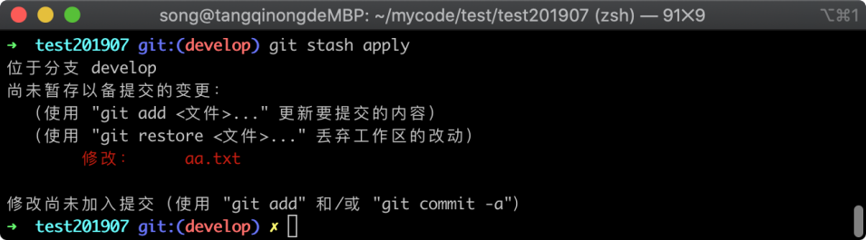

在上图中可以看到提示 `aa.txt` 文件有改动未被提交，说明我们恢复暂存已经成功了。

## 26.4 小结

工作区暂存适合于我们需要临时存储改动，暂存区和分支没有关联关系，是可以跨分支的，命令都是以 `git stash` 命令开头，这里我们主要记住这三个命令：

1. `git stash` 暂存当前工作区的改动
2. `git stash apply {暂存区编号}` 不填编号恢复上一次暂存的改动，填了恢复指定暂存记录
3. `git stash list` 查看暂存区列表
