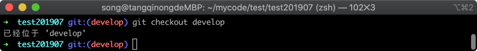
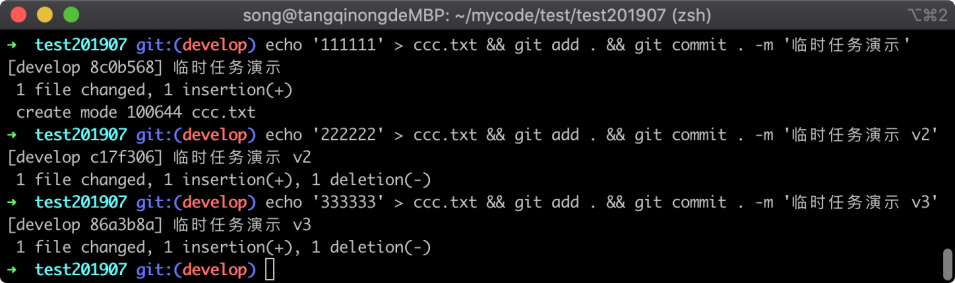
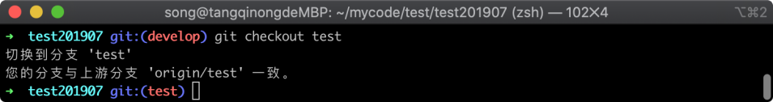
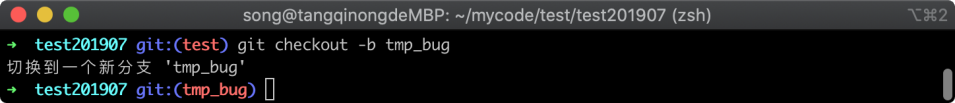
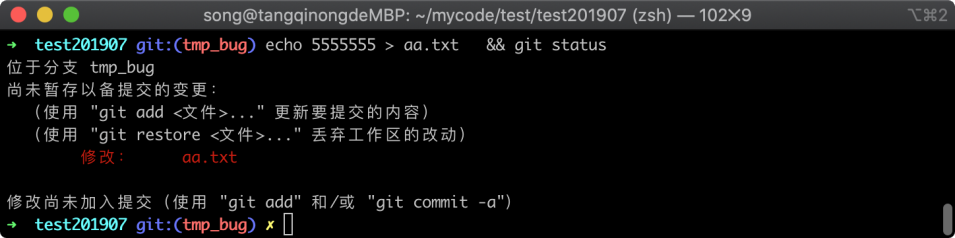
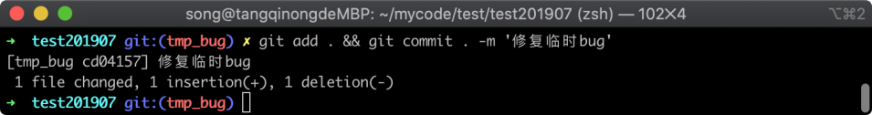
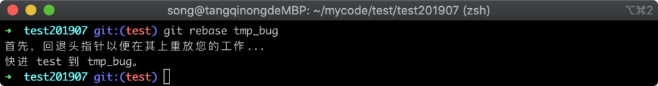
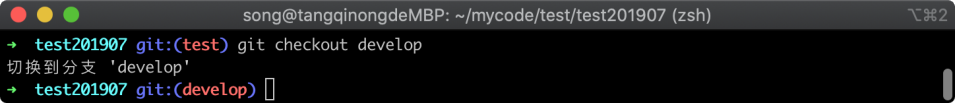
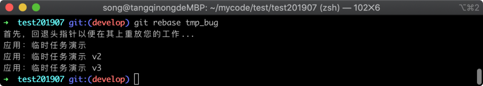
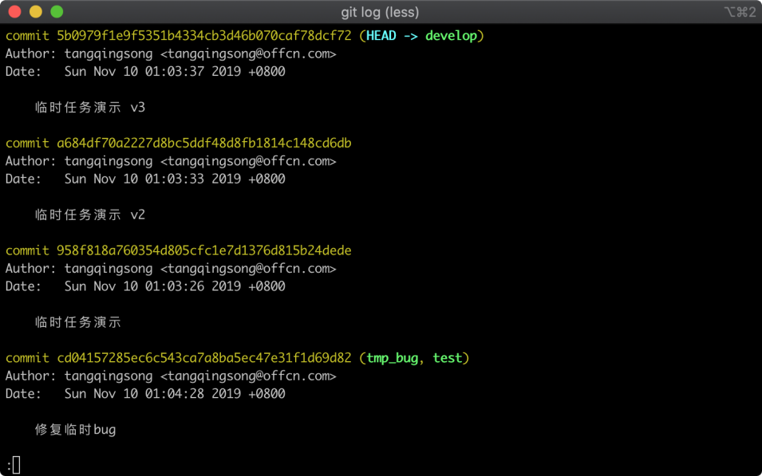

# 27-临时任务流程：解决中途需要修复BUG的尴尬


> 人生的旅途，前途很远，也很暗。然而不要怕，不怕的人的面前才有路。—— 鲁 迅

前面一节中我们学习了工作区暂存，可以用于临时修复 bug 或切换临时分支场景，这里我们再学习一个与之类似的场景：有时候项目规划了一个大版本，开发周期需要 2 个月，当我们开发到一半时候，产品经理突然说要搞个活动页面，需要在中间插入一个小版本，需要一周后上线，这个时候我们的开发分支就比较被动。

如果此时直接在当前开发分支基础上，开发活动页面的任务，将来上线会遇到麻烦，因为大的迭代版本还未开发完。而如果直接在 `test` 分支上开发任务不经过 `develop` 分支，将来等我们 `develop` 分支的大版本迭代开发完成时候，会在 `test` 分支合并 `develop` 分支代码，可能遇到代码冲突问题，因为两个分支都有新版本，Git 不知道以哪个版本为主。

## 27.1 流程设计思路

此时，我们就需要一套比较好的流程，来避免上面提到的一些问题，我们在上一节当中，学习了工作区暂存功能，不过暂存区只适合临时存储，对于这种活动页面开发周期时间比较长的，并不是不太适合。

这里我给大家参考一下我的解决方案，我们可以先从 `develop` 分支切换到 `test` 分支中去，然后从 `test` 分支基础上中新建一个 `tmp` 临时开发分支，在 `tmp` 分支中开发功能。

当开发完成之后再切回 `test` 分支，使用 `git rebase` 命令将 `tmp` 分支的提交记录复制到 `test` 分支中去，这样就可以交给测试人员测试后发布新版本了。不过为了避免将来 `develop` 分支的版本开发完成后，与 `test` 分支合并产生代码冲突问题，我们还需要切换到 `develop` 分支中，同样使用 `git rebase` 命令将 `tmp` 分支上提交的版本复制过来，这样就保障了临时任务可以提前单独发布到线上去，还不会将来产生代码冲突问题。

## 27. 2 发布临时任务

下面我通过一个实例来演示一下临时任务的处理流程，假设我们现在正在 `develop` 分支中开发一个大版本，执行切换到 `develop` 分支的命令如下所示：

```
git checkout develop
```

命令执行完毕之后，Git 返回的信息如下图所示：



在上图中可以看到已经切换到 develop 分支当中，接着我们模拟几条新版本记录，执行的命令如下所示 ：

```
echo '111111' > ccc.txt && git add . && git commit . -m '临时任务演示'
echo '222222' > ccc.txt && git add . && git commit . -m '临时任务演示 v2'
echo '333333' > ccc.txt && git add . && git commit . -m '临时任务演示 v3'
```

命令执行完毕之后，Git 返回的信息如下图所示：



在上图中可以看到三个版本的记录已经提交成功，这个时候我们突然接到产品经理说需要开发一个活动页面，后天晚上就需要上线，但我们还未开发完成的代码是不上线的，这个时候，我们就先回到 test 分支当中，执行的命令如下所示：

```
git checkout test
```

命令执行完毕之后，Git 返回的信息如下图所示：



在上图中可以看到已经切回到 `test` 分支当中，现在我从 test 分支当中新建一个分支，这个分支单独用来提交活动页面的开发任务，执行新建一个新的分支命令如下所示：

```
git checkout -b tmp_bug
```

命令执行完毕之后，Git 返回的信息如下图所示：



在上图中，可以看到新建了一个 `tmp_bug` 分支，并且已经切换到此分支当中，现在我们就在这个分支中开发，这里我随意修改一些代码用来演示，执行命令如下：

```
echo 5555555 > aa.txt   && git status
```

命令执行完毕之后，Git 工作区的改动状态如下图所示：



在上图中可以看到修改了 `aa.txt` 文件，我们将此处修改提交到新版本当中，执行的命令如下所示：

```
git add . && git commit . -m '修复临时bug'
```

命令执行完毕之后，Git 返回的信息如下图所示：



在上图中可以看到 `git commit` 命令执行成功，提交了一个新版本，此时假设我们开发活动页面的这个任务已经完成，需要发布到线上环境中去，于是我们回到 test 分支中，执行切换到 test 分支的命令如下所示：

```
git checkout test
```

命令执行完毕之后，Git 返回的信息如下图所示：


在上图中可以看到已经切换到了 `test` 分支中去，接着我们只需要使用 `git rebase` 命令，将 `tmp_bug` 分支中的提交记录复制到当前分支即可，执行命令如下所示：

```
git rebase tmp_bug
```

命令执行完毕之后，Git 返回的信息如下图所示：



在上图中可以看到 rebase 命令顺利执行完毕，已经将 `tmp_bug` 分支中提交的版本记录复制过来，这个时候就可以将代码提交给测试人员测试，测试通过后就可以发布到线上去了。

## 27.3 避免后续合并冲突

但我们这个时候需要考虑一个问题，我们此时其实相当于直接在 `test` 分支中修改了 `aa.txt` 代码，但 `develop` 分支中并没有此条修改记录，如果在后续 `develop` 分支同样修改了 `aa.txt` 文件，到时候任务开发完成在 test 分支合并 develop 就会产生冲突，因此，我们还需要在 develop 分支中也将 `tmp_bug` 的版本记录复制过来，现在先切换到 develop 分支当中，切换 develop 分支命令如下所示：

```
git checkout develop
```

命令执行完毕之后，Git 返回的信息如下图所示：



在上图中可以看到已经成功切换到了 develop 分支当中，然后我们使用 `git rebase` 命令将 `tmp_bug` 分支的版本复制过来，执行的命令如下所示：

```
git rebase tmp_bug
```

命令执行完毕之后，Git 返回的信息如下图所示：



在上图中可以看到 `git rebase` 顺利被执行，Git 我们在 `develop` 分支当中最开始提交的三条记录被放在 `tmp_bug` 分支提交记录的后面，这样我们就避免了与 `test` 分支的分叉而造成代码冲突问题，我们可以使用 `git log` 命令查看版本记录，执行命令如下所示：

```
git log
```

命令执行完毕之后，Git 仓库的版本列表如下图所示：



在上图中可以看到我们四条修改都在版本列表当中，其中 " `修复临时bug`" 的记录虽然在时间上是在前三者后面被提交的，但在版本控制列表中保持在最下面。

因此 `develop` 分支与 `test` 分支的区别就只是比它多了三条记录而已，避免了将来在 `test` 分支合并 `develop` 代码时候代码冲突问题。

## 27.4 小结

在这一节当中主要学习了临时接到紧急需求的处理方法，主要需要考虑两个场景，紧急任务需要在常规任务开发完成之前发布并且需要单独发布，紧急任务发布后不影响常规任务的开发，主要有这几点需要做：

1. 新建一个临时分支，在临时分支中开发
2. 回到 `test` 分支中，将临时分支的版本记录复制过来，单独发布上线
3. 回到 `develop` 分支中，将临时分支的版本记录复制过来，避免后续与 `test` 分支产生代码冲突
