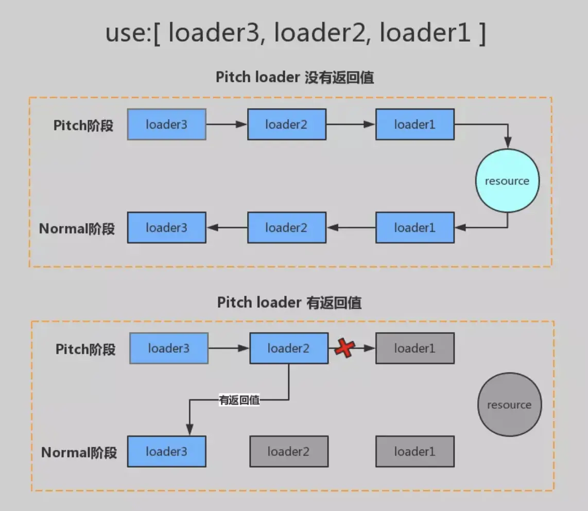

# loader 专题

## 什么是 loader

webpack 只能处理 JavaScript JSON 文件，对于其他类型的文件，需要使用 loader 进行处理。

loader 是一个转换器，它将不同类型的文件转换为 webpack 能够处理的有效模块，然后你就可以利用 webpack 的打包能力对它们进行处理。

loader 可以将所有类型的文件转换为应用程序的依赖图（和最终的 bundle）可以直接使用，并且支持链式传递。链中的每个 loader 都将对前一个 loader 的结果进行操作。

loader 运行在 Node.js 中，并且能够执行任何可能的操作。

## loader 的特点

1. 每一个 loader 都要返回 js 脚本
2. 每一个 loader 只做一件内容，为了使 loader 在更多场景链式调用
3. 每一个 loader 都是一个模块
4. 每一个 loader 都是无状态的，确保 loader 在不同模式转换之间不保存状态

## 写一个简单的 loader

loader 就是一个函数，参数是匹配到的文件内容，返回结果为最新的内容

```js
function loader(source) {
  return 'hello'
}
module.exports = loader
```

## loader 的几种引入方式

### 1. 通过 npm 包安装的 loader 可以这样写

```js
module.exports = {
  module: {
    rules: [
      {
        test: /\.js$/,
        // 直接写loader名称可以找到对应的loader
        use: 'babel-loader',
        exclude: /node_modules/,
      },
    ],
  },
}
```

### 2. 如果是自己写 loader，可以使用绝对路径的方式

```js
module.exports = {
  module: {
    rules: [
      {
        test: /\.js$/,
        use: path.resolve(__dirname, 'loaders/a.js'),
        exclude: /node_modules/,
      },
    ],
  },
}
```

### 3.如果是自己写 loader, 还可通过配置别名的方式来获取

```js
module.exports = {
  resolveLoader: {
    alias: {
      'a-loader': path.resolve(__dirname, 'loaders/a.js'),
    },
  },
  module: {
    rules: [
      {
        test: /\.js$/,
        use: 'a-loader',
        exclude: /node_modules/,
      },
    ],
  },
}
```

### 4. 如果还是不满意, 通过 自定义查找路径 方式来获取

> 那么就是通过 loader 的查找方式来定义，loader 默认会在 node_modules 查找，也可以指定其他的目录，来查找我们自定义的 loader

```js
module.exports = {
  resolveLoader: {
    modules: [
      path.resolve(__dirname, 'node_modules'),
      path.resolve(__dirname, 'loader'),
    ],
  },
  module: {
    rules: [
      {
        test: /\.js$/,
        use: 'a-loader',
        exclude: /node_modules/,
      },
    ],
  },
}
```

## loader 的执行顺序

正常的 loader 的执行顺序是从右向左的，如下图,执行顺序为：c-loader ----> b-loader----> a---->loader, 也就是 a-loader(b-loader(c-loader(resource)))

```js
module.exports = {
  module: {
    rules: [
      {
        test: /\.js$/,
        use: ['a-loader', 'b-loader', 'c-loader'],
        exclude: /node_modules/,
      },
    ],
  },
}
```

## 何谓 loader pitch

### loader 的种类

Loader 可以分为四种: 在 webpack 中 loader 分为四个阶段，分别是 pre、normal、inline 以及 post 四种 loader，区分它们的依据正如它们的名字：四种 loader 会按照不同的执行顺序去执行。

Pitching 阶段: loader 上的 pitch 方法，按照 后置(post)、行内(inline)、普通(normal)、前置(pre) 的顺序调用。

Normal 阶段: loader 上的 常规方法，按照 前置(pre)、普通(normal)、行内(inline)、后置(post) 的顺序调用。模块源码的转换， 发生在这个阶段。

### 指定 loader 种类

在 webpack 配置文件中，我们可以通过 module 对象上的 `rule.enforce` 配置项规定这个 `loader` 的种类，通过配置文件我们可以配置三种类型的 loader：

- 当 `enforce` 为 `pre` 时，该配置项目内的 loader 为前置 `pre loader`
- 当 `enforce` 为 `post` 时，该配置项目内的 loader 为后置 `post loader`
- 当 `enforce` 什么都不配置时，该配置项目内的 loader 为默认 `normal loader`
- `inline-loader` 并不在 `webpack` 配置文件中进行配置，它的配置方式在我们的业务代码的模块引入语句中

  - `inline loader` 的执行顺序同样是从右往左，也就是 `inline-loader` 执行时会先执行 `css-loader` 处理文件，再会执行 `style-loader` 处理。

  ```js
  import Styles from 'style-loader!css-loader?modules!./styles.css'
  ```

**使用行内 loader 时，可以额外配置一些规则**

- 使用 ! 前缀，将禁用所有已配置的 normal loader(普通 loader)

```js
import Styles from '!style-loader!css-loader?modules!./styles.css'
```

- 使用 !! 前缀，将禁用所有已配置的 loader（preLoader, loader, postLoader）,只要行内

```js
import Styles from '!!style-loader!css-loader?modules!./styles.css'
```

- 使用 -! 前缀，将禁用所有已配置的 pre loader 和 normal loader，但是不禁用 postLoaders

```js
import Styles from '-!style-loader!css-loader?modules!./styles.css'
```

### normal loader & pitch loader

> 我们将 loader 的 pitch 属性称为 loader 的 pitch loader。将 loader 函数本身称为 normal loader。

在定义一个 loader 函数时，可以导出一个 pitch 方法，这个方法会在 loader 函数执行前执行。

```js
// 关于normal loader本质上就是loader函数本身。
function loader(source) {
  // 这里可以针对这个结果做一些处理
  console.log('self-define-lader')
  // 返回处理的结果
  return source
}

// 关于pitch loader就是normal loader上的一个pitch属性，它同样是一个函数:
loader.pitch = function (remainingRequest, precedingRequest, data) {
  console.log('pitch')
  // 返回结果
  return 'hello'
}

module.exports = loader
```

另外，如果存在多个 loader 串行的情况，这些 loader 的 pitch 函数会从左到右依次执行，其示意图如下：



## 手动实现 babel-loader

[具体代码参见: loaders/babel-loader.js](https://github.com/gy1001/Javascript/blob/main/Webpack/zf-webpack/self-babel-loader/loaders/babel-loader.js)

### 安装核心包

```bash
npm install @babel/core @babel/preset-env  -D
```

> webpack 5 已经可以直接在 loader 中通过 this.query 直接获取 loader 的 options 配置，所以不需要利用 loader-utils 工具获取：

### loaders/babel-loader.js

```js
const babelCore = require('@babel/core')

function babelLoader(source) {
  // webpack 5 已经可以通过this.query 直接获取loader的options配置，所以不需要利用loader-utils工具获取：
  // 异步 loader 必须要调用this.async()以及this.callback来告知
  let cb = this.async()
  // console.log(this.resourcePath) 是一个绝对路径
  // /Users/gaoyuan/Code/learn/MyGithub/Javascript/Webpack/zf-webpack/self-babel-loader/src/index.js
  babelCore.transform(
    source,
    {
      ...this.query,
      sourceMaps: true,
      // 增加 filename 属性，用于生成 source-map 文件名,否则在浏览器中查看 source-map 文件名是空的
      filename: this.resourcePath.split('/').pop(),
    },
    function (err, result) {
      // 异步
      cb(err, result.code, result.map)
    },
  )
}

module.exports = babelLoader
```

### 对应的 webpack.config.js

```js
const path = require('path')

module.exports = {
  mode: 'development',
  entry: './src/index.js',
  output: {
    filename: 'bundle.js',
    path: __dirname + '/dist',
  },
  resolveLoader: {
    modules: ['node_modules', path.resolve(__dirname, 'loaders')],
  },
  devtool: 'source-map',
  module: {
    rules: [
      {
        test: /\.js$/, // 匹配所有的js文件
        exclude: /node_modules/, // 排除node_modules文件夹
        use: [
          {
            loader: 'babel-loader',
            options: {
              presets: ['@babel/preset-env'],
            },
          },
        ],
      },
    ],
  },
}
```

## 手动实现 banner-loader

[具体代码参见: loaders/banner-loader.js](https://github.com/gy1001/Javascript/blob/main/Webpack/zf-webpack/self-babel-loader/loaders/banner-loader.js)

### loaders/banner-loader.js

```js
const schemeUtils = require('schema-utils')

function bannerLoader(source) {
  const cb = this.async()
  schemeUtils.validate(
    {
      type: 'object',
      properties: {
        // 配置参数
        text: {
          type: 'string',
        },
      },
    },
    this.query,
    // 错误模块文本，方便根据错误信息定位
    'babel-loader',
  )
  cb(null, `/**${this.query.text}**/ ${source}`)
}

module.exports = bannerLoader
```

### 对应的 webpack.config.js

```js
const path = require('path')

module.exports = {
  mode: 'development',
  entry: './src/index.js',
  output: {
    filename: 'bundle.js',
    path: __dirname + '/dist',
  },
  resolveLoader: {
    modules: ['node_modules', path.resolve(__dirname, 'loaders')],
  },
  devtool: 'source-map',
  module: {
    rules: [
      {
        test: /\.js$/, // 匹配所有的js文件
        exclude: /node_modules/, // 排除node_modules文件夹
        use: [
          {
            loader: 'banner-loader',
            options: {
              text: '这是一个自定义的banner',
            },
          },
        ],
      },
    ],
  },
}
```

## 手动实现 file-loader 和 url-loader

[具体代码 file-loader](https://github.com/gy1001/Javascript/blob/main/Webpack/zf-webpack/self-babel-loader/loaders/file-loader.js)

[具体代码 url-loader](https://github.com/gy1001/Javascript/blob/main/Webpack/zf-webpack/self-babel-loader/loaders/url-loader.js)

### file-loader 实现如下

```js
// file-loader.js
const loaderIUtils = require('loader-utils')
// fileLoader 需要返回一个路径
function fileLoader(source) {
  // 处理文件逻辑
  const fileName = loaderIUtils.interpolateName(this, '[hash].[ext]', {
    content: source,
  })
  // 发射文件
  this.emitFile(fileName, source)
  // 返回处理后的内容
  return `module.exports = ${JSON.stringify(fileName)}`
}
// 加上这一行后，拿到的 source 就会改为 buffer 模式，二进制
fileLoader.raw = true
module.exports = fileLoader
```

### url-loader 实现如下

```js
const fileLoader = require('./file-loader')
var mime = require('mime-types') // 用于获取文件类型, mime最新版已经是 esm, 使用时会报错

function urlLoader(source) {
  console.log(mime.lookup(this.resourcePath)) // image/jpeg 等
  const { limit } = this.query
  if (limit && limit > source.length) {
    return `module.exports="data:${mime.lookup(
      this.resourcePath,
    )};base64,${source.toString('base64')}"`
  }
  return fileLoader.call(this, source)
}
urlLoader.raw = true
module.exports = urlLoader
```

### 对应的 webpack.config.js

```js
const path = require('path')

module.exports = {
  mode: 'development',
  entry: './src/index.js',
  output: {
    filename: 'bundle.js',
    path: __dirname + '/dist',
  },
  resolveLoader: {
    modules: ['node_modules', path.resolve(__dirname, 'loaders')],
  },
  devtool: 'source-map',
  module: {
    rules: [
      {
        test: /\.jpeg$/, // 匹配所有的js文件
        exclude: /node_modules/, // 排除node_modules文件夹
        use: [
          // {
          //   // 目的就是根据图片生成一个 md5 发射到 dist 目录下， file-loader 还会返回当前的图片路径
          //   loader: 'file-loader',
          // },
          {
            loader: 'url-loader',
            options: {
              limit: 50 * 1024,
            },
          },
        ],
      },
    ],
  },
}
```

## 实现 less-loader 和 style-loader

[less-loader 实现](https://github.com/gy1001/Javascript/blob/main/Webpack/zf-webpack/self-babel-loader/loaders/less-loader.js)

[style-loader 实现](https://github.com/gy1001/Javascript/blob/main/Webpack/zf-webpack/self-babel-loader/loaders/style-loader.js)

### less-loader 实现

```js
// 依赖于 less
const less = require('less')

function lessLoader(source) {
  let css = ''
  less.render(source, (err, output) => {
    if (err) {
      console.log(err)
    } else {
      css = output.css
    }
  })
  return css
}
module.exports = lessLoader
```

### style-loader 实现

```js
function styleLoader(source) {
  const style = `
  let style = document.createElement('style')
  style.innerHTML = ${JSON.stringify(source)}
  document.head.appendChild(style)
  `
  return style
}
module.exports = styleLoader
```

### 对应的 webpack.config.js

```js
const path = require('path')

module.exports = {
  mode: 'development',
  entry: './src/index.js',
  output: {
    filename: 'bundle.js',
    path: __dirname + '/dist',
  },
  resolveLoader: {
    modules: ['node_modules', path.resolve(__dirname, 'loaders')],
  },
  devtool: 'source-map',
  module: {
    rules: [
      {
        test: /\.less$/,
        use: ['style-loader', 'less-loader'],
      },
    ],
  },
}
```

## 实现 css-loader

[代码参考 css-loader](https://github.com/gy1001/Javascript/blob/main/Webpack/zf-webpack/self-babel-loader/loaders/css-loader.js)

注意：其调用的 style-loader 增加了 pitch 属性

> css-loader 用于解析 css 文件，并将其转换为 js 可以处理的模块。它允许你使用类似 `@import` 和 `url()` 的语法引用其他 CSS 文件或者图片等资源。`css-loader` 会处理这些引用，并将它们嵌入到最终的 CSS 中。它的主要功能是处理 CSS 文件之间的依赖关系。

比如我们修改修改上一节的中的 index.less，加入引入图片

```less
// index.less
@blueColor: blue;
body {
  background-color: @blueColor;
  background-image: url(./img/person.jpeg);
}
```

### 逻辑分析

遇到 url() 的时候我们要把之前的存起来，url(xxx)这一部分替换掉存起来，后面的在存起来，然后拼接起来返回就可以了

### 代码实现

```js
function CssLoader(source) {
  let reg = /url\((.+?)\)/g
  let pos = 0
  let resultArr = []
  resultArr.push('let list = []')
  while ((match = reg.exec(source))) {
    const [matchStr, groups] = match
    // console.log(source.slice(pos, match.index))
    resultArr.push(
      `list.push(${JSON.stringify(source.slice(pos, match.index))})`,
    )
    pos = reg.lastIndex
    // 这里把url 中匹配到的替换成 require 的写法
    resultArr.push(`list.push('url(')`)
    resultArr.push(`list.push(require(${groups}))`)
    resultArr.push(`list.push(')')`)
  }
  resultArr.push(`list.push(${JSON.stringify(source.slice(pos))})`)
  resultArr.push(`module.exports=list.join("")`)
  return resultArr.join('\r\n')
}

module.exports = CssLoader
```

接着我们要使用到 loader.pitch 属性了，我们修改 style-loader 如下

> 注意这里使用 loaderUtils.stringifyRequest 将绝对路径转换为相对路径
>
> 如：remainLoader 结果为：/Users/gaoyuan/Code/learn/MyGithub/Javascript/Webpack/zf-webpack/self-babel-loader/loaders/css-loader.js!/Users/gaoyuan/Code/learn/MyGithub/Javascript/Webpack/zf-webpack/self-babel-loader/loaders/less-loader.js!/Users/gaoyuan/Code/learn/MyGithub/Javascript/Webpack/zf-webpack/self-babel-loader/src/index.less
>
> loaderUtils.stringifyRequest(this, '!!' + remainLoader) 转换后的结果为："!!../loaders/css-loader.js!../loaders/less-loader.js!./index.less"
>
> 这里之所以要用到 !! 修饰符是为了我们只使用行内 loader，禁用其他 loader, 否则会进入死循环
>
> [具体可以参考简书：六、style-loader 中 pitch 的使用](https://www.jianshu.com/p/9dfb8e18e76d)
>
> 其大概的意思是，在 style-loader 的 pitch 方法有返回值时，剩余的 css-loader 的 pitch 方法、css-loader 的 normal 方法以及 style-loader 的 normal 方法都不会执行了。而 style-loader 的 pitch 方法里面调用了**require('!!.../x.css')**，这就会把 require 的 css 文件当作**新的入口文件**，重新链式调用剩余的 loader 函数进行处理。**（值得注意的是'!!'是一个标志，表示不会再重复递归调用 style-loader，而只会调用 css-loader 处理了）**。
>
> 作者：帅气的奶盖
> 链接：https://www.jianshu.com/p/9dfb8e18e76d
> 来源：简书
> 著作权归作者所有。商业转载请联系作者获得授权，非商业转载请注明出处。

```js
// style-loader 增加 pitch 属性
const loaderUtils = require('loader-utils') // 这里要使用 2.xx 版本，3版本中已经没有 stringifyRequest 这个方法了

// 在styleLoader
styleLoader.pitch = function (remainLoader) {
  // 返回一个函数，这个函数会接收一个参数，这个参数就是源代码
  let string = `
    const style = document.createElement('style')
    style.innerHTML = require(${loaderUtils.stringifyRequest(
      this,
      '!!' + remainLoader,
    )})
    document.head.appendChild(style)
  `
  return string
}

module.exports = styleLoader
```

### 对应的 webpack.config.js

```js
const path = require('path')

module.exports = {
  mode: 'development',
  entry: './src/index.js',
  output: {
    filename: 'bundle.js',
    path: __dirname + '/dist',
  },
  resolveLoader: {
    modules: ['node_modules', path.resolve(__dirname, 'loaders')],
  },
  devtool: 'source-map',
  module: {
    rules: [
      {
        test: /\.less$/,
        use: ['style-loader', 'css-loader', 'less-loader'],
      },
    ],
  },
}
```
