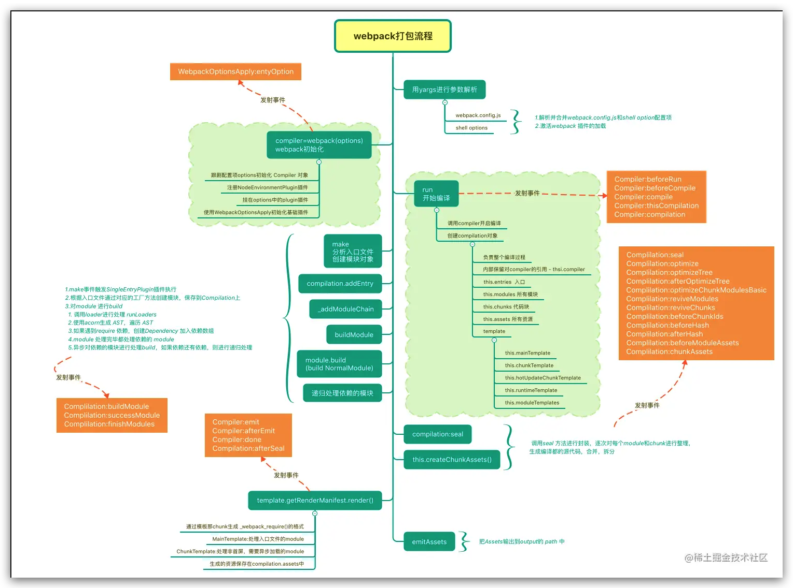

# plugin 专题

## webpack 中的 plugin

webpack 通过 plugins 实现各种功能。开发者可以通过插件引入它们自己的行为到 webpack 构建流程中。但是需要理解一些 webpack 底层特性来做相应的钩子

## webpacK 编译流程




## 加载插件的对象

| 对象                    | 钩子                            |
| :---------------------- | ------------------------------- |
| Compiler 编译对象       | run 开始运行                    |
|                         | compile 开始编译                |
|                         | compilation 创建编译对象        |
|                         | make 创建模块对对象             |
|                         | emit 发射文件                   |
|                         | done 完成                       |
| Compilation 资源构建    | buildModule 创建模块            |
|                         | normalModuleLoader 普通模块加载 |
|                         | succeedModule 模块加载完成      |
|                         | finishModules 所依赖的模块完成  |
|                         | seal 封装整理代码               |
|                         | optimize 优化                   |
|                         | after-seal 封装后               |
| Module Factory 模块处理 | beforeResolver 解析前           |
|                         | afterResolver 解析后            |
|                         | parser 解析                     |
| Module 模块             |                                 |
| Parser 解析             | program 开始遍历                |
|                         | statement 语句                  |
|                         | call 调用                       |
|                         | expression 处理表达式           |
| Template                | hash 处理 hash                  |
|                         | bootstrap 启动                  |
|                         | localVars 变量                  |
|                         | render 渲染                     |

在插件开发中最终的两个资源就是 compiler 和 compilation 对象。compiler 对象代表了完整的 webpack 环境配置。compilation 对象代表了一次资源版本构建

## 自定义插件 同步插件和异步插件

[代码参考 DonePlugin.js](https://github.com/gy1001/Javascript/blob/main/Webpack/zf-webpack/self-plugin/plugins/DonePlugin.js)

[代码参考 AsyncPlugin.js](https://github.com/gy1001/Javascript/blob/main/Webpack/zf-webpack/self-plugin/plugins/AsyncPlugin.js)

### 同步插件 DonePlugin

```js
class DonePlugin {
  constructor() {}
  apply(compiler) {
    compiler.hooks.done.tap('DonePlugin', (stats) => {
      console.log('编译完成')
      // console.log(stats)
    })
  }
}

module.exports = DonePlugin
```

### 异步插件 AsyncPlugin

```js
class AsyncPlugin {
  apply(compiler) {
    compiler.hooks.emit.tapAsync('AsyncPlugin', (compilation, callback) => {
      // 模拟异步操作
      setTimeout(() => {
        console.log('异步插件执行了')
        callback()
      }, 1000)
    })

    compiler.hooks.emit.tapPromise('AsyncPlugin', (compilation) => {
      // 模拟异步操作
      return new Promise((resolve) => {
        setTimeout(() => {
          console.log('异步promise插件执行了')
          resolve()
        }, 1000)
      })
    })
  }
}

module.exports = AsyncPlugin
```

### 对应的 webpack.config.js 文件

```js
const path = require('path')
const DonePlugin = require('./plugins/DonePlugin')
const AsyncPlugin = require('./plugins/AsyncPlugin')
module.exports = {
  mode: 'development',
  devtool: false,
  entry: './src/index.js',
  output: {
    filename: 'bundle.js',
    path: path.resolve(__dirname, 'dist'),
  },
  plugins: [
    // ...
    new DonePlugin(),
    new AsyncPlugin(),
  ],
}
```

执行`npm run dev` 后，结果如下

```bash
npm run dev
# 1s 后
异步插件执行了
# 再 1s 后
异步promise插件执行了
编译完成
```

## 实现文件列表插件 FileListPlugin

[具体代码查看 github 示例](https://github.com/gy1001/Javascript/blob/main/Webpack/zf-webpack/self-plugin/plugins/FileListPlugin.js)

[webpack 官网之 compiler 钩子](https://www.webpackjs.com/api/compiler-hooks/)

[webpack 官网之 compilation 钩子](https://www.webpackjs.com/api/compilation-hooks/)

```js
class FileListPlugin {
  constructor(options) {
    this.options = options
  }
  apply(compiler) {
    compiler.hooks.compilation.tap('OnePlugin', (compilation) => {
      compilation.hooks.additionalAssets.tapAsync('MyPlugin', (callback) => {
        let content = `## 文件名  资源大小`
        Object.entries(compilation.assets).forEach(([filename, stat]) => {
          content += `\n- ${filename}   ${stat.size()}`
        })
        compilation.assets[this.options.filename] = {
          source: function () {
            return content
          },
          size: function () {
            return content.length
          },
        }
        // 继续执行后续操作
        callback()
      })
    })
  }
}

module.exports = FileListPlugin
```

## 实现内联插件 InlineSourcePlugin

[源码查看之 github 的 InlineSourcePlugin.js](https://github.com/gy1001/Javascript/blob/main/Webpack/zf-webpack/self-plugin/plugins/InlineSourcePlugin.js)

### 实现逻辑以及代码

> 我们这里把标签外联资源，变为内置，并删除原有资源
>
> 1. 我们使用 HtmlWebpackPlugin 中的钩子函数 [htmlwebapckplugin 的 hooks 事件文档](https://www.npmjs.com/package/html-webpack-plugin#events) 拿到即将生成的资源信息
> 2. 分别遍历处理 headTag bodyTag 中的信息，与 webapck 配置插件中的 match 正则进行匹配
> 3. processTag 处理单个标签，如果合适就重写信息，并赋值其 innerHTML 值为相应的资源信息，并删除原有资源
> 4. 然后正常返回处理

```js
// 将外联的标签变为内联的，比如 link css 变为style 等
const HtmlWebpackPlugin = require('html-webpack-plugin')
class InlineSourcePlugin {
  constructor(options) {
    this.options = options
  }
  // 处理某一个标签
  processTag(tag, compilation) {
    let newTag = {}
    let url = ''
    if (
      tag.tagName === 'link' &&
      this.options.match.test(tag.attributes.href)
    ) {
      newTag = {
        tagName: 'style',
        attributes: { rel: 'stylesheet', type: 'text/css' },
      }
      url = tag.attributes.href
    }
    if (
      tag.tagName === 'script' &&
      this.options.match.test(tag.attributes.src)
    ) {
      newTag = {
        tagName: 'script',
        attributes: { defer: true, type: 'application/javascript' },
      }
      url = tag.attributes.src
    }
    if (url) {
      newTag.innerHTML = compilation.assets[url].source()
      // 删除原标签对应资源
      delete compilation.assets[url]
      return newTag
    }
    return tag
  }

  // 处理引入标签的数据
  processTags(data, compilation) {
    let headTags = []
    let bodyTags = []
    data.headTags.forEach((tag) => {
      headTags.push(this.processTag(tag, compilation))
    })
    data.bodyTags.forEach((tag) => {
      bodyTags.push(this.processTag(tag, compilation))
    })

    return {
      ...data,
      headTags: headTags,
      bodyTags: bodyTags,
    }
  }

  apply(compiler) {
    compiler.hooks.compilation.tap('InlineSourcePlugin', (compilation) => {
      HtmlWebpackPlugin.getHooks(compilation).alterAssetTagGroups.tapAsync(
        'alterPlugin',
        (data, cb) => {
          data = this.processTags(data, compilation)
          cb(null, data)
        },
      )
    })
  }
}
module.exports = InlineSourcePlugin
```

### 对应的 webpack.config.js 内容如下

```js
const path = require('path')
const DonePlugin = require('./plugins/DonePlugin')
const AsyncPlugin = require('./plugins/AsyncPlugin')
const FileListPlugin = require('./plugins/FileListPlugin')
const HtmlWebpackPlugin = require('html-webpack-plugin')
const InlineSourcePlugin = require('./plugins/InlineSourcePlugin')
const MiniCssExtractPlugin = require('mini-css-extract-plugin')

module.exports = {
  mode: 'development',
  devtool: false,
  entry: './src/index.js',
  output: {
    filename: 'bundle.js',
    path: path.resolve(__dirname, 'dist'),
  },
  module: {
    rules: [
      {
        test: /\.css$/,
        use: [MiniCssExtractPlugin.loader, 'css-loader'],
      },
    ],
  },
  plugins: [
    // ...
    new MiniCssExtractPlugin({
      filename: '[name].css',
    }),
    new DonePlugin(),
    new AsyncPlugin(),
    new HtmlWebpackPlugin({
      template: './public/index.html',
    }),
    new FileListPlugin({
      filename: 'fileList.md',
    }),
    new InlineSourcePlugin({
      match: /\.(js|css)$/,
    }),
  ],
}
```

## 实现打包后自动化发布插件 UploadPlugin

[源码参考 UploadPlugin.js](https://github.com/gy1001/Javascript/blob/main/Webpack/zf-webpack/self-plugin/plugins/UploadPlugin.js)

> 这里我们可以借助于比如七牛上传功能，这里只是做个例子，其他的依照此例即可

[七牛云之 Node.js SDK](https://developer.qiniu.com/kodo/1289/nodejs#form-upload-file)

### 插件内容如下 UploadPlugin

```js
const qiniu = require('qiniu')
const path = require('path')

class UploadPlugin {
  constructor(options) {
    const { bucket = '', domain = '', accessKey = '', secretKey = '' } = options
    let mac = new qiniu.auth.digest.Mac(accessKey, secretKey)
    let putPolicy = new qiniu.rs.PutPolicy({ scope: bucket })
    let config = new qiniu.conf.Config()
    this.uploadToken = putPolicy.uploadToken(mac)
    this.formUploader = new qiniu.form_up.FormUploader(config)
    this.putExtra = new qiniu.form_up.PutExtra()
  }

  apply(compiler) {
    compiler.hooks.afterEmit.tapPromise('UploadPlugin', (compilation) => {
      const assets = compilation.assets
      const promises = []
      Object.keys(assets).forEach((filename) => {
        promise.push(this.upload(filename))
      })
      return Promise.all(promises)
    })
  }

  upload(filename) {
    return new Promise((resolve, reject) => {
      const localFile = path.join(compiler.outputPath, key)
      this.formUploader.putFile(
        this.uploadToken,
        filename,
        localFile,
        this.putExtra,
        (err, ret) => {
          if (err || ret.statusCode !== 200) {
            reject(err)
          } else {
            console.log('上传成功')
            resolve()
          }
        },
      )
    })
  }
}

module.exports = UploadPlugin
```

### 对应的 webpack.config.js 内容如下

```js
const path = require('path')
const DonePlugin = require('./plugins/DonePlugin')
const AsyncPlugin = require('./plugins/AsyncPlugin')
const FileListPlugin = require('./plugins/FileListPlugin')
const HtmlWebpackPlugin = require('html-webpack-plugin')
const InlineSourcePlugin = require('./plugins/InlineSourcePlugin')
const MiniCssExtractPlugin = require('mini-css-extract-plugin')
const UploadPlugin = require('./plugins/UploadPlugin')

module.exports = {
  mode: 'development',
  devtool: false,
  entry: './src/index.js',
  output: {
    filename: 'bundle.js',
    path: path.resolve(__dirname, 'dist'),
  },
  module: {
    rules: [
      {
        test: /\.css$/,
        use: [MiniCssExtractPlugin.loader, 'css-loader'],
      },
    ],
  },
  plugins: [
    // ...
    new MiniCssExtractPlugin({
      filename: '[name].css',
    }),
    new UploadPlugin({
      bucket: 'xxx',
      domain: 'xxx',
      accessKey: '',
      secretKey: '',
    }),
    new DonePlugin(),
    new AsyncPlugin(),
    new HtmlWebpackPlugin({
      template: './public/index.html',
    }),
    new FileListPlugin({
      filename: 'fileList.md',
    }),
    new InlineSourcePlugin({
      match: /\.(js|css)$/,
    }),
  ],
}
```
