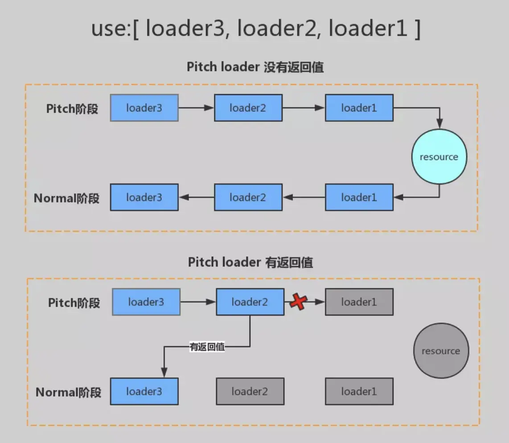

# loader 专题

## 什么是 loader

webpack 只能处理 JavaScript JSON 文件，对于其他类型的文件，需要使用 loader 进行处理。

loader 是一个转换器，它将不同类型的文件转换为 webpack 能够处理的有效模块，然后你就可以利用 webpack 的打包能力对它们进行处理。

loader 可以将所有类型的文件转换为应用程序的依赖图（和最终的 bundle）可以直接使用，并且支持链式传递。链中的每个 loader 都将对前一个 loader 的结果进行操作。

loader 运行在 Node.js 中，并且能够执行任何可能的操作。

## loader 的特点

1. 每一个 loader 都要返回 js 脚本
2. 每一个 loader 只做一件内容，为了使 loader 在更多场景链式调用
3. 每一个 loader 都是一个模块
4. 每一个 loader 都是无状态的，确保 loader 在不同模式转换之间不保存状态

## 写一个简单的 loader

loader 就是一个函数，参数是匹配到的文件内容，返回结果为最新的内容

```js
function loader(source) {
  return 'hello'
}
module.exports = loader
```

## loader 的几种引入方式

### 1. 通过 npm 包安装的 loader 可以这样写

```js
module.exports = {
  module: {
    rules: [
      {
        test: /\.js$/,
        // 直接写loader名称可以找到对应的loader
        use: 'babel-loader',
        exclude: /node_modules/,
      },
    ],
  },
}
```

### 2. 如果是自己写 loader，可以使用绝对路径的方式

```js
module.exports = {
  module: {
    rules: [
      {
        test: /\.js$/,
        use: path.resolve(__dirname, 'loaders/a.js'),
        exclude: /node_modules/,
      },
    ],
  },
}
```

### 3.如果是自己写 loader, 还可通过配置别名的方式来获取

```js
module.exports = {
  resolveLoader: {
    alias: {
      'a-loader': path.resolve(__dirname, 'loaders/a.js'),
    },
  },
  module: {
    rules: [
      {
        test: /\.js$/,
        use: 'a-loader',
        exclude: /node_modules/,
      },
    ],
  },
}
```

### 4. 如果还是不满意, 通过 自定义查找路径 方式来获取

> 那么就是通过 loader 的查找方式来定义，loader 默认会在 node_modules 查找，也可以指定其他的目录，来查找我们自定义的 loader

```js
module.exports = {
  resolveLoader: {
    modules: [
      path.resolve(__dirname, 'node_modules'),
      path.resolve(__dirname, 'loader'),
    ],
  },
  module: {
    rules: [
      {
        test: /\.js$/,
        use: 'a-loader',
        exclude: /node_modules/,
      },
    ],
  },
}
```

## loader 的执行顺序

正常的 loader 的执行顺序是从右向左的，如下图,执行顺序为：c-loader ----> b-loader----> a---->loader, 也就是 a-loader(b-loader(c-loader(resource)))

```js
module.exports = {
  module: {
    rules: [
      {
        test: /\.js$/,
        use: ['a-loader', 'b-loader', 'c-loader'],
        exclude: /node_modules/,
      },
    ],
  },
}
```

## 何谓 loader pitch

### loader 的种类

Loader 可以分为四种: 在 webpack 中 loader 分为四个阶段，分别是 pre、normal、inline 以及 post 四种 loader，区分它们的依据正如它们的名字：四种 loader 会按照不同的执行顺序去执行。

Pitching 阶段: loader 上的 pitch 方法，按照 后置(post)、行内(inline)、普通(normal)、前置(pre) 的顺序调用。

Normal 阶段: loader 上的 常规方法，按照 前置(pre)、普通(normal)、行内(inline)、后置(post) 的顺序调用。模块源码的转换， 发生在这个阶段。

### 指定 loader 种类

在 webpack 配置文件中，我们可以通过 module 对象上的 `rule.enforce` 配置项规定这个 `loader` 的种类，通过配置文件我们可以配置三种类型的 loader：

- 当 `enforce` 为 `pre` 时，该配置项目内的 loader 为前置 `pre loader`
- 当 `enforce` 为 `post` 时，该配置项目内的 loader 为后置 `post loader`
- 当 `enforce` 什么都不配置时，该配置项目内的 loader 为默认 `normal loader`
- `inline-loader` 并不在 `webpack` 配置文件中进行配置，它的配置方式在我们的业务代码的模块引入语句中

  - `inline loader` 的执行顺序同样是从右往左，也就是 `inline-loader` 执行时会先执行 `css-loader` 处理文件，再会执行 `style-loader` 处理。

  ```js
  import Styles from 'style-loader!css-loader?modules!./styles.css'
  ```

**使用行内 loader 时，可以额外配置一些规则**

- 使用 ! 前缀，将禁用所有已配置的 normal loader(普通 loader)

```js
import Styles from '!style-loader!css-loader?modules!./styles.css'
```

- 使用 !! 前缀，将禁用所有已配置的 loader（preLoader, loader, postLoader）,只要行内

```js
import Styles from '!!style-loader!css-loader?modules!./styles.css'
```

- 使用 -! 前缀，将禁用所有已配置的 pre loader 和 normal loader，但是不禁用 postLoaders

```js
import Styles from '-!style-loader!css-loader?modules!./styles.css'
```

### normal loader & pitch loader

> 我们将 loader 的 pitch 属性称为 loader 的 pitch loader。将 loader 函数本身称为 normal loader。

在定义一个 loader 函数时，可以导出一个 pitch 方法，这个方法会在 loader 函数执行前执行。

```js
// 关于normal loader本质上就是loader函数本身。
function loader(source) {
  // 这里可以针对这个结果做一些处理
  console.log('self-define-lader')
  // 返回处理的结果
  return source
}

// 关于pitch loader就是normal loader上的一个pitch属性，它同样是一个函数:
loader.pitch = function (remainingRequest, precedingRequest, data) {
  console.log('pitch')
  // 返回结果
  return 'hello'
}

module.exports = loader
```

另外，如果存在多个 loader 串行的情况，这些 loader 的 pitch 函数会从左到右依次执行，其示意图如下：


