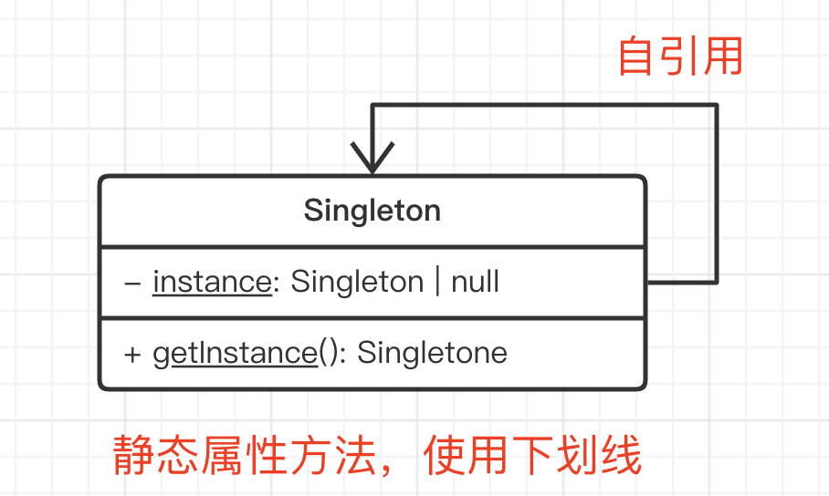

# 05-单例模式 - 全局只允许有一个实例，多则出错（用 TS 语法实现更优雅）

> 单例模式是前端常用设计模式之一，而且单例模式的设计思想到处都能体现，如 Vuex 全局唯一的 store 。本章将详细讲解单例模式，从概念背景，到代码示例和 UML 类图，最后到它的具体使用场景。

## 01: 主要内容

- 概念介绍 + 解决的问题
- UML 类图和代码演示
- 应用场景

### 学习方法

- UML 类图和代码结合理解
- 要结合使用场景

### 注意事项

- 前端用到严格的单例**模式**并不多，但单例模式的**思想**到处都有

## 02: 介绍

单例模式，即对一个 class 只能创建一个实例，即便调用多次。

### 示例

如一个系统的登录框、遮罩层，可能会被很多地方调用，但登录框只初始化一次即可，以后的直接复用。

再例如，想 Vuex Redux 这些全局数据存储，全局只能有一个实例，如果有多个，会出错的。

### 伪代码

登录框，初始化多次没必要。

```js
class LoginModal {}

// modal1 和 modal2 功能一样，没必要初始化两次
const modal1 = new LoginModal()
const modal2 = new LoginModal()
```

全局存储，初始化多个实例，会出错。

```js
class Store {
  /* get set ... */
}

const store1 = new Store()
store1.set(key, value)

const store2 = new Store()
store2.get(key) // 获取不到
```

## 03: 演示



### 使用 TS 特性

- `static` 静态属性和方法 —— **详细介绍一下，对比“静态 xx”和“实例 xx”**
- `private` 外部无法直接初始化

```js
class Singleton {
  // private - 外部无法初始化
  private constructor() { }

  // static 属性
  private static instance: Singleton | null

  // static 方法
  static getInstance(): Singleton {
    // 这里也可以写 `this.instance` ，注意和实例方法中 this 的区别！！！
    if (Singleton.instance == null) {
      Singleton.instance = new Singleton()
    }
    return Singleton.instance
  }
}

// const s1 = new Singleton() // 直接初始化会报错
// Singleton.instance // 直接访问 instance 也会报错

// 创建实例
const s1 = Singleton.getInstance()
const s2 = Singleton.getInstance()

console.log(s1 === s2) // true
```

### 不使用 TS 特性

#### 最常见的方式，使用闭包

```js
function genGetInstance() {
  let instance // 闭包

  class Singleton {}

  return () => {
    if (instance == null) {
      instance = new Singleton()
    }
    return instance
  }
}

const getInstance = genGetInstance()

const s1 = getInstance()
const s2 = getInstance()

console.log(s1 === s2) // true
```

#### 结合模块化语法，会更好一些

```js
let instance // 闭包

class Singleton {}

// 外部只能 import 这个函数
export default () => {
  if (instance == null) {
    instance = new Singleton()
  }
  return instance
}
```

### 是否符合设计原则？

5 大设计原则中，最重要的就是：**开放封闭原则**，对扩展开放，对修改封闭

- 内部封装 getInstance ，内聚，解耦

### 总结

- 使用 TypeScript 演示（注意 static）
- 使用 JavaScript 演示
- 验证：符合开放封闭原则

### 注意事项

JS 是单线程语言，如果是 Java 等多线程语言，单例模式需要加**线程锁**。

## 04: 场景

### 登录框

> 一个页面有很多地方调用登录框，使用单例模式

```typescript
class LoginForm {
  private state: string = 'hide' // 'hide' / 'show'

  private constructor() {}

  show() {
    if (this.state === 'show') {
      console.log('已经显示了')
      return
    }
    console.log('显示 LoginForm')
    this.state = 'show'
  }

  hide() {
    if (this.state === 'hide') {
      console.log('已经隐藏了')
      return
    }
    console.log('隐藏 LoginForm')
    this.state = 'hide'
  }

  private static instance: LoginForm | null = null
  static getInstance(): LoginForm {
    // 注意这里的 this
    if (this.instance == null) this.instance = new LoginForm()
    return this.instance
  }
}

const loginForm1 = LoginForm.getInstance()
const loginForm2 = LoginForm.getInstance()
console.log(loginForm1 === loginForm2) // true
```

### 其他

前端用到严格的单例模式并不多，但单例模式的思想到处都有

- 自定义事件 `eventBus` 全局只有一个
- `Vuex` `Redux` `store` 全局只有一个
- 严格的单例模式应用不多，但是单例的**思想**随处可见

## 05: 总结

### 内容回顾

- 概念介绍 + 解决的问题
- UML 类图和代码演示
- 应用场景

### 重要细节

- TS `static` `private` ，以及 UML 图的表示
- 静态方法中的 `this`
- Java 多线程，单例模式需要加线程锁 —— JS 单线程

### 注意事项

- 前端用到严格的单例**模式**并不多，但单例模式的**思想**到处都有
