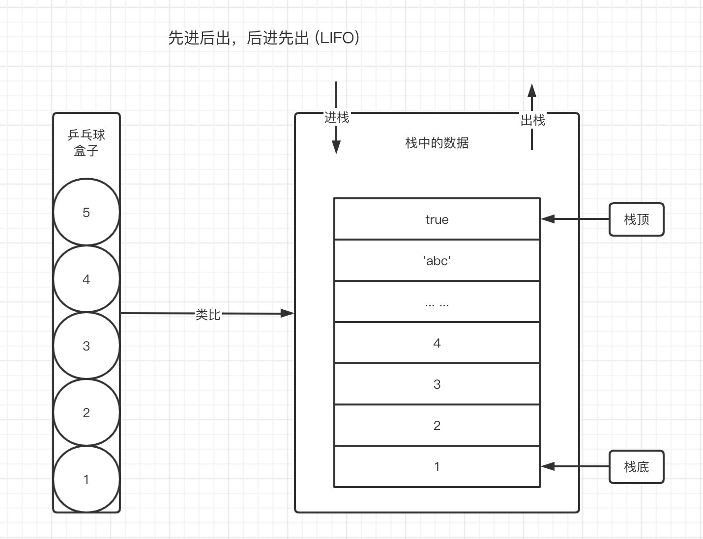
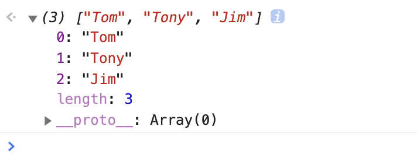
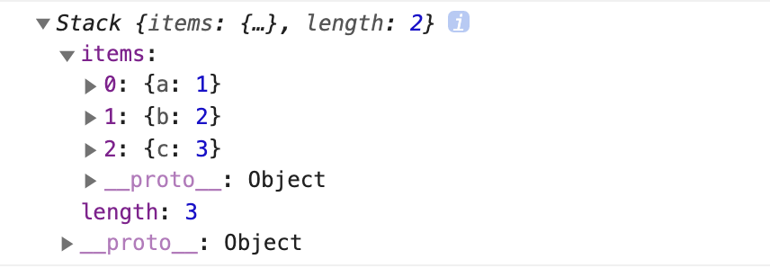
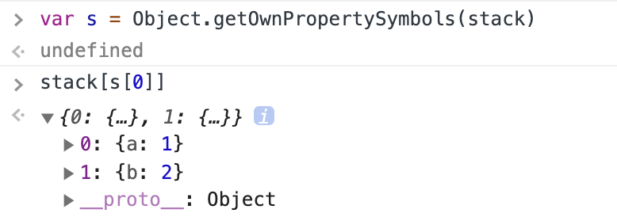

# 03-数据结构栈



栈数据结构的基础理论：**先进后出，后进先出**。

我们需要用代码体现出来，才算是真正的掌握了栈的思维。

## 01-基础实现

在上一章介绍了数组的栈方法，我们可以依赖于数组，快速实现栈对象。

```javascript
class Stack {
  constructor() {
    // 特别关注，此处的基础数据为数组
    this.items = [] 
  }
  push(node) {
    this.items.push(node)
  }
  pop() {
    this.items.pop()
  }
  peek() {
    return this.items[this.items.length - 1]
  }
  isEmpty() {
    return this.items.length === 0
  }
  clear() {
    this.items = []
  }
}
```

这种基于数组的实现方式非常简单，因为数组本身就已经实现了一部分栈的特性，因此，我们几乎不用处理额外的逻辑，只是在数组之外套了一层无意义的代码就能实现。

那如果我们不依赖已经具备栈特性的数组，自己来实现应该怎么做呢？

熟悉原型链之后我们会知道，原型链的终点是 Object 原型对象。因此，在 JavaScript 中，最基础的数据结构表达，就是一个 Object 对象。例如对于数组来说，Array 对象中的基础数据结构，应该是这样子

```javascript
{
  0: 'Tom',
  1: 'Tony',
  2: 'Jim'
}
```



实现栈数据结构，也应该跟数组一样，以对象字面量的表达方式，来作为数据结构的基础。实现如下:

```javascript
class Stack {
  constructor() {
    this.items = {}
    this.length = 0
  }
  push(node) {
    this.items[this.length] = node;
    this.length++
  }
  pop() {
    if (this.isEmpty()) {
      return null;
    }
    this.length--
    const r = this.items[this.length]
    delete this.items[this.length]
    return r
  }
  // 获取栈顶节点
  peek() {
    if (this.isEmpty()) {
      return null
    }
    return this.items[this.length - 1]
  }
  isEmpty() {
    return this.length === 0
  }
  clear() {
    this.items = {}
    this.length = 0
  }
}
```

上例以最基础的对象作为基础数据结构存储栈内容，声明实例并且往栈中添加几个元素，大概长这样。



```javascript
const stack = new Stack()

stack.push({a: 1})
stack.push({b: 2})
stack.push({c: 3})
```

还需要继续优化。

在我们的设想中，Stack 对象中的基础数据 `items` 应该只能通过 `push, pop, clear` 等 api 来修改。但是我们发现，如果 Stack 的实现仅仅如此，我们就还可以通过直接访问 `items` 的方式来修改它。这违背了我们的初衷，也违背了栈的基础思想。

```javascript
// 可以这样直接修改
stack.items = {}
```

因此，在这里，`items` 只能作为私有变量被保护起来，才能避免出现这样的情况。在 class 语法中，我们可以直接使用 `#` 的方式，直接指定对应的变量为私有变量。

```javascript
class Demo {
  // 属性名前面加上 #，即为私有变量
  #length = 0
  
  constructor() {
    this.#items = {}
  }
}
```

不过遗憾的是，私有变量语法，各浏览器的支持程度并不高。因此我们可以使用基础数据类型 Symbol 来模拟私有变量，避免外部的直接访问。

代码如下：

```javascript
class Stack {
  constructor() {
    this._i = Symbol('Stack')
    this[this._i] = {}
    this.length = 0
  }
  push(node) {
    this[this._i][this.length] = node;
    this.length++
  }
  pop() {
    if (this.isEmpty()) {
      return null;
    }
    this.length--
    const r = this[this._i][this.length]
    delete this[this._i][this.length]
    return r
  }
  getItems() {
    return this[this._i]
  }
  // 获取栈顶节点
  peek() {
    if (this.isEmpty()) {
      return null
    }
    return this[this._i][this.length - 1]
  }
  isEmpty() {
    return this.length === 0
  }
  clear() {
    this[this._i] = {}
    this.length = 0
  }
}
```

当然，Symbol 也并非完全不能访问，我们可以通过`Object.getOwnPropertySymbols(stack)`来访问实例 `stack` 的 Symbol 属性。



## 02-实战一：进制转换

现在我们有一个需求，**利用上面的栈对象，封装一个十进制转二进制的方法**

我们知道，二进制是一堆由 0 和 1 组合而成的数字。它的特点就是 「逢 2 进 1」。那么如果需要要将 10 进制 的数字，转化为二进制的数字，应该怎么做呢？

在我上大学时的教科书上提供了一种方法，叫做「相除取余数」。

什么意思呢？举一个例子，我们要将数字 11 转化为二进制。那么就依次有

```javascript
11 / 2 = 5 余 1  
// 使用计算结果的整数 5，继续下一次计算
5 / 2 = 2 余 1
2 / 2 = 1 余 0
1 / 2 = 0 余 1
```

这里，我们得到了每一次计算的余数，把所有的余数拼接起来，就是最终的二进制结果，为 `1011` 。再换一个数字 20，用这个逻辑继续推演一下

```javascript
20 / 2 = 10 余 0
10 / 2 = 5 余 0 
5 / 2 = 2 余 1
2 / 2 = 1 余 0
1 / 2 = 0 余 1
```

那么 20 转化为二进制的结果，就是 10100

我们使用代码来实现这个推演过程，只需要在每一次计算时，将余数保存压入栈中，最后将所有栈中的数字拼接起来即可得到二进制结果。

```javascript
function decimalToBinary(number) {
  // 声明一个栈容器
  const stack = new Stack()
  let result = ''

  while(number > 0) {
    // 将每一次计算的余数放入栈容器中
    stack.push(number % 2)

    // 计算下一次参与运算的结果
    number = Math.floor(number / 2)
  }

  // 拼接栈中的所有余数，得到二进制结果
  while(!stack.isEmpty()) {
    result += stack.pop()
  }

  return result
}


console.log(decimalToBinary(11))   // 1011 
console.log(decimalToBinary(20))   // 10100
console.log(decimalToBinary(25))   // 11001
```

使用同样的方式，我们可以封装一个通用方法，用于将 10 进制转化为 2/8/16 进制的数字。具体代码如下：

```javascript
/***
 * @desc 通用，10进制转其他进制
 * @param {number} number 10进制数字
 * @param {number} bs 2进制，8进制，16进制
 * @return {string} 转换结果 
 **/
function converter(number, bs) {
  const stack = new Stack()
  const digits = '0123456789ABCDEF'
  let result = ''

  while(number > 0) {
    stack.push(number % bs)
    number = Math.floor(number / bs)
  }

  while (!stack.isEmpty()) {
    result += digits[stack.pop()]
  }

  return result
}

  console.log(converter(11, 2)) // 1011
  console.log(converter(20, 2)) // 10100
  console.log(converter(25, 2)) // 11001
  console.log(converter(25, 8)) // 31
  console.log(converter(1231, 16))  // 4CF
```

## 03-实战二：有效的括号

在 LeetCode 中，有这样一道简单算法题。

给定一个只包括 小括号 '(' ')' ，中括号 '['  ']'  大括号  '{'  '}' 的字符串，判断字符串是否有效。

有效字符串需要满足：

1. 左括号必须用相同类型的右括号闭合
2. 左括号必须以正确的顺序闭合

示例：

```javascript
input：'{}'
out: true

input: '()[]{}'
out: true

input: '(]'
out: false

input: '([)]'
out: false
        
input: '{[]}'
out: true
```

也就是说，每一个括号，都必须被正确闭合。这个很好理解，而我们要写一个方法来判断字符串的括号是否都正确闭合了，应该怎么办呢？

分析一下，如果我们借助栈的思维来解决问题，我们遍历目标字符串，第一个字符串放入栈中，如果接下来的一个字符串，刚好能够匹配，我们可以将栈中的字符串删除，不能匹配，则继续压入栈中。这样，当字符串的每一个字符都遍历完成之后，如果所有的字符串都成功正确匹配，那是不是栈中应该是空的呀？所以借助这个思路，我们来实现该方法

```javascript
function isValid(s) {
  const stack = new Stack()

  for (var i = 0; i < s.length; i++) {
    // 当前字符
    const c = s[i]  

    // 栈顶字符
    const p = stack.peek()
    if (c == ')' && p == '(' || c == ']' && p == '[' || c == '}' && p == '{') {
      // 匹配上了，p 出栈，否则，c 入栈
      stack.pop()
    } else {
      stack.push(c)
    }
  }

  // 最后，如果栈为空，则表示完全匹配，否则表示没有完全正确匹配
  return stack.isEmpty()
}

console.log(isValid('()'))    // true
console.log(isValid('()[]{}'))  // true
console.log(isValid('(]'))  // false
console.log(isValid('([)]'))  // false
console.log(isValid('{[]}'))  // true
```

## 04-思考题

你在实践场景中，哪些地方运用了栈的基础思维来解决问题？
