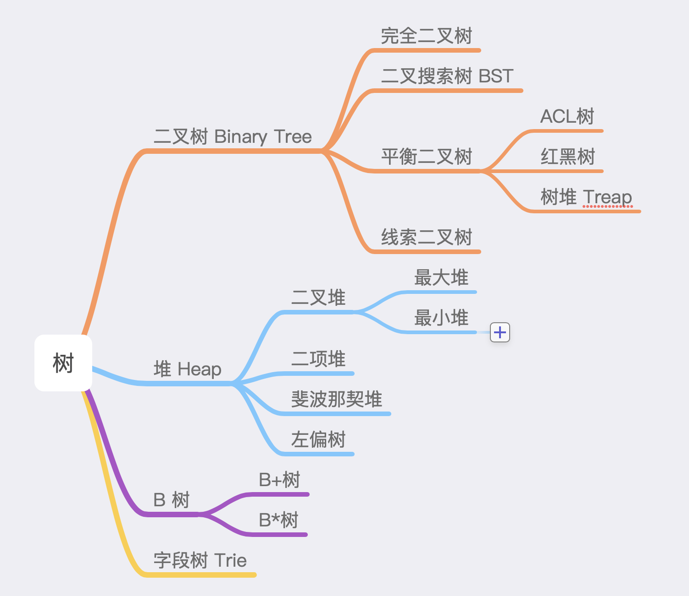
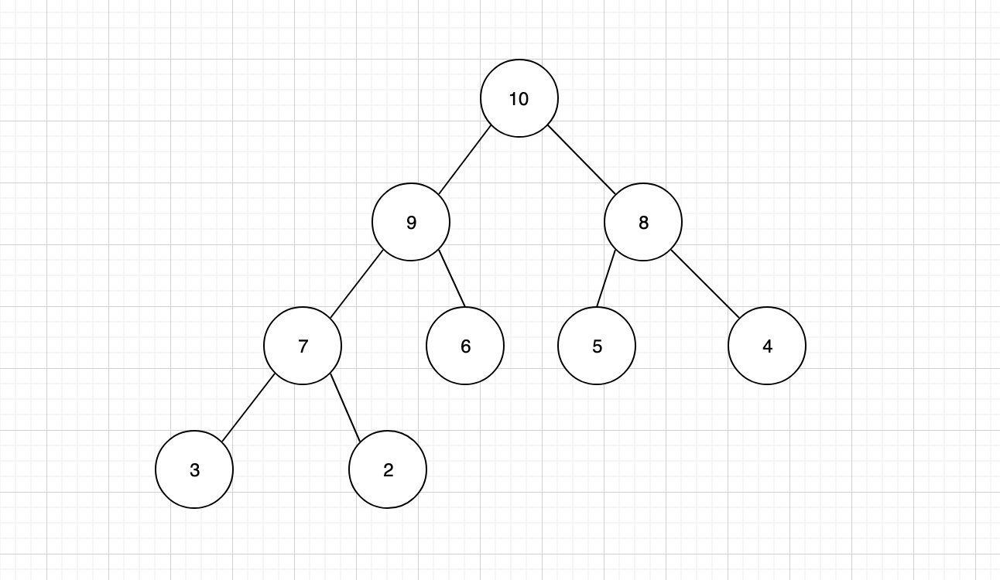
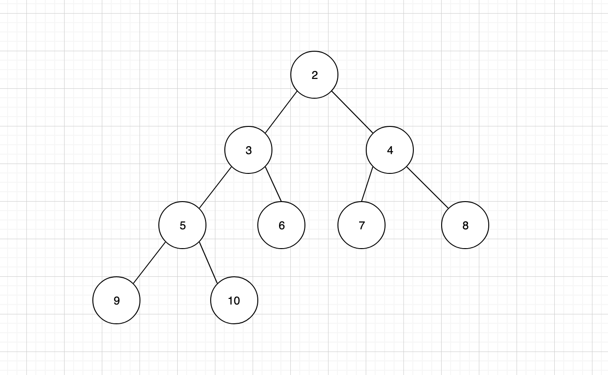
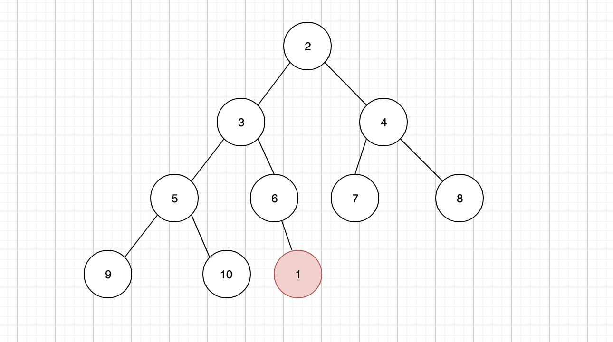
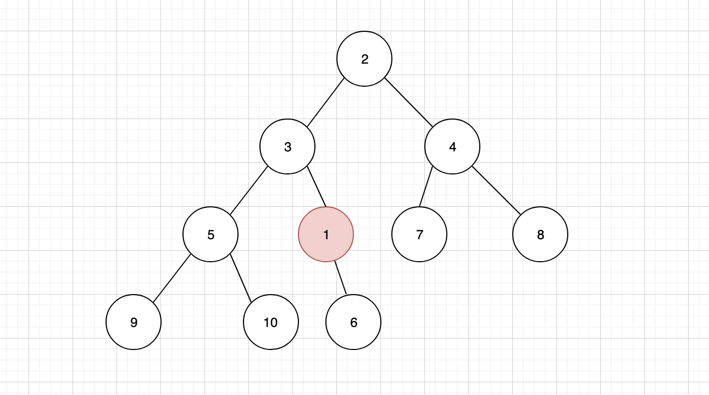
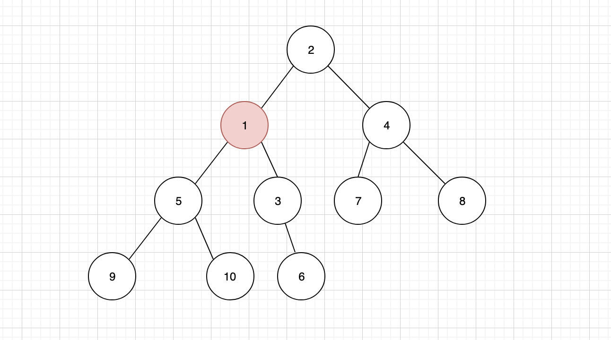
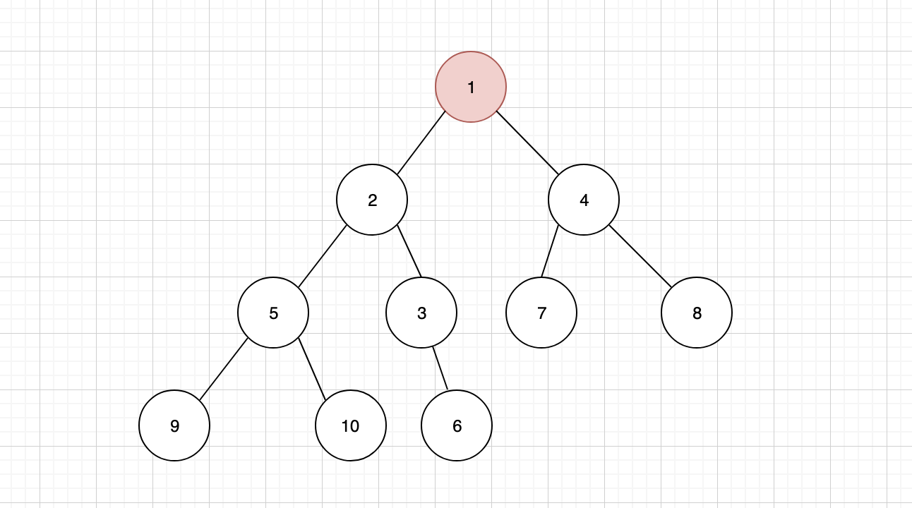
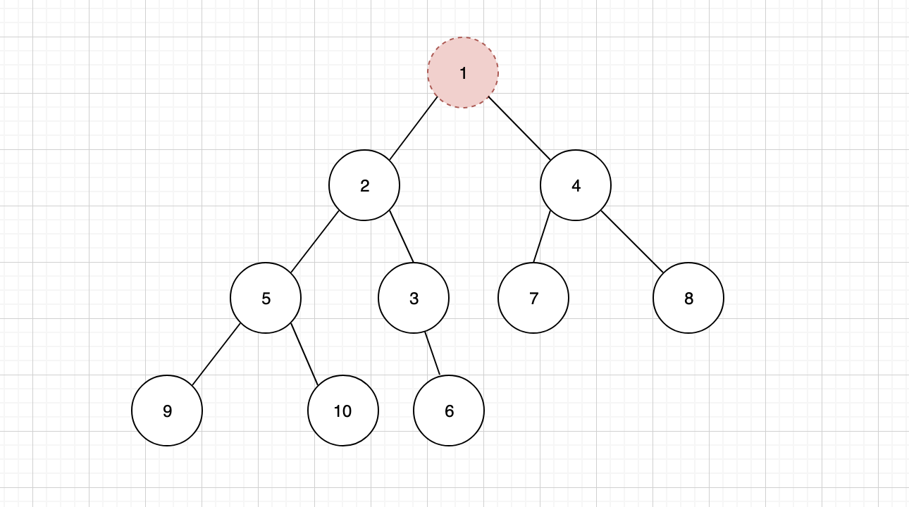
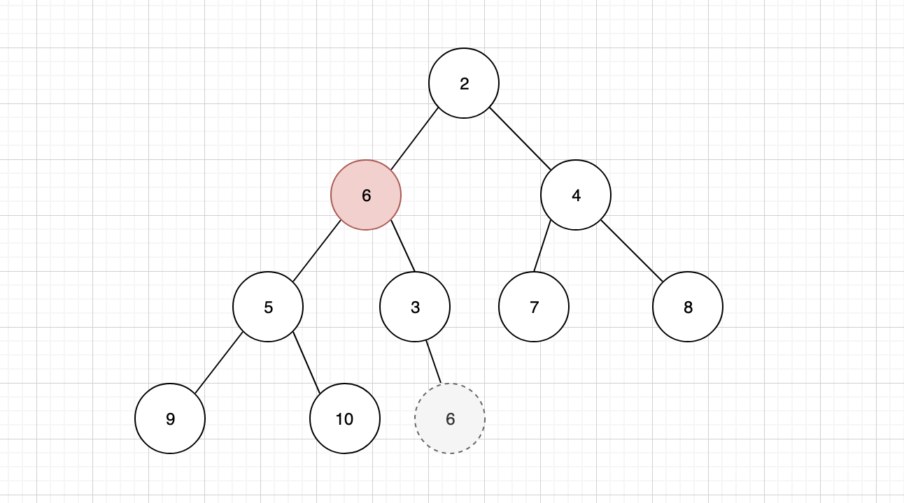
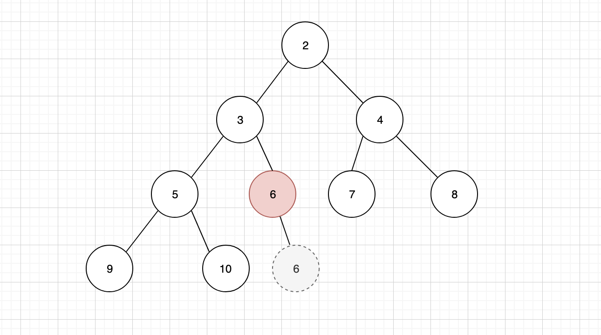

# 04-数据结构堆



堆数据结构，是树中的一种。在实践中，我们更常用的堆数据结构就是**二叉堆**。

二叉堆能够实现优先级队列「**Priority Queue**」。

Linux 内核中对各个进程的调度分配，定时器的实现原理，React Fiber 的任务调度分配，都利用了优先级队列的思维来解决问题。因此作为一名合格的高级前端工程师，优先级队列是必须要掌握的重要知识点。

> 二叉堆中，每一个节点都必须是可比较的，否则就无法判断优先级

二叉堆是一颗完全二叉树：即在树结构中，除了最后一层，其他节点都是完整的「每一个节点都拥有左右两个子节点」。它分为两种类型：

1. **最大堆** 又称为大顶堆，任何父节点的键值，都大于等于任何一个子节点。最大堆的根节点为堆顶，堆顶元素是整个堆中的最大值。



2. **最小堆** 又称为小顶堆，任何父节点的键值，都小于等于任何一个子节点。最小堆的根节点为堆顶，堆顶元素是整个堆中的最小值。



对于二叉堆，只有几个常规操作：插入节点，删除节点，以及构建二叉堆。

## 01-插入节点

二叉堆的节点插入，只能是二叉堆树结构中的最后一个位置。以上面的最小堆为例，我想要插入一个值为 1 的节点。



插入之后，我们发现并不符合小顶堆的规则，这个时候就需要进行「上浮」调整。将插入的子节点，与其父节点进行比较，如果子节点小于父节点，那么按照小顶堆的规则，就必须将父子节点进行互换



节点 1 上浮之后，还需要继续跟其新的父节点进行比较，我们发现它的父节点 3 还是要比 1 大，那么还要继续上浮



发现新的父节点 2 仍然比 1 大，还要继续上浮，最终让 1 成为新的堆顶



## 02-删除节点

在二叉堆中，我们通常只会删除处于堆顶的元素。



但是删除之后，我们会发现，二叉堆的结构就出现了混乱，为了维持稳定，并且保证二叉堆的特性，还需要在删除之后进行一些调整，首先需要将树结构中的最后一个节点，补充到堆顶位置


补充之后发现，当前的树结构不符合最小堆的特性，因此需要将新的堆顶元素，与子元素进行比较，找到最小的子元素与其交换位置，这个行为我们称之为「下沉」



继续与新的子元素进行比较，如果仍然比最小的子元素大，则需要继续下沉，直到完全符合最小堆的规则为止



## 03-构建二叉堆

构建二叉堆，本质是一个排序的过程。将不符合规则的二叉树，通过所有非叶子节点依次的下沉操作，调整成为二叉堆。图例与删除节点之后的调整过程几乎一样，因此这里就不再一一展示过程。

## 04-代码实现

我们通常基于数组来实现二叉堆。无论是最大堆，还是最小堆它其实都有自己的顺序。并且因为每个节点都最多只有两个子元素，因此我们可以非常方便的使用数组的下标，来在数组中找到对应的子元素。

> 按照栈数据结构的实现思路，更应该使用类数组的字面量对象来实现，这里的代码因为不涉及到数组操作「所有的逻辑都是自己实现，并未借助数组的其他方法，这里的核心是借助数组的下标」，使用数组更便于大家理解。打印结果也更直观，因此就直接用了数组

例如，如果父节点元素在数组中的下标为 k，那么子元素中，左节点的下标就是 2k + 1，右元素的下标就是 2k + 2。有了这个公式，我们在构建二叉堆时调整位置就很简单了。

**节点公式推导过程如下：**

以上面的例子为例，一共有九个节点，我们以 p 代表父节点，l 代表 left 左节点，r 代表 right 右节点，那么数组中下标从 0 开始，对应的关系如下

```javascript
;(p = 0), (l = 1), (r = 2)
;(p = 1), (l = 3), (r = 4)
;(p = 2), (l = 5), (r = 6)
;(p = 3), (l = 7), (r = 8)

// 当前案例一共只有9个节点，如果节点更多的话，我们还可以继续总结
;(p = 4), (l = 9), (r = 10)
;(p = 5), (l = 11), (r = 12)
```

因此我们很容易发现父节点与左右子节点下标序列的关系 `l = 2p + 1, r = 2p +2`。因此，当我们知道父节点的下标，就能够找到左右子节点的下标。

反过来会有一点麻烦，如果我们只是知道一个子节点下标，那么如何得到父节点下标呢？把上面的公式调整一下可以得到。

```javascript
p = (l - 1) / 2
p = (r - 2) / 2
```

从上面的规律我们可以看出，左节点下标始终是单数，右节点下标始终是双数，为了确保相同的公式又不影响结果，我们可以稍作调整，让他们的公式保持一致。

```javascript
// 必定等于整数
p = (l - 1) / 2  = Math.floor((l - 1) / 2)
p = (r - 2) / 2 = Math.floor((r - 1) / 2)
```

于是公式可以统一为

```javascript
p = Math.floor((i - 1) / 2)
```

我们先来看看完整的代码实现

```javascript
class BinaryHeap {
  constructor(compare, array) {
    this.compare = compare
    if (array) {
      this.heap = array
      this.size = this.heap.length
      this.buildHeap()
    } else {
      this.heap = []
      this.size = 0
    }
  }
  // 判断是否为空
  isEmpty() {
    return this.size == 0
  }
  // 通过子节点下标，获取节点的父亲节点
  parentIndex(i) {
    return Math.floor((i - 1) / 2)
  }
  parent(i) {
    return this.heap[this.parentIndex(i)]
  }
  leftIndex(i) {
    return 2 * i + 1
  }
  // 通过父节点下标，获取父节点的左边子节点
  left(i) {
    return this.heap[this.leftIndex(i)]
  }
  rightIndex(i) {
    return 2 * i + 2
  }
  // 通过父节点下标，获取父节点的右边子节点
  right(i) {
    return this.heap[this.rightIndex(i)]
  }

  // 节点交换
  swap(i, j) {
    const temp = this.heap[i]
    this.heap[i] = this.heap[j]
    this.heap[j] = temp
  }

  // 插入节点
  push(node) {
    if (this.size == 0) {
      this.size++
      this.heap[0] = node
      return
    }
    this.size++
    let i = this.size - 1
    this.heap[i] = node
    while (i != 0 && this.compare(this.heap[i], this.parent(i))) {
      this.swap(i, this.parentIndex(i))
      i = this.parentIndex(i)
    }
  }

  // 无论是删除元素，或者说构建二叉堆，都需要重新排序，封装统一的方法来支持排序过程，
  // 叶子节点不会调用此方法
  // 向下调整
  heapify(i) {
    // 找到最小的元素
    const l = this.leftIndex(i)
    const r = this.rightIndex(i)
    const pv = this.heap[i],
      lv = this.heap[l],
      rv = this.heap[r]

    let small = i
    if (l < this.size && this.compare(lv, pv)) {
      small = l
    }
    if (r < this.size && this.compare(rv, this.heap[small])) {
      small = r
    }

    if (small != i) {
      this.swap(i, small)
      this.heapify(small)
    }
  }

  // 删除堆顶元素
  pop() {
    if (this.size <= 0) {
      return null
    }
    if (this.size == 1) {
      let node = this.heap[this.size - 1]
      this.size--
      this.heap.length = this.size
      return node
    }
    const root = this.heap[0]
    this.heap[0] = this.heap[this.size - 1]
    this.size--
    this.heap.length = this.size
    this.heapify(0)
    return root
  }

  // 获取堆顶元素
  top() {
    return this.heap[0]
  }

  // 构建堆，从最后一个非叶子节点开始遍历构建
  buildHeap() {
    for (let i = this.parentIndex(this.size - 1); i >= 0; i--) {
      this.heapify(i)
    }
  }
}

function compare(a, b) {
  return a < b
}

var heap = new BinaryHeap(compare)
heap.push(1)
heap.push(2)
heap.push(3)
heap.push(4)
heap.push(5)
console.log(heap.heap) // [1, 2, 3, 4, 5]
heap.pop()
console.log(heap.heap) // [2, 4, 3, 5]

var array = [150, 80, 40, 30, 10, 70, 110, 100, 20, 90, 60, 50, 120, 140, 130]
var h = new BinaryHeap(compare, array)
console.log(h.heap) // [10, 20, 40, 30, 60, 50, 110, 100, 150, 90, 80, 70, 120, 140, 130]
```

具体代码完全按照上面图例中的逻辑来实现，相信理解起来并不困难，不过这里需要注意的是，我们往构造函数中，传入了两个参数，compare 与 array。

许多同学可能会对 compare 不是很理解。compare 是传入的一个比较函数，该比较函数必须接收两个节点作为参数，并且返回这个两个节点的比较结果。这样我们可以通过自定义该比较函数的内容，来确定最终结果是最大堆还是最小堆。

```javascript
function compare(a, b) {
  // 小顶堆
  return a < b
}

function compare(a, b) {
  // 大顶堆
  return a > b
}
```

在我们的代码实现中，比较函数对于内部逻辑的排序非常有帮助，例如插入节点时，节点首先会插入到最末尾的节点，然后通过比较其父节点的大小，进行位置交换的调整。因此只要比较结果符合 compare 的预期，我们就可以将当前节点与父节点进行位置交换

```javascript
  push(node) {
    if (this.size == 0) {
      this.size ++
      this.heap[0] = node
      return
    }
    this.size ++
    let i = this.size - 1
    this.heap[i] = node
    while(i != 0 && this.compare(this.heap[i], this.parent(i))) {
      this.swap(i, this.parentIndex(i))
      i = this.parentIndex(i)
    }
  }
```

除此之外，在实践中，参与比较的可能并非节点本身，而是节点的某个字段。

```javascript
const array = [
  {name: 'Jake', id: 29},
  {name: 'Toms', id: 22},
  {name: 'Jone', id: 40},
  ...
]
```

这个时候，我们要针对这样的数组构建一个二叉堆，比较函数就会按照需求比较 id，而非节点本身

```javascript
function compare(a, b) {
  // 小顶堆
  return a.id < b.id
}

function compare(a, b) {
  // 大顶堆
  return a.id > b.id
}
```

在数组的自身已经支持的 sort 方法也采用了类似的解决方案来决定排序的结果

```javascript
var array = [150, 80, 40, 30, 10, 70, 110, 100, 20, 90, 60, 50, 120, 140, 130]

// 由小到大排序
var _a = array.sort((a, b) => a - b)
console.log(_a) // [10, 20, 30, 40, 50, 60, 70, 80, 90, 100, 110, 120, 130, 140, 150]

// 由大到小排序
var _b = array.sort((a, b) => b - a)
console.log(_b) // [150, 140, 130, 120, 110, 100, 90, 80, 70, 60, 50, 40, 30, 20, 10]
```

节点元素不能直接参与比较，使用某个字段进行比较

```javascript
const persons = [
  { name: 'Jake', id: 29 },
  { name: 'Toms', id: 22 },
  { name: 'Jone', id: 40 },
  { name: 'Alex', id: 3 },
]

const p1 = persons.sort((a, b) => a.id - b.id)
console.log(p1) // 结果为按照 id，从小打大排序

// 因为引用类型的关系，下面的代码请分开执行，否则眼睛看到的打印结果将会是最后一次的排序结果

const p2 = persons.sort((a, b) => b.id - a.id)
console.log(p2) // 结果为按照 id，从大到小排序
```

除了 sort 方法之外，map, filter, reduce, some, every 等方法，都采用了类似的思维，传入一个条件，根据条件的执行结果，返回新的内容。这样的封装思维，我们在高阶函数中会进一步详细解读。

> 部分逻辑使用了递归实现，如果对这部分不是很理解，可以专门查阅资料学习递归的使用之后再来学习。

## 05-思考题

理解了 compare 的使用之后，你能否尝试自己封装一个数组的 map 方法？

二叉树作图工具地址：[freedgo](https://www.freedgo.com/draw-index.html)
